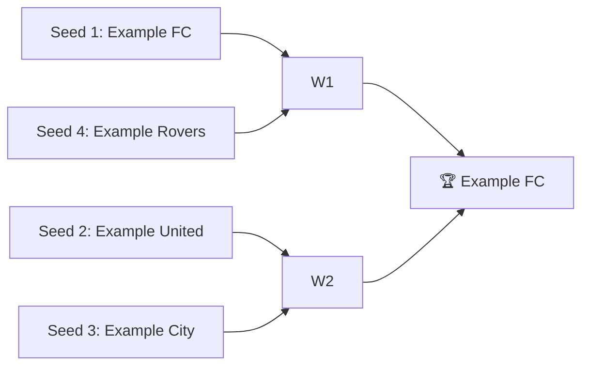

# 🏈 2016 Season — Inaugural Year

**Champion:** _Example FC_ (replace with real data)
**Runner-Up:** _Example United_
**Regular Season Top Seed:** _Example FC_
**Toilet Bowl Winner:** _Example Wanderers_

> This is a fully worked *example* page. Replace placeholders with real Yahoo data as you extract it.

## Final Standings

| Rank | Team | Owner | W–L | PF | PA | Playoff Seed |
|------|------|-------|-----|----|----|--------------|
| 1 | Example FC | Alex | 11–2 | 1820 | 1402 | 1 |
| 2 | Example United | Sam | 10–3 | 1755 | 1455 | 2 |
| 3 | Example City | Jordan | 9–4 | 1701 | 1501 | 3 |
| 4 | Example Rovers | Casey | 8–5 | 1644 | 1533 | 4 |
| 5 | Example Wanderers | Riley | 6–7 | 1588 | 1610 | — |
| 6 | Example Athletic | Morgan | 5–8 | 1510 | 1677 | — |
| 7 | Example Town | Taylor | 4–9 | 1442 | 1733 | — |
| 8 | Example County | Jamie | 3–10 | 1390 | 1788 | — |

## Playoff Bracket

## Team Rosters

| Team | Post-Draft Roster | End-of-Season Roster |
|------|-------------------|----------------------|
| Example FC | [[2016 Example FC Post-Draft]] | [[2016 Example FC End-of-Season]] |
| Example United | [[2016 Example United Post-Draft]] | [[2016 Example United End-of-Season]] |
| Example City | [[2016 Example City Post-Draft]] | [[2016 Example City End-of-Season]] |
| Example Rovers | [[2016 Example Rovers Post-Draft]] | [[2016 Example Rovers End-of-Season]] |

> Only Example FC rosters are filled in below as a demonstration. Copy [[Roster Template]] for the rest.

### Example FC — Post-Draft Roster

**Owner:** Alex · **Snapshot:** Post-Draft (after 2016 draft)

| Position | Player | Drafted Round | Acquired Via |
|----------|--------|---------------|--------------|
| QB | Example QB A | 4 | Draft |
| RB1 | Example RB A | 1 | Draft |
| RB2 | Example RB B | 2 | Draft |
| WR1 | Example WR A | 1 | Draft |
| WR2 | Example WR B | 3 | Draft |
| FLEX | Example WR C | 5 | Draft |
| TE | Example TE A | 6 | Draft |
| K | Example K A | 13 | Draft |
| DEF | Example DEF A | 14 | Draft |

**Bench:** Example RB C (7), Example WR D (8), Example QB B (9)

### Example FC — End-of-Season Roster

**Owner:** Alex · **Snapshot:** End-of-Season (final week)

| Position | Player | Drafted Round | Acquired Via |
|----------|--------|---------------|--------------|
| QB | Example QB A | 4 | Draft |
| RB1 | Example RB A | 1 | Draft |
| RB2 | Example RB B | 2 | Draft |
| WR1 | Example WR A | 1 | Draft |
| WR2 | Example WR E | — | Waiver (Week 6) |
| FLEX | Example WR C | 5 | Draft |
| TE | Example TE A | 6 | Draft |
| K | Example K A | 13 | Draft |
| DEF | Example DEF B | — | Waiver (Week 9) |

**Bench:** Example RB C (7), Example WR D (8), Example QB B (9)

**Notable Moves:** Picked up Example WR E off waivers in Week 6 after Example WR B's injury; swapped DEF in Week 9.

## Awards

- 🏆 **League Champion:** Example FC
- 💥 **Highest Single-Week Score:** Example FC (178.4, Week 11)
- 📉 **Lowest Single-Week Score:** Example County (72.1, Week 4)
- 🔥 **Biggest Bust:** Example RB D (drafted 3rd round, finished RB34)
- 🎯 **Best Draft Pick:** Example WR E (undrafted, top-10 WR)
- 🍗 **"Poultry Controversy" Nominee:** The Week 9 vetoed trade

## The Story of the Year

The league's first season. Example FC ran the table behind a dominant WR duo and a mid-round QB steal. The defining moment was the Week 9 trade that got vetoed — still debated on the group chat.

## Related

- [[Seasons]] · [[2016 Draft]] · [[Teams]] · [[Records]] · [[Lore]]
