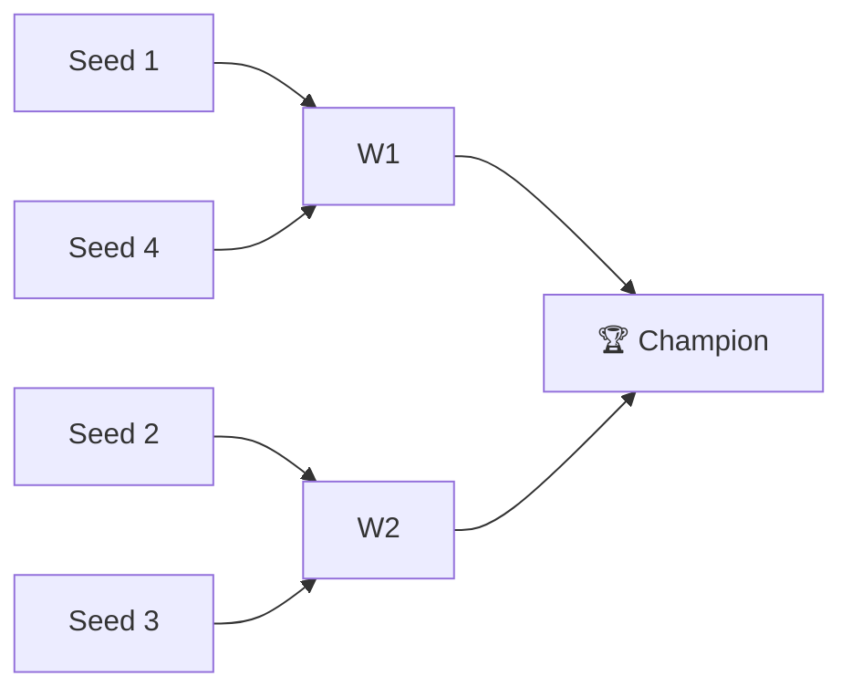

# 🏈 2018 Season

**Champion:** Curry’s legit team
**Runner-Up:** _TBD_
**Regular Season Top Seed:** _TBD_
**Toilet Bowl Winner:** _TBD_

## Final Standings

> Auto-generated from Yahoo. Edit `_TBD_` fields and add narrative.

| Rank | Team | Owner | W–L | PF | PA | Playoff Seed |
|------|------|-------|-----|----|----|--------------|
| 1 | Curry’s legit team |  | 4–7 | 1406.78 | 1614.6 | 1 |
| 2 | Anish's Awesome Team |  | 3–7 | 1523.54 | 1590.72 | 2 |
| 3 | D4rthSi Dragons | Naren | 8–3 | 1736.5 | 1545.16 | 3 |
| 4 | Sharman’s Scorpions |  | 9–2 | 1754.04 | 1523.54 | 4 |
| 5 | Roger That |  | 4–6 | 1632.38 | 1703.34 | — |
| 6 | Super Squirrels |  | 4–7 | 1450.44 | 1526.32 | — |

## Playoff Bracket

## Team Rosters

| Team | Post-Draft Roster | End-of-Season Roster |
|------|-------------------|----------------------|

## Awards

- 🏆 **League Champion:** _TBD_
- 💥 **Highest Single-Week Score:** _TBD_
- 📉 **Lowest Single-Week Score:** _TBD_
- 🔥 **Biggest Bust:** _TBD_
- 🎯 **Best Draft Pick:** _TBD_
- 🍗 **"Poultry Controversy" Nominee:** _TBD_

## The Story of the Year

_TBD — add the defining moments._

## Related

- [[Seasons]] · [[2018 Draft]] · [[Teams]] · [[Records]] · [[Lore]]
