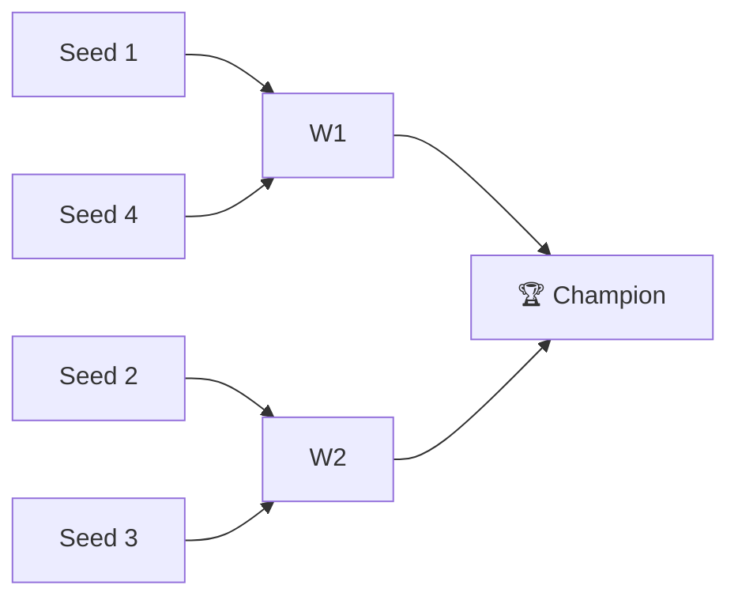

# 🏈 2019 Season

**Champion:** Curry’s legit team
**Runner-Up:** _TBD_
**Regular Season Top Seed:** _TBD_
**Toilet Bowl Winner:** _TBD_

## Final Standings

> Auto-generated from Yahoo. Edit `_TBD_` fields and add narrative.

| Rank | Team | Owner | W–L | PF | PA | Playoff Seed |
|------|------|-------|-----|----|----|--------------|
| 1 | Curry’s legit team |  | 8–5 | 1863.5 | 1661.14 | 1 |
| 2 | Ju Let The Dogs Out | Naren | 9–4 | 1766.38 | 1615.02 | 2 |
| 3 | Kaushal's Potatoes |  | 8–5 | 1673.66 | 1575.2 | 3 |
| 4 | Super Squirrels |  | 7–6 | 1682.84 | 1654.48 | 4 |
| 5 | Sharman’s Scorpions |  | 6–7 | 1590.34 | 1603.0 | — |
| 6 | Anish's Awesome Team |  | 7–6 | 1640.28 | 1762.64 | — |
| 7 | CHOPSTIX |  | 5–8 | 1431.02 | 1653.92 | — |
| 8 | Roger That |  | 2–11 | 1622.96 | 1745.58 | — |

## Playoff Bracket

## Team Rosters

| Team | Post-Draft Roster | End-of-Season Roster |
|------|-------------------|----------------------|

## Awards

- 🏆 **League Champion:** _TBD_
- 💥 **Highest Single-Week Score:** _TBD_
- 📉 **Lowest Single-Week Score:** _TBD_
- 🔥 **Biggest Bust:** _TBD_
- 🎯 **Best Draft Pick:** _TBD_
- 🍗 **"Poultry Controversy" Nominee:** _TBD_

## The Story of the Year

_TBD — add the defining moments._

## Related

- [[Seasons]] · [[2019 Draft]] · [[Teams]] · [[Records]] · [[Lore]]
