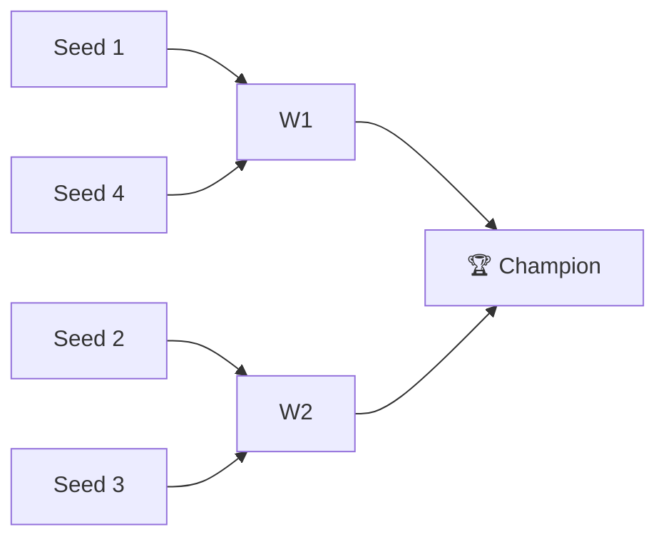

# 🏈 2023 Season

**Champion:** Super Squirrels
**Runner-Up:** _TBD_
**Regular Season Top Seed:** _TBD_
**Toilet Bowl Winner:** _TBD_

## Final Standings

> Auto-generated from Yahoo. Edit `_TBD_` fields and add narrative.

| Rank | Team | Owner | W–L | PF | PA | Playoff Seed |
|------|------|-------|-----|----|----|--------------|
| 1 | Super Squirrels |  | 7–7 | 1588.64 | 1644.92 | 1 |
| 2 | BBigg MACKS | Naren | 11–3 | 1874.16 | 1444.54 | 2 |
| 3 | Stroud Boys |  | 11–3 | 1888.52 | 1619.28 | 3 |
| 4 | Ken Keenan Kum |  | 8–6 | 1793.58 | 1771.36 | 4 |
| 5 | Pukakke NaKupp |  | 8–6 | 1755.32 | 1761.32 | — |
| 6 | Michael's Marvelous Team |  | 6–8 | 1562.06 | 1624.58 | — |
| 7 | Roger That |  | 5–9 | 1663.92 | 1709.82 | — |
| 8 | Jeremy's Neat Team |  | 5–9 | 1602.5 | 1831.42 | — |
| 9 | varun’s victorious team |  | 5–9 | 1506.58 | 1627.12 | — |
| 10 | Sharman’s Scorpions |  | 4–10 | 1365.16 | 1566.08 | — |

## Playoff Bracket

## Team Rosters

| Team | Post-Draft Roster | End-of-Season Roster |
|------|-------------------|----------------------|

## Awards

- 🏆 **League Champion:** _TBD_
- 💥 **Highest Single-Week Score:** _TBD_
- 📉 **Lowest Single-Week Score:** _TBD_
- 🔥 **Biggest Bust:** _TBD_
- 🎯 **Best Draft Pick:** _TBD_
- 🍗 **"Poultry Controversy" Nominee:** _TBD_

## The Story of the Year

_TBD — add the defining moments._

## Related

- [[Seasons]] · [[2023 Draft]] · [[Teams]] · [[Records]] · [[Lore]]
