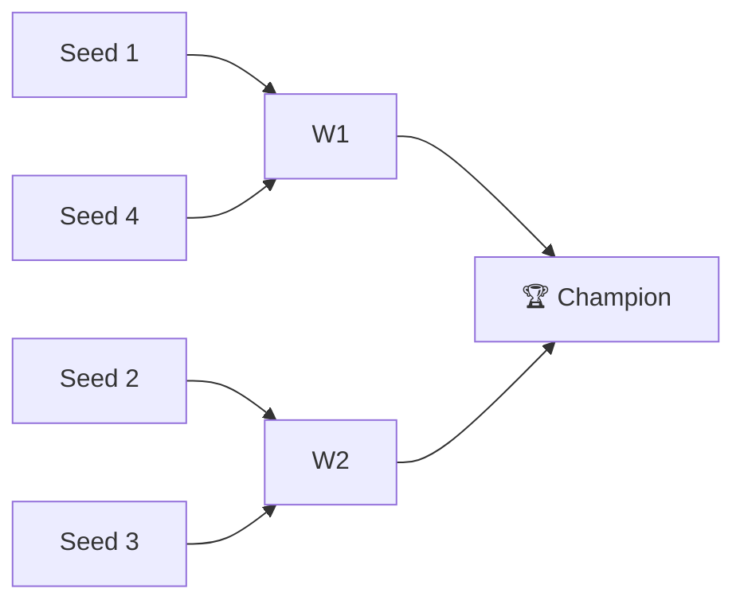

# 🗂️ Season Template

> **Copy this file** to `content/seasons/<YEAR>-season.md` when documenting a new season. Replace all `_TBD_` placeholders.

---

## <YEAR> Season

**Champion:** _TBD_
**Runner-Up:** _TBD_
**Regular Season Top Seed:** _TBD_
**Toilet Bowl Winner:** _TBD_

### Final Standings

| Rank | Team | Owner | W–L | PF | PA | Playoff Seed |
|------|------|-------|-----|----|----|--------------|
| 1 | _TBD_ | _TBD_ | 0–0 | 0 | 0 | 1 |
| 2 | _TBD_ | _TBD_ | 0–0 | 0 | 0 | 2 |
| 3 | _TBD_ | _TBD_ | 0–0 | 0 | 0 | 3 |
| 4 | _TBD_ | _TBD_ | 0–0 | 0 | 0 | 4 |
| 5 | _TBD_ | _TBD_ | 0–0 | 0 | 0 | — |
| 6 | _TBD_ | _TBD_ | 0–0 | 0 | 0 | — |
| 7 | _TBD_ | _TBD_ | 0–0 | 0 | 0 | — |
| 8 | _TBD_ | _TBD_ | 0–0 | 0 | 0 | — |
| 9 | _TBD_ | _TBD_ | 0–0 | 0 | 0 | — |
| 10 | _TBD_ | _TBD_ | 0–0 | 0 | 0 | — |

### Playoff Bracket

### Team Rosters

For each team, we track two snapshots: the **post-draft roster** (what they walked away from the draft with) and the **end-of-season roster** (what they finished with after waivers, trades, and injuries). This is the clearest way to see how much a season changed a team.

| Team | Post-Draft Roster | End-of-Season Roster |
|------|-------------------|----------------------|
| _TBD_ | [[<YEAR> <Team> Post-Draft]] | [[<YEAR> <Team> End-of-Season]] |
| _TBD_ | _TBD_ | _TBD_ |

> Each roster page follows the [[Roster Template]]. Use the starter at `content/rosters/<YEAR>/`.

### Awards

- 🏆 **League Champion:** _TBD_
- 💥 **Highest Single-Week Score:** _TBD_
- 📉 **Lowest Single-Week Score:** _TBD_
- 🔥 **Biggest Bust:** _TBD_
- 🎯 **Best Draft Pick:** _TBD_
- 🍗 **"Poultry Controversy" Nominee:** _TBD_

### The Story of the Year

_What actually happened. The trades, the meltdowns, the comeback, the curse. This is the part the spreadsheet can't tell you._

### Related

- [[Seasons]] · [[<YEAR> Draft]] · [[Teams]] · [[Records]]
