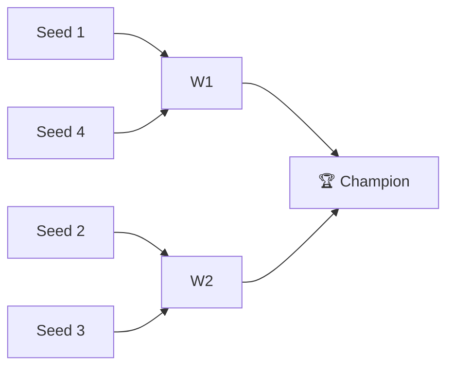

# 🏈 2025 Season

**Champion:** Jeremy's Neat Team
**Runner-Up:** _TBD_
**Regular Season Top Seed:** _TBD_
**Toilet Bowl Winner:** _TBD_

## Final Standings

> Auto-generated from Yahoo. Edit `_TBD_` fields and add narrative.

| Rank | Team | Owner | W–L | PF | PA | Playoff Seed |
|------|------|-------|-----|----|----|--------------|
| 1 | Jeremy's Neat Team |  | 8–6 | 1526.46 | 1552.74 | 1 |
| 2 | Big black big back |  | 7–7 | 1603.4 | 1557.16 | 2 |
| 3 | Roger That |  | 10–4 | 1751.42 | 1564.38 | 3 |
| 4 | Save Me | Naren | 7–7 | 1657.02 | 1648.02 | 4 |
| 5 | Indiana Jones |  | 8–6 | 1594.84 | 1458.2 | — |
| 6 | Sharman’s Scorpions |  | 8–6 | 1692.32 | 1697.14 | — |
| 7 | varun’s victorious team |  | 9–5 | 1719.92 | 1559.16 | — |
| 8 | Kaushal's Potatoes |  | 7–7 | 1551.74 | 1552.56 | — |
| 9 | Super Squirrels |  | 6–8 | 1470.88 | 1490.06 | — |
| 10 | Jayesh's Great Team |  | 6–8 | 1363.52 | 1470.56 | — |
| 11 | Michael's Marvelous Team |  | 5–9 | 1694.9 | 1555.26 | — |
| 12 | Stroud Boys |  | 3–11 | 1151.54 | 1672.72 | — |

## Playoff Bracket

## Team Rosters

| Team | Post-Draft Roster | End-of-Season Roster |
|------|-------------------|----------------------|

## Awards

- 🏆 **League Champion:** _TBD_
- 💥 **Highest Single-Week Score:** _TBD_
- 📉 **Lowest Single-Week Score:** _TBD_
- 🔥 **Biggest Bust:** _TBD_
- 🎯 **Best Draft Pick:** _TBD_
- 🍗 **"Poultry Controversy" Nominee:** _TBD_

## The Story of the Year

_TBD — add the defining moments._

## Related

- [[Seasons]] · [[2025 Draft]] · [[Teams]] · [[Records]] · [[Lore]]
