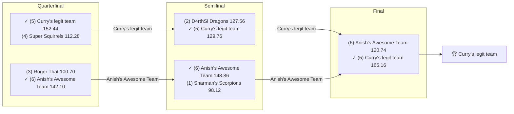

# 2018 Season

- **Champion:** [Curry's legit team](../owners/lokesh.md)
- **Runner-Up:** [Anish's Awesome Team](../owners/anish.md)
- **Regular Season Top Seed:** [Sharman's Scorpions](../owners/sharman.md)
- **Toilet Bowl Winner:** [Super Squirrels](../owners/abhinav.md)

## Final Standings

> **Finish** is the final playoff-adjusted rank, so it does not follow W-L order: a team can win the title from a lower seed. **Playoff Seed** is the seed the team entered the playoffs with; a dash means it did not qualify.

| Finish | Team | Owner | W-L | PF | PA | Playoff Seed |
|--------|------|-------|-----|----|----|--------------|
| 1 | Curry's legit team | Lokesh | 4-7 | 1406.78 | 1614.6 | 5 |
| 2 | Anish's Awesome Team | Anish | 3-7 | 1523.54 | 1590.72 | 6 |
| 3 | D4rthSi Dragons | Naren | 8-3 | 1736.5 | 1545.16 | 2 |
| 4 | Sharman's Scorpions | Sharman | 9-2 | 1754.04 | 1523.54 | 1 |
| 5 | Roger That | Pranav | 4-6 | 1632.38 | 1703.34 | 3 |
| 6 | Super Squirrels | Abhinav | 4-7 | 1450.44 | 1526.32 | 4 |

## Playoff Bracket

> The actual championship bracket, from captured weekly matchups. Seeds in parentheses; ✓ marks the winner. Consolation games are excluded, and a team that appears first in a later round had a bye.

## Team Rosters

> Post-draft and end-of-season lineups as the league's platform recorded them. Bench and IR rows are included; points are that week's score.

??? note "Curry's legit team"
    **Post-draft - week 3**

    | Slot | Player | Pos | Pts |
    |------|--------|-----|-----|
    | QB | [Aaron Rodgers](../players/aaron-rodgers.md) | QB | 19.90 |
    | RB | [James White](../players/james-white.md) | RB | 14.10 |
    | RB | [Chris Thompson](../players/chris-thompson.md) | RB | 2.70 |
    | WR | [Davante Adams](../players/davante-adams.md) | WR | 18.20 |
    | WR | [Larry Fitzgerald](../players/larry-fitzgerald.md) | WR | 2.90 |
    | TE | [O.J. Howard](../players/o-j-howard.md) | TE | 13.20 |
    | W/R/T | [Tevin Coleman](../players/tevin-coleman.md) | RB | 12.70 |
    | K | [Chris Boswell](../players/chris-boswell.md) | K | 6.00 |
    | DEF | [Browns](../players/browns.md) | DEF | 9.00 |
    | BN | [Alex Collins](../players/alex-collins.md) | RB | 16.40 |
    | BN | [Brandin Cooks](../players/brandin-cooks.md) | WR | 16.00 |
    | BN | [Jamison Crowder](../players/jamison-crowder.md) | WR | 14.50 |
    | BN | [Broncos](../players/broncos.md) | DEF | 6.00 |
    | BN | [Mason Crosby](../players/mason-crosby.md) | K | 6.00 |
    | BN | [Randall Cobb](../players/randall-cobb.md) | WR | 4.20 |

    **End of season - week 16**

    | Slot | Player | Pos | Pts |
    |------|--------|-----|-----|
    | QB | [Deshaun Watson](../players/deshaun-watson.md) | QB | 36.46 |
    | RB | [Dalvin Cook](../players/dalvin-cook.md) | RB | 13.80 |
    | RB | [Phillip Lindsay](../players/phillip-lindsay.md) | RB | 7.70 |
    | WR | [Davante Adams](../players/davante-adams.md) | WR | 24.10 |
    | WR | [T.Y. Hilton](../players/t-y-hilton.md) | WR | 20.80 |
    | TE | [Evan Engram](../players/evan-engram.md) | TE | 17.30 |
    | W/R/T | [Julian Edelman](../players/julian-edelman.md) | WR | 19.00 |
    | K | [Harrison Butker](../players/harrison-butker.md) | K | 13.00 |
    | DEF | [Titans](../players/titans.md) | DEF | 13.00 |
    | BN | [Aaron Rodgers](../players/aaron-rodgers.md) | QB | 42.88 |
    | BN | [Robbie Chosen](../players/robbie-chosen.md) | WR | 29.00 |
    | BN | [Jamaal Williams](../players/jamaal-williams.md) | RB | 27.60 |
    | BN | [Adam Humphries](../players/adam-humphries.md) | WR | 17.90 |
    | BN | [Jaylen Samuels](../players/jaylen-samuels.md) | RB | 15.40 |
    | BN | [Curtis Samuel](../players/curtis-samuel.md) | WR | 11.10 |

??? note "Anish's Awesome Team"
    **Post-draft - week 3**

    | Slot | Player | Pos | Pts |
    |------|--------|-----|-----|
    | QB | [Cam Newton](../players/cam-newton.md) | QB | 29.60 |
    | RB | [Giovani Bernard](../players/giovani-bernard.md) | RB | 19.60 |
    | RB | [David Johnson](../players/david-johnson.md) | RB | 16.10 |
    | WR | [Julio Jones](../players/julio-jones.md) | WR | 14.60 |
    | WR | [Nelson Agholor](../players/nelson-agholor.md) | WR | 6.40 |
    | TE | [Rob Gronkowski](../players/rob-gronkowski.md) | TE | 9.10 |
    | W/R/T | [Travis Kelce](../players/travis-kelce.md) | TE | 19.40 |
    | K | [Stephen Gostkowski](../players/stephen-gostkowski.md) | K | 4.00 |
    | DEF | [Texans](../players/texans.md) | DEF | 4.00 |
    | BN | [Matthew Stafford](../players/matthew-stafford.md) | QB | 18.48 |
    | BN | [Rams](../players/rams.md) | DEF | 14.00 |
    | BN | [Carson Wentz](../players/carson-wentz.md) | QB | 12.20 |
    | BN | [T.Y. Hilton](../players/t-y-hilton.md) | WR | 10.00 |
    | BN | [Allen Robinson](../players/allen-robinson.md) | WR | 8.00 |
    | BN | [Leonard Fournette](../players/leonard-fournette.md) | RB | 0.00 |

    **End of season - week 16**

    | Slot | Player | Pos | Pts |
    |------|--------|-----|-----|
    | QB | [Dak Prescott](../players/dak-prescott.md) | QB | 16.64 |
    | RB | [Chris Carson](../players/chris-carson.md) | RB | 23.60 |
    | RB | [Tarik Cohen](../players/tarik-cohen.md) | RB | 2.90 |
    | WR | [Julio Jones](../players/julio-jones.md) | WR | 12.80 |
    | WR | [Amari Cooper](../players/amari-cooper.md) | WR | 6.00 |
    | TE | [Zach Ertz](../players/zach-ertz.md) | TE | 35.00 |
    | W/R/T | [Joe Mixon](../players/joe-mixon.md) | RB | 9.80 |
    | K | [Ka'imi Fairbairn](../players/ka-imi-fairbairn.md) | K | 6.00 |
    | DEF | [Rams](../players/rams.md) | DEF | 8.00 |
    | BN | [Robert Woods](../players/robert-woods.md) | WR | 28.40 |
    | BN | [Alvin Kamara](../players/alvin-kamara.md) | RB | 26.50 |
    | BN | [Derrick Henry](../players/derrick-henry.md) | RB | 16.20 |
    | BN | [Leonard Fournette](../players/leonard-fournette.md) | RB | 16.10 |
    | BN | [George Kittle](../players/george-kittle.md) | TE | 14.40 |
    | BN | [Todd Gurley](../players/todd-gurley.md) | RB | 0.00 |

??? note "D4rthSi Dragons"
    **Post-draft - week 3**

    | Slot | Player | Pos | Pts |
    |------|--------|-----|-----|
    | QB | [Tom Brady](../players/tom-brady.md) | QB | 8.52 |
    | RB | [Saquon Barkley](../players/saquon-barkley.md) | RB | 22.70 |
    | RB | [Melvin Gordon III](../players/melvin-gordon-iii.md) | RB | 16.40 |
    | WR | [Mike Evans](../players/mike-evans.md) | WR | 25.70 |
    | WR | [Antonio Brown](../players/antonio-brown.md) | WR | 17.00 |
    | TE | [Evan Engram](../players/evan-engram.md) | TE | 2.90 |
    | W/R/T | [DeSean Jackson](../players/desean-jackson.md) | WR | 6.70 |
    | K | [Matt Bryant](../players/matt-bryant.md) | K | 3.00 |
    | DEF | [Jaguars](../players/jaguars.md) | DEF | 7.00 |
    | BN | [Sammy Watkins](../players/sammy-watkins.md) | WR | 18.50 |
    | BN | [Kyle Rudolph](../players/kyle-rudolph.md) | TE | 15.80 |
    | BN | [Russell Wilson](../players/russell-wilson.md) | QB | 15.58 |
    | BN | [Ravens](../players/ravens.md) | DEF | 6.00 |
    | BN | [Dalvin Cook](../players/dalvin-cook.md) | RB | 0.00 |
    | BN | [Dan Bailey](../players/dan-bailey.md) | K | 0.00 |

    **End of season - week 16**

    | Slot | Player | Pos | Pts |
    |------|--------|-----|-----|
    | QB | [Matt Ryan](../players/matt-ryan.md) | QB | 19.46 |
    | RB | [Saquon Barkley](../players/saquon-barkley.md) | RB | 18.70 |
    | RB | [Melvin Gordon III](../players/melvin-gordon-iii.md) | RB | 14.40 |
    | WR | [Antonio Brown](../players/antonio-brown.md) | WR | 44.50 |
    | WR | [Mike Evans](../players/mike-evans.md) | WR | 21.00 |
    | TE | [Travis Kelce](../players/travis-kelce.md) | TE | 10.40 |
    | W/R/T | [David Johnson](../players/david-johnson.md) | RB | 13.70 |
    | K | [Greg Zuerlein](../players/greg-zuerlein.md) | K | 7.00 |
    | DEF | [Patriots](../players/patriots.md) | DEF | 10.00 |
    | BN | [Baker Mayfield](../players/baker-mayfield.md) | QB | 24.96 |
    | BN | [C.J. Anderson](../players/c-j-anderson.md) | RB | 23.20 |
    | BN | [Jared Goff](../players/jared-goff.md) | QB | 17.24 |
    | BN | [Josh Allen](../players/josh-allen.md) | QB | 13.68 |
    | BN | [Brandin Cooks](../players/brandin-cooks.md) | WR | 9.20 |
    | BN | [Rob Gronkowski](../players/rob-gronkowski.md) | TE | 0.00 |

??? note "Sharman's Scorpions"
    **Post-draft - week 3**

    | Slot | Player | Pos | Pts |
    |------|--------|-----|-----|
    | QB | [Drew Brees](../players/drew-brees.md) | QB | 40.54 |
    | RB | [Kareem Hunt](../players/kareem-hunt.md) | RB | 16.40 |
    | RB | [Ezekiel Elliott](../players/ezekiel-elliott.md) | RB | 14.80 |
    | WR | [Michael Thomas](../players/michael-thomas.md) | WR | 22.90 |
    | WR | [Stefon Diggs](../players/stefon-diggs.md) | WR | 5.70 |
    | TE | [George Kittle](../players/george-kittle.md) | TE | 14.90 |
    | W/R/T | [Adam Thielen](../players/adam-thielen.md) | WR | 24.50 |
    | K | [Jake Elliott](../players/jake-elliott.md) | K | 8.00 |
    | DEF | [Bears](../players/bears.md) | DEF | 13.00 |
    | BN | [Ben Roethlisberger](../players/ben-roethlisberger.md) | QB | 25.02 |
    | BN | [Christian McCaffrey](../players/christian-mccaffrey.md) | RB | 21.40 |
    | BN | [Alex Smith](../players/alex-smith.md) | QB | 17.80 |
    | BN | [Trey Burton](../players/trey-burton.md) | TE | 9.50 |
    | BN | [Chargers](../players/chargers.md) | DEF | 1.00 |
    | BN | [Joe Mixon](../players/joe-mixon.md) | RB | 0.00 |

    **End of season - week 16**

    | Slot | Player | Pos | Pts |
    |------|--------|-----|-----|
    | QB | [Drew Brees](../players/drew-brees.md) | QB | 16.94 |
    | RB | [Christian McCaffrey](../players/christian-mccaffrey.md) | RB | 29.80 |
    | RB | [Ezekiel Elliott](../players/ezekiel-elliott.md) | RB | 15.90 |
    | WR | [Michael Thomas](../players/michael-thomas.md) | WR | 27.90 |
    | WR | [Adam Thielen](../players/adam-thielen.md) | WR | 13.30 |
    | TE | [Eric Ebron](../players/eric-ebron.md) | TE | 5.80 |
    | W/R/T | [Stefon Diggs](../players/stefon-diggs.md) | WR | 9.00 |
    | K | [Stephen Gostkowski](../players/stephen-gostkowski.md) | K | 6.00 |
    | DEF | [Bears](../players/bears.md) | DEF | 7.00 |
    | BN | [Ben Roethlisberger](../players/ben-roethlisberger.md) | QB | 29.60 |
    | BN | [Andrew Luck](../players/andrew-luck.md) | QB | 22.58 |
    | BN | [Mark Ingram II](../players/mark-ingram-ii.md) | RB | 11.30 |
    | BN | [Trey Burton](../players/trey-burton.md) | TE | 8.00 |

??? note "Roger That"
    **Post-draft - week 3**

    | Slot | Player | Pos | Pts |
    |------|--------|-----|-----|
    | QB | [Deshaun Watson](../players/deshaun-watson.md) | QB | 26.00 |
    | RB | [Alvin Kamara](../players/alvin-kamara.md) | RB | 34.00 |
    | RB | [Todd Gurley](../players/todd-gurley.md) | RB | 24.60 |
    | WR | [DeAndre Hopkins](../players/deandre-hopkins.md) | WR | 14.60 |
    | WR | [Keenan Allen](../players/keenan-allen.md) | WR | 5.40 |
    | TE | [Jimmy Graham](../players/jimmy-graham.md) | TE | 9.50 |
    | W/R/T | [Tyreek Hill](../players/tyreek-hill.md) | WR | 7.60 |
    | K | [Justin Tucker](../players/justin-tucker.md) | K | 13.00 |
    | DEF | [Vikings](../players/vikings.md) | DEF | 3.00 |
    | BN | [Jarvis Landry](../players/jarvis-landry.md) | WR | 20.30 |
    | BN | [Philip Rivers](../players/philip-rivers.md) | QB | 17.04 |
    | BN | [Demaryius Thomas](../players/demaryius-thomas.md) | WR | 11.30 |
    | BN | [Jordan Reed](../players/jordan-reed.md) | TE | 10.50 |
    | BN | [Josh Gordon](../players/josh-gordon.md) | WR | 0.00 |
    | BN | [Le'Veon Bell](../players/le-veon-bell.md) | RB | 0.00 |

    **End of season - week 16**

    | Slot | Player | Pos | Pts |
    |------|--------|-----|-----|
    | QB | [Philip Rivers](../players/philip-rivers.md) | QB | 5.34 |
    | RB | [Sony Michel](../players/sony-michel.md) | RB | 17.60 |
    | RB | [Kenyan Drake](../players/kenyan-drake.md) | RB | 9.40 |
    | WR | [DeAndre Hopkins](../players/deandre-hopkins.md) | WR | 19.40 |
    | WR | [Keenan Allen](../players/keenan-allen.md) | WR | 10.80 |
    | TE | [Cameron Brate](../players/cameron-brate.md) | TE | 2.80 |
    | W/R/T | [Nick Chubb](../players/nick-chubb.md) | RB | 13.50 |
    | K | [Justin Tucker](../players/justin-tucker.md) | K | 12.00 |
    | DEF | [Broncos](../players/broncos.md) | DEF | 1.00 |
    | BN | [Jameis Winston](../players/jameis-winston.md) | QB | 14.84 |
    | BN | [Tyreek Hill](../players/tyreek-hill.md) | WR | 13.10 |
    | BN | [Mitchell Trubisky](../players/mitchell-trubisky.md) | QB | 12.14 |
    | BN | [Jarvis Landry](../players/jarvis-landry.md) | WR | 11.82 |
    | BN | [Jimmy Graham](../players/jimmy-graham.md) | TE | 6.40 |

??? note "Super Squirrels"
    **Post-draft - week 3**

    | Slot | Player | Pos | Pts |
    |------|--------|-----|-----|
    | QB | [Patrick Mahomes](../players/patrick-mahomes.md) | QB | 25.26 |
    | RB | [Jordan Howard](../players/jordan-howard.md) | RB | 16.10 |
    | RB | [James Conner](../players/james-conner.md) | RB | 14.50 |
    | WR | [Odell Beckham Jr.](../players/odell-beckham-jr.md) | WR | 19.90 |
    | WR | [A.J. Green](../players/a-j-green.md) | WR | 10.80 |
    | TE | [Zach Ertz](../players/zach-ertz.md) | TE | 12.30 |
    | W/R/T | [JuJu Smith-Schuster](../players/juju-smith-schuster.md) | WR | 20.60 |
    | K | [Matt Prater](../players/matt-prater.md) | K | 14.00 |
    | DEF | [Eagles](../players/eagles.md) | DEF | 3.00 |
    | BN | [Adrian Peterson](../players/adrian-peterson.md) | RB | 24.00 |
    | BN | [Golden Tate](../players/golden-tate.md) | WR | 12.90 |
    | BN | [Kirk Cousins](../players/kirk-cousins.md) | QB | 11.04 |
    | BN | [Amari Cooper](../players/amari-cooper.md) | WR | 3.70 |
    | BN | [Jay Ajayi](../players/jay-ajayi.md) | RB | 0.00 |
    | BN | [LeSean McCoy](../players/lesean-mccoy.md) | RB | 0.00 |

    **End of season - week 16**

    | Slot | Player | Pos | Pts |
    |------|--------|-----|-----|
    | QB | [Patrick Mahomes](../players/patrick-mahomes.md) | QB | 28.22 |
    | RB | [Justin Jackson](../players/justin-jackson.md) | RB | 11.60 |
    | WR | [Tyler Lockett](../players/tyler-lockett.md) | WR | 13.90 |
    | WR | [DJ Moore](../players/dj-moore.md) | WR | 3.90 |
    | TE | [David Njoku](../players/david-njoku.md) | TE | 16.30 |
    | W/R/T | [JuJu Smith-Schuster](../players/juju-smith-schuster.md) | WR | 20.50 |
    | K | [Wil Lutz](../players/wil-lutz.md) | K | 8.00 |
    | DEF | [Ravens](../players/ravens.md) | DEF | 20.00 |
    | BN | [Russell Wilson](../players/russell-wilson.md) | QB | 28.54 |
    | BN | [Zay Jones](../players/zay-jones.md) | WR | 17.70 |
    | BN | [Marlon Mack](../players/marlon-mack.md) | RB | 10.80 |
    | BN | [James Conner](../players/james-conner.md) | RB | 0.00 |
    | BN | [Kerryon Johnson](../players/kerryon-johnson.md) | RB | 0.00 |
    | BN | [Lamar Miller](../players/lamar-miller.md) | RB | 0.00 |
    | BN | [Odell Beckham Jr.](../players/odell-beckham-jr.md) | WR | 0.00 |

## Awards

- **League Champion:** [Curry's legit team](../owners/lokesh.md)
- **Most Valuable Player:** [Adam Thielen](../players/adam-thielen.md) - 6 wins swung
- **Finals MVP:** [Deshaun Watson](../players/deshaun-watson.md) - 36.46 pts ([Curry's legit team](../owners/lokesh.md))
- **Newcomer of the Year:** _NA_
- **Undrafted Player of the Year:** [Eric Ebron](../players/eric-ebron.md) - 4 wins swung
- **Highest Single-Week Score:** D4rthSi Dragons - 203.12 (Wk 11)
- **Lowest Single-Week Score:** Super Squirrels - 77.12 (Wk 15)
- **Best Draft Pick:** [Christian McCaffrey](../players/christian-mccaffrey.md) (RB) - drafted by [Sharman's Scorpions](../owners/sharman.md) at pick 65, finished +15 spots at the position, 339.10 pts
- **Biggest Bust:** [David Johnson](../players/david-johnson.md) (RB) - drafted by [Anish's Awesome Team](../owners/anish.md) at pick 3, finished -5 spots at the position, 211.00 pts, played 13 of 14 weeks, scored mostly for [D4rthSi Dragons](../owners/naren.md)

## Position Highs

The biggest single week at each position, regular season, starters only. The league-wide high above is almost always a receiver or a back; this is where a kicker's or a defense's best day is visible.

| Pos | Player | Points | When |
|-----|--------|--------|------|
| QB | [Drew Brees](../players/drew-brees.md) | 40.54 | Wk 3, [Sharman's Scorpions](../owners/sharman.md) |
| RB | [Christian McCaffrey](../players/christian-mccaffrey.md) | 46.70 | Wk 12, [Sharman's Scorpions](../owners/sharman.md) |
| WR | [Tyreek Hill](../players/tyreek-hill.md) | 43.50 | Wk 11, [Roger That](../owners/pranav.md) |
| TE | [Zach Ertz](../players/zach-ertz.md) | 40.50 | Wk 10, [Anish's Awesome Team](../owners/anish.md) |
| K | [Stephen Gostkowski](../players/stephen-gostkowski.md) | 22.00 | Wk 6, [D4rthSi Dragons](../owners/naren.md) |
| DEF | [Bears](../players/bears.md) | 28.00 | Wk 9, [Sharman's Scorpions](../owners/sharman.md) |

## Team of the Season

The best starting lineup the season produced, one selection per slot the league actually starts. A slot is won the same way the MVP is: by wins swung, the games a team won by less than the player scored from the starting lineup. The flex takes the best eligible player the position slots did not already claim.

| Slot | Player | Pos | Wins Swung | Points in Them | Rostered By |
|------|--------|-----|------------|----------------|-------------|
| QB | [Drew Brees](../players/drew-brees.md) | QB | 5 | 116.56 | Sharman's Scorpions |
| RB | [Saquon Barkley](../players/saquon-barkley.md) | RB | 4 | 101.00 | D4rthSi Dragons |
|  | [Ezekiel Elliott](../players/ezekiel-elliott.md) | RB | 4 | 93.40 | Sharman's Scorpions |
| WR | [Adam Thielen](../players/adam-thielen.md) | WR | 6 | 132.40 | Sharman's Scorpions |
|  | [Antonio Brown](../players/antonio-brown.md) | WR | 5 | 136.00 | D4rthSi Dragons |
| TE | [Eric Ebron](../players/eric-ebron.md) | TE | 4 | 78.70 | Sharman's Scorpions |
| W/R/T | [Davante Adams](../players/davante-adams.md) | WR | 3 | 83.70 | Curry's legit team |
| K | [Harrison Butker](../players/harrison-butker.md) | K | 3 | 31.00 | Sharman's Scorpions, Curry's legit team |
| DEF | [Bears](../players/bears.md) | DEF | 4 | 52.00 | Sharman's Scorpions |

> Every award here is computed, not voted. **MVP** is the player who swung the most wins: games their team won by less than the player scored from the starting lineup. **Finals MVP** is the top scorer in the title game's winning lineup. **Newcomer of the Year** is the same wins-swung measure among players making their first appearance on a Pine Hills roster - a league debut, not an NFL rookie season, which the captured data does not record. **Undrafted Player of the Year** is the same measure among players nobody took in that year's draft. **Best Draft Pick** and **Biggest Bust** compare, within a position, where a player was taken against where they finished on season points; Bust is restricted to rounds 1-3 and to players who scored in at least 75% of the season's weeks, so a lost year is not counted as a bad pick.

## The Story of the Year

_TBD - add the defining moments._

## Related

- [Seasons](index.md) · [2018 Draft](../draft/2018-draft.md) · [Teams](../teams/index.md) · [Records](../records/index.md) · [Lore](../lore.md) · [Playoffs](../playoffs.md)
