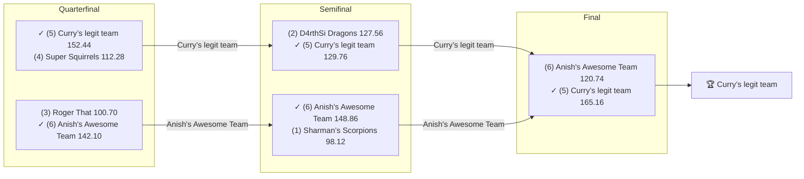

# 🏈 2018 Season

- **Champion:** Curry’s legit team
- **Runner-Up:** Anish's Awesome Team
- **Regular Season Top Seed:** Sharman’s Scorpions
- **Toilet Bowl Winner:** Super Squirrels

## Final Standings

> Auto-generated from Yahoo. **Finish** is Yahoo's final playoff-adjusted rank, so it does not follow W-L order - a team can win the title from a lower seed. **Playoff Seed** is the seed the team actually entered the playoffs with; - means it did not qualify.

| Finish | Team | Owner | W-L | PF | PA | Playoff Seed |
|--------|------|-------|-----|----|----|--------------|
| 1 | Curry’s legit team | lokesh | 4-7 | 1406.78 | 1614.6 | 5 |
| 2 | Anish's Awesome Team | Anish | 3-7 | 1523.54 | 1590.72 | 6 |
| 3 | D4rthSi Dragons | Naren | 8-3 | 1736.5 | 1545.16 | 2 |
| 4 | Sharman’s Scorpions | Sharman | 9-2 | 1754.04 | 1523.54 | 1 |
| 5 | Roger That | Pranav | 4-6 | 1632.38 | 1703.34 | 3 |
| 6 | Super Squirrels | Super | 4-7 | 1450.44 | 1526.32 | 4 |

## Playoff Bracket

> The actual championship bracket, from captured weekly matchups. Seeds in parentheses; ✓ marks the winner. Consolation games are excluded, and a team that appears first in a later round had a bye.

## Team Rosters

> Post-draft and end-of-season lineups as Yahoo recorded them. Bench and IR rows are included; points are that week's score.

??? note "Curry’s legit team"
    **Post-draft - week 3**

    | Slot | Player | Pos | Pts |
    |------|--------|-----|-----|
    | QB | Aaron Rodgers | QB | 19.90 |
    | RB | James White | RB | 14.10 |
    | RB | Chris Thompson | RB | 2.70 |
    | WR | Davante Adams | WR | 18.20 |
    | WR | Larry Fitzgerald | WR | 2.90 |
    | TE | O.J. Howard | TE | 13.20 |
    | W/R/T | Tevin Coleman | RB | 12.70 |
    | K | Chris Boswell | K | 6.00 |
    | DEF | Browns | DEF | 9.00 |
    | BN | Alex Collins | RB | 16.40 |
    | BN | Brandin Cooks | WR | 16.00 |
    | BN | Jamison Crowder | WR | 14.50 |
    | BN | Broncos | DEF | 6.00 |
    | BN | Mason Crosby | K | 6.00 |
    | BN | Randall Cobb | WR | 4.20 |

    **End of season - week 16**

    | Slot | Player | Pos | Pts |
    |------|--------|-----|-----|
    | QB | Deshaun Watson | QB | 36.46 |
    | RB | Dalvin Cook | RB | 13.80 |
    | RB | Phillip Lindsay | RB | 7.70 |
    | WR | Davante Adams | WR | 24.10 |
    | WR | T.Y. Hilton | WR | 20.80 |
    | TE | Evan Engram | TE | 17.30 |
    | W/R/T | Julian Edelman | WR | 19.00 |
    | K | Harrison Butker | K | 13.00 |
    | DEF | Titans | DEF | 13.00 |
    | BN | Aaron Rodgers | QB | 42.88 |
    | BN | Robbie Chosen | WR | 29.00 |
    | BN | Jamaal Williams | RB | 27.60 |
    | BN | Adam Humphries | WR | 17.90 |
    | BN | Jaylen Samuels | RB | 15.40 |
    | BN | Curtis Samuel | WR | 11.10 |

??? note "Anish's Awesome Team"
    **Post-draft - week 3**

    | Slot | Player | Pos | Pts |
    |------|--------|-----|-----|
    | QB | Cam Newton | QB | 29.60 |
    | RB | Giovani Bernard | RB | 19.60 |
    | RB | David Johnson | RB | 16.10 |
    | WR | Julio Jones | WR | 14.60 |
    | WR | Nelson Agholor | WR | 6.40 |
    | TE | Rob Gronkowski | TE | 9.10 |
    | W/R/T | Travis Kelce | TE | 19.40 |
    | K | Stephen Gostkowski | K | 4.00 |
    | DEF | Texans | DEF | 4.00 |
    | BN | Matthew Stafford | QB | 18.48 |
    | BN | Rams | DEF | 14.00 |
    | BN | Carson Wentz | QB | 12.20 |
    | BN | T.Y. Hilton | WR | 10.00 |
    | BN | Allen Robinson | WR | 8.00 |
    | BN | Leonard Fournette | RB | 0.00 |

    **End of season - week 16**

    | Slot | Player | Pos | Pts |
    |------|--------|-----|-----|
    | QB | Dak Prescott | QB | 16.64 |
    | RB | Chris Carson | RB | 23.60 |
    | RB | Tarik Cohen | RB | 2.90 |
    | WR | Julio Jones | WR | 12.80 |
    | WR | Amari Cooper | WR | 6.00 |
    | TE | Zach Ertz | TE | 35.00 |
    | W/R/T | Joe Mixon | RB | 9.80 |
    | K | Ka'imi Fairbairn | K | 6.00 |
    | DEF | Rams | DEF | 8.00 |
    | BN | Robert Woods | WR | 28.40 |
    | BN | Alvin Kamara | RB | 26.50 |
    | BN | Derrick Henry | RB | 16.20 |
    | BN | Leonard Fournette | RB | 16.10 |
    | BN | George Kittle | TE | 14.40 |
    | BN | Todd Gurley | RB | 0.00 |

??? note "D4rthSi Dragons"
    **Post-draft - week 3**

    | Slot | Player | Pos | Pts |
    |------|--------|-----|-----|
    | QB | Tom Brady | QB | 8.52 |
    | RB | Saquon Barkley | RB | 22.70 |
    | RB | Melvin Gordon III | RB | 16.40 |
    | WR | Mike Evans | WR | 25.70 |
    | WR | Antonio Brown | WR | 17.00 |
    | TE | Evan Engram | TE | 2.90 |
    | W/R/T | DeSean Jackson | WR | 6.70 |
    | K | Matt Bryant | K | 3.00 |
    | DEF | Jaguars | DEF | 7.00 |
    | BN | Sammy Watkins | WR | 18.50 |
    | BN | Kyle Rudolph | TE | 15.80 |
    | BN | Russell Wilson | QB | 15.58 |
    | BN | Ravens | DEF | 6.00 |
    | BN | Dalvin Cook | RB | 0.00 |
    | BN | Dan Bailey | K | 0.00 |

    **End of season - week 16**

    | Slot | Player | Pos | Pts |
    |------|--------|-----|-----|
    | QB | Matt Ryan | QB | 19.46 |
    | RB | Saquon Barkley | RB | 18.70 |
    | RB | Melvin Gordon III | RB | 14.40 |
    | WR | Antonio Brown | WR | 44.50 |
    | WR | Mike Evans | WR | 21.00 |
    | TE | Travis Kelce | TE | 10.40 |
    | W/R/T | David Johnson | RB | 13.70 |
    | K | Greg Zuerlein | K | 7.00 |
    | DEF | Patriots | DEF | 10.00 |
    | BN | Baker Mayfield | QB | 24.96 |
    | BN | C.J. Anderson | RB | 23.20 |
    | BN | Jared Goff | QB | 17.24 |
    | BN | Josh Allen | QB | 13.68 |
    | BN | Brandin Cooks | WR | 9.20 |
    | BN | Rob Gronkowski | TE | 0.00 |

??? note "Sharman’s Scorpions"
    **Post-draft - week 3**

    | Slot | Player | Pos | Pts |
    |------|--------|-----|-----|
    | QB | Drew Brees | QB | 40.54 |
    | RB | Kareem Hunt | RB | 16.40 |
    | RB | Ezekiel Elliott | RB | 14.80 |
    | WR | Michael Thomas | WR | 22.90 |
    | WR | Stefon Diggs | WR | 5.70 |
    | TE | George Kittle | TE | 14.90 |
    | W/R/T | Adam Thielen | WR | 24.50 |
    | K | Jake Elliott | K | 8.00 |
    | DEF | Bears | DEF | 13.00 |
    | BN | Ben Roethlisberger | QB | 25.02 |
    | BN | Christian McCaffrey | RB | 21.40 |
    | BN | Alex Smith | QB | 17.80 |
    | BN | Trey Burton | TE | 9.50 |
    | BN | Chargers | DEF | 1.00 |
    | BN | Joe Mixon | RB | 0.00 |

    **End of season - week 16**

    | Slot | Player | Pos | Pts |
    |------|--------|-----|-----|
    | QB | Drew Brees | QB | 16.94 |
    | RB | Christian McCaffrey | RB | 29.80 |
    | RB | Ezekiel Elliott | RB | 15.90 |
    | WR | Michael Thomas | WR | 27.90 |
    | WR | Adam Thielen | WR | 13.30 |
    | TE | Eric Ebron | TE | 5.80 |
    | W/R/T | Stefon Diggs | WR | 9.00 |
    | K | Stephen Gostkowski | K | 6.00 |
    | DEF | Bears | DEF | 7.00 |
    | BN | Ben Roethlisberger | QB | 29.60 |
    | BN | Andrew Luck | QB | 22.58 |
    | BN | Mark Ingram II | RB | 11.30 |
    | BN | Trey Burton | TE | 8.00 |

??? note "Roger That"
    **Post-draft - week 3**

    | Slot | Player | Pos | Pts |
    |------|--------|-----|-----|
    | QB | Deshaun Watson | QB | 26.00 |
    | RB | Alvin Kamara | RB | 34.00 |
    | RB | Todd Gurley | RB | 24.60 |
    | WR | DeAndre Hopkins | WR | 14.60 |
    | WR | Keenan Allen | WR | 5.40 |
    | TE | Jimmy Graham | TE | 9.50 |
    | W/R/T | Tyreek Hill | WR | 7.60 |
    | K | Justin Tucker | K | 13.00 |
    | DEF | Vikings | DEF | 3.00 |
    | BN | Jarvis Landry | WR | 20.30 |
    | BN | Philip Rivers | QB | 17.04 |
    | BN | Demaryius Thomas | WR | 11.30 |
    | BN | Jordan Reed | TE | 10.50 |
    | BN | Josh Gordon | WR | 0.00 |
    | BN | Le'Veon Bell | RB | 0.00 |

    **End of season - week 16**

    | Slot | Player | Pos | Pts |
    |------|--------|-----|-----|
    | QB | Philip Rivers | QB | 5.34 |
    | RB | Sony Michel | RB | 17.60 |
    | RB | Kenyan Drake | RB | 9.40 |
    | WR | DeAndre Hopkins | WR | 19.40 |
    | WR | Keenan Allen | WR | 10.80 |
    | TE | Cameron Brate | TE | 2.80 |
    | W/R/T | Nick Chubb | RB | 13.50 |
    | K | Justin Tucker | K | 12.00 |
    | DEF | Broncos | DEF | 1.00 |
    | BN | Jameis Winston | QB | 14.84 |
    | BN | Tyreek Hill | WR | 13.10 |
    | BN | Mitchell Trubisky | QB | 12.14 |
    | BN | Jarvis Landry | WR | 11.82 |
    | BN | Jimmy Graham | TE | 6.40 |

??? note "Super Squirrels"
    **Post-draft - week 3**

    | Slot | Player | Pos | Pts |
    |------|--------|-----|-----|
    | QB | Patrick Mahomes | QB | 25.26 |
    | RB | Jordan Howard | RB | 16.10 |
    | RB | James Conner | RB | 14.50 |
    | WR | Odell Beckham Jr. | WR | 19.90 |
    | WR | A.J. Green | WR | 10.80 |
    | TE | Zach Ertz | TE | 12.30 |
    | W/R/T | JuJu Smith-Schuster | WR | 20.60 |
    | K | Matt Prater | K | 14.00 |
    | DEF | Eagles | DEF | 3.00 |
    | BN | Adrian Peterson | RB | 24.00 |
    | BN | Golden Tate | WR | 12.90 |
    | BN | Kirk Cousins | QB | 11.04 |
    | BN | Amari Cooper | WR | 3.70 |
    | BN | Jay Ajayi | RB | 0.00 |
    | BN | LeSean McCoy | RB | 0.00 |

    **End of season - week 16**

    | Slot | Player | Pos | Pts |
    |------|--------|-----|-----|
    | QB | Patrick Mahomes | QB | 28.22 |
    | RB | Justin Jackson | RB | 11.60 |
    | WR | Tyler Lockett | WR | 13.90 |
    | WR | DJ Moore | WR | 3.90 |
    | TE | David Njoku | TE | 16.30 |
    | W/R/T | JuJu Smith-Schuster | WR | 20.50 |
    | K | Wil Lutz | K | 8.00 |
    | DEF | Ravens | DEF | 20.00 |
    | BN | Russell Wilson | QB | 28.54 |
    | BN | Zay Jones | WR | 17.70 |
    | BN | Marlon Mack | RB | 10.80 |
    | BN | James Conner | RB | 0.00 |
    | BN | Kerryon Johnson | RB | 0.00 |
    | BN | Lamar Miller | RB | 0.00 |
    | BN | Odell Beckham Jr. | WR | 0.00 |

## Awards

- 🏆 **League Champion:** Curry’s legit team
- 💥 **Highest Single-Week Score:** D4rthSi Dragons - 203.12 (Wk 11)
- 📉 **Lowest Single-Week Score:** Super Squirrels - 77.12 (Wk 15)
- 🔥 **Biggest Bust:** Jamaal Williams (RB) - drafted by [Curry’s legit team](../teams/curry-s-legit-team.md) at pick 4, finished -4 spots at the position, 27.60 pts
- 🎯 **Best Draft Pick:** Tyreek Hill (WR) - drafted by [Roger That](../teams/roger-that.md) at pick 6, finished +15 spots at the position, 243.10 pts
- 🍗 **"Poultry Controversy" Nominee:** _TBD_

> Best Draft Pick and Biggest Bust are computed, not voted: within each position, the gap between where a player was drafted and where they finished on season points. Bust is restricted to rounds 1-3.

## The Story of the Year

_TBD - add the defining moments._

## Related

- [Seasons](index.md) · [2018 Draft](../draft/2018-draft.md) · [Teams](../teams/index.md) · [Records](../records/index.md) · Lore · [Playoffs](../playoffs.md)
