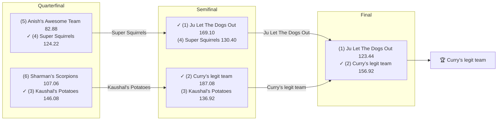

# 🏈 2019 Season

- **Champion:** Curry’s legit team
- **Runner-Up:** Ju Let The Dogs Out
- **Regular Season Top Seed:** Ju Let The Dogs Out
- **Toilet Bowl Winner:** Roger That

## Final Standings

> Auto-generated from Yahoo. **Finish** is Yahoo's final playoff-adjusted rank, so it does not follow W-L order - a team can win the title from a lower seed. **Playoff Seed** is the seed the team actually entered the playoffs with; - means it did not qualify.

| Finish | Team | Owner | W-L | PF | PA | Playoff Seed |
|--------|------|-------|-----|----|----|--------------|
| 1 | Curry’s legit team | lokesh | 8-5 | 1863.5 | 1661.14 | 2 |
| 2 | Ju Let The Dogs Out | Naren | 9-4 | 1766.38 | 1615.02 | 1 |
| 3 | Kaushal's Potatoes | Kaushal | 8-5 | 1673.66 | 1575.2 | 3 |
| 4 | Super Squirrels | Super | 7-6 | 1682.84 | 1654.48 | 4 |
| 5 | Sharman’s Scorpions | Sharman | 6-7 | 1590.34 | 1603.0 | 6 |
| 6 | Anish's Awesome Team | Anish | 7-6 | 1640.28 | 1762.64 | 5 |
| 7 | CHOPSTIX | sahil | 5-8 | 1431.02 | 1653.92 | 7 |
| 8 | Roger That | Pranav | 2-11 | 1622.96 | 1745.58 | 8 |

## Playoff Bracket

> The actual championship bracket, from captured weekly matchups. Seeds in parentheses; ✓ marks the winner. Consolation games are excluded, and a team that appears first in a later round had a bye.

## Team Rosters

| Team | Post-Draft Roster | End-of-Season Roster |
|------|-------------------|----------------------|

## Awards

- 🏆 **League Champion:** Curry’s legit team
- 💥 **Highest Single-Week Score:** _TBD_
- 📉 **Lowest Single-Week Score:** _TBD_
- 🔥 **Biggest Bust:** _TBD_
- 🎯 **Best Draft Pick:** _TBD_
- 🍗 **"Poultry Controversy" Nominee:** _TBD_

## The Story of the Year

_TBD - add the defining moments._

## Related

- [Seasons](index.md) · [2019 Draft](../draft/2019-draft.md) · [Teams](../teams/index.md) · [Records](../records/index.md) · Lore · [Playoffs](../playoffs.md)
