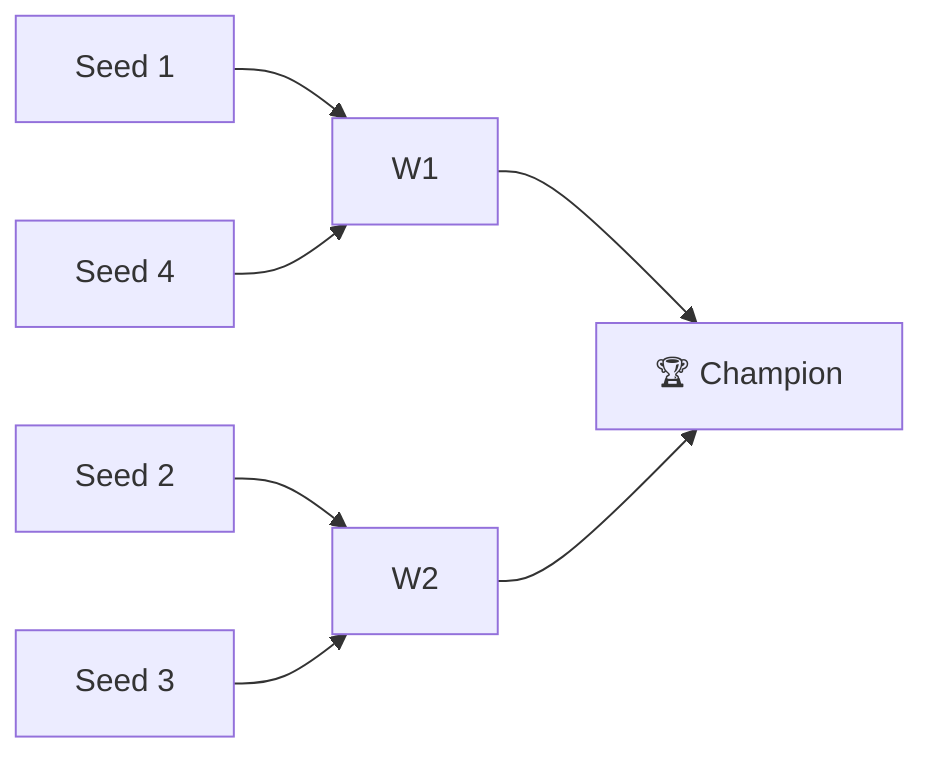

# 🏈 2019 Season

**Champion:** _TBD_
**Runner-Up:** _TBD_
**Regular Season Top Seed:** _TBD_
**Toilet Bowl Winner:** _TBD_

## Final Standings

> Auto-generated from Yahoo standings. Owners and playoff results are filled from the league bible (`raw/bible.yaml`); `_TBD_` means not yet recorded.

| Rank | Team | Owner | W–L | PF | PA | Playoff Seed |
|------|------|-------|-----|----|----|--------------|
| 1 | Curry’s legit team | _TBD_ | 8–5 | 1863.5 | 1661.14 | 1 |
| 2 | Ju Let The Dogs Out | _TBD_ | 9–4 | 1766.38 | 1615.02 | 2 |
| 3 | Kaushal's Potatoes | _TBD_ | 8–5 | 1673.66 | 1575.2 | 3 |
| 4 | Super Squirrels | _TBD_ | 7–6 | 1682.84 | 1654.48 | 4 |
| 5 | Sharman’s Scorpions | _TBD_ | 6–7 | 1590.34 | 1603.0 | — |
| 6 | Anish's Awesome Team | _TBD_ | 7–6 | 1640.28 | 1762.64 | — |
| 7 | CHOPSTIX | _TBD_ | 5–8 | 1431.02 | 1653.92 | — |
| 8 | Roger That | _TBD_ | 2–11 | 1622.96 | 1745.58 | — |

## Playoff Bracket

> Playoff results are recorded in the league bible. Add `champions: { 2019: { champion: ..., runner_up: ... } }` to `raw/bible.yaml` to populate this section.

## Team Rosters

| Team | Post-Draft Roster | End-of-Season Roster |
|------|-------------------|----------------------|

## Awards

- 🏆 **League Champion:** _TBD_
- 💥 **Highest Single-Week Score:** _TBD_
- 📉 **Lowest Single-Week Score:** _TBD_
- 🔥 **Biggest Bust:** _TBD_
- 🎯 **Best Draft Pick:** _TBD_
- 🍗 **"Poultry Controversy" Nominee:** _TBD_

## The Story of the Year

_TBD — add the defining moments._

## Related

- [Seasons](index.md) · [2019 Draft](#) · [Teams](../teams/index.md) · [Records](../records/index.md) · [Lore](#) · [Playoffs](../playoffs.md)
