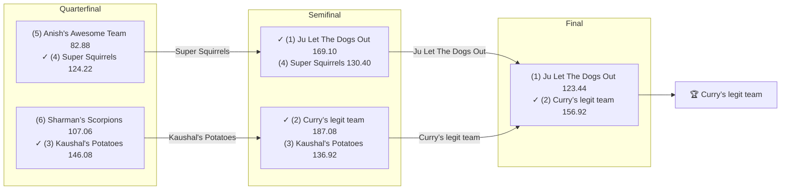

# 🏈 2019 Season

- **Champion:** Curry’s legit team
- **Runner-Up:** Ju Let The Dogs Out
- **Regular Season Top Seed:** Ju Let The Dogs Out
- **Toilet Bowl Winner:** Roger That

## Final Standings

> Auto-generated from Yahoo. **Finish** is Yahoo's final playoff-adjusted rank, so it does not follow W-L order - a team can win the title from a lower seed. **Playoff Seed** is the seed the team actually entered the playoffs with; - means it did not qualify.

| Finish | Team | Owner | W-L | PF | PA | Playoff Seed |
|--------|------|-------|-----|----|----|--------------|
| 1 | Curry’s legit team | lokesh | 8-5 | 1863.5 | 1661.14 | 2 |
| 2 | Ju Let The Dogs Out | Naren | 9-4 | 1766.38 | 1615.02 | 1 |
| 3 | Kaushal's Potatoes | Kaushal | 8-5 | 1673.66 | 1575.2 | 3 |
| 4 | Super Squirrels | Super | 7-6 | 1682.84 | 1654.48 | 4 |
| 5 | Sharman’s Scorpions | Sharman | 6-7 | 1590.34 | 1603.0 | 6 |
| 6 | Anish's Awesome Team | Anish | 7-6 | 1640.28 | 1762.64 | 5 |
| 7 | CHOPSTIX | sahil | 5-8 | 1431.02 | 1653.92 | 7 |
| 8 | Roger That | Pranav | 2-11 | 1622.96 | 1745.58 | 8 |

## Playoff Bracket

> The actual championship bracket, from captured weekly matchups. Seeds in parentheses; ✓ marks the winner. Consolation games are excluded, and a team that appears first in a later round had a bye.

## Team Rosters

> Post-draft and end-of-season lineups as Yahoo recorded them. Bench and IR rows are included; points are that week's score.

??? note "Curry’s legit team"
    **Post-draft - week 1**

    | Slot | Player | Pos | Pts |
    |------|--------|-----|-----|
    | QB | Lamar Jackson | QB | 33.56 |
    | RB | Kerryon Johnson | RB | 8.20 |
    | RB | Aaron Jones Sr. | RB | 4.90 |
    | WR | Michael Thomas | WR | 22.30 |
    | WR | Davante Adams | WR | 7.60 |
    | TE | O.J. Howard | TE | 5.20 |
    | W/R/T | Kenny Golladay | WR | 14.20 |
    | K | Matt Bryant | K | 0.00 |
    | DEF | Seahawks | DEF | 12.00 |
    | BN | Drew Brees | QB | 21.80 |
    | BN | Julian Edelman | WR | 16.38 |
    | BN | Aaron Rodgers | QB | 12.92 |
    | BN | Phillip Lindsay | RB | 10.60 |
    | BN | Sterling Shepard | WR | 10.20 |
    | IR | Jordan Reed | TE | 0.00 |

    **End of season - week 16**

    | Slot | Player | Pos | Pts |
    |------|--------|-----|-----|
    | QB | Lamar Jackson | QB | 29.82 |
    | RB | Aaron Jones Sr. | RB | 28.00 |
    | RB | Chris Carson | RB | 7.00 |
    | WR | Michael Thomas | WR | 31.60 |
    | WR | Davante Adams | WR | 22.60 |
    | TE | Darren Waller | TE | 7.70 |
    | W/R/T | Julian Edelman | WR | 14.20 |
    | K | Kai Forbath | K | 11.00 |
    | DEF | Broncos | DEF | 5.00 |
    | BN | Ronald Jones | RB | 19.90 |
    | BN | DeAndre Washington | RB | 18.60 |
    | BN | Golden Tate | WR | 15.60 |
    | BN | John Brown | WR | 12.60 |
    | BN | Devin Singletary | RB | 5.80 |
    | BN | Mike Boone | RB | 4.30 |

??? note "Ju Let The Dogs Out"
    **Post-draft - week 1**

    | Slot | Player | Pos | Pts |
    |------|--------|-----|-----|
    | QB | Patrick Mahomes | QB | 27.32 |
    | RB | Nick Chubb | RB | 11.50 |
    | RB | Todd Gurley | RB | 11.10 |
    | WR | Julio Jones | WR | 15.10 |
    | WR | Brandin Cooks | WR | 5.90 |
    | TE | George Kittle | TE | 13.40 |
    | W/R/T | Chris Carson | RB | 24.00 |
    | K | Wil Lutz | K | 15.00 |
    | DEF | Ravens | DEF | 13.00 |
    | BN | Austin Ekeler | RB | 39.40 |
    | BN | Austin Hooper | TE | 16.70 |
    | BN | Josh Gordon | WR | 16.30 |
    | BN | Tyler Lockett | WR | 11.40 |
    | BN | Tevin Coleman | RB | 7.60 |
    | BN | Cam Newton | QB | 6.36 |

    **End of season - week 16**

    | Slot | Player | Pos | Pts |
    |------|--------|-----|-----|
    | QB | Patrick Mahomes | QB | 25.44 |
    | RB | Austin Ekeler | RB | 11.90 |
    | RB | Nick Chubb | RB | 4.50 |
    | WR | Julio Jones | WR | 26.60 |
    | WR | Tyler Lockett | WR | 4.00 |
    | TE | George Kittle | TE | 18.90 |
    | W/R/T | Marlon Mack | RB | 18.10 |
    | K | Wil Lutz | K | 9.00 |
    | DEF | Steelers | DEF | 5.00 |
    | BN | Ryan Fitzpatrick | QB | 32.66 |
    | BN | Kenny Golladay | WR | 18.60 |
    | BN | Breshad Perriman | WR | 17.20 |
    | BN | Le'Veon Bell | RB | 13.30 |
    | BN | 49ers | DEF | 7.00 |
    | BN | DJ Moore | WR | 1.10 |

??? note "Kaushal's Potatoes"
    **Post-draft - week 1**

    | Slot | Player | Pos | Pts |
    |------|--------|-----|-----|
    | QB | Deshaun Watson | QB | 31.72 |
    | RB | Tarik Cohen | RB | 16.50 |
    | RB | Devonta Freeman | RB | 4.10 |
    | WR | Tyler Boyd | WR | 14.30 |
    | WR | Odell Beckham Jr. | WR | 14.10 |
    | TE | Travis Kelce | TE | 11.80 |
    | W/R/T | James White | RB | 13.20 |
    | K | Stephen Gostkowski | K | 16.00 |
    | DEF | Eagles | DEF | 1.00 |
    | BN | Dak Prescott | QB | 33.40 |
    | BN | Alshon Jeffery | WR | 22.10 |
    | BN | Allen Robinson | WR | 17.20 |
    | BN | Cooper Kupp | WR | 11.60 |
    | BN | Jordan Howard | RB | 7.50 |
    | BN | Melvin Gordon III | RB | 0.00 |

    **End of season - week 16**

    | Slot | Player | Pos | Pts |
    |------|--------|-----|-----|
    | QB | Deshaun Watson | QB | 10.06 |
    | RB | Devonta Freeman | RB | 33.70 |
    | RB | Melvin Gordon III | RB | 22.70 |
    | WR | Tyler Boyd | WR | 33.80 |
    | WR | Cooper Kupp | WR | 13.10 |
    | TE | Travis Kelce | TE | 21.40 |
    | W/R/T | A.J. Brown | WR | 15.30 |
    | K | Robbie Gould | K | 10.00 |
    | DEF | Patriots | DEF | 5.00 |
    | BN | Odell Beckham Jr. | WR | 14.40 |
    | BN | Dak Prescott | QB | 11.30 |
    | BN | Raheem Mostert | RB | 11.30 |
    | BN | Emmanuel Sanders | WR | 9.10 |
    | BN | James White | RB | 6.90 |
    | BN | DJ Chark | WR | 3.80 |

??? note "Super Squirrels"
    **Post-draft - week 1**

    | Slot | Player | Pos | Pts |
    |------|--------|-----|-----|
    | QB | Tom Brady | QB | 25.64 |
    | RB | Christian McCaffrey | RB | 42.90 |
    | RB | Le'Veon Bell | RB | 23.20 |
    | WR | Dede Westbrook | WR | 14.20 |
    | WR | Mike Williams | WR | 4.90 |
    | TE | Jared Cook | TE | 5.70 |
    | W/R/T | Joe Mixon | RB | 3.70 |
    | K | Justin Tucker | K | 11.00 |
    | DEF | Bears | DEF | 9.00 |
    | BN | Tyrell Williams | WR | 22.50 |
    | BN | Matt Ryan | QB | 20.56 |
    | BN | David Njoku | TE | 13.70 |
    | BN | Latavius Murray | RB | 12.70 |
    | BN | Kenyan Drake | RB | 4.70 |
    | BN | Antonio Brown | WR | 0.00 |

    **End of season - week 16**

    | Slot | Player | Pos | Pts |
    |------|--------|-----|-----|
    | QB | Matt Ryan | QB | 17.96 |
    | RB | Christian McCaffrey | RB | 32.30 |
    | RB | Joe Mixon | RB | 9.30 |
    | WR | DeVante Parker | WR | 22.10 |
    | WR | Allen Robinson | WR | 11.30 |
    | TE | Hunter Henry | TE | 9.50 |
    | W/R/T | Courtland Sutton | WR | 9.10 |
    | K | Justin Tucker | K | 7.00 |
    | DEF | Titans | DEF | -1.00 |
    | BN | Miles Sanders | RB | 26.60 |
    | BN | Jared Cook | TE | 23.40 |
    | BN | Phillip Lindsay | RB | 19.80 |
    | BN | Tom Brady | QB | 17.24 |
    | BN | Todd Gurley | RB | 16.80 |
    | BN | Dalvin Cook | RB | 0.00 |

??? note "Sharman’s Scorpions"
    **Post-draft - week 1**

    | Slot | Player | Pos | Pts |
    |------|--------|-----|-----|
    | QB | Jared Goff | QB | 10.44 |
    | RB | Marlon Mack | RB | 25.40 |
    | RB | Ezekiel Elliott | RB | 13.30 |
    | WR | DeAndre Hopkins | WR | 31.10 |
    | WR | Keenan Allen | WR | 26.30 |
    | TE | Hunter Henry | TE | 10.00 |
    | W/R/T | Adam Thielen | WR | 13.30 |
    | K | Greg Zuerlein | K | 15.00 |
    | DEF | Chargers | DEF | 2.00 |
    | BN | Kyler Murray | QB | 22.62 |
    | BN | DJ Moore | WR | 12.60 |
    | BN | Ben Roethlisberger | QB | 10.74 |
    | BN | Rams | DEF | 9.00 |
    | BN | Curtis Samuel | WR | 6.20 |
    | BN | Miles Sanders | RB | 3.70 |

    **End of season - week 16**

    | Slot | Player | Pos | Pts |
    |------|--------|-----|-----|
    | QB | Jimmy Garoppolo | QB | 12.42 |
    | RB | Kenyan Drake | RB | 33.40 |
    | RB | Ezekiel Elliott | RB | 15.40 |
    | WR | Keenan Allen | WR | 11.60 |
    | WR | Jamison Crowder | WR | 10.00 |
    | TE | Tyler Higbee | TE | 19.40 |
    | W/R/T | DeAndre Hopkins | WR | 7.30 |
    | K | Greg Zuerlein | K | 9.00 |
    | DEF | Eagles | DEF | 8.00 |
    | BN | Jared Goff | QB | 21.12 |
    | BN | Kyler Murray | QB | 12.72 |
    | BN | Latavius Murray | RB | 4.50 |
    | BN | Adam Thielen | WR | 0.20 |
    | BN | Calvin Ridley | WR | 0.00 |
    | BN | DK Metcalf | WR | 0.00 |

??? note "Anish's Awesome Team"
    **Post-draft - week 1**

    | Slot | Player | Pos | Pts |
    |------|--------|-----|-----|
    | QB | Baker Mayfield | QB | 12.40 |
    | RB | Alvin Kamara | RB | 23.90 |
    | RB | Leonard Fournette | RB | 11.40 |
    | WR | Robert Woods | WR | 16.60 |
    | WR | JuJu Smith-Schuster | WR | 13.80 |
    | TE | Delanie Walker | TE | 22.50 |
    | W/R/T | Mark Ingram II | RB | 22.70 |
    | K | Jason Myers | K | 3.00 |
    | DEF | Cowboys | DEF | 6.00 |
    | BN | T.Y. Hilton | WR | 28.70 |
    | BN | Philip Rivers | QB | 24.92 |
    | BN | Calvin Ridley | WR | 16.40 |
    | BN | Darren Waller | TE | 14.00 |
    | BN | Duke Johnson | RB | 13.00 |
    | BN | Corey Davis | WR | 0.00 |

    **End of season - week 16**

    | Slot | Player | Pos | Pts |
    |------|--------|-----|-----|
    | QB | Drew Brees | QB | 22.86 |
    | RB | Alvin Kamara | RB | 29.00 |
    | RB | Leonard Fournette | RB | 13.50 |
    | WR | Robert Woods | WR | 20.30 |
    | WR | Jarvis Landry | WR | 14.40 |
    | TE | Mark Andrews | TE | 27.30 |
    | W/R/T | Mark Ingram II | RB | 17.10 |
    | K | Jason Myers | K | 9.00 |
    | DEF | Ravens | DEF | 4.00 |
    | BN | Ryan Tannehill | QB | 23.68 |
    | BN | Kareem Hunt | RB | 8.10 |
    | BN | Jamaal Williams | RB | 7.20 |
    | BN | Saints | DEF | 6.00 |
    | BN | Zach Pascal | WR | 1.60 |
    | BN | Alshon Jeffery | WR | 0.00 |

??? note "CHOPSTIX"
    **Post-draft - week 1**

    | Slot | Player | Pos | Pts |
    |------|--------|-----|-----|
    | QB | Jameis Winston | QB | 10.06 |
    | RB | Dalvin Cook | RB | 26.00 |
    | RB | Saquon Barkley | RB | 17.90 |
    | WR | Amari Cooper | WR | 22.60 |
    | WR | Tyreek Hill | WR | 4.10 |
    | TE | Evan Engram | TE | 28.60 |
    | W/R/T | Damien Williams | RB | 18.50 |
    | K | Harrison Butker | K | 17.00 |
    | DEF | Vikings | DEF | 16.00 |
    | BN | Larry Fitzgerald | WR | 25.30 |
    | BN | Carson Wentz | QB | 25.02 |
    | BN | Chris Godwin Jr. | WR | 14.30 |
    | BN | Christian Kirk | WR | 12.20 |
    | BN | Vance McDonald | TE | 6.00 |
    | BN | David Montgomery | RB | 5.50 |

    **End of season - week 16**

    | Slot | Player | Pos | Pts |
    |------|--------|-----|-----|
    | QB | Carson Wentz | QB | 18.96 |
    | RB | Saquon Barkley | RB | 43.90 |
    | RB | Damien Williams | RB | 18.20 |
    | WR | Larry Fitzgerald | WR | 14.80 |
    | WR | Chris Godwin Jr. | WR | 0.00 |
    | TE | Evan Engram | TE | 0.00 |
    | W/R/T | Tyreek Hill | WR | 12.20 |
    | K | Harrison Butker | K | 10.00 |
    | DEF | Vikings | DEF | 9.00 |
    | BN | Jameis Winston | QB | 15.00 |
    | BN | David Montgomery | RB | 6.90 |
    | BN | Amari Cooper | WR | 6.40 |
    | BN | Christian Kirk | WR | 0.90 |
    | BN | Jordan Howard | RB | 0.00 |

??? note "Roger That"
    **Post-draft - week 1**

    | Slot | Player | Pos | Pts |
    |------|--------|-----|-----|
    | QB | Russell Wilson | QB | 16.60 |
    | RB | David Johnson | RB | 25.70 |
    | RB | James Conner | RB | 10.50 |
    | WR | Stefon Diggs | WR | 5.70 |
    | WR | Mike Evans | WR | 4.80 |
    | TE | Zach Ertz | TE | 10.40 |
    | W/R/T | Derrick Henry | RB | 28.90 |
    | K | Ka'imi Fairbairn | K | 4.00 |
    | DEF | Browns | DEF | 0.00 |
    | BN | Sammy Watkins | WR | 46.80 |
    | BN | Josh Jacobs | RB | 24.30 |
    | BN | Jarvis Landry | WR | 11.70 |
    | BN | Sony Michel | RB | 1.40 |
    | BN | A.J. Green | WR | 0.00 |
    | BN | Kyle Rudolph | TE | 0.00 |

    **End of season - week 16**

    | Slot | Player | Pos | Pts |
    |------|--------|-----|-----|
    | QB | Josh Allen | QB | 20.62 |
    | RB | Sony Michel | RB | 11.10 |
    | WR | Mike Evans | WR | 0.00 |
    | K | Ka'imi Fairbairn | K | 11.00 |
    | BN | Stefon Diggs | WR | 14.70 |
    | BN | Tyrell Williams | WR | 12.20 |
    | BN | Russell Wilson | QB | 10.96 |
    | BN | Zach Ertz | TE | 6.80 |
    | BN | Sammy Watkins | WR | 4.80 |
    | BN | James Conner | RB | 3.20 |
    | BN | David Johnson | RB | 1.70 |
    | BN | Browns | DEF | 1.00 |
    | BN | A.J. Green | WR | 0.00 |
    | BN | Derrick Henry | RB | 0.00 |
    | BN | Josh Jacobs | RB | 0.00 |

## Awards

- 🏆 **League Champion:** Curry’s legit team
- 💥 **Highest Single-Week Score:** Curry’s legit team - 218.24 (Wk 5)
- 📉 **Lowest Single-Week Score:** Roger That - 42.72 (Wk 16)
- 🔥 **Biggest Bust:** T.Y. Hilton (WR) - drafted by [Anish's Awesome Team](../teams/anish-s-awesome-team.md) at pick 2, finished -22 spots at the position, 102.80 pts
- 🎯 **Best Draft Pick:** Chris Godwin Jr. (WR) - drafted by [CHOPSTIX](../teams/chopstix.md) at pick 8, finished +31 spots at the position, 276.10 pts
- 🍗 **"Poultry Controversy" Nominee:** _TBD_

> Best Draft Pick and Biggest Bust are computed, not voted: within each position, the gap between where a player was drafted and where they finished on season points. Bust is restricted to rounds 1-3.

## The Story of the Year

_TBD - add the defining moments._

## Related

- [Seasons](index.md) · [2019 Draft](../draft/2019-draft.md) · [Teams](../teams/index.md) · [Records](../records/index.md) · Lore · [Playoffs](../playoffs.md)
