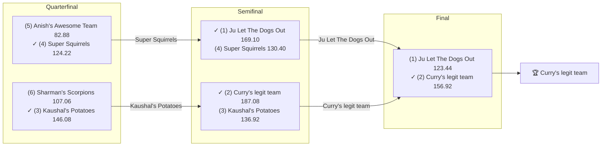

# 2019 Season

- **Champion:** [Curry's legit team](../owners/lokesh.md)
- **Runner-Up:** [Ju Let The Dogs Out](../owners/naren.md)
- **Regular Season Top Seed:** [Ju Let The Dogs Out](../owners/naren.md)
- **Toilet Bowl Winner:** [Roger That](../owners/pranav.md)

## Final Standings

> **Finish** is the final playoff-adjusted rank, so it does not follow W-L order: a team can win the title from a lower seed. **Playoff Seed** is the seed the team entered the playoffs with; a dash means it did not qualify.

| Finish | Team | Owner | W-L | PF | PA | Playoff Seed |
|--------|------|-------|-----|----|----|--------------|
| 1 | Curry's legit team | Lokesh | 8-5 | 1863.5 | 1661.14 | 2 |
| 2 | Ju Let The Dogs Out | Naren | 9-4 | 1766.38 | 1615.02 | 1 |
| 3 | Kaushal's Potatoes | Kaushal | 8-5 | 1673.66 | 1575.2 | 3 |
| 4 | Super Squirrels | Abhinav | 7-6 | 1682.84 | 1654.48 | 4 |
| 5 | Sharman's Scorpions | Sharman | 6-7 | 1590.34 | 1603.0 | 6 |
| 6 | Anish's Awesome Team | Anish | 7-6 | 1640.28 | 1762.64 | 5 |
| 7 | CHOPSTIX | sahil | 5-8 | 1431.02 | 1653.92 | 7 |
| 8 | Roger That | Pranav | 2-11 | 1622.96 | 1745.58 | 8 |

## Playoff Bracket

> The actual championship bracket, from captured weekly matchups. Seeds in parentheses; ✓ marks the winner. Consolation games are excluded, and a team that appears first in a later round had a bye.

## Team Rosters

> Post-draft and end-of-season lineups as the league's platform recorded them. Bench and IR rows are included; points are that week's score.

??? note "Curry's legit team"
    **Post-draft - week 1**

    | Slot | Player | Pos | Pts |
    |------|--------|-----|-----|
    | QB | [Lamar Jackson](../players/lamar-jackson.md) | QB | 33.56 |
    | RB | [Kerryon Johnson](../players/kerryon-johnson.md) | RB | 8.20 |
    | RB | [Aaron Jones Sr.](../players/aaron-jones-sr.md) | RB | 4.90 |
    | WR | [Michael Thomas](../players/michael-thomas.md) | WR | 22.30 |
    | WR | [Davante Adams](../players/davante-adams.md) | WR | 7.60 |
    | TE | [O.J. Howard](../players/o-j-howard.md) | TE | 5.20 |
    | W/R/T | [Kenny Golladay](../players/kenny-golladay.md) | WR | 14.20 |
    | K | [Matt Bryant](../players/matt-bryant.md) | K | 0.00 |
    | DEF | [Seahawks](../players/seahawks.md) | DEF | 12.00 |
    | BN | [Drew Brees](../players/drew-brees.md) | QB | 21.80 |
    | BN | [Julian Edelman](../players/julian-edelman.md) | WR | 16.38 |
    | BN | [Aaron Rodgers](../players/aaron-rodgers.md) | QB | 12.92 |
    | BN | [Phillip Lindsay](../players/phillip-lindsay.md) | RB | 10.60 |
    | BN | [Sterling Shepard](../players/sterling-shepard.md) | WR | 10.20 |
    | IR | [Jordan Reed](../players/jordan-reed.md) | TE | 0.00 |

    **End of season - week 16**

    | Slot | Player | Pos | Pts |
    |------|--------|-----|-----|
    | QB | [Lamar Jackson](../players/lamar-jackson.md) | QB | 29.82 |
    | RB | [Aaron Jones Sr.](../players/aaron-jones-sr.md) | RB | 28.00 |
    | RB | [Chris Carson](../players/chris-carson.md) | RB | 7.00 |
    | WR | [Michael Thomas](../players/michael-thomas.md) | WR | 31.60 |
    | WR | [Davante Adams](../players/davante-adams.md) | WR | 22.60 |
    | TE | [Darren Waller](../players/darren-waller.md) | TE | 7.70 |
    | W/R/T | [Julian Edelman](../players/julian-edelman.md) | WR | 14.20 |
    | K | [Kai Forbath](../players/kai-forbath.md) | K | 11.00 |
    | DEF | [Broncos](../players/broncos.md) | DEF | 5.00 |
    | BN | [Ronald Jones](../players/ronald-jones.md) | RB | 19.90 |
    | BN | [DeAndre Washington](../players/deandre-washington.md) | RB | 18.60 |
    | BN | [Golden Tate](../players/golden-tate.md) | WR | 15.60 |
    | BN | [John Brown](../players/john-brown.md) | WR | 12.60 |
    | BN | [Devin Singletary](../players/devin-singletary.md) | RB | 5.80 |
    | BN | [Mike Boone](../players/mike-boone.md) | RB | 4.30 |

??? note "Ju Let The Dogs Out"
    **Post-draft - week 1**

    | Slot | Player | Pos | Pts |
    |------|--------|-----|-----|
    | QB | [Patrick Mahomes](../players/patrick-mahomes.md) | QB | 27.32 |
    | RB | [Nick Chubb](../players/nick-chubb.md) | RB | 11.50 |
    | RB | [Todd Gurley](../players/todd-gurley.md) | RB | 11.10 |
    | WR | [Julio Jones](../players/julio-jones.md) | WR | 15.10 |
    | WR | [Brandin Cooks](../players/brandin-cooks.md) | WR | 5.90 |
    | TE | [George Kittle](../players/george-kittle.md) | TE | 13.40 |
    | W/R/T | [Chris Carson](../players/chris-carson.md) | RB | 24.00 |
    | K | [Wil Lutz](../players/wil-lutz.md) | K | 15.00 |
    | DEF | [Ravens](../players/ravens.md) | DEF | 13.00 |
    | BN | [Austin Ekeler](../players/austin-ekeler.md) | RB | 39.40 |
    | BN | [Austin Hooper](../players/austin-hooper.md) | TE | 16.70 |
    | BN | [Josh Gordon](../players/josh-gordon.md) | WR | 16.30 |
    | BN | [Tyler Lockett](../players/tyler-lockett.md) | WR | 11.40 |
    | BN | [Tevin Coleman](../players/tevin-coleman.md) | RB | 7.60 |
    | BN | [Cam Newton](../players/cam-newton.md) | QB | 6.36 |

    **End of season - week 16**

    | Slot | Player | Pos | Pts |
    |------|--------|-----|-----|
    | QB | [Patrick Mahomes](../players/patrick-mahomes.md) | QB | 25.44 |
    | RB | [Austin Ekeler](../players/austin-ekeler.md) | RB | 11.90 |
    | RB | [Nick Chubb](../players/nick-chubb.md) | RB | 4.50 |
    | WR | [Julio Jones](../players/julio-jones.md) | WR | 26.60 |
    | WR | [Tyler Lockett](../players/tyler-lockett.md) | WR | 4.00 |
    | TE | [George Kittle](../players/george-kittle.md) | TE | 18.90 |
    | W/R/T | [Marlon Mack](../players/marlon-mack.md) | RB | 18.10 |
    | K | [Wil Lutz](../players/wil-lutz.md) | K | 9.00 |
    | DEF | [Steelers](../players/steelers.md) | DEF | 5.00 |
    | BN | [Ryan Fitzpatrick](../players/ryan-fitzpatrick.md) | QB | 32.66 |
    | BN | [Kenny Golladay](../players/kenny-golladay.md) | WR | 18.60 |
    | BN | [Breshad Perriman](../players/breshad-perriman.md) | WR | 17.20 |
    | BN | [Le'Veon Bell](../players/le-veon-bell.md) | RB | 13.30 |
    | BN | [49ers](../players/49ers.md) | DEF | 7.00 |
    | BN | [DJ Moore](../players/dj-moore.md) | WR | 1.10 |

??? note "Kaushal's Potatoes"
    **Post-draft - week 1**

    | Slot | Player | Pos | Pts |
    |------|--------|-----|-----|
    | QB | [Deshaun Watson](../players/deshaun-watson.md) | QB | 31.72 |
    | RB | [Tarik Cohen](../players/tarik-cohen.md) | RB | 16.50 |
    | RB | [Devonta Freeman](../players/devonta-freeman.md) | RB | 4.10 |
    | WR | [Tyler Boyd](../players/tyler-boyd.md) | WR | 14.30 |
    | WR | [Odell Beckham Jr.](../players/odell-beckham-jr.md) | WR | 14.10 |
    | TE | [Travis Kelce](../players/travis-kelce.md) | TE | 11.80 |
    | W/R/T | [James White](../players/james-white.md) | RB | 13.20 |
    | K | [Stephen Gostkowski](../players/stephen-gostkowski.md) | K | 16.00 |
    | DEF | [Eagles](../players/eagles.md) | DEF | 1.00 |
    | BN | [Dak Prescott](../players/dak-prescott.md) | QB | 33.40 |
    | BN | [Alshon Jeffery](../players/alshon-jeffery.md) | WR | 22.10 |
    | BN | [Allen Robinson](../players/allen-robinson.md) | WR | 17.20 |
    | BN | [Cooper Kupp](../players/cooper-kupp.md) | WR | 11.60 |
    | BN | [Jordan Howard](../players/jordan-howard.md) | RB | 7.50 |
    | BN | [Melvin Gordon III](../players/melvin-gordon-iii.md) | RB | 0.00 |

    **End of season - week 16**

    | Slot | Player | Pos | Pts |
    |------|--------|-----|-----|
    | QB | [Deshaun Watson](../players/deshaun-watson.md) | QB | 10.06 |
    | RB | [Devonta Freeman](../players/devonta-freeman.md) | RB | 33.70 |
    | RB | [Melvin Gordon III](../players/melvin-gordon-iii.md) | RB | 22.70 |
    | WR | [Tyler Boyd](../players/tyler-boyd.md) | WR | 33.80 |
    | WR | [Cooper Kupp](../players/cooper-kupp.md) | WR | 13.10 |
    | TE | [Travis Kelce](../players/travis-kelce.md) | TE | 21.40 |
    | W/R/T | [A.J. Brown](../players/a-j-brown.md) | WR | 15.30 |
    | K | [Robbie Gould](../players/robbie-gould.md) | K | 10.00 |
    | DEF | [Patriots](../players/patriots.md) | DEF | 5.00 |
    | BN | [Odell Beckham Jr.](../players/odell-beckham-jr.md) | WR | 14.40 |
    | BN | [Dak Prescott](../players/dak-prescott.md) | QB | 11.30 |
    | BN | [Raheem Mostert](../players/raheem-mostert.md) | RB | 11.30 |
    | BN | [Emmanuel Sanders](../players/emmanuel-sanders.md) | WR | 9.10 |
    | BN | [James White](../players/james-white.md) | RB | 6.90 |
    | BN | [DJ Chark](../players/dj-chark.md) | WR | 3.80 |

??? note "Super Squirrels"
    **Post-draft - week 1**

    | Slot | Player | Pos | Pts |
    |------|--------|-----|-----|
    | QB | [Tom Brady](../players/tom-brady.md) | QB | 25.64 |
    | RB | [Christian McCaffrey](../players/christian-mccaffrey.md) | RB | 42.90 |
    | RB | [Le'Veon Bell](../players/le-veon-bell.md) | RB | 23.20 |
    | WR | [Dede Westbrook](../players/dede-westbrook.md) | WR | 14.20 |
    | WR | [Mike Williams](../players/mike-williams.md) | WR | 4.90 |
    | TE | [Jared Cook](../players/jared-cook.md) | TE | 5.70 |
    | W/R/T | [Joe Mixon](../players/joe-mixon.md) | RB | 3.70 |
    | K | [Justin Tucker](../players/justin-tucker.md) | K | 11.00 |
    | DEF | [Bears](../players/bears.md) | DEF | 9.00 |
    | BN | [Tyrell Williams](../players/tyrell-williams.md) | WR | 22.50 |
    | BN | [Matt Ryan](../players/matt-ryan.md) | QB | 20.56 |
    | BN | [David Njoku](../players/david-njoku.md) | TE | 13.70 |
    | BN | [Latavius Murray](../players/latavius-murray.md) | RB | 12.70 |
    | BN | [Kenyan Drake](../players/kenyan-drake.md) | RB | 4.70 |
    | BN | [Antonio Brown](../players/antonio-brown.md) | WR | 0.00 |

    **End of season - week 16**

    | Slot | Player | Pos | Pts |
    |------|--------|-----|-----|
    | QB | [Matt Ryan](../players/matt-ryan.md) | QB | 17.96 |
    | RB | [Christian McCaffrey](../players/christian-mccaffrey.md) | RB | 32.30 |
    | RB | [Joe Mixon](../players/joe-mixon.md) | RB | 9.30 |
    | WR | [DeVante Parker](../players/devante-parker.md) | WR | 22.10 |
    | WR | [Allen Robinson](../players/allen-robinson.md) | WR | 11.30 |
    | TE | [Hunter Henry](../players/hunter-henry.md) | TE | 9.50 |
    | W/R/T | [Courtland Sutton](../players/courtland-sutton.md) | WR | 9.10 |
    | K | [Justin Tucker](../players/justin-tucker.md) | K | 7.00 |
    | DEF | [Titans](../players/titans.md) | DEF | -1.00 |
    | BN | [Miles Sanders](../players/miles-sanders.md) | RB | 26.60 |
    | BN | [Jared Cook](../players/jared-cook.md) | TE | 23.40 |
    | BN | [Phillip Lindsay](../players/phillip-lindsay.md) | RB | 19.80 |
    | BN | [Tom Brady](../players/tom-brady.md) | QB | 17.24 |
    | BN | [Todd Gurley](../players/todd-gurley.md) | RB | 16.80 |
    | BN | [Dalvin Cook](../players/dalvin-cook.md) | RB | 0.00 |

??? note "Sharman's Scorpions"
    **Post-draft - week 1**

    | Slot | Player | Pos | Pts |
    |------|--------|-----|-----|
    | QB | [Jared Goff](../players/jared-goff.md) | QB | 10.44 |
    | RB | [Marlon Mack](../players/marlon-mack.md) | RB | 25.40 |
    | RB | [Ezekiel Elliott](../players/ezekiel-elliott.md) | RB | 13.30 |
    | WR | [DeAndre Hopkins](../players/deandre-hopkins.md) | WR | 31.10 |
    | WR | [Keenan Allen](../players/keenan-allen.md) | WR | 26.30 |
    | TE | [Hunter Henry](../players/hunter-henry.md) | TE | 10.00 |
    | W/R/T | [Adam Thielen](../players/adam-thielen.md) | WR | 13.30 |
    | K | [Greg Zuerlein](../players/greg-zuerlein.md) | K | 15.00 |
    | DEF | [Chargers](../players/chargers.md) | DEF | 2.00 |
    | BN | [Kyler Murray](../players/kyler-murray.md) | QB | 22.62 |
    | BN | [DJ Moore](../players/dj-moore.md) | WR | 12.60 |
    | BN | [Ben Roethlisberger](../players/ben-roethlisberger.md) | QB | 10.74 |
    | BN | [Rams](../players/rams.md) | DEF | 9.00 |
    | BN | [Curtis Samuel](../players/curtis-samuel.md) | WR | 6.20 |
    | BN | [Miles Sanders](../players/miles-sanders.md) | RB | 3.70 |

    **End of season - week 16**

    | Slot | Player | Pos | Pts |
    |------|--------|-----|-----|
    | QB | [Jimmy Garoppolo](../players/jimmy-garoppolo.md) | QB | 12.42 |
    | RB | [Kenyan Drake](../players/kenyan-drake.md) | RB | 33.40 |
    | RB | [Ezekiel Elliott](../players/ezekiel-elliott.md) | RB | 15.40 |
    | WR | [Keenan Allen](../players/keenan-allen.md) | WR | 11.60 |
    | WR | [Jamison Crowder](../players/jamison-crowder.md) | WR | 10.00 |
    | TE | [Tyler Higbee](../players/tyler-higbee.md) | TE | 19.40 |
    | W/R/T | [DeAndre Hopkins](../players/deandre-hopkins.md) | WR | 7.30 |
    | K | [Greg Zuerlein](../players/greg-zuerlein.md) | K | 9.00 |
    | DEF | [Eagles](../players/eagles.md) | DEF | 8.00 |
    | BN | [Jared Goff](../players/jared-goff.md) | QB | 21.12 |
    | BN | [Kyler Murray](../players/kyler-murray.md) | QB | 12.72 |
    | BN | [Latavius Murray](../players/latavius-murray.md) | RB | 4.50 |
    | BN | [Adam Thielen](../players/adam-thielen.md) | WR | 0.20 |
    | BN | [Calvin Ridley](../players/calvin-ridley.md) | WR | 0.00 |
    | BN | [DK Metcalf](../players/dk-metcalf.md) | WR | 0.00 |

??? note "Anish's Awesome Team"
    **Post-draft - week 1**

    | Slot | Player | Pos | Pts |
    |------|--------|-----|-----|
    | QB | [Baker Mayfield](../players/baker-mayfield.md) | QB | 12.40 |
    | RB | [Alvin Kamara](../players/alvin-kamara.md) | RB | 23.90 |
    | RB | [Leonard Fournette](../players/leonard-fournette.md) | RB | 11.40 |
    | WR | [Robert Woods](../players/robert-woods.md) | WR | 16.60 |
    | WR | [JuJu Smith-Schuster](../players/juju-smith-schuster.md) | WR | 13.80 |
    | TE | [Delanie Walker](../players/delanie-walker.md) | TE | 22.50 |
    | W/R/T | [Mark Ingram II](../players/mark-ingram-ii.md) | RB | 22.70 |
    | K | [Jason Myers](../players/jason-myers.md) | K | 3.00 |
    | DEF | [Cowboys](../players/cowboys.md) | DEF | 6.00 |
    | BN | [T.Y. Hilton](../players/t-y-hilton.md) | WR | 28.70 |
    | BN | [Philip Rivers](../players/philip-rivers.md) | QB | 24.92 |
    | BN | [Calvin Ridley](../players/calvin-ridley.md) | WR | 16.40 |
    | BN | [Darren Waller](../players/darren-waller.md) | TE | 14.00 |
    | BN | [Duke Johnson](../players/duke-johnson.md) | RB | 13.00 |
    | BN | [Corey Davis](../players/corey-davis.md) | WR | 0.00 |

    **End of season - week 16**

    | Slot | Player | Pos | Pts |
    |------|--------|-----|-----|
    | QB | [Drew Brees](../players/drew-brees.md) | QB | 22.86 |
    | RB | [Alvin Kamara](../players/alvin-kamara.md) | RB | 29.00 |
    | RB | [Leonard Fournette](../players/leonard-fournette.md) | RB | 13.50 |
    | WR | [Robert Woods](../players/robert-woods.md) | WR | 20.30 |
    | WR | [Jarvis Landry](../players/jarvis-landry.md) | WR | 14.40 |
    | TE | [Mark Andrews](../players/mark-andrews.md) | TE | 27.30 |
    | W/R/T | [Mark Ingram II](../players/mark-ingram-ii.md) | RB | 17.10 |
    | K | [Jason Myers](../players/jason-myers.md) | K | 9.00 |
    | DEF | [Ravens](../players/ravens.md) | DEF | 4.00 |
    | BN | [Ryan Tannehill](../players/ryan-tannehill.md) | QB | 23.68 |
    | BN | [Kareem Hunt](../players/kareem-hunt.md) | RB | 8.10 |
    | BN | [Jamaal Williams](../players/jamaal-williams.md) | RB | 7.20 |
    | BN | [Saints](../players/saints.md) | DEF | 6.00 |
    | BN | [Zach Pascal](../players/zach-pascal.md) | WR | 1.60 |
    | BN | [Alshon Jeffery](../players/alshon-jeffery.md) | WR | 0.00 |

??? note "CHOPSTIX"
    **Post-draft - week 1**

    | Slot | Player | Pos | Pts |
    |------|--------|-----|-----|
    | QB | [Jameis Winston](../players/jameis-winston.md) | QB | 10.06 |
    | RB | [Dalvin Cook](../players/dalvin-cook.md) | RB | 26.00 |
    | RB | [Saquon Barkley](../players/saquon-barkley.md) | RB | 17.90 |
    | WR | [Amari Cooper](../players/amari-cooper.md) | WR | 22.60 |
    | WR | [Tyreek Hill](../players/tyreek-hill.md) | WR | 4.10 |
    | TE | [Evan Engram](../players/evan-engram.md) | TE | 28.60 |
    | W/R/T | [Damien Williams](../players/damien-williams.md) | RB | 18.50 |
    | K | [Harrison Butker](../players/harrison-butker.md) | K | 17.00 |
    | DEF | [Vikings](../players/vikings.md) | DEF | 16.00 |
    | BN | [Larry Fitzgerald](../players/larry-fitzgerald.md) | WR | 25.30 |
    | BN | [Carson Wentz](../players/carson-wentz.md) | QB | 25.02 |
    | BN | [Chris Godwin Jr.](../players/chris-godwin-jr.md) | WR | 14.30 |
    | BN | [Christian Kirk](../players/christian-kirk.md) | WR | 12.20 |
    | BN | [Vance McDonald](../players/vance-mcdonald.md) | TE | 6.00 |
    | BN | [David Montgomery](../players/david-montgomery.md) | RB | 5.50 |

    **End of season - week 16**

    | Slot | Player | Pos | Pts |
    |------|--------|-----|-----|
    | QB | [Carson Wentz](../players/carson-wentz.md) | QB | 18.96 |
    | RB | [Saquon Barkley](../players/saquon-barkley.md) | RB | 43.90 |
    | RB | [Damien Williams](../players/damien-williams.md) | RB | 18.20 |
    | WR | [Larry Fitzgerald](../players/larry-fitzgerald.md) | WR | 14.80 |
    | WR | [Chris Godwin Jr.](../players/chris-godwin-jr.md) | WR | 0.00 |
    | TE | [Evan Engram](../players/evan-engram.md) | TE | 0.00 |
    | W/R/T | [Tyreek Hill](../players/tyreek-hill.md) | WR | 12.20 |
    | K | [Harrison Butker](../players/harrison-butker.md) | K | 10.00 |
    | DEF | [Vikings](../players/vikings.md) | DEF | 9.00 |
    | BN | [Jameis Winston](../players/jameis-winston.md) | QB | 15.00 |
    | BN | [David Montgomery](../players/david-montgomery.md) | RB | 6.90 |
    | BN | [Amari Cooper](../players/amari-cooper.md) | WR | 6.40 |
    | BN | [Christian Kirk](../players/christian-kirk.md) | WR | 0.90 |
    | BN | [Jordan Howard](../players/jordan-howard.md) | RB | 0.00 |

??? note "Roger That"
    **Post-draft - week 1**

    | Slot | Player | Pos | Pts |
    |------|--------|-----|-----|
    | QB | [Russell Wilson](../players/russell-wilson.md) | QB | 16.60 |
    | RB | [David Johnson](../players/david-johnson.md) | RB | 25.70 |
    | RB | [James Conner](../players/james-conner.md) | RB | 10.50 |
    | WR | [Stefon Diggs](../players/stefon-diggs.md) | WR | 5.70 |
    | WR | [Mike Evans](../players/mike-evans.md) | WR | 4.80 |
    | TE | [Zach Ertz](../players/zach-ertz.md) | TE | 10.40 |
    | W/R/T | [Derrick Henry](../players/derrick-henry.md) | RB | 28.90 |
    | K | [Ka'imi Fairbairn](../players/ka-imi-fairbairn.md) | K | 4.00 |
    | DEF | [Browns](../players/browns.md) | DEF | 0.00 |
    | BN | [Sammy Watkins](../players/sammy-watkins.md) | WR | 46.80 |
    | BN | [Josh Jacobs](../players/josh-jacobs.md) | RB | 24.30 |
    | BN | [Jarvis Landry](../players/jarvis-landry.md) | WR | 11.70 |
    | BN | [Sony Michel](../players/sony-michel.md) | RB | 1.40 |
    | BN | [A.J. Green](../players/a-j-green.md) | WR | 0.00 |
    | BN | [Kyle Rudolph](../players/kyle-rudolph.md) | TE | 0.00 |

    **End of season - week 16**

    | Slot | Player | Pos | Pts |
    |------|--------|-----|-----|
    | QB | [Josh Allen](../players/josh-allen.md) | QB | 20.62 |
    | RB | [Sony Michel](../players/sony-michel.md) | RB | 11.10 |
    | WR | [Mike Evans](../players/mike-evans.md) | WR | 0.00 |
    | K | [Ka'imi Fairbairn](../players/ka-imi-fairbairn.md) | K | 11.00 |
    | BN | [Stefon Diggs](../players/stefon-diggs.md) | WR | 14.70 |
    | BN | [Tyrell Williams](../players/tyrell-williams.md) | WR | 12.20 |
    | BN | [Russell Wilson](../players/russell-wilson.md) | QB | 10.96 |
    | BN | [Zach Ertz](../players/zach-ertz.md) | TE | 6.80 |
    | BN | [Sammy Watkins](../players/sammy-watkins.md) | WR | 4.80 |
    | BN | [James Conner](../players/james-conner.md) | RB | 3.20 |
    | BN | [David Johnson](../players/david-johnson.md) | RB | 1.70 |
    | BN | [Browns](../players/browns.md) | DEF | 1.00 |
    | BN | [A.J. Green](../players/a-j-green.md) | WR | 0.00 |
    | BN | [Derrick Henry](../players/derrick-henry.md) | RB | 0.00 |
    | BN | [Josh Jacobs](../players/josh-jacobs.md) | RB | 0.00 |

## Awards

- **League Champion:** [Curry's legit team](../owners/lokesh.md)
- **Most Valuable Player:** [Dalvin Cook](../players/dalvin-cook.md) - 6 wins swung
- **Finals MVP:** [Michael Thomas](../players/michael-thomas.md) - 31.60 pts ([Curry's legit team](../owners/lokesh.md))
- **Newcomer of the Year:** [Lamar Jackson](../players/lamar-jackson.md) - 3 wins swung
- **Undrafted Player of the Year:** [Patriots](../players/patriots.md) - 4 wins swung
- **Highest Single-Week Score:** Curry's legit team - 218.24 (Wk 5)
- **Lowest Single-Week Score:** Roger That - 42.72 (Wk 16)
- **Best Draft Pick:** [Austin Ekeler](../players/austin-ekeler.md) (RB) - drafted by [Ju Let The Dogs Out](../owners/naren.md) at pick 116, finished +30 spots at the position, 291.10 pts
- **Biggest Bust:** [Odell Beckham Jr.](../players/odell-beckham-jr.md) (WR) - drafted by [Kaushal's Potatoes](../owners/kaushal.md) at pick 8, finished -16 spots at the position, 183.60 pts, played 15 of 16 weeks

## Position Highs

The biggest single week at each position, regular season, starters only. The league-wide high above is almost always a receiver or a back; this is where a kicker's or a defense's best day is visible.

| Pos | Player | Points | When |
|-----|--------|--------|------|
| QB | [Deshaun Watson](../players/deshaun-watson.md) | 41.74 | Wk 5, [Kaushal's Potatoes](../owners/kaushal.md) |
| RB | [Aaron Jones Sr.](../players/aaron-jones-sr.md) | 49.20 | Wk 5, [Curry's legit team](../owners/lokesh.md) |
| WR | [Mike Evans](../players/mike-evans.md) | 45.00 | Wk 3, [Roger That](../owners/pranav.md) |
| TE | [Darren Waller](../players/darren-waller.md) | 31.60 | Wk 7, [Curry's legit team](../owners/lokesh.md) |
| K | [Harrison Butker](../players/harrison-butker.md) | 18.00 | Wk 9, [CHOPSTIX](../owners/sahil.md) |
| DEF | [Patriots](../players/patriots.md) | 37.00 | Wk 2, [Kaushal's Potatoes](../owners/kaushal.md) |

## Team of the Season

The best starting lineup the season produced, one selection per slot the league actually starts. A slot is won the same way the MVP is: by wins swung, the games a team won by less than the player scored from the starting lineup. The flex takes the best eligible player the position slots did not already claim.

| Slot | Player | Pos | Wins Swung | Points in Them | Rostered By |
|------|--------|-----|------------|----------------|-------------|
| QB | [Lamar Jackson](../players/lamar-jackson.md) | QB | 3 | 80.44 | Curry's legit team |
| RB | [Dalvin Cook](../players/dalvin-cook.md) | RB | 6 | 151.10 | CHOPSTIX, Super Squirrels |
|  | [Alvin Kamara](../players/alvin-kamara.md) | RB | 5 | 107.80 | Anish's Awesome Team |
| WR | [Amari Cooper](../players/amari-cooper.md) | WR | 4 | 103.40 | CHOPSTIX |
|  | [Julio Jones](../players/julio-jones.md) | WR | 4 | 82.60 | Ju Let The Dogs Out |
| TE | [Travis Kelce](../players/travis-kelce.md) | TE | 4 | 71.80 | Kaushal's Potatoes |
| W/R/T | [Leonard Fournette](../players/leonard-fournette.md) | RB | 4 | 84.20 | Anish's Awesome Team |
| K | [Greg Zuerlein](../players/greg-zuerlein.md) | K | 2 | 17.00 | Sharman's Scorpions |
| DEF | [Patriots](../players/patriots.md) | DEF | 4 | 98.00 | Kaushal's Potatoes |

> Every award here is computed, not voted. **MVP** is the player who swung the most wins: games their team won by less than the player scored from the starting lineup. **Finals MVP** is the top scorer in the title game's winning lineup. **Newcomer of the Year** is the same wins-swung measure among players making their first appearance on a Pine Hills roster - a league debut, not an NFL rookie season, which the captured data does not record. **Undrafted Player of the Year** is the same measure among players nobody took in that year's draft. **Best Draft Pick** and **Biggest Bust** compare, within a position, where a player was taken against where they finished on season points; Bust is restricted to rounds 1-3 and to players who scored in at least 75% of the season's weeks, so a lost year is not counted as a bad pick.

## The Story of the Year

_TBD - add the defining moments._

## Related

- [Seasons](index.md) · [2019 Draft](../draft/2019-draft.md) · [Teams](../teams/index.md) · [Records](../records/index.md) · [Lore](../lore.md) · [Playoffs](../playoffs.md)
