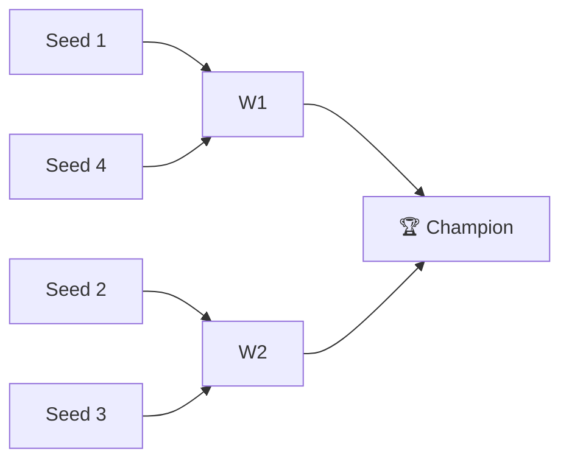

# 🏈 2020 Season

**Champion:** _TBD_
**Runner-Up:** _TBD_
**Regular Season Top Seed:** _TBD_
**Toilet Bowl Winner:** _TBD_

## Final Standings

> Auto-generated from Yahoo standings. Owners and playoff results are filled from the league bible (`raw/bible.yaml`); `_TBD_` means not yet recorded.

| Rank | Team | Owner | W-L | PF | PA | Playoff Seed |
|------|------|-------|-----|----|----|--------------|
| 1 | Roger That | _TBD_ | 6-7 | 1529.92 | 1623.92 | 1 |
| 2 | Imagine Losing | _TBD_ | 7-6 | 1515.24 | 1564.58 | 2 |
| 3 | Kaushal's Potatoes | _TBD_ | 6-7 | 1636.04 | 1579.58 | 3 |
| 4 | CHOPSTIX | _TBD_ | 2-11 | 1374.98 | 1718.72 | 4 |
| 5 | Anish's Awesome Team | _TBD_ | 9-4 | 1635.98 | 1576.34 | - |
| 6 | My team is Koo(l) | _TBD_ | 9-4 | 1783.6 | 1593.36 | - |
| 7 | Sharman’s Scorpions | _TBD_ | 8-5 | 1732.96 | 1522.1 | - |
| 7 | Aryan's Amazing Team | _TBD_ | 6-7 | 1538.1 | 1652.8 | - |
| 8 | Super Squirrels | _TBD_ | 8-5 | 1635.56 | 1452.18 | - |
| 9 | I have Hop(e) | _TBD_ | 4-9 | 1548.58 | 1647.38 | - |

## Playoff Bracket

> Playoff results are recorded in the league bible. Add `champions: { 2020: { champion: ..., runner_up: ... } }` to `raw/bible.yaml` to populate this section.

## Team Rosters

| Team | Post-Draft Roster | End-of-Season Roster |
|------|-------------------|----------------------|

## Awards

- 🏆 **League Champion:** _TBD_
- 💥 **Highest Single-Week Score:** _TBD_
- 📉 **Lowest Single-Week Score:** _TBD_
- 🔥 **Biggest Bust:** _TBD_
- 🎯 **Best Draft Pick:** _TBD_
- 🍗 **"Poultry Controversy" Nominee:** _TBD_

## The Story of the Year

_TBD - add the defining moments._

## Related

- [Seasons](index.md) · [2020 Draft](#) · [Teams](../teams/index.md) · [Records](../records/index.md) · [Lore](#) · [Playoffs](../playoffs.md)
