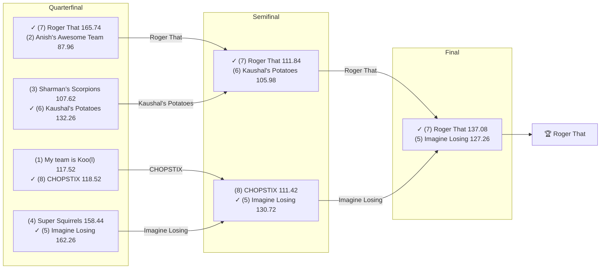

# 🏈 2020 Season

- **Champion:** Roger That
- **Runner-Up:** Imagine Losing
- **Regular Season Top Seed:** My team is Koo(l)
- **Toilet Bowl Winner:** I have Hop(e)

## Final Standings

> Auto-generated from Yahoo. **Finish** is Yahoo's final playoff-adjusted rank, so it does not follow W-L order - a team can win the title from a lower seed. **Playoff Seed** is the seed the team actually entered the playoffs with; - means it did not qualify.

| Finish | Team | Owner | W-L | PF | PA | Playoff Seed |
|--------|------|-------|-----|----|----|--------------|
| 1 | Roger That | Pranav | 6-7 | 1529.92 | 1623.92 | 7 |
| 2 | Imagine Losing | Om | 7-6 | 1515.24 | 1564.58 | 5 |
| 3 | Kaushal's Potatoes | Kaushal | 6-7 | 1636.04 | 1579.58 | 6 |
| 4 | CHOPSTIX | sahil | 2-11 | 1374.98 | 1718.72 | 8 |
| 5 | Anish's Awesome Team | Anish | 9-4 | 1635.98 | 1576.34 | 2 |
| 6 | My team is Koo(l) | lokesh | 9-4 | 1783.6 | 1593.36 | 1 |
| 7 | Sharman’s Scorpions | Sharman | 8-5 | 1732.96 | 1522.1 | 3 |
| 7 | Aryan's Amazing Team | Aryan | 6-7 | 1538.1 | 1652.8 | - |
| 8 | Super Squirrels | Super | 8-5 | 1635.56 | 1452.18 | 4 |
| 9 | I have Hop(e) | Naren | 4-9 | 1548.58 | 1647.38 | - |

## Playoff Bracket

> The actual championship bracket, from captured weekly matchups. Seeds in parentheses; ✓ marks the winner. Consolation games are excluded, and a team that appears first in a later round had a bye.

## Team Rosters

> Post-draft and end-of-season lineups as Yahoo recorded them. Bench and IR rows are included; points are that week's score.

??? note "Roger That"
    **Post-draft - week 1**

    | Slot | Player | Pos | Pts |
    |------|--------|-----|-----|
    | QB | Russell Wilson | QB | 31.78 |
    | RB | Christian McCaffrey | RB | 28.50 |
    | RB | Boston Scott | RB | 7.40 |
    | WR | JuJu Smith-Schuster | WR | 24.90 |
    | WR | Odell Beckham Jr. | WR | 5.20 |
    | TE | Hunter Henry | TE | 12.30 |
    | W/R/T | Michael Gallup | WR | 8.00 |
    | K | Justin Tucker | K | 9.00 |
    | DEF | Chiefs | DEF | 7.00 |
    | BN | Cam Newton | QB | 25.70 |
    | BN | David Johnson | RB | 19.90 |
    | BN | Noah Fant | TE | 19.10 |
    | BN | Jared Goff | QB | 11.50 |
    | BN | Ronald Jones | RB | 10.20 |
    | BN | Miles Sanders | RB | 0.00 |

    **End of season - week 16**

    | Slot | Player | Pos | Pts |
    |------|--------|-----|-----|
    | QB | Jalen Hurts | QB | 20.58 |
    | RB | Miles Sanders | RB | 18.40 |
    | RB | Mike Davis | RB | 8.80 |
    | WR | JuJu Smith-Schuster | WR | 24.60 |
    | WR | A.J. Brown | WR | 8.30 |
    | TE | Noah Fant | TE | 12.50 |
    | W/R/T | David Johnson | RB | 28.90 |
    | K | Justin Tucker | K | 9.00 |
    | DEF | Bears | DEF | 6.00 |
    | BN | Jeff Wilson Jr. | RB | 27.40 |
    | BN | CeeDee Lamb | WR | 24.00 |
    | BN | Russell Wilson | QB | 19.90 |
    | BN | Ezekiel Elliott | RB | 17.90 |
    | BN | Russell Gage Jr. | WR | 6.30 |
    | BN | Christian McCaffrey | RB | 0.00 |
    | IR | Hunter Henry | TE | 0.00 |

??? note "Imagine Losing"
    **Post-draft - week 1**

    | Slot | Player | Pos | Pts |
    |------|--------|-----|-----|
    | QB | Deshaun Watson | QB | 21.82 |
    | RB | Jonathan Taylor | RB | 14.90 |
    | RB | James Conner | RB | 3.70 |
    | WR | Calvin Ridley | WR | 33.90 |
    | WR | Michael Thomas | WR | 4.70 |
    | TE | George Kittle | TE | 9.30 |
    | W/R/T | DK Metcalf | WR | 19.50 |
    | K | Ka'imi Fairbairn | K | 2.00 |
    | DEF | Colts | DEF | 4.00 |
    | BN | Aaron Rodgers | QB | 30.76 |
    | BN | Hollywood Brown | WR | 15.10 |
    | BN | J.K. Dobbins | RB | 14.20 |
    | BN | Jonnu Smith | TE | 13.60 |
    | BN | Jordan Howard | RB | 6.70 |
    | BN | Eagles | DEF | 3.00 |

    **End of season - week 16**

    | Slot | Player | Pos | Pts |
    |------|--------|-----|-----|
    | QB | Deshaun Watson | QB | 26.76 |
    | RB | Jonathan Taylor | RB | 19.40 |
    | RB | J.K. Dobbins | RB | 13.70 |
    | WR | DK Metcalf | WR | 11.90 |
    | WR | T.Y. Hilton | WR | 9.00 |
    | TE | George Kittle | TE | 13.20 |
    | W/R/T | Calvin Ridley | WR | 17.30 |
    | K | Jason Myers | K | 10.00 |
    | DEF | Cardinals | DEF | 6.00 |
    | BN | James Conner | RB | 17.60 |
    | BN | Derrick Henry | RB | 9.80 |
    | BN | Mike Gesicki | TE | 9.40 |
    | BN | Wayne Gallman | RB | 7.30 |
    | BN | Colts | DEF | 0.00 |
    | BN | Michael Thomas | WR | 0.00 |

??? note "Kaushal's Potatoes"
    **Post-draft - week 1**

    | Slot | Player | Pos | Pts |
    |------|--------|-----|-----|
    | QB | Dak Prescott | QB | 17.64 |
    | RB | Melvin Gordon III | RB | 15.60 |
    | RB | Le'Veon Bell | RB | 6.60 |
    | WR | Davante Adams | WR | 41.60 |
    | WR | Cooper Kupp | WR | 8.00 |
    | TE | Travis Kelce | TE | 17.00 |
    | W/R/T | DJ Chark | WR | 11.50 |
    | K | Matt Prater | K | 12.00 |
    | DEF | Patriots | DEF | 11.00 |
    | BN | Darius Slayton | WR | 28.20 |
    | BN | Sammy Watkins | WR | 21.50 |
    | BN | Baker Mayfield | QB | 10.86 |
    | IR | Sony Michel | RB | 9.70 |
    | BN | Steelers | DEF | 8.00 |
    | BN | Chris Herndon | TE | 7.70 |
    | BN | Cam Akers | RB | 5.30 |

    **End of season - week 16**

    | Slot | Player | Pos | Pts |
    |------|--------|-----|-----|
    | QB | Matt Ryan | QB | 19.90 |
    | RB | Nyheim Miller-Hines | RB | 16.70 |
    | RB | Melvin Gordon III | RB | 7.90 |
    | WR | Davante Adams | WR | 43.20 |
    | WR | Cooper Kupp | WR | 14.70 |
    | TE | Travis Kelce | TE | 22.80 |
    | W/R/T | Robbie Chosen | WR | 16.90 |
    | K | Matt Prater | K | 1.00 |
    | DEF | Patriots | DEF | -4.00 |
    | BN | Kirk Cousins | QB | 23.64 |
    | BN | DJ Chark | WR | 16.20 |
    | BN | Emmanuel Sanders | WR | 13.50 |
    | BN | Devin Singletary | RB | 7.20 |
    | BN | Dallas Goedert | TE | 6.80 |
    | BN | Matthew Stafford | QB | 0.68 |

??? note "CHOPSTIX"
    **Post-draft - week 1**

    | Slot | Player | Pos | Pts |
    |------|--------|-----|-----|
    | QB | Lamar Jackson | QB | 27.50 |
    | RB | Kenyan Drake | RB | 14.50 |
    | RB | Saquon Barkley | RB | 12.60 |
    | WR | A.J. Brown | WR | 8.90 |
    | WR | Keenan Allen | WR | 7.70 |
    | TE | Hayden Hurst | TE | 6.80 |
    | W/R/T | Chris Carson | RB | 24.60 |
    | K | Zane Gonzalez | K | 8.00 |
    | DEF | Bills | DEF | 8.00 |
    | BN | Ben Roethlisberger | QB | 22.06 |
    | BN | T.Y. Hilton | WR | 9.30 |
    | BN | Broncos | DEF | 4.00 |
    | BN | Leonard Fournette | RB | 2.90 |
    | BN | Blake Jarwin | TE | 2.20 |
    | BN | Matt Breida | RB | 2.20 |

    **End of season - week 16**

    | Slot | Player | Pos | Pts |
    |------|--------|-----|-----|
    | QB | Lamar Jackson | QB | 21.32 |
    | RB | Kenyan Drake | RB | 13.00 |
    | RB | Chris Carson | RB | 10.90 |
    | WR | Robert Woods | WR | 8.90 |
    | WR | Keenan Allen | WR | 0.00 |
    | TE | Jared Cook | TE | 11.20 |
    | W/R/T | Marvin Jones Jr. | WR | 4.90 |
    | K | Tyler Bass | K | 8.00 |
    | DEF | 49ers | DEF | 11.00 |
    | BN | Myles Gaskin | RB | 33.90 |
    | BN | Ben Roethlisberger | QB | 25.54 |
    | BN | Derek Carr | QB | 23.24 |
    | BN | Jamaal Williams | RB | 0.00 |
    | BN | Phillip Lindsay | RB | 0.00 |
    | BN | Ronald Jones | RB | 0.00 |

??? note "Anish's Awesome Team"
    **Post-draft - week 1**

    | Slot | Player | Pos | Pts |
    |------|--------|-----|-----|
    | QB | Kyler Murray | QB | 27.30 |
    | RB | Ezekiel Elliott | RB | 27.70 |
    | RB | Aaron Jones Sr. | RB | 17.60 |
    | WR | Chris Godwin Jr. | WR | 13.90 |
    | WR | DJ Moore | WR | 9.40 |
    | TE | Tyler Higbee | TE | 7.00 |
    | W/R/T | Julian Edelman | WR | 13.00 |
    | K | Younghoe Koo | K | 9.00 |
    | DEF | Titans | DEF | 3.00 |
    | BN | Dallas Goedert | TE | 24.10 |
    | BN | Carson Wentz | QB | 15.00 |
    | BN | A.J. Green | WR | 10.10 |
    | BN | Tarik Cohen | RB | 6.70 |
    | BN | Kerryon Johnson | RB | 1.40 |
    | BN | Courtland Sutton | WR | 0.00 |

    **End of season - week 16**

    | Slot | Player | Pos | Pts |
    |------|--------|-----|-----|
    | QB | Kyler Murray | QB | 16.38 |
    | RB | Aaron Jones Sr. | RB | 12.80 |
    | RB | Antonio Gibson | RB | 9.90 |
    | WR | Chris Godwin Jr. | WR | 19.40 |
    | WR | Justin Jefferson | WR | 14.50 |
    | TE | Austin Hooper | TE | 14.10 |
    | W/R/T | DJ Moore | WR | 8.70 |
    | K | Jason Sanders | K | 15.00 |
    | DEF | Texans | DEF | -4.00 |
    | BN | Brandin Cooks | WR | 27.10 |
    | BN | J.D. McKissic | RB | 23.20 |
    | BN | Curtis Samuel | WR | 20.80 |
    | BN | Eric Ebron | TE | 15.70 |
    | BN | Antonio Brown | WR | 13.50 |
    | BN | Tony Pollard | RB | 3.00 |

??? note "My team is Koo(l)"
    **Post-draft - week 1**

    | Slot | Player | Pos | Pts |
    |------|--------|-----|-----|
    | QB | Matt Ryan | QB | 24.90 |
    | RB | Josh Jacobs | RB | 35.90 |
    | RB | Nick Chubb | RB | 5.60 |
    | WR | Tyreek Hill | WR | 15.60 |
    | WR | Terry McLaurin | WR | 11.10 |
    | TE | Darren Waller | TE | 10.50 |
    | W/R/T | James White | RB | 8.20 |
    | K | Robbie Gould | K | 10.00 |
    | DEF | Lions | DEF | 1.00 |
    | BN | Robert Woods | WR | 17.90 |
    | BN | Joe Burrow | QB | 17.32 |
    | BN | Cordarrelle Patterson | WR | 15.10 |
    | BN | James Robinson | RB | 10.00 |
    | BN | Austin Hooper | TE | 3.50 |
    | BN | Brandon Aiyuk | WR | 0.00 |

    **End of season - week 16**

    | Slot | Player | Pos | Pts |
    |------|--------|-----|-----|
    | QB | Justin Herbert | QB | 16.72 |
    | RB | Nick Chubb | RB | 17.60 |
    | RB | Josh Jacobs | RB | 6.90 |
    | WR | Tyreek Hill | WR | 10.50 |
    | WR | Cole Beasley | WR | 4.70 |
    | TE | Darren Waller | TE | 16.20 |
    | W/R/T | Leonard Fournette | RB | 15.60 |
    | K | Younghoe Koo | K | 2.00 |
    | DEF | Browns | DEF | 6.00 |
    | BN | Irv Smith Jr. | TE | 23.30 |
    | BN | Tim Patrick | WR | 6.90 |
    | BN | Dolphins | DEF | 5.00 |
    | BN | Cordarrelle Patterson | WR | 2.20 |
    | BN | Terry McLaurin | WR | 0.00 |

??? note "Sharman’s Scorpions"
    **Post-draft - week 1**

    | Slot | Player | Pos | Pts |
    |------|--------|-----|-----|
    | QB | Patrick Mahomes | QB | 20.44 |
    | RB | Alvin Kamara | RB | 23.70 |
    | RB | Todd Gurley | RB | 13.70 |
    | WR | Adam Thielen | WR | 31.00 |
    | WR | Marvin Jones Jr. | WR | 9.50 |
    | TE | Jared Cook | TE | 13.00 |
    | W/R/T | Mark Ingram II | RB | 2.90 |
    | K | Harrison Butker | K | 10.00 |
    | DEF | Saints | DEF | 17.00 |
    | BN | Daniel Jones | QB | 19.36 |
    | BN | Will Fuller V | WR | 19.20 |
    | BN | Kareem Hunt | RB | 12.10 |
    | BN | Chargers | DEF | 11.00 |
    | BN | Mike Evans | WR | 7.20 |
    | BN | Mike Gesicki | TE | 6.00 |

    **End of season - week 16**

    | Slot | Player | Pos | Pts |
    |------|--------|-----|-----|
    | QB | Patrick Mahomes | QB | 20.22 |
    | RB | Alvin Kamara | RB | 56.20 |
    | RB | Kareem Hunt | RB | 14.20 |
    | WR | Adam Thielen | WR | 23.70 |
    | WR | Brandon Aiyuk | WR | 4.10 |
    | TE | Logan Thomas | TE | 13.30 |
    | W/R/T | Keke Coutee | WR | 10.40 |
    | K | Harrison Butker | K | 7.00 |
    | DEF | Packers | DEF | 7.00 |
    | BN | Mike Evans | WR | 40.10 |
    | BN | Teddy Bridgewater | QB | 9.58 |
    | BN | Chase Claypool | WR | 9.40 |
    | BN | Todd Gurley | RB | 8.00 |
    | BN | Cam Akers | RB | 0.00 |
    | BN | Corey Davis | WR | 0.00 |

??? note "Aryan's Amazing Team"
    **Post-draft - week 1**

    | Slot | Player | Pos | Pts |
    |------|--------|-----|-----|
    | QB | Josh Allen | QB | 28.18 |
    | RB | Raheem Mostert | RB | 25.10 |
    | RB | Derrick Henry | RB | 16.10 |
    | WR | Julio Jones | WR | 24.70 |
    | WR | Jarvis Landry | WR | 11.10 |
    | TE | Mark Andrews | TE | 22.80 |
    | W/R/T | Marlon Mack | RB | 8.60 |
    | K | Wil Lutz | K | 10.00 |
    | DEF | Ravens | DEF | 15.00 |
    | BN | Jimmy Garoppolo | QB | 19.26 |
    | BN | Phillip Lindsay | RB | 4.50 |
    | BN | Brandin Cooks | WR | 4.00 |
    | BN | Eric Ebron | TE | 2.80 |
    | BN | Golden Tate | WR | 0.00 |
    | BN | Kenny Golladay | WR | 0.00 |

    **End of season - week 16**

    | Slot | Player | Pos | Pts |
    |------|--------|-----|-----|
    | QB | Josh Allen | QB | 32.30 |
    | WR | Mecole Hardman Jr. | WR | 11.50 |
    | WR | Julio Jones | WR | 0.00 |
    | TE | Dalton Schultz | TE | 5.10 |
    | W/R/T | Jarvis Landry | WR | 0.00 |
    | K | Wil Lutz | K | 10.00 |
    | DEF | Rams | DEF | 6.00 |
    | BN | Aaron Rodgers | QB | 26.14 |
    | BN | Rob Gronkowski | TE | 19.80 |
    | BN | Gus Edwards | RB | 14.20 |
    | BN | Mark Andrews | TE | 13.60 |
    | BN | Ravens | DEF | 10.00 |
    | BN | Jakobi Meyers | WR | 8.50 |
    | BN | Jordan Wilkins | RB | 0.00 |
    | BN | Kenny Golladay | WR | 0.00 |

??? note "Super Squirrels"
    **Post-draft - week 1**

    | Slot | Player | Pos | Pts |
    |------|--------|-----|-----|
    | QB | Matthew Stafford | QB | 17.18 |
    | RB | Dalvin Cook | RB | 21.80 |
    | RB | Clyde Edwards-Helaire | RB | 19.80 |
    | WR | Allen Robinson | WR | 12.30 |
    | WR | Mecole Hardman Jr. | WR | 3.60 |
    | TE | Evan Engram | TE | 2.90 |
    | W/R/T | Stefon Diggs | WR | 16.60 |
    | K | Jake Elliott | K | 5.00 |
    | DEF | 49ers | DEF | 4.00 |
    | BN | Tom Brady | QB | 22.46 |
    | BN | John Brown | WR | 19.00 |
    | BN | Amari Cooper | WR | 18.10 |
    | BN | T.J. Hockenson | TE | 16.60 |
    | BN | D'Andre Swift | RB | 11.30 |
    | BN | Tyler Boyd | WR | 7.30 |

    **End of season - week 16**

    | Slot | Player | Pos | Pts |
    |------|--------|-----|-----|
    | QB | Tom Brady | QB | 29.92 |
    | RB | Dalvin Cook | RB | 16.50 |
    | RB | D'Andre Swift | RB | 9.00 |
    | WR | Stefon Diggs | WR | 41.50 |
    | WR | Allen Robinson | WR | 20.30 |
    | TE | T.J. Hockenson | TE | 6.30 |
    | W/R/T | Amari Cooper | WR | 16.10 |
    | K | Ryan Succop | K | 5.00 |
    | DEF | Bills | DEF | 7.00 |
    | BN | Sterling Shepard | WR | 22.70 |
    | BN | Evan Engram | TE | 14.00 |
    | BN | Jared Goff | QB | 10.66 |
    | BN | Rodrigo Blankenship | K | 6.00 |
    | BN | Clyde Edwards-Helaire | RB | 0.00 |
    | BN | Tyler Boyd | WR | 0.00 |

??? note "I have Hop(e)"
    **Post-draft - week 1**

    | Slot | Player | Pos | Pts |
    |------|--------|-----|-----|
    | QB | Drew Brees | QB | 14.40 |
    | RB | Austin Ekeler | RB | 9.70 |
    | RB | Joe Mixon | RB | 6.10 |
    | WR | DeAndre Hopkins | WR | 29.10 |
    | WR | Tyler Lockett | WR | 17.20 |
    | TE | Zach Ertz | TE | 10.80 |
    | W/R/T | DeSean Jackson | WR | 6.60 |
    | K | Greg Zuerlein | K | 5.00 |
    | DEF | Bears | DEF | 3.00 |
    | BN | Ryan Tannehill | QB | 19.36 |
    | BN | Diontae Johnson | WR | 11.00 |
    | BN | Devin Singletary | RB | 10.30 |
    | BN | DeVante Parker | WR | 8.70 |
    | BN | David Montgomery | RB | 8.40 |
    | BN | Rob Gronkowski | TE | 3.10 |

    **End of season - week 16**

    | Slot | Player | Pos | Pts |
    |------|--------|-----|-----|
    | QB | Ryan Tannehill | QB | 18.34 |
    | RB | David Montgomery | RB | 20.10 |
    | RB | Austin Ekeler | RB | 15.80 |
    | WR | Diontae Johnson | WR | 22.40 |
    | WR | DeAndre Hopkins | WR | 12.80 |
    | TE | Robert Tonyan | TE | 2.70 |
    | W/R/T | Hollywood Brown | WR | 12.50 |
    | K | Daniel Carlson | K | 13.00 |
    | DEF | Steelers | DEF | 9.00 |
    | BN | Nelson Agholor | WR | 26.50 |
    | BN | Taysom Hill | QB | 11.02 |
    | BN | Tyler Lockett | WR | 7.40 |
    | BN | DeVante Parker | WR | 0.00 |
    | IR | James Robinson | RB | 0.00 |
    | IR | Joe Mixon | RB | 0.00 |
    | BN | Jordan Reed | TE | 0.00 |
    | BN | Raheem Mostert | RB | 0.00 |

## Awards

- 🏆 **League Champion:** Roger That
- 💥 **Highest Single-Week Score:** My team is Koo(l) - 175.42 (Wk 2)
- 📉 **Lowest Single-Week Score:** Imagine Losing - 67.72 (Wk 10)
- 🔥 **Biggest Bust:** Michael Thomas (WR) - drafted by [Imagine Losing](../teams/imagine-losing.md) at pick 6, finished -33 spots at the position, 83.90 pts
- 🎯 **Best Draft Pick:** Kareem Hunt (RB) - drafted by [Sharman’s Scorpions](../teams/sharman-s-scorpions.md) at pick 104, finished +23 spots at the position, 213.40 pts
- 🍗 **"Poultry Controversy" Nominee:** _TBD_

> Best Draft Pick and Biggest Bust are computed, not voted: within each position, the gap between where a player was drafted and where they finished on season points. Bust is restricted to rounds 1-3.

## The Story of the Year

_TBD - add the defining moments._

## Related

- [Seasons](index.md) · [2020 Draft](../draft/2020-draft.md) · [Teams](../teams/index.md) · [Records](../records/index.md) · Lore · [Playoffs](../playoffs.md)
