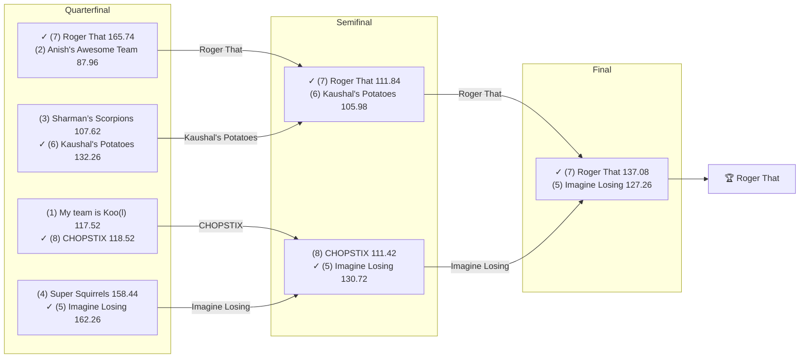

# 2020 Season

- **Champion:** Roger That
- **Runner-Up:** Imagine Losing
- **Regular Season Top Seed:** My team is Koo(l)
- **Toilet Bowl Winner:** I have Hop(e)

## Final Standings

> **Finish** is Yahoo's final playoff-adjusted rank, so it does not follow W-L order: a team can win the title from a lower seed. **Playoff Seed** is the seed the team entered the playoffs with; a dash means it did not qualify.

| Finish | Team | Owner | W-L | PF | PA | Playoff Seed |
|--------|------|-------|-----|----|----|--------------|
| 1 | Roger That | Pranav | 6-7 | 1529.92 | 1623.92 | 7 |
| 2 | Imagine Losing | Om | 7-6 | 1515.24 | 1564.58 | 5 |
| 3 | Kaushal's Potatoes | Kaushal | 6-7 | 1636.04 | 1579.58 | 6 |
| 4 | CHOPSTIX | sahil | 2-11 | 1374.98 | 1718.72 | 8 |
| 5 | Anish's Awesome Team | Anish | 9-4 | 1635.98 | 1576.34 | 2 |
| 6 | My team is Koo(l) | lokesh | 9-4 | 1783.6 | 1593.36 | 1 |
| 7 | Sharman’s Scorpions | Sharman | 8-5 | 1732.96 | 1522.1 | 3 |
| 7 | Aryan's Amazing Team | Aryan | 6-7 | 1538.1 | 1652.8 | - |
| 8 | Super Squirrels | Super | 8-5 | 1635.56 | 1452.18 | 4 |
| 9 | I have Hop(e) | Naren | 4-9 | 1548.58 | 1647.38 | - |

## Playoff Bracket

> The actual championship bracket, from captured weekly matchups. Seeds in parentheses; ✓ marks the winner. Consolation games are excluded, and a team that appears first in a later round had a bye.

## Team Rosters

> Post-draft and end-of-season lineups as Yahoo recorded them. Bench and IR rows are included; points are that week's score.

??? note "Roger That"
    **Post-draft - week 1**

    | Slot | Player | Pos | Pts |
    |------|--------|-----|-----|
    | QB | [Russell Wilson](../players/russell-wilson.md) | QB | 31.78 |
    | RB | [Christian McCaffrey](../players/christian-mccaffrey.md) | RB | 28.50 |
    | RB | [Boston Scott](../players/boston-scott.md) | RB | 7.40 |
    | WR | [JuJu Smith-Schuster](../players/juju-smith-schuster.md) | WR | 24.90 |
    | WR | [Odell Beckham Jr.](../players/odell-beckham-jr.md) | WR | 5.20 |
    | TE | [Hunter Henry](../players/hunter-henry.md) | TE | 12.30 |
    | W/R/T | [Michael Gallup](../players/michael-gallup.md) | WR | 8.00 |
    | K | [Justin Tucker](../players/justin-tucker.md) | K | 9.00 |
    | DEF | [Chiefs](../players/chiefs.md) | DEF | 7.00 |
    | BN | [Cam Newton](../players/cam-newton.md) | QB | 25.70 |
    | BN | [David Johnson](../players/david-johnson.md) | RB | 19.90 |
    | BN | [Noah Fant](../players/noah-fant.md) | TE | 19.10 |
    | BN | [Jared Goff](../players/jared-goff.md) | QB | 11.50 |
    | BN | [Ronald Jones](../players/ronald-jones.md) | RB | 10.20 |
    | BN | [Miles Sanders](../players/miles-sanders.md) | RB | 0.00 |

    **End of season - week 16**

    | Slot | Player | Pos | Pts |
    |------|--------|-----|-----|
    | QB | [Jalen Hurts](../players/jalen-hurts.md) | QB | 20.58 |
    | RB | [Miles Sanders](../players/miles-sanders.md) | RB | 18.40 |
    | RB | [Mike Davis](../players/mike-davis.md) | RB | 8.80 |
    | WR | [JuJu Smith-Schuster](../players/juju-smith-schuster.md) | WR | 24.60 |
    | WR | [A.J. Brown](../players/a-j-brown.md) | WR | 8.30 |
    | TE | [Noah Fant](../players/noah-fant.md) | TE | 12.50 |
    | W/R/T | [David Johnson](../players/david-johnson.md) | RB | 28.90 |
    | K | [Justin Tucker](../players/justin-tucker.md) | K | 9.00 |
    | DEF | [Bears](../players/bears.md) | DEF | 6.00 |
    | BN | [Jeff Wilson Jr.](../players/jeff-wilson-jr.md) | RB | 27.40 |
    | BN | [CeeDee Lamb](../players/ceedee-lamb.md) | WR | 24.00 |
    | BN | [Russell Wilson](../players/russell-wilson.md) | QB | 19.90 |
    | BN | [Ezekiel Elliott](../players/ezekiel-elliott.md) | RB | 17.90 |
    | BN | [Russell Gage Jr.](../players/russell-gage-jr.md) | WR | 6.30 |
    | BN | [Christian McCaffrey](../players/christian-mccaffrey.md) | RB | 0.00 |
    | IR | [Hunter Henry](../players/hunter-henry.md) | TE | 0.00 |

??? note "Imagine Losing"
    **Post-draft - week 1**

    | Slot | Player | Pos | Pts |
    |------|--------|-----|-----|
    | QB | [Deshaun Watson](../players/deshaun-watson.md) | QB | 21.82 |
    | RB | [Jonathan Taylor](../players/jonathan-taylor.md) | RB | 14.90 |
    | RB | [James Conner](../players/james-conner.md) | RB | 3.70 |
    | WR | [Calvin Ridley](../players/calvin-ridley.md) | WR | 33.90 |
    | WR | [Michael Thomas](../players/michael-thomas.md) | WR | 4.70 |
    | TE | [George Kittle](../players/george-kittle.md) | TE | 9.30 |
    | W/R/T | [DK Metcalf](../players/dk-metcalf.md) | WR | 19.50 |
    | K | [Ka'imi Fairbairn](../players/ka-imi-fairbairn.md) | K | 2.00 |
    | DEF | [Colts](../players/colts.md) | DEF | 4.00 |
    | BN | [Aaron Rodgers](../players/aaron-rodgers.md) | QB | 30.76 |
    | BN | [Hollywood Brown](../players/hollywood-brown.md) | WR | 15.10 |
    | BN | [J.K. Dobbins](../players/j-k-dobbins.md) | RB | 14.20 |
    | BN | [Jonnu Smith](../players/jonnu-smith.md) | TE | 13.60 |
    | BN | [Jordan Howard](../players/jordan-howard.md) | RB | 6.70 |
    | BN | [Eagles](../players/eagles.md) | DEF | 3.00 |

    **End of season - week 16**

    | Slot | Player | Pos | Pts |
    |------|--------|-----|-----|
    | QB | [Deshaun Watson](../players/deshaun-watson.md) | QB | 26.76 |
    | RB | [Jonathan Taylor](../players/jonathan-taylor.md) | RB | 19.40 |
    | RB | [J.K. Dobbins](../players/j-k-dobbins.md) | RB | 13.70 |
    | WR | [DK Metcalf](../players/dk-metcalf.md) | WR | 11.90 |
    | WR | [T.Y. Hilton](../players/t-y-hilton.md) | WR | 9.00 |
    | TE | [George Kittle](../players/george-kittle.md) | TE | 13.20 |
    | W/R/T | [Calvin Ridley](../players/calvin-ridley.md) | WR | 17.30 |
    | K | [Jason Myers](../players/jason-myers.md) | K | 10.00 |
    | DEF | [Cardinals](../players/cardinals.md) | DEF | 6.00 |
    | BN | [James Conner](../players/james-conner.md) | RB | 17.60 |
    | BN | [Derrick Henry](../players/derrick-henry.md) | RB | 9.80 |
    | BN | [Mike Gesicki](../players/mike-gesicki.md) | TE | 9.40 |
    | BN | [Wayne Gallman](../players/wayne-gallman.md) | RB | 7.30 |
    | BN | [Colts](../players/colts.md) | DEF | 0.00 |
    | BN | [Michael Thomas](../players/michael-thomas.md) | WR | 0.00 |

??? note "Kaushal's Potatoes"
    **Post-draft - week 1**

    | Slot | Player | Pos | Pts |
    |------|--------|-----|-----|
    | QB | [Dak Prescott](../players/dak-prescott.md) | QB | 17.64 |
    | RB | [Melvin Gordon III](../players/melvin-gordon-iii.md) | RB | 15.60 |
    | RB | [Le'Veon Bell](../players/le-veon-bell.md) | RB | 6.60 |
    | WR | [Davante Adams](../players/davante-adams.md) | WR | 41.60 |
    | WR | [Cooper Kupp](../players/cooper-kupp.md) | WR | 8.00 |
    | TE | [Travis Kelce](../players/travis-kelce.md) | TE | 17.00 |
    | W/R/T | [DJ Chark](../players/dj-chark.md) | WR | 11.50 |
    | K | [Matt Prater](../players/matt-prater.md) | K | 12.00 |
    | DEF | [Patriots](../players/patriots.md) | DEF | 11.00 |
    | BN | [Darius Slayton](../players/darius-slayton.md) | WR | 28.20 |
    | BN | [Sammy Watkins](../players/sammy-watkins.md) | WR | 21.50 |
    | BN | [Baker Mayfield](../players/baker-mayfield.md) | QB | 10.86 |
    | IR | [Sony Michel](../players/sony-michel.md) | RB | 9.70 |
    | BN | [Steelers](../players/steelers.md) | DEF | 8.00 |
    | BN | [Chris Herndon](../players/chris-herndon.md) | TE | 7.70 |
    | BN | [Cam Akers](../players/cam-akers.md) | RB | 5.30 |

    **End of season - week 16**

    | Slot | Player | Pos | Pts |
    |------|--------|-----|-----|
    | QB | [Matt Ryan](../players/matt-ryan.md) | QB | 19.90 |
    | RB | [Nyheim Miller-Hines](../players/nyheim-miller-hines.md) | RB | 16.70 |
    | RB | [Melvin Gordon III](../players/melvin-gordon-iii.md) | RB | 7.90 |
    | WR | [Davante Adams](../players/davante-adams.md) | WR | 43.20 |
    | WR | [Cooper Kupp](../players/cooper-kupp.md) | WR | 14.70 |
    | TE | [Travis Kelce](../players/travis-kelce.md) | TE | 22.80 |
    | W/R/T | [Robbie Chosen](../players/robbie-chosen.md) | WR | 16.90 |
    | K | [Matt Prater](../players/matt-prater.md) | K | 1.00 |
    | DEF | [Patriots](../players/patriots.md) | DEF | -4.00 |
    | BN | [Kirk Cousins](../players/kirk-cousins.md) | QB | 23.64 |
    | BN | [DJ Chark](../players/dj-chark.md) | WR | 16.20 |
    | BN | [Emmanuel Sanders](../players/emmanuel-sanders.md) | WR | 13.50 |
    | BN | [Devin Singletary](../players/devin-singletary.md) | RB | 7.20 |
    | BN | [Dallas Goedert](../players/dallas-goedert.md) | TE | 6.80 |
    | BN | [Matthew Stafford](../players/matthew-stafford.md) | QB | 0.68 |

??? note "CHOPSTIX"
    **Post-draft - week 1**

    | Slot | Player | Pos | Pts |
    |------|--------|-----|-----|
    | QB | [Lamar Jackson](../players/lamar-jackson.md) | QB | 27.50 |
    | RB | [Kenyan Drake](../players/kenyan-drake.md) | RB | 14.50 |
    | RB | [Saquon Barkley](../players/saquon-barkley.md) | RB | 12.60 |
    | WR | [A.J. Brown](../players/a-j-brown.md) | WR | 8.90 |
    | WR | [Keenan Allen](../players/keenan-allen.md) | WR | 7.70 |
    | TE | [Hayden Hurst](../players/hayden-hurst.md) | TE | 6.80 |
    | W/R/T | [Chris Carson](../players/chris-carson.md) | RB | 24.60 |
    | K | [Zane Gonzalez](../players/zane-gonzalez.md) | K | 8.00 |
    | DEF | [Bills](../players/bills.md) | DEF | 8.00 |
    | BN | [Ben Roethlisberger](../players/ben-roethlisberger.md) | QB | 22.06 |
    | BN | [T.Y. Hilton](../players/t-y-hilton.md) | WR | 9.30 |
    | BN | [Broncos](../players/broncos.md) | DEF | 4.00 |
    | BN | [Leonard Fournette](../players/leonard-fournette.md) | RB | 2.90 |
    | BN | [Blake Jarwin](../players/blake-jarwin.md) | TE | 2.20 |
    | BN | [Matt Breida](../players/matt-breida.md) | RB | 2.20 |

    **End of season - week 16**

    | Slot | Player | Pos | Pts |
    |------|--------|-----|-----|
    | QB | [Lamar Jackson](../players/lamar-jackson.md) | QB | 21.32 |
    | RB | [Kenyan Drake](../players/kenyan-drake.md) | RB | 13.00 |
    | RB | [Chris Carson](../players/chris-carson.md) | RB | 10.90 |
    | WR | [Robert Woods](../players/robert-woods.md) | WR | 8.90 |
    | WR | [Keenan Allen](../players/keenan-allen.md) | WR | 0.00 |
    | TE | [Jared Cook](../players/jared-cook.md) | TE | 11.20 |
    | W/R/T | [Marvin Jones Jr.](../players/marvin-jones-jr.md) | WR | 4.90 |
    | K | [Tyler Bass](../players/tyler-bass.md) | K | 8.00 |
    | DEF | [49ers](../players/49ers.md) | DEF | 11.00 |
    | BN | [Myles Gaskin](../players/myles-gaskin.md) | RB | 33.90 |
    | BN | [Ben Roethlisberger](../players/ben-roethlisberger.md) | QB | 25.54 |
    | BN | [Derek Carr](../players/derek-carr.md) | QB | 23.24 |
    | BN | [Jamaal Williams](../players/jamaal-williams.md) | RB | 0.00 |
    | BN | [Phillip Lindsay](../players/phillip-lindsay.md) | RB | 0.00 |
    | BN | [Ronald Jones](../players/ronald-jones.md) | RB | 0.00 |

??? note "Anish's Awesome Team"
    **Post-draft - week 1**

    | Slot | Player | Pos | Pts |
    |------|--------|-----|-----|
    | QB | [Kyler Murray](../players/kyler-murray.md) | QB | 27.30 |
    | RB | [Ezekiel Elliott](../players/ezekiel-elliott.md) | RB | 27.70 |
    | RB | [Aaron Jones Sr.](../players/aaron-jones-sr.md) | RB | 17.60 |
    | WR | [Chris Godwin Jr.](../players/chris-godwin-jr.md) | WR | 13.90 |
    | WR | [DJ Moore](../players/dj-moore.md) | WR | 9.40 |
    | TE | [Tyler Higbee](../players/tyler-higbee.md) | TE | 7.00 |
    | W/R/T | [Julian Edelman](../players/julian-edelman.md) | WR | 13.00 |
    | K | [Younghoe Koo](../players/younghoe-koo.md) | K | 9.00 |
    | DEF | [Titans](../players/titans.md) | DEF | 3.00 |
    | BN | [Dallas Goedert](../players/dallas-goedert.md) | TE | 24.10 |
    | BN | [Carson Wentz](../players/carson-wentz.md) | QB | 15.00 |
    | BN | [A.J. Green](../players/a-j-green.md) | WR | 10.10 |
    | BN | [Tarik Cohen](../players/tarik-cohen.md) | RB | 6.70 |
    | BN | [Kerryon Johnson](../players/kerryon-johnson.md) | RB | 1.40 |
    | BN | [Courtland Sutton](../players/courtland-sutton.md) | WR | 0.00 |

    **End of season - week 16**

    | Slot | Player | Pos | Pts |
    |------|--------|-----|-----|
    | QB | [Kyler Murray](../players/kyler-murray.md) | QB | 16.38 |
    | RB | [Aaron Jones Sr.](../players/aaron-jones-sr.md) | RB | 12.80 |
    | RB | [Antonio Gibson](../players/antonio-gibson.md) | RB | 9.90 |
    | WR | [Chris Godwin Jr.](../players/chris-godwin-jr.md) | WR | 19.40 |
    | WR | [Justin Jefferson](../players/justin-jefferson.md) | WR | 14.50 |
    | TE | [Austin Hooper](../players/austin-hooper.md) | TE | 14.10 |
    | W/R/T | [DJ Moore](../players/dj-moore.md) | WR | 8.70 |
    | K | [Jason Sanders](../players/jason-sanders.md) | K | 15.00 |
    | DEF | [Texans](../players/texans.md) | DEF | -4.00 |
    | BN | [Brandin Cooks](../players/brandin-cooks.md) | WR | 27.10 |
    | BN | [J.D. McKissic](../players/j-d-mckissic.md) | RB | 23.20 |
    | BN | [Curtis Samuel](../players/curtis-samuel.md) | WR | 20.80 |
    | BN | [Eric Ebron](../players/eric-ebron.md) | TE | 15.70 |
    | BN | [Antonio Brown](../players/antonio-brown.md) | WR | 13.50 |
    | BN | [Tony Pollard](../players/tony-pollard.md) | RB | 3.00 |

??? note "My team is Koo(l)"
    **Post-draft - week 1**

    | Slot | Player | Pos | Pts |
    |------|--------|-----|-----|
    | QB | [Matt Ryan](../players/matt-ryan.md) | QB | 24.90 |
    | RB | [Josh Jacobs](../players/josh-jacobs.md) | RB | 35.90 |
    | RB | [Nick Chubb](../players/nick-chubb.md) | RB | 5.60 |
    | WR | [Tyreek Hill](../players/tyreek-hill.md) | WR | 15.60 |
    | WR | [Terry McLaurin](../players/terry-mclaurin.md) | WR | 11.10 |
    | TE | [Darren Waller](../players/darren-waller.md) | TE | 10.50 |
    | W/R/T | [James White](../players/james-white.md) | RB | 8.20 |
    | K | [Robbie Gould](../players/robbie-gould.md) | K | 10.00 |
    | DEF | [Lions](../players/lions.md) | DEF | 1.00 |
    | BN | [Robert Woods](../players/robert-woods.md) | WR | 17.90 |
    | BN | [Joe Burrow](../players/joe-burrow.md) | QB | 17.32 |
    | BN | [Cordarrelle Patterson](../players/cordarrelle-patterson.md) | WR | 15.10 |
    | BN | [James Robinson](../players/james-robinson.md) | RB | 10.00 |
    | BN | [Austin Hooper](../players/austin-hooper.md) | TE | 3.50 |
    | BN | [Brandon Aiyuk](../players/brandon-aiyuk.md) | WR | 0.00 |

    **End of season - week 16**

    | Slot | Player | Pos | Pts |
    |------|--------|-----|-----|
    | QB | [Justin Herbert](../players/justin-herbert.md) | QB | 16.72 |
    | RB | [Nick Chubb](../players/nick-chubb.md) | RB | 17.60 |
    | RB | [Josh Jacobs](../players/josh-jacobs.md) | RB | 6.90 |
    | WR | [Tyreek Hill](../players/tyreek-hill.md) | WR | 10.50 |
    | WR | [Cole Beasley](../players/cole-beasley.md) | WR | 4.70 |
    | TE | [Darren Waller](../players/darren-waller.md) | TE | 16.20 |
    | W/R/T | [Leonard Fournette](../players/leonard-fournette.md) | RB | 15.60 |
    | K | [Younghoe Koo](../players/younghoe-koo.md) | K | 2.00 |
    | DEF | [Browns](../players/browns.md) | DEF | 6.00 |
    | BN | [Irv Smith Jr.](../players/irv-smith-jr.md) | TE | 23.30 |
    | BN | [Tim Patrick](../players/tim-patrick.md) | WR | 6.90 |
    | BN | [Dolphins](../players/dolphins.md) | DEF | 5.00 |
    | BN | [Cordarrelle Patterson](../players/cordarrelle-patterson.md) | WR | 2.20 |
    | BN | [Terry McLaurin](../players/terry-mclaurin.md) | WR | 0.00 |

??? note "Sharman’s Scorpions"
    **Post-draft - week 1**

    | Slot | Player | Pos | Pts |
    |------|--------|-----|-----|
    | QB | [Patrick Mahomes](../players/patrick-mahomes.md) | QB | 20.44 |
    | RB | [Alvin Kamara](../players/alvin-kamara.md) | RB | 23.70 |
    | RB | [Todd Gurley](../players/todd-gurley.md) | RB | 13.70 |
    | WR | [Adam Thielen](../players/adam-thielen.md) | WR | 31.00 |
    | WR | [Marvin Jones Jr.](../players/marvin-jones-jr.md) | WR | 9.50 |
    | TE | [Jared Cook](../players/jared-cook.md) | TE | 13.00 |
    | W/R/T | [Mark Ingram II](../players/mark-ingram-ii.md) | RB | 2.90 |
    | K | [Harrison Butker](../players/harrison-butker.md) | K | 10.00 |
    | DEF | [Saints](../players/saints.md) | DEF | 17.00 |
    | BN | [Daniel Jones](../players/daniel-jones.md) | QB | 19.36 |
    | BN | [Will Fuller V](../players/will-fuller-v.md) | WR | 19.20 |
    | BN | [Kareem Hunt](../players/kareem-hunt.md) | RB | 12.10 |
    | BN | [Chargers](../players/chargers.md) | DEF | 11.00 |
    | BN | [Mike Evans](../players/mike-evans.md) | WR | 7.20 |
    | BN | [Mike Gesicki](../players/mike-gesicki.md) | TE | 6.00 |

    **End of season - week 16**

    | Slot | Player | Pos | Pts |
    |------|--------|-----|-----|
    | QB | [Patrick Mahomes](../players/patrick-mahomes.md) | QB | 20.22 |
    | RB | [Alvin Kamara](../players/alvin-kamara.md) | RB | 56.20 |
    | RB | [Kareem Hunt](../players/kareem-hunt.md) | RB | 14.20 |
    | WR | [Adam Thielen](../players/adam-thielen.md) | WR | 23.70 |
    | WR | [Brandon Aiyuk](../players/brandon-aiyuk.md) | WR | 4.10 |
    | TE | [Logan Thomas](../players/logan-thomas.md) | TE | 13.30 |
    | W/R/T | [Keke Coutee](../players/keke-coutee.md) | WR | 10.40 |
    | K | [Harrison Butker](../players/harrison-butker.md) | K | 7.00 |
    | DEF | [Packers](../players/packers.md) | DEF | 7.00 |
    | BN | [Mike Evans](../players/mike-evans.md) | WR | 40.10 |
    | BN | [Teddy Bridgewater](../players/teddy-bridgewater.md) | QB | 9.58 |
    | BN | [Chase Claypool](../players/chase-claypool.md) | WR | 9.40 |
    | BN | [Todd Gurley](../players/todd-gurley.md) | RB | 8.00 |
    | BN | [Cam Akers](../players/cam-akers.md) | RB | 0.00 |
    | BN | [Corey Davis](../players/corey-davis.md) | WR | 0.00 |

??? note "Aryan's Amazing Team"
    **Post-draft - week 1**

    | Slot | Player | Pos | Pts |
    |------|--------|-----|-----|
    | QB | [Josh Allen](../players/josh-allen.md) | QB | 28.18 |
    | RB | [Raheem Mostert](../players/raheem-mostert.md) | RB | 25.10 |
    | RB | [Derrick Henry](../players/derrick-henry.md) | RB | 16.10 |
    | WR | [Julio Jones](../players/julio-jones.md) | WR | 24.70 |
    | WR | [Jarvis Landry](../players/jarvis-landry.md) | WR | 11.10 |
    | TE | [Mark Andrews](../players/mark-andrews.md) | TE | 22.80 |
    | W/R/T | [Marlon Mack](../players/marlon-mack.md) | RB | 8.60 |
    | K | [Wil Lutz](../players/wil-lutz.md) | K | 10.00 |
    | DEF | [Ravens](../players/ravens.md) | DEF | 15.00 |
    | BN | [Jimmy Garoppolo](../players/jimmy-garoppolo.md) | QB | 19.26 |
    | BN | [Phillip Lindsay](../players/phillip-lindsay.md) | RB | 4.50 |
    | BN | [Brandin Cooks](../players/brandin-cooks.md) | WR | 4.00 |
    | BN | [Eric Ebron](../players/eric-ebron.md) | TE | 2.80 |
    | BN | [Golden Tate](../players/golden-tate.md) | WR | 0.00 |
    | BN | [Kenny Golladay](../players/kenny-golladay.md) | WR | 0.00 |

    **End of season - week 16**

    | Slot | Player | Pos | Pts |
    |------|--------|-----|-----|
    | QB | [Josh Allen](../players/josh-allen.md) | QB | 32.30 |
    | WR | [Mecole Hardman Jr.](../players/mecole-hardman-jr.md) | WR | 11.50 |
    | WR | [Julio Jones](../players/julio-jones.md) | WR | 0.00 |
    | TE | [Dalton Schultz](../players/dalton-schultz.md) | TE | 5.10 |
    | W/R/T | [Jarvis Landry](../players/jarvis-landry.md) | WR | 0.00 |
    | K | [Wil Lutz](../players/wil-lutz.md) | K | 10.00 |
    | DEF | [Rams](../players/rams.md) | DEF | 6.00 |
    | BN | [Aaron Rodgers](../players/aaron-rodgers.md) | QB | 26.14 |
    | BN | [Rob Gronkowski](../players/rob-gronkowski.md) | TE | 19.80 |
    | BN | [Gus Edwards](../players/gus-edwards.md) | RB | 14.20 |
    | BN | [Mark Andrews](../players/mark-andrews.md) | TE | 13.60 |
    | BN | [Ravens](../players/ravens.md) | DEF | 10.00 |
    | BN | [Jakobi Meyers](../players/jakobi-meyers.md) | WR | 8.50 |
    | BN | [Jordan Wilkins](../players/jordan-wilkins.md) | RB | 0.00 |
    | BN | [Kenny Golladay](../players/kenny-golladay.md) | WR | 0.00 |

??? note "Super Squirrels"
    **Post-draft - week 1**

    | Slot | Player | Pos | Pts |
    |------|--------|-----|-----|
    | QB | [Matthew Stafford](../players/matthew-stafford.md) | QB | 17.18 |
    | RB | [Dalvin Cook](../players/dalvin-cook.md) | RB | 21.80 |
    | RB | [Clyde Edwards-Helaire](../players/clyde-edwards-helaire.md) | RB | 19.80 |
    | WR | [Allen Robinson](../players/allen-robinson.md) | WR | 12.30 |
    | WR | [Mecole Hardman Jr.](../players/mecole-hardman-jr.md) | WR | 3.60 |
    | TE | [Evan Engram](../players/evan-engram.md) | TE | 2.90 |
    | W/R/T | [Stefon Diggs](../players/stefon-diggs.md) | WR | 16.60 |
    | K | [Jake Elliott](../players/jake-elliott.md) | K | 5.00 |
    | DEF | [49ers](../players/49ers.md) | DEF | 4.00 |
    | BN | [Tom Brady](../players/tom-brady.md) | QB | 22.46 |
    | BN | [John Brown](../players/john-brown.md) | WR | 19.00 |
    | BN | [Amari Cooper](../players/amari-cooper.md) | WR | 18.10 |
    | BN | [T.J. Hockenson](../players/t-j-hockenson.md) | TE | 16.60 |
    | BN | [D'Andre Swift](../players/d-andre-swift.md) | RB | 11.30 |
    | BN | [Tyler Boyd](../players/tyler-boyd.md) | WR | 7.30 |

    **End of season - week 16**

    | Slot | Player | Pos | Pts |
    |------|--------|-----|-----|
    | QB | [Tom Brady](../players/tom-brady.md) | QB | 29.92 |
    | RB | [Dalvin Cook](../players/dalvin-cook.md) | RB | 16.50 |
    | RB | [D'Andre Swift](../players/d-andre-swift.md) | RB | 9.00 |
    | WR | [Stefon Diggs](../players/stefon-diggs.md) | WR | 41.50 |
    | WR | [Allen Robinson](../players/allen-robinson.md) | WR | 20.30 |
    | TE | [T.J. Hockenson](../players/t-j-hockenson.md) | TE | 6.30 |
    | W/R/T | [Amari Cooper](../players/amari-cooper.md) | WR | 16.10 |
    | K | [Ryan Succop](../players/ryan-succop.md) | K | 5.00 |
    | DEF | [Bills](../players/bills.md) | DEF | 7.00 |
    | BN | [Sterling Shepard](../players/sterling-shepard.md) | WR | 22.70 |
    | BN | [Evan Engram](../players/evan-engram.md) | TE | 14.00 |
    | BN | [Jared Goff](../players/jared-goff.md) | QB | 10.66 |
    | BN | [Rodrigo Blankenship](../players/rodrigo-blankenship.md) | K | 6.00 |
    | BN | [Clyde Edwards-Helaire](../players/clyde-edwards-helaire.md) | RB | 0.00 |
    | BN | [Tyler Boyd](../players/tyler-boyd.md) | WR | 0.00 |

??? note "I have Hop(e)"
    **Post-draft - week 1**

    | Slot | Player | Pos | Pts |
    |------|--------|-----|-----|
    | QB | [Drew Brees](../players/drew-brees.md) | QB | 14.40 |
    | RB | [Austin Ekeler](../players/austin-ekeler.md) | RB | 9.70 |
    | RB | [Joe Mixon](../players/joe-mixon.md) | RB | 6.10 |
    | WR | [DeAndre Hopkins](../players/deandre-hopkins.md) | WR | 29.10 |
    | WR | [Tyler Lockett](../players/tyler-lockett.md) | WR | 17.20 |
    | TE | [Zach Ertz](../players/zach-ertz.md) | TE | 10.80 |
    | W/R/T | [DeSean Jackson](../players/desean-jackson.md) | WR | 6.60 |
    | K | [Greg Zuerlein](../players/greg-zuerlein.md) | K | 5.00 |
    | DEF | [Bears](../players/bears.md) | DEF | 3.00 |
    | BN | [Ryan Tannehill](../players/ryan-tannehill.md) | QB | 19.36 |
    | BN | [Diontae Johnson](../players/diontae-johnson.md) | WR | 11.00 |
    | BN | [Devin Singletary](../players/devin-singletary.md) | RB | 10.30 |
    | BN | [DeVante Parker](../players/devante-parker.md) | WR | 8.70 |
    | BN | [David Montgomery](../players/david-montgomery.md) | RB | 8.40 |
    | BN | [Rob Gronkowski](../players/rob-gronkowski.md) | TE | 3.10 |

    **End of season - week 16**

    | Slot | Player | Pos | Pts |
    |------|--------|-----|-----|
    | QB | [Ryan Tannehill](../players/ryan-tannehill.md) | QB | 18.34 |
    | RB | [David Montgomery](../players/david-montgomery.md) | RB | 20.10 |
    | RB | [Austin Ekeler](../players/austin-ekeler.md) | RB | 15.80 |
    | WR | [Diontae Johnson](../players/diontae-johnson.md) | WR | 22.40 |
    | WR | [DeAndre Hopkins](../players/deandre-hopkins.md) | WR | 12.80 |
    | TE | [Robert Tonyan](../players/robert-tonyan.md) | TE | 2.70 |
    | W/R/T | [Hollywood Brown](../players/hollywood-brown.md) | WR | 12.50 |
    | K | [Daniel Carlson](../players/daniel-carlson.md) | K | 13.00 |
    | DEF | [Steelers](../players/steelers.md) | DEF | 9.00 |
    | BN | [Nelson Agholor](../players/nelson-agholor.md) | WR | 26.50 |
    | BN | [Taysom Hill](../players/taysom-hill.md) | QB | 11.02 |
    | BN | [Tyler Lockett](../players/tyler-lockett.md) | WR | 7.40 |
    | BN | [DeVante Parker](../players/devante-parker.md) | WR | 0.00 |
    | IR | [James Robinson](../players/james-robinson.md) | RB | 0.00 |
    | IR | [Joe Mixon](../players/joe-mixon.md) | RB | 0.00 |
    | BN | [Jordan Reed](../players/jordan-reed.md) | TE | 0.00 |
    | BN | [Raheem Mostert](../players/raheem-mostert.md) | RB | 0.00 |

## Awards

- **League Champion:** Roger That
- **Most Valuable Player:** [Kyler Murray](../players/kyler-murray.md) - 9 wins swung
- **Finals MVP:** [David Johnson](../players/david-johnson.md) - 28.90 pts ([Roger That](../teams/roger-that.md))
- **Newcomer of the Year:** [Jonathan Taylor](../players/jonathan-taylor.md) - 6 wins swung
- **Undrafted Player of the Year:** [Justin Jefferson](../players/justin-jefferson.md) - 4 wins swung
- **Highest Single-Week Score:** My team is Koo(l) - 175.42 (Wk 2)
- **Lowest Single-Week Score:** Imagine Losing - 67.72 (Wk 10)
- **Best Draft Pick:** [Kareem Hunt](../players/kareem-hunt.md) (RB) - drafted by [Sharman’s Scorpions](../teams/sharman-s-scorpions.md) at pick 104, finished +23 spots at the position, 213.40 pts
- **Biggest Bust:** [Michael Thomas](../players/michael-thomas.md) (WR) - drafted by [Imagine Losing](../teams/imagine-losing.md) at pick 6, finished -33 spots at the position, 83.90 pts

## Team of the Season

The best starting lineup the season produced, one selection per slot the league actually starts. A slot is won the same way the MVP is: by wins swung, the games a team won by less than the player scored from the starting lineup. The flex takes the best eligible player the position slots did not already claim.

| Slot | Player | Pos | Wins Swung | Points in Them | Rostered By |
|------|--------|-----|------------|----------------|-------------|
| QB | [Kyler Murray](../players/kyler-murray.md) | QB | 9 | 249.48 | [Anish's Awesome Team](../teams/anish-s-awesome-team.md) |
| RB | [Aaron Jones Sr.](../players/aaron-jones-sr.md) | RB | 7 | 162.80 | [Anish's Awesome Team](../teams/anish-s-awesome-team.md) |
|  | [Jonathan Taylor](../players/jonathan-taylor.md) | RB | 6 | 112.60 | [Imagine Losing](../teams/imagine-losing.md) |
| WR | [Calvin Ridley](../players/calvin-ridley.md) | WR | 7 | 175.10 | [Imagine Losing](../teams/imagine-losing.md) |
|  | [Tyreek Hill](../players/tyreek-hill.md) | WR | 6 | 156.30 | [My team is Koo(l)](../teams/my-team-is-koo-l.md) |
| TE | [Travis Kelce](../players/travis-kelce.md) | TE | 4 | 104.36 | [Kaushal's Potatoes](../teams/kaushal-s-potatoes.md) |
| W/R/T | [DK Metcalf](../players/dk-metcalf.md) | WR | 6 | 127.30 | [Imagine Losing](../teams/imagine-losing.md) |
| K | [Jason Sanders](../players/jason-sanders.md) | K | 3 | 39.00 | [Anish's Awesome Team](../teams/anish-s-awesome-team.md) |
| DEF | [Colts](../players/colts.md) | DEF | 4 | 50.00 | [Imagine Losing](../teams/imagine-losing.md) |

> Every award here is computed, not voted. **MVP** is the player who swung the most wins: games their team won by less than the player scored from the starting lineup. **Finals MVP** is the top scorer in the title game's winning lineup. **Newcomer of the Year** is the same wins-swung measure among players making their first appearance on a Pine Hills roster - a league debut, not an NFL rookie season, which the captured data does not record. **Undrafted Player of the Year** is the same measure among players nobody took in that year's draft. **Best Draft Pick** and **Biggest Bust** compare, within a position, where a player was taken against where they finished on season points; Bust is restricted to rounds 1-3.

## The Story of the Year

_TBD - add the defining moments._

## Related

- [Seasons](index.md) · [2020 Draft](../draft/2020-draft.md) · [Teams](../teams/index.md) · [Records](../records/index.md) · [Lore](../lore.md) · [Playoffs](../playoffs.md)
