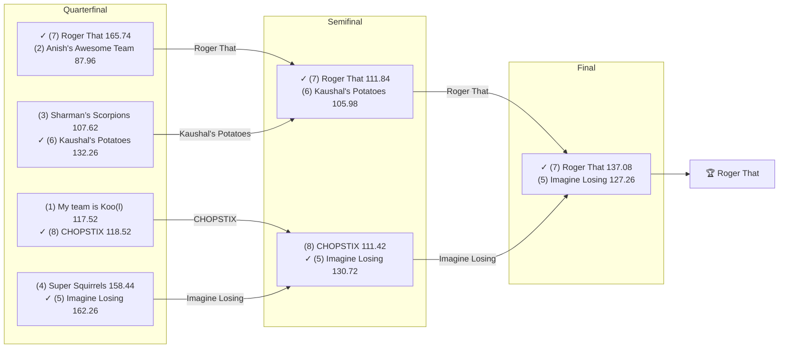

# 🏈 2020 Season

- **Champion:** Roger That
- **Runner-Up:** Imagine Losing
- **Regular Season Top Seed:** My team is Koo(l)
- **Toilet Bowl Winner:** I have Hop(e)

## Final Standings

> Auto-generated from Yahoo. **Finish** is Yahoo's final playoff-adjusted rank, so it does not follow W-L order - a team can win the title from a lower seed. **Playoff Seed** is the seed the team actually entered the playoffs with; - means it did not qualify.

| Finish | Team | Owner | W-L | PF | PA | Playoff Seed |
|--------|------|-------|-----|----|----|--------------|
| 1 | Roger That | Pranav | 6-7 | 1529.92 | 1623.92 | 7 |
| 2 | Imagine Losing | Om | 7-6 | 1515.24 | 1564.58 | 5 |
| 3 | Kaushal's Potatoes | Kaushal | 6-7 | 1636.04 | 1579.58 | 6 |
| 4 | CHOPSTIX | sahil | 2-11 | 1374.98 | 1718.72 | 8 |
| 5 | Anish's Awesome Team | Anish | 9-4 | 1635.98 | 1576.34 | 2 |
| 6 | My team is Koo(l) | lokesh | 9-4 | 1783.6 | 1593.36 | 1 |
| 7 | Sharman’s Scorpions | Sharman | 8-5 | 1732.96 | 1522.1 | 3 |
| 7 | Aryan's Amazing Team | Aryan | 6-7 | 1538.1 | 1652.8 | - |
| 8 | Super Squirrels | Super | 8-5 | 1635.56 | 1452.18 | 4 |
| 9 | I have Hop(e) | Naren | 4-9 | 1548.58 | 1647.38 | - |

## Playoff Bracket

> The actual championship bracket, from captured weekly matchups. Seeds in parentheses; ✓ marks the winner. Consolation games are excluded, and a team that appears first in a later round had a bye.

## Team Rosters

| Team | Post-Draft Roster | End-of-Season Roster |
|------|-------------------|----------------------|

## Awards

- 🏆 **League Champion:** Roger That
- 💥 **Highest Single-Week Score:** _TBD_
- 📉 **Lowest Single-Week Score:** _TBD_
- 🔥 **Biggest Bust:** _TBD_
- 🎯 **Best Draft Pick:** _TBD_
- 🍗 **"Poultry Controversy" Nominee:** _TBD_

## The Story of the Year

_TBD - add the defining moments._

## Related

- [Seasons](index.md) · [2020 Draft](../draft/2020-draft.md) · [Teams](../teams/index.md) · [Records](../records/index.md) · Lore · [Playoffs](../playoffs.md)
