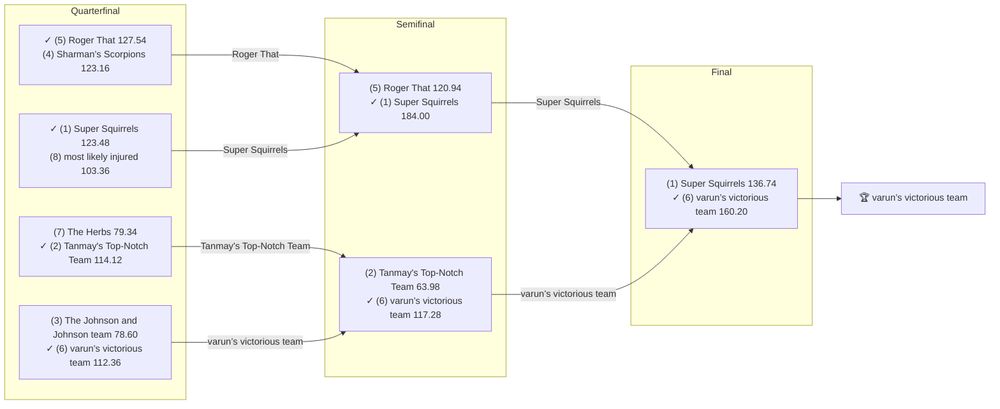

# 🏈 2021 Season

- **Champion:** varun’s victorious team
- **Runner-Up:** Super Squirrels
- **Regular Season Top Seed:** Super Squirrels
- **Toilet Bowl Winner:** Michael's Marvelous Team

## Final Standings

> Auto-generated from Yahoo. **Finish** is Yahoo's final playoff-adjusted rank, so it does not follow W-L order - a team can win the title from a lower seed. **Playoff Seed** is the seed the team actually entered the playoffs with; - means it did not qualify.

| Finish | Team | Owner | W-L | PF | PA | Playoff Seed |
|--------|------|-------|-----|----|----|--------------|
| 1 | varun’s victorious team | Varun | 6-8 | 1807.58 | 1799.58 | 6 |
| 2 | Super Squirrels | Super | 11-3 | 1980.66 | 1752.36 | 1 |
| 3 | Roger That | Pranav | 7-7 | 1680.32 | 1643.08 | 5 |
| 4 | Tanmay's Top-Notch Team | Tanmay | 8-6 | 1785.16 | 1642.12 | 2 |
| 5 | The Herbs | Naren | 6-8 | 1772.12 | 1688.02 | 7 |
| 6 | most likely injured | Aneesh | 6-8 | 1686.7 | 1794.56 | 8 |
| 7 | The Johnson and Johnson team | lokesh | 8-6 | 1727.72 | 1760.48 | 3 |
| 8 | Sharman’s Scorpions | Sharman | 8-6 | 1691.44 | 1778.26 | 4 |
| 9 | Anish's Awesome Team | Anish | 6-8 | 1629.4 | 1731.14 | - |
| 10 | Michael's Marvelous Team | Michael | 4-10 | 1607.88 | 1779.38 | - |

## Playoff Bracket

> The actual championship bracket, from captured weekly matchups. Seeds in parentheses; ✓ marks the winner. Consolation games are excluded, and a team that appears first in a later round had a bye.

## Team Rosters

| Team | Post-Draft Roster | End-of-Season Roster |
|------|-------------------|----------------------|

## Awards

- 🏆 **League Champion:** varun’s victorious team
- 💥 **Highest Single-Week Score:** _TBD_
- 📉 **Lowest Single-Week Score:** _TBD_
- 🔥 **Biggest Bust:** _TBD_
- 🎯 **Best Draft Pick:** _TBD_
- 🍗 **"Poultry Controversy" Nominee:** _TBD_

## The Story of the Year

_TBD - add the defining moments._

## Related

- [Seasons](index.md) · [2021 Draft](../draft/2021-draft.md) · [Teams](../teams/index.md) · [Records](../records/index.md) · Lore · [Playoffs](../playoffs.md)
