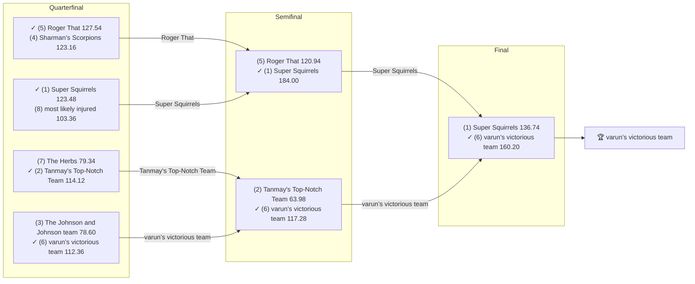

# 🏈 2021 Season

- **Champion:** varun’s victorious team
- **Runner-Up:** Super Squirrels
- **Regular Season Top Seed:** Super Squirrels
- **Toilet Bowl Winner:** Michael's Marvelous Team

## Final Standings

> Auto-generated from Yahoo. **Finish** is Yahoo's final playoff-adjusted rank, so it does not follow W-L order - a team can win the title from a lower seed. **Playoff Seed** is the seed the team actually entered the playoffs with; - means it did not qualify.

| Finish | Team | Owner | W-L | PF | PA | Playoff Seed |
|--------|------|-------|-----|----|----|--------------|
| 1 | varun’s victorious team | Varun | 6-8 | 1807.58 | 1799.58 | 6 |
| 2 | Super Squirrels | Super | 11-3 | 1980.66 | 1752.36 | 1 |
| 3 | Roger That | Pranav | 7-7 | 1680.32 | 1643.08 | 5 |
| 4 | Tanmay's Top-Notch Team | Tanmay | 8-6 | 1785.16 | 1642.12 | 2 |
| 5 | The Herbs | Naren | 6-8 | 1772.12 | 1688.02 | 7 |
| 6 | most likely injured | Aneesh | 6-8 | 1686.7 | 1794.56 | 8 |
| 7 | The Johnson and Johnson team | lokesh | 8-6 | 1727.72 | 1760.48 | 3 |
| 8 | Sharman’s Scorpions | Sharman | 8-6 | 1691.44 | 1778.26 | 4 |
| 9 | Anish's Awesome Team | Anish | 6-8 | 1629.4 | 1731.14 | - |
| 10 | Michael's Marvelous Team | Michael | 4-10 | 1607.88 | 1779.38 | - |

## Playoff Bracket

> The actual championship bracket, from captured weekly matchups. Seeds in parentheses; ✓ marks the winner. Consolation games are excluded, and a team that appears first in a later round had a bye.

## Team Rosters

> Post-draft and end-of-season lineups as Yahoo recorded them. Bench and IR rows are included; points are that week's score.

??? note "varun’s victorious team"
    **Post-draft - week 1**

    | Slot | Player | Pos | Pts |
    |------|--------|-----|-----|
    | QB | Tom Brady | QB | 29.16 |
    | RB | Jonathan Taylor | RB | 17.60 |
    | RB | Clyde Edwards-Helaire | RB | 10.20 |
    | WR | DJ Moore | WR | 16.30 |
    | WR | Terry McLaurin | WR | 10.20 |
    | TE | Mark Andrews | TE | 5.00 |
    | W/R/T | Michael Gallup | WR | 7.60 |
    | K | Harrison Butker | K | 10.00 |
    | DEF | Rams | DEF | 8.00 |
    | BN | Jamaal Williams | RB | 25.00 |
    | BN | Trevor Lawrence | QB | 22.08 |
    | BN | Ja'Marr Chase | WR | 20.90 |
    | BN | Saints | DEF | 15.00 |
    | BN | Saquon Barkley | RB | 3.70 |
    | BN | Mike Gesicki | TE | 0.00 |

    **End of season - week 17**

    | Slot | Player | Pos | Pts |
    |------|--------|-----|-----|
    | QB | Tom Brady | QB | 27.40 |
    | RB | Jonathan Taylor | RB | 18.40 |
    | RB | Saquon Barkley | RB | 10.20 |
    | WR | Terry McLaurin | WR | 13.10 |
    | WR | Michael Gallup | WR | 12.60 |
    | TE | Mark Andrews | TE | 14.90 |
    | W/R/T | Ja'Marr Chase | WR | 55.60 |
    | K | Harrison Butker | K | 7.00 |
    | DEF | Cowboys | DEF | 1.00 |
    | BN | Chris Boswell | K | 17.00 |
    | BN | Rams | DEF | 13.00 |
    | BN | Trevor Lawrence | QB | 10.32 |
    | BN | Mike Gesicki | TE | 9.10 |
    | BN | DJ Moore | WR | 5.90 |
    | BN | Clyde Edwards-Helaire | RB | 0.00 |

??? note "Super Squirrels"
    **Post-draft - week 1**

    | Slot | Player | Pos | Pts |
    |------|--------|-----|-----|
    | QB | Russell Wilson | QB | 27.06 |
    | RB | Dalvin Cook | RB | 20.40 |
    | RB | Najee Harris | RB | 5.90 |
    | WR | Cooper Kupp | WR | 23.80 |
    | WR | Chris Godwin Jr. | WR | 23.50 |
    | TE | Tyler Higbee | TE | 11.80 |
    | W/R/T | Joe Mixon | RB | 25.00 |
    | K | Justin Tucker | K | 11.00 |
    | DEF | Commanders | DEF | 7.00 |
    | BN | Deebo Samuel Sr. | WR | 31.90 |
    | BN | Joe Burrow | QB | 18.64 |
    | BN | Kenyan Drake | RB | 12.00 |
    | BN | Colts | DEF | 4.00 |
    | BN | AJ Dillon | RB | 3.60 |
    | BN | Evan Engram | TE | 0.00 |

    **End of season - week 17**

    | Slot | Player | Pos | Pts |
    |------|--------|-----|-----|
    | QB | Joe Burrow | QB | 34.84 |
    | RB | Joe Mixon | RB | 15.60 |
    | RB | Dalvin Cook | RB | 4.30 |
    | WR | Cooper Kupp | WR | 21.50 |
    | WR | Deebo Samuel Sr. | WR | 17.20 |
    | TE | Dallas Goedert | TE | 13.10 |
    | W/R/T | Jaylen Waddle | WR | 9.20 |
    | K | Justin Tucker | K | 15.00 |
    | DEF | Eagles | DEF | 6.00 |
    | BN | Najee Harris | RB | 29.60 |
    | BN | Tyler Higbee | TE | 12.90 |
    | BN | Michael Badgley | K | 10.00 |
    | BN | Craig Reynolds | RB | 2.30 |
    | BN | Myles Gaskin | RB | 2.30 |
    | BN | Marquez Valdes-Scantling | WR | 1.30 |

??? note "Roger That"
    **Post-draft - week 1**

    | Slot | Player | Pos | Pts |
    |------|--------|-----|-----|
    | QB | Lamar Jackson | QB | 18.00 |
    | RB | Melvin Gordon III | RB | 20.80 |
    | RB | David Montgomery | RB | 18.80 |
    | WR | CeeDee Lamb | WR | 24.60 |
    | WR | Davante Adams | WR | 10.60 |
    | TE | Travis Kelce | TE | 25.60 |
    | W/R/T | Julio Jones | WR | 5.90 |
    | K | Greg Zuerlein | K | 12.00 |
    | DEF | Jaguars | DEF | -3.00 |
    | BN | JuJu Smith-Schuster | WR | 9.20 |
    | BN | Phillip Lindsay | RB | 8.50 |
    | BN | Hunter Henry | TE | 6.10 |
    | BN | Courtland Sutton | WR | 2.40 |
    | BN | Ryan Fitzpatrick | QB | 0.72 |
    | IR | Irv Smith Jr. | TE | 0.00 |
    | BN | Trey Sermon | RB | 0.00 |

    **End of season - week 17**

    | Slot | Player | Pos | Pts |
    |------|--------|-----|-----|
    | QB | Tua Tagovailoa | QB | 5.30 |
    | RB | Boston Scott | RB | 24.60 |
    | RB | Duke Johnson | RB | 8.50 |
    | WR | Russell Gage Jr. | WR | 8.00 |
    | WR | Isaiah McKenzie | WR | 1.90 |
    | TE | Dalton Schultz | TE | 11.40 |
    | W/R/T | Rashaad Penny | RB | 32.50 |
    | K | Matt Prater | K | 15.00 |
    | DEF | Bears | DEF | 21.00 |
    | BN | Davante Adams | WR | 30.60 |
    | BN | Russell Wilson | QB | 27.84 |
    | BN | David Montgomery | RB | 21.10 |
    | BN | Travis Kelce | TE | 13.40 |
    | BN | CeeDee Lamb | WR | 9.60 |
    | IR | Julio Jones | WR | 0.00 |
    | BN | Lamar Jackson | QB | 0.00 |

??? note "Tanmay's Top-Notch Team"
    **Post-draft - week 1**

    | Slot | Player | Pos | Pts |
    |------|--------|-----|-----|
    | QB | Aaron Rodgers | QB | 3.32 |
    | RB | Austin Ekeler | RB | 11.70 |
    | RB | James Robinson | RB | 8.40 |
    | WR | Tyreek Hill | WR | 37.10 |
    | WR | Adam Thielen | WR | 30.20 |
    | TE | George Kittle | TE | 11.80 |
    | W/R/T | Chase Claypool | WR | 10.00 |
    | K | Jason Myers | K | 4.00 |
    | DEF | Patriots | DEF | 5.00 |
    | BN | DeVonta Smith | WR | 19.10 |
    | BN | Damien Harris | RB | 11.70 |
    | BN | Leonard Fournette | RB | 10.90 |
    | BN | Kenny Golladay | WR | 10.40 |
    | BN | Michael Carter | RB | 3.00 |
    | BN | Marquez Callaway | WR | 2.40 |

    **End of season - week 17**

    | Slot | Player | Pos | Pts |
    |------|--------|-----|-----|
    | QB | Aaron Rodgers | QB | 20.32 |
    | RB | Alvin Kamara | RB | 21.00 |
    | RB | Melvin Gordon III | RB | 10.20 |
    | WR | Tyreek Hill | WR | 10.20 |
    | WR | Adam Thielen | WR | 0.00 |
    | TE | George Kittle | TE | 4.50 |
    | W/R/T | Chase Claypool | WR | 4.70 |
    | K | Greg Zuerlein | K | 2.00 |
    | DEF | Seahawks | DEF | 5.00 |
    | BN | Austin Ekeler | RB | 20.20 |
    | BN | Damien Harris | RB | 17.70 |
    | BN | Derek Carr | QB | 12.20 |
    | BN | Jarvis Landry | WR | 8.90 |
    | BN | DeVonta Smith | WR | 8.40 |
    | BN | Bills | DEF | 8.00 |

??? note "The Herbs"
    **Post-draft - week 1**

    | Slot | Player | Pos | Pts |
    |------|--------|-----|-----|
    | QB | Justin Herbert | QB | 14.38 |
    | RB | Christian McCaffrey | RB | 27.70 |
    | RB | Miles Sanders | RB | 17.30 |
    | WR | DK Metcalf | WR | 16.00 |
    | WR | Justin Jefferson | WR | 12.54 |
    | TE | Kyle Pitts Sr. | TE | 7.10 |
    | W/R/T | Tyler Boyd | WR | 6.20 |
    | K | Jason Sanders | K | 6.00 |
    | DEF | Steelers | DEF | 14.00 |
    | BN | Rob Gronkowski | TE | 29.00 |
    | BN | Kirk Cousins | QB | 22.04 |
    | BN | Kareem Hunt | RB | 17.10 |
    | BN | Nyheim Miller-Hines | RB | 14.90 |
    | BN | Laviska Shenault Jr. | WR | 12.90 |
    | IR | Michael Thomas | WR | 0.00 |
    | BN | Odell Beckham Jr. | WR | 0.00 |

    **End of season - week 17**

    | Slot | Player | Pos | Pts |
    |------|--------|-----|-----|
    | QB | Justin Herbert | QB | 17.68 |
    | RB | Elijah Mitchell | RB | 21.00 |
    | RB | Sony Michel | RB | 18.90 |
    | WR | Odell Beckham Jr. | WR | 14.90 |
    | WR | Justin Jefferson | WR | 11.80 |
    | TE | Rob Gronkowski | TE | 18.50 |
    | W/R/T | Amon-Ra St. Brown | WR | 35.40 |
    | K | Nick Folk | K | 9.00 |
    | DEF | Colts | DEF | 6.00 |
    | BN | DK Metcalf | WR | 30.90 |
    | BN | Devin Singletary | RB | 23.00 |
    | BN | D'Onta Foreman | RB | 19.20 |
    | BN | Cordarrelle Patterson | WR | 9.50 |
    | BN | Kyle Pitts Sr. | TE | 8.90 |
    | IR | Christian McCaffrey | RB | 0.00 |
    | BN | Kareem Hunt | RB | 0.00 |

??? note "most likely injured"
    **Post-draft - week 1**

    | Slot | Player | Pos | Pts |
    |------|--------|-----|-----|
    | QB | Ryan Tannehill | QB | 15.18 |
    | RB | D'Andre Swift | RB | 24.40 |
    | RB | Aaron Jones Sr. | RB | 4.20 |
    | WR | Stefon Diggs | WR | 15.90 |
    | WR | Allen Robinson | WR | 9.50 |
    | TE | Robert Tonyan | TE | 2.80 |
    | W/R/T | Robert Woods | WR | 12.40 |
    | K | Matt Gay | K | 12.00 |
    | DEF | Buccaneers | DEF | 2.00 |
    | BN | Dak Prescott | QB | 28.42 |
    | BN | Hollywood Brown | WR | 19.40 |
    | BN | Jarvis Landry | WR | 19.40 |
    | BN | DJ Chark | WR | 17.60 |
    | BN | Chase Edmonds | RB | 14.60 |
    | BN | Devin Singletary | RB | 11.00 |

    **End of season - week 17**

    | Slot | Player | Pos | Pts |
    |------|--------|-----|-----|
    | QB | Dak Prescott | QB | 23.04 |
    | RB | Dare Ogunbowale | RB | 14.80 |
    | RB | Chase Edmonds | RB | 13.20 |
    | WR | Diontae Johnson | WR | 17.10 |
    | WR | Keenan Allen | WR | 14.40 |
    | TE | Zach Ertz | TE | 11.10 |
    | W/R/T | Brandon Aiyuk | WR | 15.60 |
    | K | Greg Joseph | K | 6.00 |
    | DEF | Buccaneers | DEF | 3.00 |
    | BN | Darrel Williams | RB | 25.70 |
    | BN | Taysom Hill | QB | 17.38 |
    | BN | Justin Jackson | RB | 9.10 |
    | BN | 49ers | DEF | 9.00 |
    | BN | Hollywood Brown | WR | 3.80 |
    | IR | James Robinson | RB | 0.00 |
    | BN | Jeff Wilson Jr. | RB | 0.00 |
    | IR | Leonard Fournette | RB | 0.00 |

??? note "The Johnson and Johnson team"
    **Post-draft - week 1**

    | Slot | Player | Pos | Pts |
    |------|--------|-----|-----|
    | QB | Jalen Hurts | QB | 28.76 |
    | RB | Josh Jacobs | RB | 17.00 |
    | RB | Derrick Henry | RB | 10.70 |
    | WR | Keenan Allen | WR | 19.00 |
    | WR | Brandon Aiyuk | WR | 0.70 |
    | TE | Darren Waller | TE | 26.50 |
    | W/R/T | Jerry Jeudy | WR | 13.20 |
    | K | Tyler Bass | K | 11.00 |
    | DEF | Panthers | DEF | 9.00 |
    | BN | Mike Williams | WR | 22.20 |
    | BN | Josh Allen | QB | 17.20 |
    | BN | Dallas Goedert | TE | 14.20 |
    | BN | Zack Moss | RB | 0.00 |
    | BN | Ronald Jones | RB | -0.60 |
    | BN | Packers | DEF | -4.00 |

    **End of season - week 17**

    | Slot | Player | Pos | Pts |
    |------|--------|-----|-----|
    | QB | Josh Allen | QB | 23.90 |
    | RB | Aaron Jones Sr. | RB | 15.60 |
    | RB | Ronald Jones | RB | 3.70 |
    | WR | Hunter Renfrow | WR | 27.00 |
    | WR | Darnell Mooney | WR | 19.90 |
    | TE | Gerald Everett | TE | 6.60 |
    | W/R/T | Mike Williams | WR | 15.30 |
    | K | Tyler Bass | K | 3.00 |
    | DEF | Patriots | DEF | 12.00 |
    | BN | Jalen Hurts | QB | 12.96 |
    | BN | A.J. Green | WR | 10.40 |
    | BN | Van Jefferson | WR | 10.30 |
    | BN | Michael Carter | RB | 7.30 |
    | BN | Gabe Davis | WR | 7.00 |
    | BN | Darren Waller | TE | 0.00 |
    | IR | Derrick Henry | RB | 0.00 |

??? note "Sharman’s Scorpions"
    **Post-draft - week 1**

    | Slot | Player | Pos | Pts |
    |------|--------|-----|-----|
    | QB | Matthew Stafford | QB | 24.34 |
    | RB | Antonio Gibson | RB | 11.80 |
    | RB | Ezekiel Elliott | RB | 5.90 |
    | WR | Tyler Lockett | WR | 26.00 |
    | WR | A.J. Brown | WR | 14.90 |
    | TE | Noah Fant | TE | 12.20 |
    | W/R/T | Tee Higgins | WR | 15.80 |
    | K | Ryan Succop | K | 7.00 |
    | DEF | 49ers | DEF | 10.00 |
    | BN | Darrell Henderson Jr. | RB | 15.70 |
    | BN | Jonnu Smith | TE | 9.80 |
    | BN | Matt Ryan | QB | 7.36 |
    | BN | Chargers | DEF | 4.00 |
    | BN | Raheem Mostert | RB | 2.00 |
    | BN | Boston Scott | RB | 0.00 |

    **End of season - week 17**

    | Slot | Player | Pos | Pts |
    |------|--------|-----|-----|
    | QB | Matthew Stafford | QB | 16.26 |
    | RB | Ezekiel Elliott | RB | 4.00 |
    | RB | Antonio Gibson | RB | 0.00 |
    | WR | Christian Kirk | WR | 13.40 |
    | WR | Tyler Lockett | WR | 12.10 |
    | TE | Noah Fant | TE | 21.20 |
    | W/R/T | Tony Pollard | RB | 8.80 |
    | K | Daniel Carlson | K | 13.00 |
    | DEF | Dolphins | DEF | 0.00 |
    | BN | Jakobi Meyers | WR | 21.30 |
    | BN | Saints | DEF | 15.00 |
    | BN | Pat Freiermuth | TE | 7.20 |
    | BN | Cole Beasley | WR | 6.20 |
    | IR | A.J. Brown | WR | 6.10 |
    | BN | Darrell Henderson Jr. | RB | 0.00 |
    | BN | Dawson Knox | TE | 0.00 |

??? note "Anish's Awesome Team"
    **Post-draft - week 1**

    | Slot | Player | Pos | Pts |
    |------|--------|-----|-----|
    | QB | Patrick Mahomes | QB | 33.28 |
    | RB | Nick Chubb | RB | 22.10 |
    | RB | Mike Davis | RB | 10.20 |
    | WR | Calvin Ridley | WR | 10.10 |
    | WR | Mike Evans | WR | 5.40 |
    | TE | T.J. Hockenson | TE | 25.70 |
    | W/R/T | Brandin Cooks | WR | 18.20 |
    | K | Robbie Gould | K | 14.00 |
    | DEF | Broncos | DEF | 8.00 |
    | BN | Corey Davis | WR | 26.70 |
    | BN | Robbie Chosen | WR | 12.70 |
    | BN | Myles Gaskin | RB | 12.60 |
    | BN | Jakobi Meyers | WR | 10.40 |
    | BN | Latavius Murray | RB | 8.80 |
    | BN | James Conner | RB | 5.30 |

    **End of season - week 17**

    | Slot | Player | Pos | Pts |
    |------|--------|-----|-----|
    | QB | Patrick Mahomes | QB | 20.86 |
    | RB | Devonta Freeman | RB | 8.70 |
    | RB | James Conner | RB | 0.00 |
    | WR | Michael Pittman Jr. | WR | 10.70 |
    | WR | DeVante Parker | WR | 8.60 |
    | TE | Austin Hooper | TE | 4.80 |
    | W/R/T | Nick Chubb | RB | 5.80 |
    | K | Matt Gay | K | 2.00 |
    | DEF | Chiefs | DEF | 3.00 |
    | BN | Brandin Cooks | WR | 19.60 |
    | BN | Mike Evans | WR | 14.70 |
    | BN | K.J. Osborn | WR | 14.00 |
    | BN | Devin Duvernay | WR | 6.50 |
    | IR | Calvin Ridley | WR | 0.00 |
    | BN | Jermar Jefferson | RB | 0.00 |
    | BN | T.J. Hockenson | TE | 0.00 |

??? note "Michael's Marvelous Team"
    **Post-draft - week 1**

    | Slot | Player | Pos | Pts |
    |------|--------|-----|-----|
    | QB | Kyler Murray | QB | 34.56 |
    | RB | Alvin Kamara | RB | 18.10 |
    | RB | Chris Carson | RB | 12.70 |
    | WR | Amari Cooper | WR | 38.90 |
    | WR | DeAndre Hopkins | WR | 26.30 |
    | TE | Logan Thomas | TE | 12.00 |
    | W/R/T | Diontae Johnson | WR | 14.60 |
    | K | Younghoe Koo | K | 6.00 |
    | DEF | Browns | DEF | 1.00 |
    | BN | Antonio Brown | WR | 23.70 |
    | BN | Ty'Son Williams | RB | 18.40 |
    | BN | Mecole Hardman Jr. | WR | 5.60 |
    | BN | Javonte Williams | RB | 5.10 |
    | BN | Sony Michel | RB | 0.20 |
    | BN | Will Fuller V | WR | 0.00 |

    **End of season - week 17**

    | Slot | Player | Pos | Pts |
    |------|--------|-----|-----|
    | QB | Kyler Murray | QB | 22.92 |
    | RB | Josh Jacobs | RB | 18.00 |
    | RB | Javonte Williams | RB | 4.20 |
    | WR | Stefon Diggs | WR | 10.20 |
    | WR | Tee Higgins | WR | 9.20 |
    | TE | Cole Kmet | TE | 5.50 |
    | W/R/T | Amari Cooper | WR | 10.80 |
    | K | Dustin Hopkins | K | 10.00 |
    | DEF | Texans | DEF | 3.00 |
    | BN | AJ Dillon | RB | 22.30 |
    | BN | Rashod Bateman | WR | 12.80 |
    | IR | D'Andre Swift | RB | 5.90 |
    | BN | Antonio Brown | WR | 5.60 |
    | BN | Alexander Mattison | RB | 5.30 |
    | BN | DeAndre Hopkins | WR | 0.00 |
    | BN | Kirk Cousins | QB | 0.00 |

## Awards

- 🏆 **League Champion:** varun’s victorious team
- 💥 **Highest Single-Week Score:** Roger That - 196.28 (Wk 5)
- 📉 **Lowest Single-Week Score:** Tanmay's Top-Notch Team - 63.98 (Wk 16)
- 🔥 **Biggest Bust:** Christian McCaffrey (RB) - drafted by [The Herbs](../teams/the-herbs.md) at pick 1, finished -24 spots at the position, 127.50 pts
- 🎯 **Best Draft Pick:** Davante Adams (WR) - drafted by [Roger That](../teams/roger-that.md) at pick 8, finished +37 spots at the position, 332.80 pts
- 🍗 **"Poultry Controversy" Nominee:** _TBD_

> Best Draft Pick and Biggest Bust are computed, not voted: within each position, the gap between where a player was drafted and where they finished on season points. Bust is restricted to rounds 1-3.

## The Story of the Year

_TBD - add the defining moments._

## Related

- [Seasons](index.md) · [2021 Draft](../draft/2021-draft.md) · [Teams](../teams/index.md) · [Records](../records/index.md) · Lore · [Playoffs](../playoffs.md)
