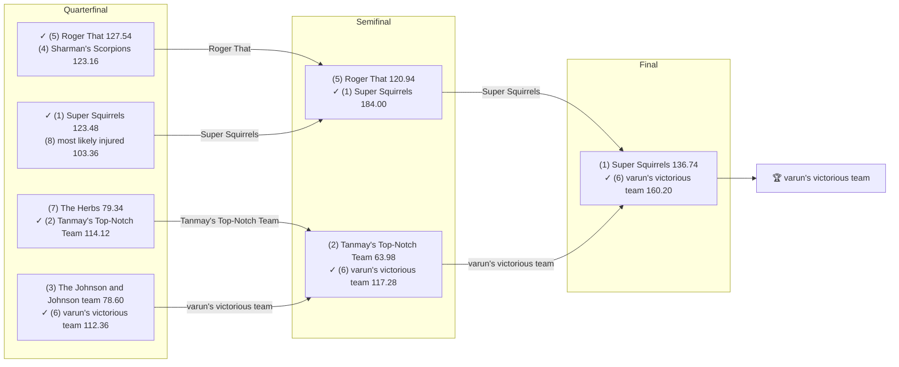

# 2021 Season

- **Champion:** [varun's victorious team](../owners/varun.md)
- **Runner-Up:** [Super Squirrels](../owners/abhinav.md)
- **Regular Season Top Seed:** [Super Squirrels](../owners/abhinav.md)
- **Toilet Bowl Winner:** [Michael's Marvelous Team](../owners/michael.md)

## Final Standings

**Finish** is the final playoff-adjusted rank, not W-L order. **Playoff Seed** is the seed the team entered the playoffs with; a dash means it did not qualify.

| Finish | Team | Owner | W-L | PF | PA | Playoff Seed |
|--------|------|-------|-----|----|----|--------------|
| 1 | varun's victorious team | Varun | 6-8 | 1807.58 | 1799.58 | 6 |
| 2 | Super Squirrels | Abhinav | 11-3 | 1980.66 | 1752.36 | 1 |
| 3 | Roger That | Pranav | 7-7 | 1680.32 | 1643.08 | 5 |
| 4 | Tanmay's Top-Notch Team | Tanmay | 8-6 | 1785.16 | 1642.12 | 2 |
| 5 | The Herbs | Naren | 6-8 | 1772.12 | 1688.02 | 7 |
| 6 | most likely injured | Aneesh | 6-8 | 1686.7 | 1794.56 | 8 |
| 7 | The Johnson and Johnson team | Lokesh | 8-6 | 1727.72 | 1760.48 | 3 |
| 8 | Sharman's Scorpions | Sharman | 8-6 | 1691.44 | 1778.26 | 4 |
| 9 | Anish's Awesome Team | Anish | 6-8 | 1629.4 | 1731.14 | - |
| 10 | Michael's Marvelous Team | Michael | 4-10 | 1607.88 | 1779.38 | - |

## Playoff Bracket

Seeds in parentheses; ✓ marks the winner. Consolation games are excluded; a team appearing first in a later round had a bye.

## Team Rosters

Post-draft and end-of-season lineups as the league's platform recorded them. Bench and IR rows are included; points are that week's score.

??? note "varun's victorious team"
    **Post-draft - week 1**

    | Slot | Player | Pos | Pts |
    |------|--------|-----|-----|
    | QB | [Tom Brady](../players/tom-brady.md) | QB | 29.16 |
    | RB | [Jonathan Taylor](../players/jonathan-taylor.md) | RB | 17.60 |
    | RB | [Clyde Edwards-Helaire](../players/clyde-edwards-helaire.md) | RB | 10.20 |
    | WR | [DJ Moore](../players/dj-moore.md) | WR | 16.30 |
    | WR | [Terry McLaurin](../players/terry-mclaurin.md) | WR | 10.20 |
    | TE | [Mark Andrews](../players/mark-andrews.md) | TE | 5.00 |
    | W/R/T | [Michael Gallup](../players/michael-gallup.md) | WR | 7.60 |
    | K | [Harrison Butker](../players/harrison-butker.md) | K | 10.00 |
    | DEF | [Rams](../players/rams.md) | DEF | 8.00 |
    | BN | [Jamaal Williams](../players/jamaal-williams.md) | RB | 25.00 |
    | BN | [Trevor Lawrence](../players/trevor-lawrence.md) | QB | 22.08 |
    | BN | [Ja'Marr Chase](../players/ja-marr-chase.md) | WR | 20.90 |
    | BN | [Saints](../players/saints.md) | DEF | 15.00 |
    | BN | [Saquon Barkley](../players/saquon-barkley.md) | RB | 3.70 |
    | BN | [Mike Gesicki](../players/mike-gesicki.md) | TE | 0.00 |

    **End of season - week 17**

    | Slot | Player | Pos | Pts |
    |------|--------|-----|-----|
    | QB | [Tom Brady](../players/tom-brady.md) | QB | 27.40 |
    | RB | [Jonathan Taylor](../players/jonathan-taylor.md) | RB | 18.40 |
    | RB | [Saquon Barkley](../players/saquon-barkley.md) | RB | 10.20 |
    | WR | [Terry McLaurin](../players/terry-mclaurin.md) | WR | 13.10 |
    | WR | [Michael Gallup](../players/michael-gallup.md) | WR | 12.60 |
    | TE | [Mark Andrews](../players/mark-andrews.md) | TE | 14.90 |
    | W/R/T | [Ja'Marr Chase](../players/ja-marr-chase.md) | WR | 55.60 |
    | K | [Harrison Butker](../players/harrison-butker.md) | K | 7.00 |
    | DEF | [Cowboys](../players/cowboys.md) | DEF | 1.00 |
    | BN | [Chris Boswell](../players/chris-boswell.md) | K | 17.00 |
    | BN | [Rams](../players/rams.md) | DEF | 13.00 |
    | BN | [Trevor Lawrence](../players/trevor-lawrence.md) | QB | 10.32 |
    | BN | [Mike Gesicki](../players/mike-gesicki.md) | TE | 9.10 |
    | BN | [DJ Moore](../players/dj-moore.md) | WR | 5.90 |
    | BN | [Clyde Edwards-Helaire](../players/clyde-edwards-helaire.md) | RB | 0.00 |

??? note "Super Squirrels"
    **Post-draft - week 1**

    | Slot | Player | Pos | Pts |
    |------|--------|-----|-----|
    | QB | [Russell Wilson](../players/russell-wilson.md) | QB | 27.06 |
    | RB | [Dalvin Cook](../players/dalvin-cook.md) | RB | 20.40 |
    | RB | [Najee Harris](../players/najee-harris.md) | RB | 5.90 |
    | WR | [Cooper Kupp](../players/cooper-kupp.md) | WR | 23.80 |
    | WR | [Chris Godwin Jr.](../players/chris-godwin-jr.md) | WR | 23.50 |
    | TE | [Tyler Higbee](../players/tyler-higbee.md) | TE | 11.80 |
    | W/R/T | [Joe Mixon](../players/joe-mixon.md) | RB | 25.00 |
    | K | [Justin Tucker](../players/justin-tucker.md) | K | 11.00 |
    | DEF | [Commanders](../players/commanders.md) | DEF | 7.00 |
    | BN | [Deebo Samuel Sr.](../players/deebo-samuel-sr.md) | WR | 31.90 |
    | BN | [Joe Burrow](../players/joe-burrow.md) | QB | 18.64 |
    | BN | [Kenyan Drake](../players/kenyan-drake.md) | RB | 12.00 |
    | BN | [Colts](../players/colts.md) | DEF | 4.00 |
    | BN | [AJ Dillon](../players/aj-dillon.md) | RB | 3.60 |
    | BN | [Evan Engram](../players/evan-engram.md) | TE | 0.00 |

    **End of season - week 17**

    | Slot | Player | Pos | Pts |
    |------|--------|-----|-----|
    | QB | [Joe Burrow](../players/joe-burrow.md) | QB | 34.84 |
    | RB | [Joe Mixon](../players/joe-mixon.md) | RB | 15.60 |
    | RB | [Dalvin Cook](../players/dalvin-cook.md) | RB | 4.30 |
    | WR | [Cooper Kupp](../players/cooper-kupp.md) | WR | 21.50 |
    | WR | [Deebo Samuel Sr.](../players/deebo-samuel-sr.md) | WR | 17.20 |
    | TE | [Dallas Goedert](../players/dallas-goedert.md) | TE | 13.10 |
    | W/R/T | [Jaylen Waddle](../players/jaylen-waddle.md) | WR | 9.20 |
    | K | [Justin Tucker](../players/justin-tucker.md) | K | 15.00 |
    | DEF | [Eagles](../players/eagles.md) | DEF | 6.00 |
    | BN | [Najee Harris](../players/najee-harris.md) | RB | 29.60 |
    | BN | [Tyler Higbee](../players/tyler-higbee.md) | TE | 12.90 |
    | BN | [Michael Badgley](../players/michael-badgley.md) | K | 10.00 |
    | BN | [Craig Reynolds](../players/craig-reynolds.md) | RB | 2.30 |
    | BN | [Myles Gaskin](../players/myles-gaskin.md) | RB | 2.30 |
    | BN | [Marquez Valdes-Scantling](../players/marquez-valdes-scantling.md) | WR | 1.30 |

??? note "Roger That"
    **Post-draft - week 1**

    | Slot | Player | Pos | Pts |
    |------|--------|-----|-----|
    | QB | [Lamar Jackson](../players/lamar-jackson.md) | QB | 18.00 |
    | RB | [Melvin Gordon III](../players/melvin-gordon-iii.md) | RB | 20.80 |
    | RB | [David Montgomery](../players/david-montgomery.md) | RB | 18.80 |
    | WR | [CeeDee Lamb](../players/ceedee-lamb.md) | WR | 24.60 |
    | WR | [Davante Adams](../players/davante-adams.md) | WR | 10.60 |
    | TE | [Travis Kelce](../players/travis-kelce.md) | TE | 25.60 |
    | W/R/T | [Julio Jones](../players/julio-jones.md) | WR | 5.90 |
    | K | [Greg Zuerlein](../players/greg-zuerlein.md) | K | 12.00 |
    | DEF | [Jaguars](../players/jaguars.md) | DEF | -3.00 |
    | BN | [JuJu Smith-Schuster](../players/juju-smith-schuster.md) | WR | 9.20 |
    | BN | [Phillip Lindsay](../players/phillip-lindsay.md) | RB | 8.50 |
    | BN | [Hunter Henry](../players/hunter-henry.md) | TE | 6.10 |
    | BN | [Courtland Sutton](../players/courtland-sutton.md) | WR | 2.40 |
    | BN | [Ryan Fitzpatrick](../players/ryan-fitzpatrick.md) | QB | 0.72 |
    | IR | [Irv Smith Jr.](../players/irv-smith-jr.md) | TE | 0.00 |
    | BN | [Trey Sermon](../players/trey-sermon.md) | RB | 0.00 |

    **End of season - week 17**

    | Slot | Player | Pos | Pts |
    |------|--------|-----|-----|
    | QB | [Tua Tagovailoa](../players/tua-tagovailoa.md) | QB | 5.30 |
    | RB | [Boston Scott](../players/boston-scott.md) | RB | 24.60 |
    | RB | [Duke Johnson](../players/duke-johnson.md) | RB | 8.50 |
    | WR | [Russell Gage Jr.](../players/russell-gage-jr.md) | WR | 8.00 |
    | WR | [Isaiah McKenzie](../players/isaiah-mckenzie.md) | WR | 1.90 |
    | TE | [Dalton Schultz](../players/dalton-schultz.md) | TE | 11.40 |
    | W/R/T | [Rashaad Penny](../players/rashaad-penny.md) | RB | 32.50 |
    | K | [Matt Prater](../players/matt-prater.md) | K | 15.00 |
    | DEF | [Bears](../players/bears.md) | DEF | 21.00 |
    | BN | [Davante Adams](../players/davante-adams.md) | WR | 30.60 |
    | BN | [Russell Wilson](../players/russell-wilson.md) | QB | 27.84 |
    | BN | [David Montgomery](../players/david-montgomery.md) | RB | 21.10 |
    | BN | [Travis Kelce](../players/travis-kelce.md) | TE | 13.40 |
    | BN | [CeeDee Lamb](../players/ceedee-lamb.md) | WR | 9.60 |
    | IR | [Julio Jones](../players/julio-jones.md) | WR | 0.00 |
    | BN | [Lamar Jackson](../players/lamar-jackson.md) | QB | 0.00 |

??? note "Tanmay's Top-Notch Team"
    **Post-draft - week 1**

    | Slot | Player | Pos | Pts |
    |------|--------|-----|-----|
    | QB | [Aaron Rodgers](../players/aaron-rodgers.md) | QB | 3.32 |
    | RB | [Austin Ekeler](../players/austin-ekeler.md) | RB | 11.70 |
    | RB | [James Robinson](../players/james-robinson.md) | RB | 8.40 |
    | WR | [Tyreek Hill](../players/tyreek-hill.md) | WR | 37.10 |
    | WR | [Adam Thielen](../players/adam-thielen.md) | WR | 30.20 |
    | TE | [George Kittle](../players/george-kittle.md) | TE | 11.80 |
    | W/R/T | [Chase Claypool](../players/chase-claypool.md) | WR | 10.00 |
    | K | [Jason Myers](../players/jason-myers.md) | K | 4.00 |
    | DEF | [Patriots](../players/patriots.md) | DEF | 5.00 |
    | BN | [DeVonta Smith](../players/devonta-smith.md) | WR | 19.10 |
    | BN | [Damien Harris](../players/damien-harris.md) | RB | 11.70 |
    | BN | [Leonard Fournette](../players/leonard-fournette.md) | RB | 10.90 |
    | BN | [Kenny Golladay](../players/kenny-golladay.md) | WR | 10.40 |
    | BN | [Michael Carter](../players/michael-carter.md) | RB | 3.00 |
    | BN | [Marquez Callaway](../players/marquez-callaway.md) | WR | 2.40 |

    **End of season - week 17**

    | Slot | Player | Pos | Pts |
    |------|--------|-----|-----|
    | QB | [Aaron Rodgers](../players/aaron-rodgers.md) | QB | 20.32 |
    | RB | [Alvin Kamara](../players/alvin-kamara.md) | RB | 21.00 |
    | RB | [Melvin Gordon III](../players/melvin-gordon-iii.md) | RB | 10.20 |
    | WR | [Tyreek Hill](../players/tyreek-hill.md) | WR | 10.20 |
    | WR | [Adam Thielen](../players/adam-thielen.md) | WR | 0.00 |
    | TE | [George Kittle](../players/george-kittle.md) | TE | 4.50 |
    | W/R/T | [Chase Claypool](../players/chase-claypool.md) | WR | 4.70 |
    | K | [Greg Zuerlein](../players/greg-zuerlein.md) | K | 2.00 |
    | DEF | [Seahawks](../players/seahawks.md) | DEF | 5.00 |
    | BN | [Austin Ekeler](../players/austin-ekeler.md) | RB | 20.20 |
    | BN | [Damien Harris](../players/damien-harris.md) | RB | 17.70 |
    | BN | [Derek Carr](../players/derek-carr.md) | QB | 12.20 |
    | BN | [Jarvis Landry](../players/jarvis-landry.md) | WR | 8.90 |
    | BN | [DeVonta Smith](../players/devonta-smith.md) | WR | 8.40 |
    | BN | [Bills](../players/bills.md) | DEF | 8.00 |

??? note "The Herbs"
    **Post-draft - week 1**

    | Slot | Player | Pos | Pts |
    |------|--------|-----|-----|
    | QB | [Justin Herbert](../players/justin-herbert.md) | QB | 14.38 |
    | RB | [Christian McCaffrey](../players/christian-mccaffrey.md) | RB | 27.70 |
    | RB | [Miles Sanders](../players/miles-sanders.md) | RB | 17.30 |
    | WR | [DK Metcalf](../players/dk-metcalf.md) | WR | 16.00 |
    | WR | [Justin Jefferson](../players/justin-jefferson.md) | WR | 12.54 |
    | TE | [Kyle Pitts Sr.](../players/kyle-pitts-sr.md) | TE | 7.10 |
    | W/R/T | [Tyler Boyd](../players/tyler-boyd.md) | WR | 6.20 |
    | K | [Jason Sanders](../players/jason-sanders.md) | K | 6.00 |
    | DEF | [Steelers](../players/steelers.md) | DEF | 14.00 |
    | BN | [Rob Gronkowski](../players/rob-gronkowski.md) | TE | 29.00 |
    | BN | [Kirk Cousins](../players/kirk-cousins.md) | QB | 22.04 |
    | BN | [Kareem Hunt](../players/kareem-hunt.md) | RB | 17.10 |
    | BN | [Nyheim Miller-Hines](../players/nyheim-miller-hines.md) | RB | 14.90 |
    | BN | [Laviska Shenault Jr.](../players/laviska-shenault-jr.md) | WR | 12.90 |
    | IR | [Michael Thomas](../players/michael-thomas.md) | WR | 0.00 |
    | BN | [Odell Beckham Jr.](../players/odell-beckham-jr.md) | WR | 0.00 |

    **End of season - week 17**

    | Slot | Player | Pos | Pts |
    |------|--------|-----|-----|
    | QB | [Justin Herbert](../players/justin-herbert.md) | QB | 17.68 |
    | RB | [Elijah Mitchell](../players/elijah-mitchell.md) | RB | 21.00 |
    | RB | [Sony Michel](../players/sony-michel.md) | RB | 18.90 |
    | WR | [Odell Beckham Jr.](../players/odell-beckham-jr.md) | WR | 14.90 |
    | WR | [Justin Jefferson](../players/justin-jefferson.md) | WR | 11.80 |
    | TE | [Rob Gronkowski](../players/rob-gronkowski.md) | TE | 18.50 |
    | W/R/T | [Amon-Ra St. Brown](../players/amon-ra-st-brown.md) | WR | 35.40 |
    | K | [Nick Folk](../players/nick-folk.md) | K | 9.00 |
    | DEF | [Colts](../players/colts.md) | DEF | 6.00 |
    | BN | [DK Metcalf](../players/dk-metcalf.md) | WR | 30.90 |
    | BN | [Devin Singletary](../players/devin-singletary.md) | RB | 23.00 |
    | BN | [D'Onta Foreman](../players/d-onta-foreman.md) | RB | 19.20 |
    | BN | [Cordarrelle Patterson](../players/cordarrelle-patterson.md) | WR | 9.50 |
    | BN | [Kyle Pitts Sr.](../players/kyle-pitts-sr.md) | TE | 8.90 |
    | IR | [Christian McCaffrey](../players/christian-mccaffrey.md) | RB | 0.00 |
    | BN | [Kareem Hunt](../players/kareem-hunt.md) | RB | 0.00 |

??? note "most likely injured"
    **Post-draft - week 1**

    | Slot | Player | Pos | Pts |
    |------|--------|-----|-----|
    | QB | [Ryan Tannehill](../players/ryan-tannehill.md) | QB | 15.18 |
    | RB | [D'Andre Swift](../players/d-andre-swift.md) | RB | 24.40 |
    | RB | [Aaron Jones Sr.](../players/aaron-jones-sr.md) | RB | 4.20 |
    | WR | [Stefon Diggs](../players/stefon-diggs.md) | WR | 15.90 |
    | WR | [Allen Robinson](../players/allen-robinson.md) | WR | 9.50 |
    | TE | [Robert Tonyan](../players/robert-tonyan.md) | TE | 2.80 |
    | W/R/T | [Robert Woods](../players/robert-woods.md) | WR | 12.40 |
    | K | [Matt Gay](../players/matt-gay.md) | K | 12.00 |
    | DEF | [Buccaneers](../players/buccaneers.md) | DEF | 2.00 |
    | BN | [Dak Prescott](../players/dak-prescott.md) | QB | 28.42 |
    | BN | [Hollywood Brown](../players/hollywood-brown.md) | WR | 19.40 |
    | BN | [Jarvis Landry](../players/jarvis-landry.md) | WR | 19.40 |
    | BN | [DJ Chark](../players/dj-chark.md) | WR | 17.60 |
    | BN | [Chase Edmonds](../players/chase-edmonds.md) | RB | 14.60 |
    | BN | [Devin Singletary](../players/devin-singletary.md) | RB | 11.00 |

    **End of season - week 17**

    | Slot | Player | Pos | Pts |
    |------|--------|-----|-----|
    | QB | [Dak Prescott](../players/dak-prescott.md) | QB | 23.04 |
    | RB | [Dare Ogunbowale](../players/dare-ogunbowale.md) | RB | 14.80 |
    | RB | [Chase Edmonds](../players/chase-edmonds.md) | RB | 13.20 |
    | WR | [Diontae Johnson](../players/diontae-johnson.md) | WR | 17.10 |
    | WR | [Keenan Allen](../players/keenan-allen.md) | WR | 14.40 |
    | TE | [Zach Ertz](../players/zach-ertz.md) | TE | 11.10 |
    | W/R/T | [Brandon Aiyuk](../players/brandon-aiyuk.md) | WR | 15.60 |
    | K | [Greg Joseph](../players/greg-joseph.md) | K | 6.00 |
    | DEF | [Buccaneers](../players/buccaneers.md) | DEF | 3.00 |
    | BN | [Darrel Williams](../players/darrel-williams.md) | RB | 25.70 |
    | BN | [Taysom Hill](../players/taysom-hill.md) | QB | 17.38 |
    | BN | [Justin Jackson](../players/justin-jackson.md) | RB | 9.10 |
    | BN | [49ers](../players/49ers.md) | DEF | 9.00 |
    | BN | [Hollywood Brown](../players/hollywood-brown.md) | WR | 3.80 |
    | IR | [James Robinson](../players/james-robinson.md) | RB | 0.00 |
    | BN | [Jeff Wilson Jr.](../players/jeff-wilson-jr.md) | RB | 0.00 |
    | IR | [Leonard Fournette](../players/leonard-fournette.md) | RB | 0.00 |

??? note "The Johnson and Johnson team"
    **Post-draft - week 1**

    | Slot | Player | Pos | Pts |
    |------|--------|-----|-----|
    | QB | [Jalen Hurts](../players/jalen-hurts.md) | QB | 28.76 |
    | RB | [Josh Jacobs](../players/josh-jacobs.md) | RB | 17.00 |
    | RB | [Derrick Henry](../players/derrick-henry.md) | RB | 10.70 |
    | WR | [Keenan Allen](../players/keenan-allen.md) | WR | 19.00 |
    | WR | [Brandon Aiyuk](../players/brandon-aiyuk.md) | WR | 0.70 |
    | TE | [Darren Waller](../players/darren-waller.md) | TE | 26.50 |
    | W/R/T | [Jerry Jeudy](../players/jerry-jeudy.md) | WR | 13.20 |
    | K | [Tyler Bass](../players/tyler-bass.md) | K | 11.00 |
    | DEF | [Panthers](../players/panthers.md) | DEF | 9.00 |
    | BN | [Mike Williams](../players/mike-williams.md) | WR | 22.20 |
    | BN | [Josh Allen](../players/josh-allen.md) | QB | 17.20 |
    | BN | [Dallas Goedert](../players/dallas-goedert.md) | TE | 14.20 |
    | BN | [Zack Moss](../players/zack-moss.md) | RB | 0.00 |
    | BN | [Ronald Jones](../players/ronald-jones.md) | RB | -0.60 |
    | BN | [Packers](../players/packers.md) | DEF | -4.00 |

    **End of season - week 17**

    | Slot | Player | Pos | Pts |
    |------|--------|-----|-----|
    | QB | [Josh Allen](../players/josh-allen.md) | QB | 23.90 |
    | RB | [Aaron Jones Sr.](../players/aaron-jones-sr.md) | RB | 15.60 |
    | RB | [Ronald Jones](../players/ronald-jones.md) | RB | 3.70 |
    | WR | [Hunter Renfrow](../players/hunter-renfrow.md) | WR | 27.00 |
    | WR | [Darnell Mooney](../players/darnell-mooney.md) | WR | 19.90 |
    | TE | [Gerald Everett](../players/gerald-everett.md) | TE | 6.60 |
    | W/R/T | [Mike Williams](../players/mike-williams.md) | WR | 15.30 |
    | K | [Tyler Bass](../players/tyler-bass.md) | K | 3.00 |
    | DEF | [Patriots](../players/patriots.md) | DEF | 12.00 |
    | BN | [Jalen Hurts](../players/jalen-hurts.md) | QB | 12.96 |
    | BN | [A.J. Green](../players/a-j-green.md) | WR | 10.40 |
    | BN | [Van Jefferson](../players/van-jefferson.md) | WR | 10.30 |
    | BN | [Michael Carter](../players/michael-carter.md) | RB | 7.30 |
    | BN | [Gabe Davis](../players/gabe-davis.md) | WR | 7.00 |
    | BN | [Darren Waller](../players/darren-waller.md) | TE | 0.00 |
    | IR | [Derrick Henry](../players/derrick-henry.md) | RB | 0.00 |

??? note "Sharman's Scorpions"
    **Post-draft - week 1**

    | Slot | Player | Pos | Pts |
    |------|--------|-----|-----|
    | QB | [Matthew Stafford](../players/matthew-stafford.md) | QB | 24.34 |
    | RB | [Antonio Gibson](../players/antonio-gibson.md) | RB | 11.80 |
    | RB | [Ezekiel Elliott](../players/ezekiel-elliott.md) | RB | 5.90 |
    | WR | [Tyler Lockett](../players/tyler-lockett.md) | WR | 26.00 |
    | WR | [A.J. Brown](../players/a-j-brown.md) | WR | 14.90 |
    | TE | [Noah Fant](../players/noah-fant.md) | TE | 12.20 |
    | W/R/T | [Tee Higgins](../players/tee-higgins.md) | WR | 15.80 |
    | K | [Ryan Succop](../players/ryan-succop.md) | K | 7.00 |
    | DEF | [49ers](../players/49ers.md) | DEF | 10.00 |
    | BN | [Darrell Henderson Jr.](../players/darrell-henderson-jr.md) | RB | 15.70 |
    | BN | [Jonnu Smith](../players/jonnu-smith.md) | TE | 9.80 |
    | BN | [Matt Ryan](../players/matt-ryan.md) | QB | 7.36 |
    | BN | [Chargers](../players/chargers.md) | DEF | 4.00 |
    | BN | [Raheem Mostert](../players/raheem-mostert.md) | RB | 2.00 |
    | BN | [Boston Scott](../players/boston-scott.md) | RB | 0.00 |

    **End of season - week 17**

    | Slot | Player | Pos | Pts |
    |------|--------|-----|-----|
    | QB | [Matthew Stafford](../players/matthew-stafford.md) | QB | 16.26 |
    | RB | [Ezekiel Elliott](../players/ezekiel-elliott.md) | RB | 4.00 |
    | RB | [Antonio Gibson](../players/antonio-gibson.md) | RB | 0.00 |
    | WR | [Christian Kirk](../players/christian-kirk.md) | WR | 13.40 |
    | WR | [Tyler Lockett](../players/tyler-lockett.md) | WR | 12.10 |
    | TE | [Noah Fant](../players/noah-fant.md) | TE | 21.20 |
    | W/R/T | [Tony Pollard](../players/tony-pollard.md) | RB | 8.80 |
    | K | [Daniel Carlson](../players/daniel-carlson.md) | K | 13.00 |
    | DEF | [Dolphins](../players/dolphins.md) | DEF | 0.00 |
    | BN | [Jakobi Meyers](../players/jakobi-meyers.md) | WR | 21.30 |
    | BN | [Saints](../players/saints.md) | DEF | 15.00 |
    | BN | [Pat Freiermuth](../players/pat-freiermuth.md) | TE | 7.20 |
    | BN | [Cole Beasley](../players/cole-beasley.md) | WR | 6.20 |
    | IR | [A.J. Brown](../players/a-j-brown.md) | WR | 6.10 |
    | BN | [Darrell Henderson Jr.](../players/darrell-henderson-jr.md) | RB | 0.00 |
    | BN | [Dawson Knox](../players/dawson-knox.md) | TE | 0.00 |

??? note "Anish's Awesome Team"
    **Post-draft - week 1**

    | Slot | Player | Pos | Pts |
    |------|--------|-----|-----|
    | QB | [Patrick Mahomes](../players/patrick-mahomes.md) | QB | 33.28 |
    | RB | [Nick Chubb](../players/nick-chubb.md) | RB | 22.10 |
    | RB | [Mike Davis](../players/mike-davis.md) | RB | 10.20 |
    | WR | [Calvin Ridley](../players/calvin-ridley.md) | WR | 10.10 |
    | WR | [Mike Evans](../players/mike-evans.md) | WR | 5.40 |
    | TE | [T.J. Hockenson](../players/t-j-hockenson.md) | TE | 25.70 |
    | W/R/T | [Brandin Cooks](../players/brandin-cooks.md) | WR | 18.20 |
    | K | [Robbie Gould](../players/robbie-gould.md) | K | 14.00 |
    | DEF | [Broncos](../players/broncos.md) | DEF | 8.00 |
    | BN | [Corey Davis](../players/corey-davis.md) | WR | 26.70 |
    | BN | [Robbie Chosen](../players/robbie-chosen.md) | WR | 12.70 |
    | BN | [Myles Gaskin](../players/myles-gaskin.md) | RB | 12.60 |
    | BN | [Jakobi Meyers](../players/jakobi-meyers.md) | WR | 10.40 |
    | BN | [Latavius Murray](../players/latavius-murray.md) | RB | 8.80 |
    | BN | [James Conner](../players/james-conner.md) | RB | 5.30 |

    **End of season - week 17**

    | Slot | Player | Pos | Pts |
    |------|--------|-----|-----|
    | QB | [Patrick Mahomes](../players/patrick-mahomes.md) | QB | 20.86 |
    | RB | [Devonta Freeman](../players/devonta-freeman.md) | RB | 8.70 |
    | RB | [James Conner](../players/james-conner.md) | RB | 0.00 |
    | WR | [Michael Pittman Jr.](../players/michael-pittman-jr.md) | WR | 10.70 |
    | WR | [DeVante Parker](../players/devante-parker.md) | WR | 8.60 |
    | TE | [Austin Hooper](../players/austin-hooper.md) | TE | 4.80 |
    | W/R/T | [Nick Chubb](../players/nick-chubb.md) | RB | 5.80 |
    | K | [Matt Gay](../players/matt-gay.md) | K | 2.00 |
    | DEF | [Chiefs](../players/chiefs.md) | DEF | 3.00 |
    | BN | [Brandin Cooks](../players/brandin-cooks.md) | WR | 19.60 |
    | BN | [Mike Evans](../players/mike-evans.md) | WR | 14.70 |
    | BN | [K.J. Osborn](../players/k-j-osborn.md) | WR | 14.00 |
    | BN | [Devin Duvernay](../players/devin-duvernay.md) | WR | 6.50 |
    | IR | [Calvin Ridley](../players/calvin-ridley.md) | WR | 0.00 |
    | BN | [Jermar Jefferson](../players/jermar-jefferson.md) | RB | 0.00 |
    | BN | [T.J. Hockenson](../players/t-j-hockenson.md) | TE | 0.00 |

??? note "Michael's Marvelous Team"
    **Post-draft - week 1**

    | Slot | Player | Pos | Pts |
    |------|--------|-----|-----|
    | QB | [Kyler Murray](../players/kyler-murray.md) | QB | 34.56 |
    | RB | [Alvin Kamara](../players/alvin-kamara.md) | RB | 18.10 |
    | RB | [Chris Carson](../players/chris-carson.md) | RB | 12.70 |
    | WR | [Amari Cooper](../players/amari-cooper.md) | WR | 38.90 |
    | WR | [DeAndre Hopkins](../players/deandre-hopkins.md) | WR | 26.30 |
    | TE | [Logan Thomas](../players/logan-thomas.md) | TE | 12.00 |
    | W/R/T | [Diontae Johnson](../players/diontae-johnson.md) | WR | 14.60 |
    | K | [Younghoe Koo](../players/younghoe-koo.md) | K | 6.00 |
    | DEF | [Browns](../players/browns.md) | DEF | 1.00 |
    | BN | [Antonio Brown](../players/antonio-brown.md) | WR | 23.70 |
    | BN | [Ty'Son Williams](../players/ty-son-williams.md) | RB | 18.40 |
    | BN | [Mecole Hardman Jr.](../players/mecole-hardman-jr.md) | WR | 5.60 |
    | BN | [Javonte Williams](../players/javonte-williams.md) | RB | 5.10 |
    | BN | [Sony Michel](../players/sony-michel.md) | RB | 0.20 |
    | BN | [Will Fuller V](../players/will-fuller-v.md) | WR | 0.00 |

    **End of season - week 17**

    | Slot | Player | Pos | Pts |
    |------|--------|-----|-----|
    | QB | [Kyler Murray](../players/kyler-murray.md) | QB | 22.92 |
    | RB | [Josh Jacobs](../players/josh-jacobs.md) | RB | 18.00 |
    | RB | [Javonte Williams](../players/javonte-williams.md) | RB | 4.20 |
    | WR | [Stefon Diggs](../players/stefon-diggs.md) | WR | 10.20 |
    | WR | [Tee Higgins](../players/tee-higgins.md) | WR | 9.20 |
    | TE | [Cole Kmet](../players/cole-kmet.md) | TE | 5.50 |
    | W/R/T | [Amari Cooper](../players/amari-cooper.md) | WR | 10.80 |
    | K | [Dustin Hopkins](../players/dustin-hopkins.md) | K | 10.00 |
    | DEF | [Texans](../players/texans.md) | DEF | 3.00 |
    | BN | [AJ Dillon](../players/aj-dillon.md) | RB | 22.30 |
    | BN | [Rashod Bateman](../players/rashod-bateman.md) | WR | 12.80 |
    | IR | [D'Andre Swift](../players/d-andre-swift.md) | RB | 5.90 |
    | BN | [Antonio Brown](../players/antonio-brown.md) | WR | 5.60 |
    | BN | [Alexander Mattison](../players/alexander-mattison.md) | RB | 5.30 |
    | BN | [DeAndre Hopkins](../players/deandre-hopkins.md) | WR | 0.00 |
    | BN | [Kirk Cousins](../players/kirk-cousins.md) | QB | 0.00 |

## Awards

- **League Champion:** [varun's victorious team](../owners/varun.md)
- **Most Valuable Player:** [Cooper Kupp](../players/cooper-kupp.md) - 6 wins swung
- **Finals MVP:** [Ja'Marr Chase](../players/ja-marr-chase.md) - 55.60 pts ([varun's victorious team](../owners/varun.md))
- **Newcomer of the Year:** [Najee Harris](../players/najee-harris.md) - 5 wins swung
- **Undrafted Player of the Year:** [Hunter Renfrow](../players/hunter-renfrow.md) - 3 wins swung
- **Highest Single-Week Score:** Roger That - 196.28 (Wk 5)
- **Lowest Single-Week Score:** Tanmay's Top-Notch Team - 63.98 (Wk 16)
- **Best Draft Pick:** [Deebo Samuel Sr.](../players/deebo-samuel-sr.md) (WR) - drafted by [Super Squirrels](../owners/abhinav.md) at pick 102, finished +34 spots at the position, 317.50 pts
- **Biggest Bust:** [DK Metcalf](../players/dk-metcalf.md) (WR) - drafted by [The Herbs](../owners/naren.md) at pick 20, finished -7 spots at the position, 233.50 pts, played 16 of 17 weeks

## Position Highs

Highest single week at each position. Regular season, starters only.

| Pos | Player | Points | When |
|-----|--------|--------|------|
| QB | [Justin Herbert](../players/justin-herbert.md) | 42.82 | Wk 5, [The Herbs](../owners/naren.md) |
| RB | [Jonathan Taylor](../players/jonathan-taylor.md) | 53.40 | Wk 11, [varun's victorious team](../owners/varun.md) |
| WR | [Tyreek Hill](../players/tyreek-hill.md) | 47.60 | Wk 4, [Tanmay's Top-Notch Team](../owners/tanmay.md) |
| TE | [Mark Andrews](../players/mark-andrews.md) | 41.70 | Wk 5, [varun's victorious team](../owners/varun.md) |
| K (2-way tie) | [Daniel Carlson](../players/daniel-carlson.md) | 21.00 | Wk 12, [Sharman's Scorpions](../owners/sharman.md) |
|  | [Nick Folk](../players/nick-folk.md) | 21.00 | Wk 12, [The Herbs](../owners/naren.md) |
| DEF | [Patriots](../players/patriots.md) | 28.00 | Wk 11, [The Johnson and Johnson team](../owners/lokesh.md) |

## Team of the Season

Each starting slot goes to the player who swung the most wins in it; the flex takes the best eligible player the position slots did not claim.

| Slot | Player | Pos | Wins Swung | Points in Them | Rostered By |
|------|--------|-----|------------|----------------|-------------|
| QB | [Matthew Stafford](../players/matthew-stafford.md) | QB | 6 | 142.82 | Sharman's Scorpions |
| RB | [Ezekiel Elliott](../players/ezekiel-elliott.md) | RB | 6 | 107.60 | Sharman's Scorpions |
|  | [Najee Harris](../players/najee-harris.md) | RB | 5 | 104.50 | Super Squirrels |
| WR | [Cooper Kupp](../players/cooper-kupp.md) | WR | 6 | 184.30 | Super Squirrels |
|  | [Davante Adams](../players/davante-adams.md) | WR | 5 | 103.80 | Roger That |
| TE | [Travis Kelce](../players/travis-kelce.md) | TE | 4 | 110.50 | Roger That |
| W/R/T | [CeeDee Lamb](../players/ceedee-lamb.md) | WR | 5 | 103.80 | Roger That |
| K (2-way tie) | [Ryan Succop](../players/ryan-succop.md) | K | 2 | 22.00 | Sharman's Scorpions |
|  | [Matt Prater](../players/matt-prater.md) | K | 2 | 22.00 | Roger That |
| DEF | [Bills](../players/bills.md) | DEF | 2 | 35.00 | Sharman's Scorpions, The Herbs |

Every award is computed rather than voted. Full definitions are on [Awards](../awards.md).

## Related

- [Seasons](index.md) · [2021 Draft](../draft/2021-draft.md) · [Teams](../teams/index.md) · [Records](../records/index.md) · [Lore](../lore.md) · [Playoffs](../playoffs.md)

*[PF]: Points For - total points a team scored
*[PA]: Points Against - total points scored against a team
*[W/R/T]: Flex slot - a receiver, back or tight end may start in it
*[BN]: Bench - rostered that week, but not in the starting lineup
*[IR]: Injured Reserve
*[QB]: Quarterback
*[RB]: Running back
*[WR]: Wide receiver
*[TE]: Tight end
*[DEF]: Team defense
*[MVP]: Most Valuable Player
