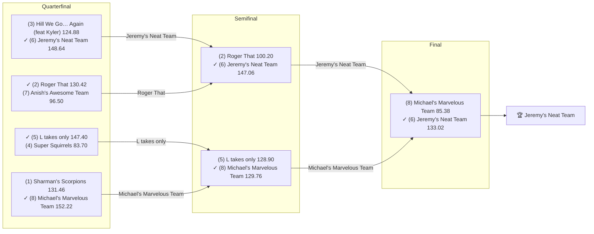

# 2022 Season

- **Champion:** [Jeremy's Neat Team](../owners/jeremy.md)
- **Runner-Up:** [Michael's Marvelous Team](../owners/michael.md)
- **Regular Season Top Seed:** [Sharman's Scorpions](../owners/sharman.md)
- **Toilet Bowl Winner:** [varun's victorious team](../owners/varun.md)

## Final Standings

> **Finish** is the final playoff-adjusted rank, so it does not follow W-L order: a team can win the title from a lower seed. **Playoff Seed** is the seed the team entered the playoffs with; a dash means it did not qualify.

| Finish | Team | Owner | W-L | PF | PA | Playoff Seed |
|--------|------|-------|-----|----|----|--------------|
| 1 | Jeremy's Neat Team | Jeremy | 7-7 | 1788.44 | 1695.46 | 6 |
| 2 | Michael's Marvelous Team | Michael | 5-9 | 1628.34 | 1801.56 | 8 |
| 3 | L takes only | Lokesh | 8-6 | 1648.82 | 1680.0 | 5 |
| 4 | Roger That | Pranav | 10-4 | 1920.2 | 1619.5 | 2 |
| 5 | Anish's Awesome Team | Anish | 6-8 | 1620.38 | 1764.36 | 7 |
| 6 | Super Squirrels | Abhinav | 8-6 | 1686.1 | 1566.4 | 4 |
| 7 | Sharman's Scorpions | Sharman | 11-3 | 1768.56 | 1535.26 | 1 |
| 8 | Hill We Go… Again (feat Kyler) | Naren | 8-6 | 1794.4 | 1730.54 | 3 |
| 9 | Tanmay's Hospital | Tanmay | 5-9 | 1460.74 | 1688.02 | - |
| 10 | varun's victorious team | Varun | 2-12 | 1510.86 | 1745.74 | - |

## Playoff Bracket

> The actual championship bracket, from captured weekly matchups. Seeds in parentheses; ✓ marks the winner. Consolation games are excluded, and a team that appears first in a later round had a bye.

## Team Rosters

> Post-draft and end-of-season lineups as the league's platform recorded them. Bench and IR rows are included; points are that week's score.

??? note "Jeremy's Neat Team"
    **Post-draft - week 1**

    | Slot | Player | Pos | Pts |
    |------|--------|-----|-----|
    | QB | [Patrick Mahomes](../players/patrick-mahomes.md) | QB | 34.90 |
    | RB | [Javonte Williams](../players/javonte-williams.md) | RB | 19.80 |
    | RB | [Aaron Jones Sr.](../players/aaron-jones-sr.md) | RB | 10.60 |
    | WR | [Justin Jefferson](../players/justin-jefferson.md) | WR | 39.40 |
    | WR | [Jaylen Waddle](../players/jaylen-waddle.md) | WR | 17.70 |
    | TE | [Dalton Schultz](../players/dalton-schultz.md) | TE | 13.20 |
    | W/R/T | [James Conner](../players/james-conner.md) | RB | 16.50 |
    | K | [Evan McPherson](../players/evan-mcpherson.md) | K | 8.00 |
    | DEF | [Buccaneers](../players/buccaneers.md) | DEF | 13.00 |
    | BN | [Devin Duvernay](../players/devin-duvernay.md) | WR | 23.10 |
    | BN | [Nyheim Miller-Hines](../players/nyheim-miller-hines.md) | RB | 14.80 |
    | BN | [Elijah Moore](../players/elijah-moore.md) | WR | 9.90 |
    | BN | [Rams](../players/rams.md) | DEF | 9.00 |
    | BN | [Tyler Lockett](../players/tyler-lockett.md) | WR | 5.80 |
    | BN | [Rhamondre Stevenson](../players/rhamondre-stevenson.md) | RB | 4.70 |

    **End of season - week 17**

    | Slot | Player | Pos | Pts |
    |------|--------|-----|-----|
    | QB | [Patrick Mahomes](../players/patrick-mahomes.md) | QB | 26.52 |
    | RB | [Tyler Allgeier](../players/tyler-allgeier.md) | RB | 16.50 |
    | RB | [James Conner](../players/james-conner.md) | RB | 14.00 |
    | WR | [Jaylen Waddle](../players/jaylen-waddle.md) | WR | 8.20 |
    | WR | [Justin Jefferson](../players/justin-jefferson.md) | WR | 2.50 |
    | TE | [Dalton Schultz](../players/dalton-schultz.md) | TE | 24.60 |
    | W/R/T | [DJ Moore](../players/dj-moore.md) | WR | 23.70 |
    | K | [Harrison Butker](../players/harrison-butker.md) | K | 3.00 |
    | DEF | [Giants](../players/giants.md) | DEF | 14.00 |
    | BN | [Richie James](../players/richie-james.md) | WR | 20.60 |
    | BN | [Allen Lazard](../players/allen-lazard.md) | WR | 10.90 |
    | BN | [AJ Dillon](../players/aj-dillon.md) | RB | 10.10 |
    | BN | [Rhamondre Stevenson](../players/rhamondre-stevenson.md) | RB | 7.10 |
    | BN | [Jahan Dotson](../players/jahan-dotson.md) | WR | 6.70 |
    | BN | [Tyler Lockett](../players/tyler-lockett.md) | WR | 3.50 |

??? note "Michael's Marvelous Team"
    **Post-draft - week 1**

    | Slot | Player | Pos | Pts |
    |------|--------|-----|-----|
    | QB | [Russell Wilson](../players/russell-wilson.md) | QB | 17.80 |
    | RB | [Saquon Barkley](../players/saquon-barkley.md) | RB | 33.40 |
    | RB | [Christian McCaffrey](../players/christian-mccaffrey.md) | RB | 15.70 |
    | WR | [Mike Williams](../players/mike-williams.md) | WR | 3.00 |
    | WR | [Allen Robinson](../players/allen-robinson.md) | WR | 2.20 |
    | TE | [Mark Andrews](../players/mark-andrews.md) | TE | 10.20 |
    | W/R/T | [Hollywood Brown](../players/hollywood-brown.md) | WR | 14.30 |
    | K | [Nick Folk](../players/nick-folk.md) | K | 1.00 |
    | DEF | [Colts](../players/colts.md) | DEF | 6.00 |
    | BN | [Jerry Jeudy](../players/jerry-jeudy.md) | WR | 20.20 |
    | BN | [Drake London](../players/drake-london.md) | WR | 12.40 |
    | BN | [Chase Edmonds](../players/chase-edmonds.md) | RB | 10.50 |
    | BN | [Skyy Moore](../players/skyy-moore.md) | WR | 10.40 |
    | BN | [Chris Olave](../players/chris-olave.md) | WR | 9.10 |
    | BN | [Tony Pollard](../players/tony-pollard.md) | RB | 4.20 |

    **End of season - week 17**

    | Slot | Player | Pos | Pts |
    |------|--------|-----|-----|
    | QB | [Trevor Lawrence](../players/trevor-lawrence.md) | QB | 5.48 |
    | RB | [Christian McCaffrey](../players/christian-mccaffrey.md) | RB | 31.30 |
    | RB | [Saquon Barkley](../players/saquon-barkley.md) | RB | 7.30 |
    | WR | [Mike Williams](../players/mike-williams.md) | WR | 16.40 |
    | WR | [Jerry Jeudy](../players/jerry-jeudy.md) | WR | 10.80 |
    | TE | [Tyler Higbee](../players/tyler-higbee.md) | TE | 4.10 |
    | W/R/T | [Tony Pollard](../players/tony-pollard.md) | RB | 0.00 |
    | K | [Nick Folk](../players/nick-folk.md) | K | 6.00 |
    | DEF | [Dolphins](../players/dolphins.md) | DEF | 4.00 |
    | BN | [Mark Andrews](../players/mark-andrews.md) | TE | 19.00 |
    | BN | [Hollywood Brown](../players/hollywood-brown.md) | WR | 12.10 |
    | BN | [Drake London](../players/drake-london.md) | WR | 9.70 |
    | BN | [Chris Olave](../players/chris-olave.md) | WR | 8.20 |
    | BN | [Broncos](../players/broncos.md) | DEF | 6.00 |
    | BN | [Tyler Boyd](../players/tyler-boyd.md) | WR | 0.00 |

??? note "L takes only"
    **Post-draft - week 1**

    | Slot | Player | Pos | Pts |
    |------|--------|-----|-----|
    | QB | [Jalen Hurts](../players/jalen-hurts.md) | QB | 24.72 |
    | RB | [D'Andre Swift](../players/d-andre-swift.md) | RB | 26.50 |
    | RB | [Kenny Gainwell](../players/kenny-gainwell.md) | RB | 11.20 |
    | WR | [Ja'Marr Chase](../players/ja-marr-chase.md) | WR | 28.90 |
    | WR | [Gabe Davis](../players/gabe-davis.md) | WR | 18.80 |
    | TE | [Cole Kmet](../players/cole-kmet.md) | TE | 0.00 |
    | W/R/T | [DJ Moore](../players/dj-moore.md) | WR | 8.00 |
    | K | [Ryan Succop](../players/ryan-succop.md) | K | 15.00 |
    | DEF | [Titans](../players/titans.md) | DEF | 9.00 |
    | BN | [Damien Harris](../players/damien-harris.md) | RB | 7.80 |
    | BN | [Aaron Rodgers](../players/aaron-rodgers.md) | QB | 4.70 |
    | BN | [Elijah Mitchell](../players/elijah-mitchell.md) | RB | 4.10 |
    | BN | [Allen Lazard](../players/allen-lazard.md) | WR | 0.00 |
    | BN | [George Kittle](../players/george-kittle.md) | TE | 0.00 |
    | BN | [Rondale Moore](../players/rondale-moore.md) | WR | 0.00 |

    **End of season - week 17**

    | Slot | Player | Pos | Pts |
    |------|--------|-----|-----|
    | QB | [Jared Goff](../players/jared-goff.md) | QB | 22.40 |
    | RB | [Isiah Pacheco](../players/isiah-pacheco.md) | RB | 12.90 |
    | RB | [Ezekiel Elliott](../players/ezekiel-elliott.md) | RB | 9.70 |
    | WR | [Keenan Allen](../players/keenan-allen.md) | WR | 11.80 |
    | WR | [Zay Jones](../players/zay-jones.md) | WR | 5.40 |
    | TE | [George Kittle](../players/george-kittle.md) | TE | 12.30 |
    | W/R/T | [Raheem Mostert](../players/raheem-mostert.md) | RB | 31.00 |
    | K | [Graham Gano](../players/graham-gano.md) | K | 8.00 |
    | DEF | [Ravens](../players/ravens.md) | DEF | 3.00 |
    | BN | [D'Andre Swift](../players/d-andre-swift.md) | RB | 27.70 |
    | BN | [Cordarrelle Patterson](../players/cordarrelle-patterson.md) | RB | 20.40 |
    | BN | [Donovan Peoples-Jones](../players/donovan-peoples-jones.md) | WR | 8.30 |
    | BN | [Chris Moore](../players/chris-moore.md) | WR | 5.10 |
    | IR | [Darnell Mooney](../players/darnell-mooney.md) | WR | 0.00 |
    | IR | [Elijah Mitchell](../players/elijah-mitchell.md) | RB | 0.00 |
    | BN | [Gabe Davis](../players/gabe-davis.md) | WR | 0.00 |
    | BN | [Jalen Hurts](../players/jalen-hurts.md) | QB | 0.00 |

??? note "Roger That"
    **Post-draft - week 1**

    | Slot | Player | Pos | Pts |
    |------|--------|-----|-----|
    | QB | [Kirk Cousins](../players/kirk-cousins.md) | QB | 19.08 |
    | RB | [Austin Ekeler](../players/austin-ekeler.md) | RB | 11.20 |
    | RB | [David Montgomery](../players/david-montgomery.md) | RB | 8.00 |
    | WR | [A.J. Brown](../players/a-j-brown.md) | WR | 25.50 |
    | WR | [DK Metcalf](../players/dk-metcalf.md) | WR | 8.60 |
    | TE | [Travis Kelce](../players/travis-kelce.md) | TE | 26.10 |
    | W/R/T | [Josh Jacobs](../players/josh-jacobs.md) | RB | 8.30 |
    | K | [Harrison Butker](../players/harrison-butker.md) | K | 9.00 |
    | DEF | [Saints](../players/saints.md) | DEF | 6.00 |
    | BN | [Michael Thomas](../players/michael-thomas.md) | WR | 22.70 |
    | BN | [James Robinson](../players/james-robinson.md) | RB | 19.90 |
    | BN | [Miles Sanders](../players/miles-sanders.md) | RB | 18.50 |
    | BN | [Trevor Lawrence](../players/trevor-lawrence.md) | QB | 14.40 |
    | BN | [Amari Cooper](../players/amari-cooper.md) | WR | 4.70 |
    | BN | [DeAndre Hopkins](../players/deandre-hopkins.md) | WR | 0.00 |

    **End of season - week 17**

    | Slot | Player | Pos | Pts |
    |------|--------|-----|-----|
    | QB | [Geno Smith](../players/geno-smith.md) | QB | 17.12 |
    | RB | [Austin Ekeler](../players/austin-ekeler.md) | RB | 32.10 |
    | RB | [Josh Jacobs](../players/josh-jacobs.md) | RB | 19.50 |
    | WR | [A.J. Brown](../players/a-j-brown.md) | WR | 19.70 |
    | WR | [DeAndre Hopkins](../players/deandre-hopkins.md) | WR | 0.00 |
    | TE | [Travis Kelce](../players/travis-kelce.md) | TE | 11.30 |
    | W/R/T | [DK Metcalf](../players/dk-metcalf.md) | WR | 1.30 |
    | K | [Evan McPherson](../players/evan-mcpherson.md) | K | 0.00 |
    | DEF | [Browns](../players/browns.md) | DEF | 13.00 |
    | BN | [Amari Cooper](../players/amari-cooper.md) | WR | 25.50 |
    | BN | [Deshaun Watson](../players/deshaun-watson.md) | QB | 21.86 |
    | BN | [Kirk Cousins](../players/kirk-cousins.md) | QB | 10.90 |
    | BN | [Miles Sanders](../players/miles-sanders.md) | RB | 6.10 |
    | BN | [David Montgomery](../players/david-montgomery.md) | RB | 5.60 |
    | BN | [James Robinson](../players/james-robinson.md) | RB | 0.00 |
    | IR | [Michael Thomas](../players/michael-thomas.md) | WR | 0.00 |

??? note "Anish's Awesome Team"
    **Post-draft - week 1**

    | Slot | Player | Pos | Pts |
    |------|--------|-----|-----|
    | QB | [Joe Burrow](../players/joe-burrow.md) | QB | 22.22 |
    | RB | [Jonathan Taylor](../players/jonathan-taylor.md) | RB | 27.50 |
    | RB | [Leonard Fournette](../players/leonard-fournette.md) | RB | 15.70 |
    | WR | [Mike Evans](../players/mike-evans.md) | WR | 18.10 |
    | WR | [Terry McLaurin](../players/terry-mclaurin.md) | WR | 13.80 |
    | TE | [Albert Okwuegbunam Jr.](../players/albert-okwuegbunam-jr.md) | TE | 8.30 |
    | W/R/T | [Courtland Sutton](../players/courtland-sutton.md) | WR | 11.20 |
    | K | [Matt Gay](../players/matt-gay.md) | K | 6.00 |
    | DEF | [Ravens](../players/ravens.md) | DEF | 11.00 |
    | BN | [AJ Dillon](../players/aj-dillon.md) | RB | 20.10 |
    | BN | [Julio Jones](../players/julio-jones.md) | WR | 11.60 |
    | BN | [Zach Ertz](../players/zach-ertz.md) | TE | 11.40 |
    | BN | [Isaiah McKenzie](../players/isaiah-mckenzie.md) | WR | 9.90 |
    | BN | [Dameon Pierce](../players/dameon-pierce.md) | RB | 4.90 |
    | BN | [Robert Woods](../players/robert-woods.md) | WR | 2.30 |

    **End of season - week 17**

    | Slot | Player | Pos | Pts |
    |------|--------|-----|-----|
    | QB | [Joe Burrow](../players/joe-burrow.md) | QB | 0.00 |
    | RB | [Jerick McKinnon](../players/jerick-mckinnon.md) | RB | 22.60 |
    | RB | [Leonard Fournette](../players/leonard-fournette.md) | RB | 8.70 |
    | WR | [Mike Evans](../players/mike-evans.md) | WR | 48.70 |
    | WR | [Terry McLaurin](../players/terry-mclaurin.md) | WR | 5.70 |
    | TE | [Evan Engram](../players/evan-engram.md) | TE | 3.90 |
    | W/R/T | [Diontae Johnson](../players/diontae-johnson.md) | WR | 5.50 |
    | K | [Cameron Dicker](../players/cameron-dicker.md) | K | 8.00 |
    | DEF | [Chargers](../players/chargers.md) | DEF | 9.00 |
    | BN | [Courtland Sutton](../players/courtland-sutton.md) | WR | 8.40 |
    | BN | [Zack Moss](../players/zack-moss.md) | RB | 7.40 |
    | BN | [Mack Hollins](../players/mack-hollins.md) | WR | 7.00 |
    | BN | [D'Onta Foreman](../players/d-onta-foreman.md) | RB | 3.50 |
    | BN | [Curtis Samuel](../players/curtis-samuel.md) | WR | 1.60 |

??? note "Super Squirrels"
    **Post-draft - week 1**

    | Slot | Player | Pos | Pts |
    |------|--------|-----|-----|
    | QB | [Lamar Jackson](../players/lamar-jackson.md) | QB | 21.22 |
    | RB | [Devin Singletary](../players/devin-singletary.md) | RB | 8.20 |
    | RB | [Ezekiel Elliott](../players/ezekiel-elliott.md) | RB | 5.90 |
    | WR | [Stefon Diggs](../players/stefon-diggs.md) | WR | 26.20 |
    | WR | [CeeDee Lamb](../players/ceedee-lamb.md) | WR | 4.90 |
    | TE | [Dawson Knox](../players/dawson-knox.md) | TE | 1.50 |
    | W/R/T | [Tee Higgins](../players/tee-higgins.md) | WR | 4.70 |
    | K | [Daniel Carlson](../players/daniel-carlson.md) | K | 9.00 |
    | DEF | [Bills](../players/bills.md) | DEF | 17.00 |
    | BN | [Rashod Bateman](../players/rashod-bateman.md) | WR | 13.90 |
    | BN | [Pat Freiermuth](../players/pat-freiermuth.md) | TE | 12.50 |
    | BN | [Trey Lance](../players/trey-lance.md) | QB | 10.96 |
    | BN | [Chase Claypool](../players/chase-claypool.md) | WR | 9.40 |
    | IR | [Gus Edwards](../players/gus-edwards.md) | RB | 0.00 |
    | BN | [J.K. Dobbins](../players/j-k-dobbins.md) | RB | 0.00 |
    | BN | [Kenneth Walker III](../players/kenneth-walker-iii.md) | RB | 0.00 |

    **End of season - week 17**

    | Slot | Player | Pos | Pts |
    |------|--------|-----|-----|
    | QB | [Daniel Jones](../players/daniel-jones.md) | QB | 36.18 |
    | RB | [Kenneth Walker III](../players/kenneth-walker-iii.md) | RB | 15.20 |
    | RB | [Rachaad White](../players/rachaad-white.md) | RB | 9.80 |
    | WR | [CeeDee Lamb](../players/ceedee-lamb.md) | WR | 21.00 |
    | WR | [Stefon Diggs](../players/stefon-diggs.md) | WR | 0.00 |
    | TE | [Pat Freiermuth](../players/pat-freiermuth.md) | TE | 6.60 |
    | W/R/T | [Tee Higgins](../players/tee-higgins.md) | WR | 0.00 |
    | K | [Daniel Carlson](../players/daniel-carlson.md) | K | 12.00 |
    | DEF | [Bills](../players/bills.md) | DEF | 0.00 |
    | BN | [J.K. Dobbins](../players/j-k-dobbins.md) | RB | 9.30 |
    | BN | [Brian Robinson](../players/brian-robinson.md) | RB | 8.70 |
    | BN | [Commanders](../players/commanders.md) | DEF | 5.00 |
    | BN | [George Pickens](../players/george-pickens.md) | WR | 4.90 |
    | BN | [Devin Singletary](../players/devin-singletary.md) | RB | 0.00 |
    | BN | [Lamar Jackson](../players/lamar-jackson.md) | QB | 0.00 |

??? note "Sharman's Scorpions"
    **Post-draft - week 1**

    | Slot | Player | Pos | Pts |
    |------|--------|-----|-----|
    | QB | [Josh Allen](../players/josh-allen.md) | QB | 33.48 |
    | RB | [Dalvin Cook](../players/dalvin-cook.md) | RB | 13.80 |
    | RB | [Travis Etienne Jr.](../players/travis-etienne-jr.md) | RB | 8.50 |
    | WR | [Davante Adams](../players/davante-adams.md) | WR | 30.10 |
    | WR | [Michael Pittman Jr.](../players/michael-pittman-jr.md) | WR | 27.10 |
    | TE | [T.J. Hockenson](../players/t-j-hockenson.md) | TE | 7.80 |
    | W/R/T | [Amon-Ra St. Brown](../players/amon-ra-st-brown.md) | WR | 20.40 |
    | K | [Tyler Bass](../players/tyler-bass.md) | K | 8.00 |
    | DEF | [Bengals](../players/bengals.md) | DEF | 2.00 |
    | BN | [Antonio Gibson](../players/antonio-gibson.md) | RB | 20.00 |
    | BN | [Matthew Stafford](../players/matthew-stafford.md) | QB | 10.80 |
    | BN | [Melvin Gordon III](../players/melvin-gordon-iii.md) | RB | 7.20 |
    | BN | [Kadarius Toney](../players/kadarius-toney.md) | WR | 2.30 |
    | BN | [David Njoku](../players/david-njoku.md) | TE | 1.70 |
    | BN | [Packers](../players/packers.md) | DEF | 1.00 |

    **End of season - week 17**

    | Slot | Player | Pos | Pts |
    |------|--------|-----|-----|
    | QB | [Josh Allen](../players/josh-allen.md) | QB | 0.00 |
    | RB | [Bam Knight](../players/bam-knight.md) | RB | 6.40 |
    | RB | [Dalvin Cook](../players/dalvin-cook.md) | RB | 6.40 |
    | WR | [Davante Adams](../players/davante-adams.md) | WR | 34.30 |
    | WR | [Amon-Ra St. Brown](../players/amon-ra-st-brown.md) | WR | 10.20 |
    | TE | [T.J. Hockenson](../players/t-j-hockenson.md) | TE | 12.90 |
    | W/R/T | [Michael Pittman Jr.](../players/michael-pittman-jr.md) | WR | 16.10 |
    | K | [Tyler Bass](../players/tyler-bass.md) | K | 0.00 |
    | DEF | [Packers](../players/packers.md) | DEF | 23.00 |
    | BN | [Travis Etienne Jr.](../players/travis-etienne-jr.md) | RB | 23.00 |
    | BN | [Brett Maher](../players/brett-maher.md) | K | 10.00 |
    | BN | [Buccaneers](../players/buccaneers.md) | DEF | 8.00 |
    | BN | [David Njoku](../players/david-njoku.md) | TE | 3.10 |
    | BN | [Darius Slayton](../players/darius-slayton.md) | WR | 1.40 |
    | BN | [Antonio Gibson](../players/antonio-gibson.md) | RB | 0.00 |

??? note "Hill We Go… Again (feat Kyler)"
    **Post-draft - week 1**

    | Slot | Player | Pos | Pts |
    |------|--------|-----|-----|
    | QB | [Kyler Murray](../players/kyler-murray.md) | QB | 20.62 |
    | RB | [Nick Chubb](../players/nick-chubb.md) | RB | 15.30 |
    | RB | [Derrick Henry](../players/derrick-henry.md) | RB | 8.20 |
    | WR | [Tyreek Hill](../players/tyreek-hill.md) | WR | 18.00 |
    | WR | [Diontae Johnson](../players/diontae-johnson.md) | WR | 12.50 |
    | TE | [Kyle Pitts Sr.](../players/kyle-pitts-sr.md) | TE | 3.90 |
    | W/R/T | [JuJu Smith-Schuster](../players/juju-smith-schuster.md) | WR | 11.90 |
    | K | [Rodrigo Blankenship](../players/rodrigo-blankenship.md) | K | 9.00 |
    | DEF | [Broncos](../players/broncos.md) | DEF | 5.00 |
    | BN | [Kareem Hunt](../players/kareem-hunt.md) | RB | 23.00 |
    | BN | [Rashaad Penny](../players/rashaad-penny.md) | RB | 8.70 |
    | BN | [Chris Godwin Jr.](../players/chris-godwin-jr.md) | WR | 6.50 |
    | BN | [Darnell Mooney](../players/darnell-mooney.md) | WR | 1.80 |
    | BN | [George Pickens](../players/george-pickens.md) | WR | 1.30 |
    | IR | [Brian Robinson](../players/brian-robinson.md) | RB | 0.00 |
    | BN | [James Cook III](../players/james-cook-iii.md) | RB | -1.80 |

    **End of season - week 17**

    | Slot | Player | Pos | Pts |
    |------|--------|-----|-----|
    | QB | [Justin Fields](../players/justin-fields.md) | QB | 17.20 |
    | RB | [Cam Akers](../players/cam-akers.md) | RB | 14.30 |
    | RB | [Joe Mixon](../players/joe-mixon.md) | RB | 0.00 |
    | WR | [Tyreek Hill](../players/tyreek-hill.md) | WR | 15.70 |
    | WR | [Ja'Marr Chase](../players/ja-marr-chase.md) | WR | 0.00 |
    | TE | [Juwan Johnson](../players/juwan-johnson.md) | TE | 11.20 |
    | W/R/T | [Garrett Wilson](../players/garrett-wilson.md) | WR | 4.80 |
    | K | [Riley Patterson](../players/riley-patterson.md) | K | 9.00 |
    | DEF | [Eagles](../players/eagles.md) | DEF | 10.00 |
    | BN | [Nick Chubb](../players/nick-chubb.md) | RB | 12.60 |
    | BN | [Patriots](../players/patriots.md) | DEF | 12.00 |
    | BN | [Gerald Everett](../players/gerald-everett.md) | TE | 10.50 |
    | BN | [JuJu Smith-Schuster](../players/juju-smith-schuster.md) | WR | 4.10 |
    | BN | [Christian Watson](../players/christian-watson.md) | WR | 2.10 |
    | BN | [Derrick Henry](../players/derrick-henry.md) | RB | 0.00 |
    | IR | [Kyler Murray](../players/kyler-murray.md) | QB | 0.00 |
    | IR | [Rashaad Penny](../players/rashaad-penny.md) | RB | 0.00 |

??? note "Tanmay's Hospital"
    **Post-draft - week 1**

    | Slot | Player | Pos | Pts |
    |------|--------|-----|-----|
    | QB | [Dak Prescott](../players/dak-prescott.md) | QB | 5.46 |
    | RB | [Joe Mixon](../players/joe-mixon.md) | RB | 21.50 |
    | RB | [Najee Harris](../players/najee-harris.md) | RB | 10.60 |
    | WR | [Brandin Cooks](../players/brandin-cooks.md) | WR | 15.20 |
    | WR | [Keenan Allen](../players/keenan-allen.md) | WR | 10.60 |
    | TE | [Darren Waller](../players/darren-waller.md) | TE | 11.90 |
    | W/R/T | [Clyde Edwards-Helaire](../players/clyde-edwards-helaire.md) | RB | 22.40 |
    | K | [Greg Joseph](../players/greg-joseph.md) | K | 13.00 |
    | DEF | [Browns](../players/browns.md) | DEF | 6.00 |
    | BN | [Cordarrelle Patterson](../players/cordarrelle-patterson.md) | RB | 22.60 |
    | BN | [Christian Kirk](../players/christian-kirk.md) | WR | 17.70 |
    | BN | [Michael Carter](../players/michael-carter.md) | RB | 17.00 |
    | BN | [Breece Hall](../players/breece-hall.md) | RB | 10.10 |
    | BN | [Adam Thielen](../players/adam-thielen.md) | WR | 6.60 |
    | BN | [DeVonta Smith](../players/devonta-smith.md) | WR | 0.00 |

    **End of season - week 17**

    | Slot | Player | Pos | Pts |
    |------|--------|-----|-----|
    | QB | [Dak Prescott](../players/dak-prescott.md) | QB | 16.38 |
    | RB | [Najee Harris](../players/najee-harris.md) | RB | 20.30 |
    | RB | [Michael Carter](../players/michael-carter.md) | RB | 2.50 |
    | WR | [Chris Godwin Jr.](../players/chris-godwin-jr.md) | WR | 21.00 |
    | WR | [Christian Kirk](../players/christian-kirk.md) | WR | 4.10 |
    | TE | [Darren Waller](../players/darren-waller.md) | TE | 16.20 |
    | W/R/T | [Adam Thielen](../players/adam-thielen.md) | WR | 2.60 |
    | K | [Michael Badgley](../players/michael-badgley.md) | K | 12.00 |
    | DEF | [Cowboys](../players/cowboys.md) | DEF | 10.00 |
    | BN | [DeVonta Smith](../players/devonta-smith.md) | WR | 20.50 |
    | BN | [Saints](../players/saints.md) | DEF | 18.00 |
    | BN | [Aaron Rodgers](../players/aaron-rodgers.md) | QB | 16.56 |
    | BN | [Aaron Jones Sr.](../players/aaron-jones-sr.md) | RB | 13.30 |
    | BN | [Brandin Cooks](../players/brandin-cooks.md) | WR | 7.90 |
    | IR | [Clyde Edwards-Helaire](../players/clyde-edwards-helaire.md) | RB | 0.00 |
    | BN | [Dawson Knox](../players/dawson-knox.md) | TE | 0.00 |

??? note "varun's victorious team"
    **Post-draft - week 1**

    | Slot | Player | Pos | Pts |
    |------|--------|-----|-----|
    | QB | [Tom Brady](../players/tom-brady.md) | QB | 11.38 |
    | RB | [Alvin Kamara](../players/alvin-kamara.md) | RB | 7.60 |
    | RB | [Cam Akers](../players/cam-akers.md) | RB | 0.00 |
    | WR | [Cooper Kupp](../players/cooper-kupp.md) | WR | 31.80 |
    | WR | [Hunter Renfrow](../players/hunter-renfrow.md) | WR | 5.50 |
    | TE | [Dallas Goedert](../players/dallas-goedert.md) | TE | 9.00 |
    | W/R/T | [Brandon Aiyuk](../players/brandon-aiyuk.md) | WR | 6.70 |
    | K | [Justin Tucker](../players/justin-tucker.md) | K | 6.00 |
    | DEF | [49ers](../players/49ers.md) | DEF | 5.00 |
    | BN | [Justin Herbert](../players/justin-herbert.md) | QB | 23.26 |
    | BN | [Deebo Samuel Sr.](../players/deebo-samuel-sr.md) | WR | 12.60 |
    | BN | [Darrell Henderson Jr.](../players/darrell-henderson-jr.md) | RB | 12.30 |
    | BN | [Hunter Henry](../players/hunter-henry.md) | TE | 4.00 |
    | BN | [Russell Gage Jr.](../players/russell-gage-jr.md) | WR | 3.30 |
    | BN | [Chiefs](../players/chiefs.md) | DEF | 3.00 |

    **End of season - week 17**

    | Slot | Player | Pos | Pts |
    |------|--------|-----|-----|
    | QB | [Justin Herbert](../players/justin-herbert.md) | QB | 16.68 |
    | RB | [Latavius Murray](../players/latavius-murray.md) | RB | 11.20 |
    | RB | [Samaje Perine](../players/samaje-perine.md) | RB | 0.00 |
    | WR | [Brandon Aiyuk](../players/brandon-aiyuk.md) | WR | 26.70 |
    | WR | [Isaiah McKenzie](../players/isaiah-mckenzie.md) | WR | 0.00 |
    | TE | [Hunter Henry](../players/hunter-henry.md) | TE | 10.20 |
    | W/R/T | [Joshua Palmer](../players/joshua-palmer.md) | WR | 0.00 |
    | K | [Justin Tucker](../players/justin-tucker.md) | K | 9.00 |
    | DEF | [Chiefs](../players/chiefs.md) | DEF | 8.00 |
    | BN | [Tom Brady](../players/tom-brady.md) | QB | 37.68 |
    | BN | [Alvin Kamara](../players/alvin-kamara.md) | RB | 9.00 |
    | BN | [Parris Campbell](../players/parris-campbell.md) | WR | 8.30 |
    | IR | [Dallas Goedert](../players/dallas-goedert.md) | TE | 7.50 |
    | BN | [49ers](../players/49ers.md) | DEF | 3.00 |
    | BN | [Ameer Abdullah](../players/ameer-abdullah.md) | RB | 0.00 |
    | IR | [Cooper Kupp](../players/cooper-kupp.md) | WR | 0.00 |
    | BN | [Deebo Samuel Sr.](../players/deebo-samuel-sr.md) | WR | 0.00 |

## Awards

- **League Champion:** [Jeremy's Neat Team](../owners/jeremy.md)
- **Most Valuable Player:** [Jalen Hurts](../players/jalen-hurts.md) - 6 wins swung
- **Finals MVP:** [Patrick Mahomes](../players/patrick-mahomes.md) - 26.52 pts ([Jeremy's Neat Team](../owners/jeremy.md))
- **Newcomer of the Year:** [Dameon Pierce](../players/dameon-pierce.md) - 2 wins swung
- **Undrafted Player of the Year:** [Raheem Mostert](../players/raheem-mostert.md) - 3 wins swung
- **Highest Single-Week Score:** Hill We Go… Again (feat Kyler) - 185.70 (Wk 9)
- **Lowest Single-Week Score:** Michael's Marvelous Team - 45.80 (Wk 9)
- **Best Draft Pick:** [DeVonta Smith](../players/devonta-smith.md) (WR) - drafted by [Tanmay's Hospital](../owners/tanmay.md) at pick 109, finished +31 spots at the position, 242.40 pts
- **Biggest Bust:** [D'Andre Swift](../players/d-andre-swift.md) (RB) - drafted by [L takes only](../owners/lokesh.md) at pick 13, finished -15 spots at the position, 175.50 pts, played 13 of 17 weeks

## Position Highs

The biggest single week at each position, regular season, starters only. The league-wide high above is almost always a receiver or a back; this is where a kicker's or a defense's best day is visible.

| Pos | Player | Points | When |
|-----|--------|--------|------|
| QB | [Lamar Jackson](../players/lamar-jackson.md) | 42.62 | Wk 2, [Super Squirrels](../owners/abhinav.md) |
| RB | [Joe Mixon](../players/joe-mixon.md) | 55.10 | Wk 9, [Hill We Go… Again (feat Kyler)](../owners/naren.md) |
| WR | [Stefon Diggs](../players/stefon-diggs.md) | 44.80 | Wk 2, [Super Squirrels](../owners/abhinav.md) |
| TE | [T.J. Hockenson](../players/t-j-hockenson.md) | 39.90 | Wk 4, [Sharman's Scorpions](../owners/sharman.md) |
| K | [Tyler Bass](../players/tyler-bass.md) | 23.00 | Wk 11, [Sharman's Scorpions](../owners/sharman.md) |
| DEF | [Browns](../players/browns.md) | 30.00 | Wk 13, [Roger That](../owners/pranav.md) |

## Team of the Season

The best starting lineup the season produced, one selection per slot the league actually starts. A slot is won the same way the MVP is: by wins swung, the games a team won by less than the player scored from the starting lineup. The flex takes the best eligible player the position slots did not already claim.

| Slot | Player | Pos | Wins Swung | Points in Them | Rostered By |
|------|--------|-----|------------|----------------|-------------|
| QB | [Jalen Hurts](../players/jalen-hurts.md) | QB | 6 | 162.66 | L takes only |
| RB | [Christian McCaffrey](../players/christian-mccaffrey.md) | RB | 5 | 134.96 | Michael's Marvelous Team |
|  | [Saquon Barkley](../players/saquon-barkley.md) | RB | 5 | 90.50 | Michael's Marvelous Team |
| WR | [Davante Adams](../players/davante-adams.md) | WR | 5 | 150.40 | Sharman's Scorpions |
|  | [Mike Evans](../players/mike-evans.md) | WR | 5 | 97.00 | Anish's Awesome Team |
| TE | [Travis Kelce](../players/travis-kelce.md) | TE | 3 | 56.70 | Roger That |
| W/R/T | [Tyreek Hill](../players/tyreek-hill.md) | WR | 4 | 121.60 | Hill We Go… Again (feat Kyler) |
| K | [Nick Folk](../players/nick-folk.md) | K | 3 | 38.00 | Michael's Marvelous Team |
| DEF | [Cowboys](../players/cowboys.md) | DEF | 2 | 14.00 | Hill We Go… Again (feat Kyler), Tanmay's Hospital |

> Every award here is computed, not voted. **MVP** is the player who swung the most wins: games their team won by less than the player scored from the starting lineup. **Finals MVP** is the top scorer in the title game's winning lineup. **Newcomer of the Year** is the same wins-swung measure among players making their first appearance on a Pine Hills roster - a league debut, not an NFL rookie season, which the captured data does not record. **Undrafted Player of the Year** is the same measure among players nobody took in that year's draft. **Best Draft Pick** and **Biggest Bust** compare, within a position, where a player was taken against where they finished on season points; Bust is restricted to rounds 1-3 and to players who scored in at least 75% of the season's weeks, so a lost year is not counted as a bad pick.

## The Story of the Year

_TBD - add the defining moments._

## Related

- [Seasons](index.md) · [2022 Draft](../draft/2022-draft.md) · [Teams](../teams/index.md) · [Records](../records/index.md) · [Lore](../lore.md) · [Playoffs](../playoffs.md)
