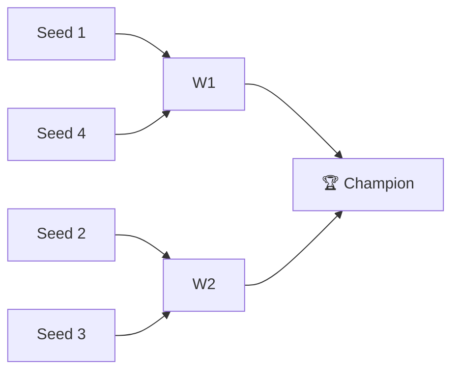

# 🏈 2022 Season

**Champion:** _TBD_
**Runner-Up:** _TBD_
**Regular Season Top Seed:** _TBD_
**Toilet Bowl Winner:** _TBD_

## Final Standings

> Auto-generated from Yahoo standings. Owners and playoff results are filled from the league bible (`raw/bible.yaml`); `_TBD_` means not yet recorded.

| Rank | Team | Owner | W-L | PF | PA | Playoff Seed |
|------|------|-------|-----|----|----|--------------|
| 1 | Jeremy's Neat Team | _TBD_ | 7-7 | 1788.44 | 1695.46 | 1 |
| 2 | Michael's Marvelous Team | _TBD_ | 5-9 | 1628.34 | 1801.56 | 2 |
| 3 | L takes only | _TBD_ | 8-6 | 1648.82 | 1680.0 | 3 |
| 4 | Roger That | _TBD_ | 10-4 | 1920.2 | 1619.5 | 4 |
| 5 | Anish's Awesome Team | _TBD_ | 6-8 | 1620.38 | 1764.36 | - |
| 6 | Super Squirrels | _TBD_ | 8-6 | 1686.1 | 1566.4 | - |
| 7 | Sharman’s Scorpions | _TBD_ | 11-3 | 1768.56 | 1535.26 | - |
| 8 | Hill We Go… Again (feat Kyler) | _TBD_ | 8-6 | 1794.4 | 1730.54 | - |
| 9 | Tanmay's Hospital | _TBD_ | 5-9 | 1460.74 | 1688.02 | - |
| 10 | varun’s victorious team | _TBD_ | 2-12 | 1510.86 | 1745.74 | - |

## Playoff Bracket

> Playoff results are recorded in the league bible. Add `champions: { 2022: { champion: ..., runner_up: ... } }` to `raw/bible.yaml` to populate this section.

## Team Rosters

| Team | Post-Draft Roster | End-of-Season Roster |
|------|-------------------|----------------------|

## Awards

- 🏆 **League Champion:** _TBD_
- 💥 **Highest Single-Week Score:** _TBD_
- 📉 **Lowest Single-Week Score:** _TBD_
- 🔥 **Biggest Bust:** _TBD_
- 🎯 **Best Draft Pick:** _TBD_
- 🍗 **"Poultry Controversy" Nominee:** _TBD_

## The Story of the Year

_TBD - add the defining moments._

## Related

- [Seasons](index.md) · [2022 Draft](#) · [Teams](../teams/index.md) · [Records](../records/index.md) · [Lore](#) · [Playoffs](../playoffs.md)
