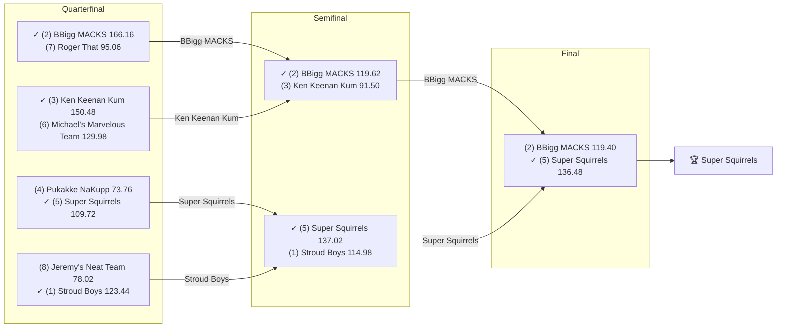

# 🏈 2023 Season

- **Champion:** Super Squirrels
- **Runner-Up:** BBigg MACKS
- **Regular Season Top Seed:** Stroud Boys
- **Toilet Bowl Winner:** Sharman’s Scorpions

## Final Standings

> Auto-generated from Yahoo. **Finish** is Yahoo's final playoff-adjusted rank, so it does not follow W-L order - a team can win the title from a lower seed. **Playoff Seed** is the seed the team actually entered the playoffs with; - means it did not qualify.

| Finish | Team | Owner | W-L | PF | PA | Playoff Seed |
|--------|------|-------|-----|----|----|--------------|
| 1 | Super Squirrels | Super | 7-7 | 1588.64 | 1644.92 | 5 |
| 2 | BBigg MACKS | Naren | 11-3 | 1874.16 | 1444.54 | 2 |
| 3 | Stroud Boys | Tanmay | 11-3 | 1888.52 | 1619.28 | 1 |
| 4 | Ken Keenan Kum | lokesh | 8-6 | 1793.58 | 1771.36 | 3 |
| 5 | Pukakke NaKupp | Anish | 8-6 | 1755.32 | 1761.32 | 4 |
| 6 | Michael's Marvelous Team | Michael | 6-8 | 1562.06 | 1624.58 | 6 |
| 7 | Roger That | Pranav | 5-9 | 1663.92 | 1709.82 | 7 |
| 8 | Jeremy's Neat Team | Jeremy | 5-9 | 1602.5 | 1831.42 | 8 |
| 9 | varun’s victorious team | Varun | 5-9 | 1506.58 | 1627.12 | - |
| 10 | Sharman’s Scorpions | Sharman | 4-10 | 1365.16 | 1566.08 | - |

## Playoff Bracket

> The actual championship bracket, from captured weekly matchups. Seeds in parentheses; ✓ marks the winner. Consolation games are excluded, and a team that appears first in a later round had a bye.

## Team Rosters

| Team | Post-Draft Roster | End-of-Season Roster |
|------|-------------------|----------------------|

## Awards

- 🏆 **League Champion:** Super Squirrels
- 💥 **Highest Single-Week Score:** _TBD_
- 📉 **Lowest Single-Week Score:** _TBD_
- 🔥 **Biggest Bust:** _TBD_
- 🎯 **Best Draft Pick:** _TBD_
- 🍗 **"Poultry Controversy" Nominee:** _TBD_

## The Story of the Year

_TBD - add the defining moments._

## Related

- [Seasons](index.md) · [2023 Draft](../draft/2023-draft.md) · [Teams](../teams/index.md) · [Records](../records/index.md) · Lore · [Playoffs](../playoffs.md)
