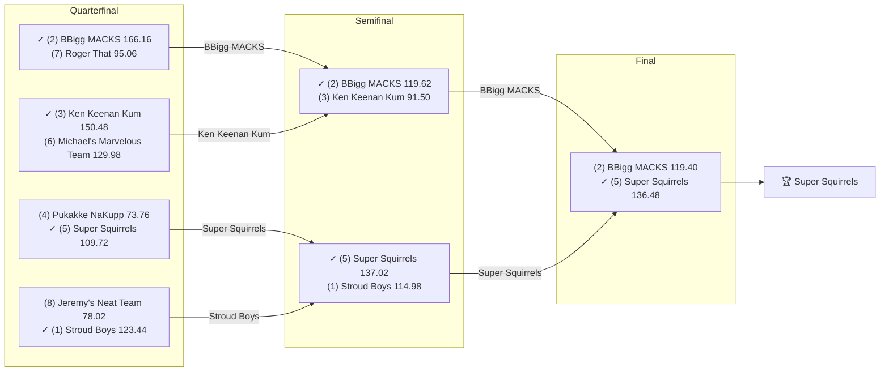

# 🏈 2023 Season

- **Champion:** Super Squirrels
- **Runner-Up:** BBigg MACKS
- **Regular Season Top Seed:** Stroud Boys
- **Toilet Bowl Winner:** Sharman’s Scorpions

## Final Standings

> Auto-generated from Yahoo. **Finish** is Yahoo's final playoff-adjusted rank, so it does not follow W-L order - a team can win the title from a lower seed. **Playoff Seed** is the seed the team actually entered the playoffs with; - means it did not qualify.

| Finish | Team | Owner | W-L | PF | PA | Playoff Seed |
|--------|------|-------|-----|----|----|--------------|
| 1 | Super Squirrels | Super | 7-7 | 1588.64 | 1644.92 | 5 |
| 2 | BBigg MACKS | Naren | 11-3 | 1874.16 | 1444.54 | 2 |
| 3 | Stroud Boys | Tanmay | 11-3 | 1888.52 | 1619.28 | 1 |
| 4 | Ken Keenan Kum | lokesh | 8-6 | 1793.58 | 1771.36 | 3 |
| 5 | Pukakke NaKupp | Anish | 8-6 | 1755.32 | 1761.32 | 4 |
| 6 | Michael's Marvelous Team | Michael | 6-8 | 1562.06 | 1624.58 | 6 |
| 7 | Roger That | Pranav | 5-9 | 1663.92 | 1709.82 | 7 |
| 8 | Jeremy's Neat Team | Jeremy | 5-9 | 1602.5 | 1831.42 | 8 |
| 9 | varun’s victorious team | Varun | 5-9 | 1506.58 | 1627.12 | - |
| 10 | Sharman’s Scorpions | Sharman | 4-10 | 1365.16 | 1566.08 | - |

## Playoff Bracket

> The actual championship bracket, from captured weekly matchups. Seeds in parentheses; ✓ marks the winner. Consolation games are excluded, and a team that appears first in a later round had a bye.

## Team Rosters

> Post-draft and end-of-season lineups as Yahoo recorded them. Bench and IR rows are included; points are that week's score.

??? note "Super Squirrels"
    **Post-draft - week 1**

    | Slot | Player | Pos | Pts |
    |------|--------|-----|-----|
    | QB | Trevor Lawrence | QB | 18.74 |
    | RB | Breece Hall | RB | 15.70 |
    | RB | Khalil Herbert | RB | 11.40 |
    | WR | DeVonta Smith | WR | 17.70 |
    | WR | Hollywood Brown | WR | 8.70 |
    | TE | T.J. Hockenson | TE | 11.50 |
    | W/R/T | Brandon Aiyuk | WR | 32.90 |
    | K | Daniel Carlson | K | 5.00 |
    | DEF | Bills | DEF | 5.00 |
    | BN | Rashid Shaheed | WR | 30.60 |
    | BN | Gabe Davis | WR | 5.20 |
    | BN | Deon Jackson | RB | 3.80 |
    | BN | Zach Charbonnet | RB | 1.10 |
    | BN | Chig Okonkwo | TE | 0.00 |
    | IR | Cooper Kupp | WR | 0.00 |
    | IR | Jonathan Taylor | RB | 0.00 |
    | BN | Rashaad Penny | RB | 0.00 |

    **End of season - week 17**

    | Slot | Player | Pos | Pts |
    |------|--------|-----|-----|
    | QB | Matthew Stafford | QB | 14.58 |
    | RB | Breece Hall | RB | 27.60 |
    | RB | Jonathan Taylor | RB | 17.40 |
    | WR | Brandon Aiyuk | WR | 24.40 |
    | WR | DeVonta Smith | WR | 6.00 |
    | TE | Tucker Kraft | TE | 10.80 |
    | W/R/T | Cooper Kupp | WR | 12.70 |
    | K | Matt Gay | K | 12.00 |
    | DEF | Bears | DEF | 11.00 |
    | BN | Jerome Ford | RB | 26.10 |
    | BN | De'Von Achane | RB | 23.70 |
    | BN | Tua Tagovailoa | QB | 16.88 |
    | BN | Gabe Davis | WR | 4.10 |
    | BN | T.J. Hockenson | TE | 0.00 |
    | BN | Trevor Lawrence | QB | 0.00 |

??? note "BBigg MACKS"
    **Post-draft - week 1**

    | Slot | Player | Pos | Pts |
    |------|--------|-----|-----|
    | QB | Geno Smith | QB | 9.08 |
    | RB | Christian McCaffrey | RB | 25.90 |
    | RB | J.K. Dobbins | RB | 11.70 |
    | WR | Chris Olave | WR | 19.20 |
    | WR | Amon-Ra St. Brown | WR | 19.10 |
    | TE | David Njoku | TE | 4.40 |
    | W/R/T | Calvin Ridley | WR | 24.10 |
    | K | Graham Gano | K | 0.00 |
    | DEF | Jaguars | DEF | 11.00 |
    | BN | Michael Pittman Jr. | WR | 23.70 |
    | BN | James Conner | RB | 12.00 |
    | BN | Chris Godwin Jr. | WR | 10.10 |
    | BN | George Pickens | WR | 8.60 |
    | BN | Dak Prescott | QB | 6.32 |
    | BN | Alvin Kamara | RB | 0.00 |
    | IR | Jeff Wilson Jr. | RB | 0.00 |
    | IR | Kyler Murray | QB | 0.00 |

    **End of season - week 17**

    | Slot | Player | Pos | Pts |
    |------|--------|-----|-----|
    | QB | Dak Prescott | QB | 21.30 |
    | RB | Christian McCaffrey | RB | 13.10 |
    | RB | Alvin Kamara | RB | 6.90 |
    | WR | Amon-Ra St. Brown | WR | 22.10 |
    | WR | Michael Pittman Jr. | WR | 9.60 |
    | TE | Trey McBride | TE | 10.80 |
    | W/R/T | Zamir White | RB | 15.60 |
    | K | Brandon Aubrey | K | 11.00 |
    | DEF | Broncos | DEF | 9.00 |
    | BN | Jaylen Warren | RB | 19.80 |
    | BN | Chris Godwin Jr. | WR | 17.10 |
    | BN | Sam LaPorta | TE | 15.40 |
    | BN | Calvin Ridley | WR | 7.90 |
    | BN | Stefon Diggs | WR | 7.10 |
    | BN | Raiders | DEF | 1.00 |

??? note "Stroud Boys"
    **Post-draft - week 1**

    | Slot | Player | Pos | Pts |
    |------|--------|-----|-----|
    | QB | Lamar Jackson | QB | 7.56 |
    | RB | Travis Etienne Jr. | RB | 21.40 |
    | RB | James Cook III | RB | 10.30 |
    | WR | Garrett Wilson | WR | 14.40 |
    | WR | Ja'Marr Chase | WR | 9.10 |
    | TE | Evan Engram | TE | 9.90 |
    | W/R/T | Skyy Moore | WR | 0.40 |
    | K | Jason Sanders | K | 14.00 |
    | DEF | Ravens | DEF | 11.00 |
    | BN | Samaje Perine | RB | 11.80 |
    | BN | Deebo Samuel Sr. | WR | 11.30 |
    | BN | Mike Williams | WR | 8.50 |
    | BN | Tank Bigsby | RB | 5.30 |
    | BN | DJ Moore | WR | 4.50 |
    | BN | D'Andre Swift | RB | 1.30 |

    **End of season - week 17**

    | Slot | Player | Pos | Pts |
    |------|--------|-----|-----|
    | QB | Lamar Jackson | QB | 36.34 |
    | RB | Kyren Williams | RB | 30.10 |
    | RB | Travis Etienne Jr. | RB | 25.80 |
    | WR | DJ Moore | WR | 30.90 |
    | WR | Justin Jefferson | WR | 10.90 |
    | TE | David Njoku | TE | 17.40 |
    | W/R/T | Deebo Samuel Sr. | WR | 18.20 |
    | K | Dustin Hopkins | K | 0.00 |
    | DEF | Chiefs | DEF | 7.00 |
    | BN | Jaguars | DEF | 18.00 |
    | BN | C.J. Stroud | QB | 12.92 |
    | BN | Evan Engram | TE | 12.00 |
    | BN | Devin Singletary | RB | 11.60 |
    | BN | D'Andre Swift | RB | 7.60 |
    | BN | Ja'Marr Chase | WR | 7.10 |
    | IR | Mike Williams | WR | 0.00 |

??? note "Ken Keenan Kum"
    **Post-draft - week 1**

    | Slot | Player | Pos | Pts |
    |------|--------|-----|-----|
    | QB | Patrick Mahomes | QB | 20.54 |
    | RB | Tony Pollard | RB | 22.20 |
    | RB | Jahmyr Gibbs | RB | 8.00 |
    | WR | Jordan Addison | WR | 16.10 |
    | WR | Keenan Allen | WR | 14.20 |
    | TE | Isaiah Likely | TE | 1.40 |
    | W/R/T | Raheem Mostert | RB | 13.00 |
    | K | Riley Patterson | K | 3.00 |
    | DEF | Packers | DEF | 15.00 |
    | BN | Diontae Johnson | WR | 7.80 |
    | BN | Rachaad White | RB | 6.90 |
    | BN | Aaron Rodgers | QB | 0.00 |
    | IR | Christian Watson | WR | 0.00 |
    | BN | Jerry Jeudy | WR | 0.00 |
    | BN | Travis Kelce | TE | 0.00 |

    **End of season - week 17**

    | Slot | Player | Pos | Pts |
    |------|--------|-----|-----|
    | QB | Patrick Mahomes | QB | 12.00 |
    | RB | Ezekiel Elliott | RB | 11.50 |
    | RB | Rachaad White | RB | 8.60 |
    | WR | Jayden Reed | WR | 26.90 |
    | WR | Diontae Johnson | WR | 11.60 |
    | TE | Travis Kelce | TE | 4.60 |
    | W/R/T | Adam Thielen | WR | 9.80 |
    | K | Jake Moody | K | 9.00 |
    | DEF | Packers | DEF | 12.00 |
    | BN | Sam Howell | QB | 8.66 |
    | BN | Tony Pollard | RB | 5.90 |
    | BN | Jordan Addison | WR | 5.80 |
    | BN | Jahmyr Gibbs | RB | 5.30 |
    | IR | Aaron Rodgers | QB | 0.00 |
    | BN | Keenan Allen | WR | 0.00 |
    | BN | Raheem Mostert | RB | 0.00 |

??? note "Pukakke NaKupp"
    **Post-draft - week 1**

    | Slot | Player | Pos | Pts |
    |------|--------|-----|-----|
    | QB | Josh Allen | QB | 12.04 |
    | RB | Aaron Jones Sr. | RB | 26.70 |
    | RB | Derrick Henry | RB | 13.90 |
    | WR | Tyreek Hill | WR | 44.50 |
    | WR | Drake London | WR | 0.00 |
    | TE | Darren Waller | TE | 6.60 |
    | W/R/T | Cam Akers | RB | 8.90 |
    | K | Evan McPherson | K | 4.00 |
    | DEF | Eagles | DEF | 13.00 |
    | BN | Michael Thomas | WR | 11.10 |
    | BN | Dalvin Cook | RB | 8.90 |
    | BN | Tank Dell | WR | 7.80 |
    | BN | JuJu Smith-Schuster | WR | 7.30 |
    | BN | Jamaal Williams | RB | 7.20 |
    | BN | Van Jefferson | WR | 6.40 |

    **End of season - week 17**

    | Slot | Player | Pos | Pts |
    |------|--------|-----|-----|
    | QB | Josh Allen | QB | 22.16 |
    | RB | Chuba Hubbard | RB | 11.10 |
    | RB | Derrick Henry | RB | 4.20 |
    | WR | Nico Collins | WR | 15.70 |
    | WR | Tyreek Hill | WR | 13.60 |
    | TE | Isaiah Likely | TE | 18.20 |
    | W/R/T | Puka Nacua | WR | 18.70 |
    | K | Jason Myers | K | 13.00 |
    | DEF | Eagles | DEF | 5.00 |
    | BN | Rashee Rice | WR | 17.70 |
    | BN | Aaron Jones Sr. | RB | 14.00 |
    | BN | Gus Edwards | RB | 10.80 |
    | IR | Darren Waller | TE | 10.10 |
    | BN | Drake London | WR | 9.60 |
    | BN | Jonathan Mingo | WR | 2.00 |
    | BN | Russell Wilson | QB | 0.00 |

??? note "Michael's Marvelous Team"
    **Post-draft - week 1**

    | Slot | Player | Pos | Pts |
    |------|--------|-----|-----|
    | QB | Deshaun Watson | QB | 21.66 |
    | RB | Rhamondre Stevenson | RB | 14.90 |
    | RB | Saquon Barkley | RB | 9.30 |
    | WR | Mike Evans | WR | 18.60 |
    | WR | CeeDee Lamb | WR | 11.70 |
    | TE | Gerald Everett | TE | 4.30 |
    | W/R/T | Terry McLaurin | WR | 5.10 |
    | K | Jason Myers | K | 8.00 |
    | BN | Zay Flowers | WR | 17.70 |
    | BN | DeAndre Hopkins | WR | 13.50 |
    | BN | Courtland Sutton | WR | 13.20 |
    | BN | Commanders | DEF | 11.00 |
    | BN | Javonte Williams | RB | 9.70 |
    | BN | Jaxon Smith-Njigba | WR | 4.30 |
    | BN | Quentin Johnston | WR | 2.90 |
    | IR | Mark Andrews | TE | 0.00 |

    **End of season - week 17**

    | Slot | Player | Pos | Pts |
    |------|--------|-----|-----|
    | QB | Brock Purdy | QB | 17.60 |
    | RB | Saquon Barkley | RB | 8.80 |
    | RB | Keaton Mitchell | RB | 0.00 |
    | WR | Terry McLaurin | WR | 16.10 |
    | WR | Mike Evans | WR | 10.00 |
    | TE | Cade Otton | TE | 3.00 |
    | W/R/T | CeeDee Lamb | WR | 40.20 |
    | K | Jason Sanders | K | 7.00 |
    | DEF | Bills | DEF | 17.00 |
    | BN | Zay Flowers | WR | 19.60 |
    | BN | DeAndre Hopkins | WR | 14.20 |
    | BN | Noah Brown | WR | 1.80 |
    | BN | Christian Watson | WR | 0.00 |
    | BN | Deshaun Watson | QB | 0.00 |
    | BN | Rhamondre Stevenson | RB | 0.00 |

??? note "Roger That"
    **Post-draft - week 1**

    | Slot | Player | Pos | Pts |
    |------|--------|-----|-----|
    | QB | Daniel Jones | QB | 6.46 |
    | RB | Nick Chubb | RB | 16.70 |
    | RB | Joe Mixon | RB | 10.30 |
    | WR | A.J. Brown | WR | 14.90 |
    | WR | DK Metcalf | WR | 13.70 |
    | TE | George Kittle | TE | 4.90 |
    | W/R/T | Miles Sanders | RB | 11.80 |
    | K | Tyler Bass | K | 13.00 |
    | DEF | Cowboys | DEF | 37.00 |
    | BN | Kirk Cousins | QB | 17.46 |
    | BN | Brian Robinson | RB | 13.60 |
    | BN | Isiah Pacheco | RB | 9.40 |
    | BN | Elijah Moore | WR | 9.20 |
    | BN | Dalton Kincaid | TE | 6.60 |
    | BN | Steelers | DEF | 4.00 |

    **End of season - week 17**

    | Slot | Player | Pos | Pts |
    |------|--------|-----|-----|
    | QB | Jordan Love | QB | 28.44 |
    | RB | Joe Mixon | RB | 18.70 |
    | RB | Ty Chandler | RB | 9.40 |
    | WR | DK Metcalf | WR | 15.60 |
    | WR | A.J. Brown | WR | 9.30 |
    | TE | George Kittle | TE | 5.90 |
    | W/R/T | Dalton Kincaid | TE | 12.70 |
    | K | Tyler Bass | K | 9.00 |
    | DEF | Cowboys | DEF | 6.00 |
    | BN | Isiah Pacheco | RB | 29.50 |
    | BN | Elijah Moore | WR | 17.10 |
    | BN | Derek Carr | QB | 15.58 |
    | BN | Brian Robinson | RB | 11.60 |
    | BN | Tyler Boyd | WR | 4.90 |
    | BN | Clyde Edwards-Helaire | RB | 0.00 |
    | IR | Kirk Cousins | QB | 0.00 |

??? note "Jeremy's Neat Team"
    **Post-draft - week 1**

    | Slot | Player | Pos | Pts |
    |------|--------|-----|-----|
    | QB | Jalen Hurts | QB | 12.50 |
    | RB | Bijan Robinson | RB | 20.30 |
    | RB | Alexander Mattison | RB | 13.40 |
    | WR | Stefon Diggs | WR | 26.20 |
    | WR | Tee Higgins | WR | 0.00 |
    | TE | Tyler Higbee | TE | 7.90 |
    | W/R/T | Tyler Lockett | WR | 3.00 |
    | K | Harrison Butker | K | 8.00 |
    | DEF | 49ers | DEF | 13.00 |
    | BN | Jared Goff | QB | 14.02 |
    | BN | David Montgomery | RB | 13.40 |
    | BN | Kenny Gainwell | RB | 11.40 |
    | BN | Saints | DEF | 10.00 |
    | BN | Pat Freiermuth | TE | 7.30 |
    | BN | Treylon Burks | WR | 4.70 |

    **End of season - week 17**

    | Slot | Player | Pos | Pts |
    |------|--------|-----|-----|
    | QB | Jalen Hurts | QB | 20.18 |
    | RB | Bijan Robinson | RB | 11.60 |
    | RB | Javonte Williams | RB | 8.80 |
    | WR | Chris Olave | WR | 5.60 |
    | WR | Tyler Lockett | WR | 2.00 |
    | TE | Jake Ferguson | TE | 7.30 |
    | W/R/T | David Montgomery | RB | 12.50 |
    | K | Harrison Butker | K | 24.00 |
    | DEF | Titans | DEF | 2.00 |
    | BN | James Conner | RB | 26.30 |
    | BN | George Pickens | WR | 20.10 |
    | BN | Jared Goff | QB | 12.84 |
    | BN | 49ers | DEF | 9.00 |
    | BN | Odell Beckham Jr. | WR | 4.30 |
    | BN | Tee Higgins | WR | 2.90 |

??? note "varun’s victorious team"
    **Post-draft - week 1**

    | Slot | Player | Pos | Pts |
    |------|--------|-----|-----|
    | QB | Justin Herbert | QB | 20.86 |
    | RB | Josh Jacobs | RB | 9.10 |
    | RB | Antonio Gibson | RB | 3.00 |
    | WR | Justin Jefferson | WR | 24.00 |
    | WR | Christian Kirk | WR | 1.90 |
    | TE | Dallas Goedert | TE | 0.00 |
    | W/R/T | Brandin Cooks | WR | 4.20 |
    | K | Younghoe Koo | K | 7.00 |
    | DEF | Bengals | DEF | 7.00 |
    | BN | Jaylen Waddle | WR | 11.80 |
    | BN | Brandon McManus | K | 8.00 |
    | BN | Dameon Pierce | RB | 6.70 |
    | BN | Joe Burrow | QB | 3.18 |
    | BN | Dalton Schultz | TE | 2.40 |
    | BN | Dolphins | DEF | 2.00 |

    **End of season - week 17**

    | Slot | Player | Pos | Pts |
    |------|--------|-----|-----|
    | QB | Justin Herbert | QB | 0.00 |
    | RB | James Cook III | RB | 5.40 |
    | RB | Josh Jacobs | RB | 0.00 |
    | WR | Garrett Wilson | WR | 9.90 |
    | WR | Jaylen Waddle | WR | 0.00 |
    | TE | Dallas Goedert | TE | 15.70 |
    | W/R/T | Brandin Cooks | WR | 17.00 |
    | K | Brandon McManus | K | 14.00 |
    | DEF | Bengals | DEF | 4.00 |
    | BN | Tyler Higbee | TE | 12.20 |
    | BN | Kareem Hunt | RB | 9.10 |
    | BN | Antonio Gibson | RB | 5.60 |
    | BN | Dalton Schultz | TE | 3.90 |
    | BN | Christian Kirk | WR | 0.00 |
    | IR | Joe Burrow | QB | 0.00 |
    | BN | Ray-Ray McCloud III | WR | 0.00 |

??? note "Sharman’s Scorpions"
    **Post-draft - week 1**

    | Slot | Player | Pos | Pts |
    |------|--------|-----|-----|
    | QB | Justin Fields | QB | 15.54 |
    | RB | Austin Ekeler | RB | 26.40 |
    | RB | Najee Harris | RB | 5.30 |
    | WR | Davante Adams | WR | 12.60 |
    | WR | Amari Cooper | WR | 6.70 |
    | TE | Kyle Pitts Sr. | TE | 6.40 |
    | W/R/T | Kenneth Walker III | RB | 10.70 |
    | K | Justin Tucker | K | 5.00 |
    | DEF | Broncos | DEF | 3.00 |
    | BN | Anthony Richardson Sr. | QB | 21.92 |
    | BN | Jets | DEF | 20.00 |
    | BN | Cole Kmet | TE | 9.40 |
    | BN | Jahan Dotson | WR | 9.00 |
    | BN | Rashod Bateman | WR | 6.50 |
    | BN | AJ Dillon | RB | 5.60 |

    **End of season - week 17**

    | Slot | Player | Pos | Pts |
    |------|--------|-----|-----|
    | QB | Justin Fields | QB | 25.22 |
    | RB | Kenneth Walker III | RB | 16.50 |
    | RB | Austin Ekeler | RB | 4.00 |
    | WR | Amari Cooper | WR | 0.00 |
    | WR | Courtland Sutton | WR | 0.00 |
    | TE | Cole Kmet | TE | 0.00 |
    | W/R/T | Davante Adams | WR | 37.60 |
    | K | Justin Tucker | K | 8.00 |
    | DEF | Browns | DEF | 15.00 |
    | BN | Najee Harris | RB | 24.20 |
    | BN | Geno Smith | QB | 16.90 |
    | BN | Rashod Bateman | WR | 9.40 |
    | BN | AJ Dillon | RB | 2.70 |
    | BN | Kyle Pitts Sr. | TE | 1.50 |
    | BN | Jahan Dotson | WR | 0.00 |

## Awards

- 🏆 **League Champion:** Super Squirrels
- 💥 **Highest Single-Week Score:** Stroud Boys - 193.44 (Wk 5)
- 📉 **Lowest Single-Week Score:** Sharman’s Scorpions - 25.80 (Wk 13)
- 🔥 **Biggest Bust:** Nick Chubb (RB) - drafted by [Roger That](../teams/roger-that.md) at pick 7, finished -31 spots at the position, 23.10 pts
- 🎯 **Best Draft Pick:** Mike Evans (WR) - drafted by [Michael's Marvelous Team](../teams/michael-s-marvelous-team.md) at pick 92, finished +28 spots at the position, 277.30 pts
- 🍗 **"Poultry Controversy" Nominee:** _TBD_

> Best Draft Pick and Biggest Bust are computed, not voted: within each position, the gap between where a player was drafted and where they finished on season points. Bust is restricted to rounds 1-3.

## The Story of the Year

_TBD - add the defining moments._

## Related

- [Seasons](index.md) · [2023 Draft](../draft/2023-draft.md) · [Teams](../teams/index.md) · [Records](../records/index.md) · Lore · [Playoffs](../playoffs.md)
