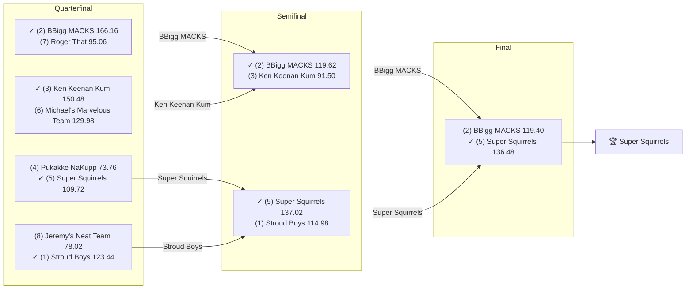

# 2023 Season

- **Champion:** Super Squirrels
- **Runner-Up:** BBigg MACKS
- **Regular Season Top Seed:** Stroud Boys
- **Toilet Bowl Winner:** Sharman’s Scorpions

## Final Standings

> **Finish** is Yahoo's final playoff-adjusted rank, so it does not follow W-L order: a team can win the title from a lower seed. **Playoff Seed** is the seed the team entered the playoffs with; a dash means it did not qualify.

| Finish | Team | Owner | W-L | PF | PA | Playoff Seed |
|--------|------|-------|-----|----|----|--------------|
| 1 | Super Squirrels | Super | 7-7 | 1588.64 | 1644.92 | 5 |
| 2 | BBigg MACKS | Naren | 11-3 | 1874.16 | 1444.54 | 2 |
| 3 | Stroud Boys | Tanmay | 11-3 | 1888.52 | 1619.28 | 1 |
| 4 | Ken Keenan Kum | lokesh | 8-6 | 1793.58 | 1771.36 | 3 |
| 5 | Pukakke NaKupp | Anish | 8-6 | 1755.32 | 1761.32 | 4 |
| 6 | Michael's Marvelous Team | Michael | 6-8 | 1562.06 | 1624.58 | 6 |
| 7 | Roger That | Pranav | 5-9 | 1663.92 | 1709.82 | 7 |
| 8 | Jeremy's Neat Team | Jeremy | 5-9 | 1602.5 | 1831.42 | 8 |
| 9 | varun’s victorious team | Varun | 5-9 | 1506.58 | 1627.12 | - |
| 10 | Sharman’s Scorpions | Sharman | 4-10 | 1365.16 | 1566.08 | - |

## Playoff Bracket

> The actual championship bracket, from captured weekly matchups. Seeds in parentheses; ✓ marks the winner. Consolation games are excluded, and a team that appears first in a later round had a bye.

## Team Rosters

> Post-draft and end-of-season lineups as Yahoo recorded them. Bench and IR rows are included; points are that week's score.

??? note "Super Squirrels"
    **Post-draft - week 1**

    | Slot | Player | Pos | Pts |
    |------|--------|-----|-----|
    | QB | [Trevor Lawrence](../players/trevor-lawrence.md) | QB | 18.74 |
    | RB | [Breece Hall](../players/breece-hall.md) | RB | 15.70 |
    | RB | [Khalil Herbert](../players/khalil-herbert.md) | RB | 11.40 |
    | WR | [DeVonta Smith](../players/devonta-smith.md) | WR | 17.70 |
    | WR | [Hollywood Brown](../players/hollywood-brown.md) | WR | 8.70 |
    | TE | [T.J. Hockenson](../players/t-j-hockenson.md) | TE | 11.50 |
    | W/R/T | [Brandon Aiyuk](../players/brandon-aiyuk.md) | WR | 32.90 |
    | K | [Daniel Carlson](../players/daniel-carlson.md) | K | 5.00 |
    | DEF | [Bills](../players/bills.md) | DEF | 5.00 |
    | BN | [Rashid Shaheed](../players/rashid-shaheed.md) | WR | 30.60 |
    | BN | [Gabe Davis](../players/gabe-davis.md) | WR | 5.20 |
    | BN | [Deon Jackson](../players/deon-jackson.md) | RB | 3.80 |
    | BN | [Zach Charbonnet](../players/zach-charbonnet.md) | RB | 1.10 |
    | BN | [Chig Okonkwo](../players/chig-okonkwo.md) | TE | 0.00 |
    | IR | [Cooper Kupp](../players/cooper-kupp.md) | WR | 0.00 |
    | IR | [Jonathan Taylor](../players/jonathan-taylor.md) | RB | 0.00 |
    | BN | [Rashaad Penny](../players/rashaad-penny.md) | RB | 0.00 |

    **End of season - week 17**

    | Slot | Player | Pos | Pts |
    |------|--------|-----|-----|
    | QB | [Matthew Stafford](../players/matthew-stafford.md) | QB | 14.58 |
    | RB | [Breece Hall](../players/breece-hall.md) | RB | 27.60 |
    | RB | [Jonathan Taylor](../players/jonathan-taylor.md) | RB | 17.40 |
    | WR | [Brandon Aiyuk](../players/brandon-aiyuk.md) | WR | 24.40 |
    | WR | [DeVonta Smith](../players/devonta-smith.md) | WR | 6.00 |
    | TE | [Tucker Kraft](../players/tucker-kraft.md) | TE | 10.80 |
    | W/R/T | [Cooper Kupp](../players/cooper-kupp.md) | WR | 12.70 |
    | K | [Matt Gay](../players/matt-gay.md) | K | 12.00 |
    | DEF | [Bears](../players/bears.md) | DEF | 11.00 |
    | BN | [Jerome Ford](../players/jerome-ford.md) | RB | 26.10 |
    | BN | [De'Von Achane](../players/de-von-achane.md) | RB | 23.70 |
    | BN | [Tua Tagovailoa](../players/tua-tagovailoa.md) | QB | 16.88 |
    | BN | [Gabe Davis](../players/gabe-davis.md) | WR | 4.10 |
    | BN | [T.J. Hockenson](../players/t-j-hockenson.md) | TE | 0.00 |
    | BN | [Trevor Lawrence](../players/trevor-lawrence.md) | QB | 0.00 |

??? note "BBigg MACKS"
    **Post-draft - week 1**

    | Slot | Player | Pos | Pts |
    |------|--------|-----|-----|
    | QB | [Geno Smith](../players/geno-smith.md) | QB | 9.08 |
    | RB | [Christian McCaffrey](../players/christian-mccaffrey.md) | RB | 25.90 |
    | RB | [J.K. Dobbins](../players/j-k-dobbins.md) | RB | 11.70 |
    | WR | [Chris Olave](../players/chris-olave.md) | WR | 19.20 |
    | WR | [Amon-Ra St. Brown](../players/amon-ra-st-brown.md) | WR | 19.10 |
    | TE | [David Njoku](../players/david-njoku.md) | TE | 4.40 |
    | W/R/T | [Calvin Ridley](../players/calvin-ridley.md) | WR | 24.10 |
    | K | [Graham Gano](../players/graham-gano.md) | K | 0.00 |
    | DEF | [Jaguars](../players/jaguars.md) | DEF | 11.00 |
    | BN | [Michael Pittman Jr.](../players/michael-pittman-jr.md) | WR | 23.70 |
    | BN | [James Conner](../players/james-conner.md) | RB | 12.00 |
    | BN | [Chris Godwin Jr.](../players/chris-godwin-jr.md) | WR | 10.10 |
    | BN | [George Pickens](../players/george-pickens.md) | WR | 8.60 |
    | BN | [Dak Prescott](../players/dak-prescott.md) | QB | 6.32 |
    | BN | [Alvin Kamara](../players/alvin-kamara.md) | RB | 0.00 |
    | IR | [Jeff Wilson Jr.](../players/jeff-wilson-jr.md) | RB | 0.00 |
    | IR | [Kyler Murray](../players/kyler-murray.md) | QB | 0.00 |

    **End of season - week 17**

    | Slot | Player | Pos | Pts |
    |------|--------|-----|-----|
    | QB | [Dak Prescott](../players/dak-prescott.md) | QB | 21.30 |
    | RB | [Christian McCaffrey](../players/christian-mccaffrey.md) | RB | 13.10 |
    | RB | [Alvin Kamara](../players/alvin-kamara.md) | RB | 6.90 |
    | WR | [Amon-Ra St. Brown](../players/amon-ra-st-brown.md) | WR | 22.10 |
    | WR | [Michael Pittman Jr.](../players/michael-pittman-jr.md) | WR | 9.60 |
    | TE | [Trey McBride](../players/trey-mcbride.md) | TE | 10.80 |
    | W/R/T | [Zamir White](../players/zamir-white.md) | RB | 15.60 |
    | K | [Brandon Aubrey](../players/brandon-aubrey.md) | K | 11.00 |
    | DEF | [Broncos](../players/broncos.md) | DEF | 9.00 |
    | BN | [Jaylen Warren](../players/jaylen-warren.md) | RB | 19.80 |
    | BN | [Chris Godwin Jr.](../players/chris-godwin-jr.md) | WR | 17.10 |
    | BN | [Sam LaPorta](../players/sam-laporta.md) | TE | 15.40 |
    | BN | [Calvin Ridley](../players/calvin-ridley.md) | WR | 7.90 |
    | BN | [Stefon Diggs](../players/stefon-diggs.md) | WR | 7.10 |
    | BN | [Raiders](../players/raiders.md) | DEF | 1.00 |

??? note "Stroud Boys"
    **Post-draft - week 1**

    | Slot | Player | Pos | Pts |
    |------|--------|-----|-----|
    | QB | [Lamar Jackson](../players/lamar-jackson.md) | QB | 7.56 |
    | RB | [Travis Etienne Jr.](../players/travis-etienne-jr.md) | RB | 21.40 |
    | RB | [James Cook III](../players/james-cook-iii.md) | RB | 10.30 |
    | WR | [Garrett Wilson](../players/garrett-wilson.md) | WR | 14.40 |
    | WR | [Ja'Marr Chase](../players/ja-marr-chase.md) | WR | 9.10 |
    | TE | [Evan Engram](../players/evan-engram.md) | TE | 9.90 |
    | W/R/T | [Skyy Moore](../players/skyy-moore.md) | WR | 0.40 |
    | K | [Jason Sanders](../players/jason-sanders.md) | K | 14.00 |
    | DEF | [Ravens](../players/ravens.md) | DEF | 11.00 |
    | BN | [Samaje Perine](../players/samaje-perine.md) | RB | 11.80 |
    | BN | [Deebo Samuel Sr.](../players/deebo-samuel-sr.md) | WR | 11.30 |
    | BN | [Mike Williams](../players/mike-williams.md) | WR | 8.50 |
    | BN | [Tank Bigsby](../players/tank-bigsby.md) | RB | 5.30 |
    | BN | [DJ Moore](../players/dj-moore.md) | WR | 4.50 |
    | BN | [D'Andre Swift](../players/d-andre-swift.md) | RB | 1.30 |

    **End of season - week 17**

    | Slot | Player | Pos | Pts |
    |------|--------|-----|-----|
    | QB | [Lamar Jackson](../players/lamar-jackson.md) | QB | 36.34 |
    | RB | [Kyren Williams](../players/kyren-williams.md) | RB | 30.10 |
    | RB | [Travis Etienne Jr.](../players/travis-etienne-jr.md) | RB | 25.80 |
    | WR | [DJ Moore](../players/dj-moore.md) | WR | 30.90 |
    | WR | [Justin Jefferson](../players/justin-jefferson.md) | WR | 10.90 |
    | TE | [David Njoku](../players/david-njoku.md) | TE | 17.40 |
    | W/R/T | [Deebo Samuel Sr.](../players/deebo-samuel-sr.md) | WR | 18.20 |
    | K | [Dustin Hopkins](../players/dustin-hopkins.md) | K | 0.00 |
    | DEF | [Chiefs](../players/chiefs.md) | DEF | 7.00 |
    | BN | [Jaguars](../players/jaguars.md) | DEF | 18.00 |
    | BN | [C.J. Stroud](../players/c-j-stroud.md) | QB | 12.92 |
    | BN | [Evan Engram](../players/evan-engram.md) | TE | 12.00 |
    | BN | [Devin Singletary](../players/devin-singletary.md) | RB | 11.60 |
    | BN | [D'Andre Swift](../players/d-andre-swift.md) | RB | 7.60 |
    | BN | [Ja'Marr Chase](../players/ja-marr-chase.md) | WR | 7.10 |
    | IR | [Mike Williams](../players/mike-williams.md) | WR | 0.00 |

??? note "Ken Keenan Kum"
    **Post-draft - week 1**

    | Slot | Player | Pos | Pts |
    |------|--------|-----|-----|
    | QB | [Patrick Mahomes](../players/patrick-mahomes.md) | QB | 20.54 |
    | RB | [Tony Pollard](../players/tony-pollard.md) | RB | 22.20 |
    | RB | [Jahmyr Gibbs](../players/jahmyr-gibbs.md) | RB | 8.00 |
    | WR | [Jordan Addison](../players/jordan-addison.md) | WR | 16.10 |
    | WR | [Keenan Allen](../players/keenan-allen.md) | WR | 14.20 |
    | TE | [Isaiah Likely](../players/isaiah-likely.md) | TE | 1.40 |
    | W/R/T | [Raheem Mostert](../players/raheem-mostert.md) | RB | 13.00 |
    | K | [Riley Patterson](../players/riley-patterson.md) | K | 3.00 |
    | DEF | [Packers](../players/packers.md) | DEF | 15.00 |
    | BN | [Diontae Johnson](../players/diontae-johnson.md) | WR | 7.80 |
    | BN | [Rachaad White](../players/rachaad-white.md) | RB | 6.90 |
    | BN | [Aaron Rodgers](../players/aaron-rodgers.md) | QB | 0.00 |
    | IR | [Christian Watson](../players/christian-watson.md) | WR | 0.00 |
    | BN | [Jerry Jeudy](../players/jerry-jeudy.md) | WR | 0.00 |
    | BN | [Travis Kelce](../players/travis-kelce.md) | TE | 0.00 |

    **End of season - week 17**

    | Slot | Player | Pos | Pts |
    |------|--------|-----|-----|
    | QB | [Patrick Mahomes](../players/patrick-mahomes.md) | QB | 12.00 |
    | RB | [Ezekiel Elliott](../players/ezekiel-elliott.md) | RB | 11.50 |
    | RB | [Rachaad White](../players/rachaad-white.md) | RB | 8.60 |
    | WR | [Jayden Reed](../players/jayden-reed.md) | WR | 26.90 |
    | WR | [Diontae Johnson](../players/diontae-johnson.md) | WR | 11.60 |
    | TE | [Travis Kelce](../players/travis-kelce.md) | TE | 4.60 |
    | W/R/T | [Adam Thielen](../players/adam-thielen.md) | WR | 9.80 |
    | K | [Jake Moody](../players/jake-moody.md) | K | 9.00 |
    | DEF | [Packers](../players/packers.md) | DEF | 12.00 |
    | BN | [Sam Howell](../players/sam-howell.md) | QB | 8.66 |
    | BN | [Tony Pollard](../players/tony-pollard.md) | RB | 5.90 |
    | BN | [Jordan Addison](../players/jordan-addison.md) | WR | 5.80 |
    | BN | [Jahmyr Gibbs](../players/jahmyr-gibbs.md) | RB | 5.30 |
    | IR | [Aaron Rodgers](../players/aaron-rodgers.md) | QB | 0.00 |
    | BN | [Keenan Allen](../players/keenan-allen.md) | WR | 0.00 |
    | BN | [Raheem Mostert](../players/raheem-mostert.md) | RB | 0.00 |

??? note "Pukakke NaKupp"
    **Post-draft - week 1**

    | Slot | Player | Pos | Pts |
    |------|--------|-----|-----|
    | QB | [Josh Allen](../players/josh-allen.md) | QB | 12.04 |
    | RB | [Aaron Jones Sr.](../players/aaron-jones-sr.md) | RB | 26.70 |
    | RB | [Derrick Henry](../players/derrick-henry.md) | RB | 13.90 |
    | WR | [Tyreek Hill](../players/tyreek-hill.md) | WR | 44.50 |
    | WR | [Drake London](../players/drake-london.md) | WR | 0.00 |
    | TE | [Darren Waller](../players/darren-waller.md) | TE | 6.60 |
    | W/R/T | [Cam Akers](../players/cam-akers.md) | RB | 8.90 |
    | K | [Evan McPherson](../players/evan-mcpherson.md) | K | 4.00 |
    | DEF | [Eagles](../players/eagles.md) | DEF | 13.00 |
    | BN | [Michael Thomas](../players/michael-thomas.md) | WR | 11.10 |
    | BN | [Dalvin Cook](../players/dalvin-cook.md) | RB | 8.90 |
    | BN | [Tank Dell](../players/tank-dell.md) | WR | 7.80 |
    | BN | [JuJu Smith-Schuster](../players/juju-smith-schuster.md) | WR | 7.30 |
    | BN | [Jamaal Williams](../players/jamaal-williams.md) | RB | 7.20 |
    | BN | [Van Jefferson](../players/van-jefferson.md) | WR | 6.40 |

    **End of season - week 17**

    | Slot | Player | Pos | Pts |
    |------|--------|-----|-----|
    | QB | [Josh Allen](../players/josh-allen.md) | QB | 22.16 |
    | RB | [Chuba Hubbard](../players/chuba-hubbard.md) | RB | 11.10 |
    | RB | [Derrick Henry](../players/derrick-henry.md) | RB | 4.20 |
    | WR | [Nico Collins](../players/nico-collins.md) | WR | 15.70 |
    | WR | [Tyreek Hill](../players/tyreek-hill.md) | WR | 13.60 |
    | TE | [Isaiah Likely](../players/isaiah-likely.md) | TE | 18.20 |
    | W/R/T | [Puka Nacua](../players/puka-nacua.md) | WR | 18.70 |
    | K | [Jason Myers](../players/jason-myers.md) | K | 13.00 |
    | DEF | [Eagles](../players/eagles.md) | DEF | 5.00 |
    | BN | [Rashee Rice](../players/rashee-rice.md) | WR | 17.70 |
    | BN | [Aaron Jones Sr.](../players/aaron-jones-sr.md) | RB | 14.00 |
    | BN | [Gus Edwards](../players/gus-edwards.md) | RB | 10.80 |
    | IR | [Darren Waller](../players/darren-waller.md) | TE | 10.10 |
    | BN | [Drake London](../players/drake-london.md) | WR | 9.60 |
    | BN | [Jonathan Mingo](../players/jonathan-mingo.md) | WR | 2.00 |
    | BN | [Russell Wilson](../players/russell-wilson.md) | QB | 0.00 |

??? note "Michael's Marvelous Team"
    **Post-draft - week 1**

    | Slot | Player | Pos | Pts |
    |------|--------|-----|-----|
    | QB | [Deshaun Watson](../players/deshaun-watson.md) | QB | 21.66 |
    | RB | [Rhamondre Stevenson](../players/rhamondre-stevenson.md) | RB | 14.90 |
    | RB | [Saquon Barkley](../players/saquon-barkley.md) | RB | 9.30 |
    | WR | [Mike Evans](../players/mike-evans.md) | WR | 18.60 |
    | WR | [CeeDee Lamb](../players/ceedee-lamb.md) | WR | 11.70 |
    | TE | [Gerald Everett](../players/gerald-everett.md) | TE | 4.30 |
    | W/R/T | [Terry McLaurin](../players/terry-mclaurin.md) | WR | 5.10 |
    | K | [Jason Myers](../players/jason-myers.md) | K | 8.00 |
    | BN | [Zay Flowers](../players/zay-flowers.md) | WR | 17.70 |
    | BN | [DeAndre Hopkins](../players/deandre-hopkins.md) | WR | 13.50 |
    | BN | [Courtland Sutton](../players/courtland-sutton.md) | WR | 13.20 |
    | BN | [Commanders](../players/commanders.md) | DEF | 11.00 |
    | BN | [Javonte Williams](../players/javonte-williams.md) | RB | 9.70 |
    | BN | [Jaxon Smith-Njigba](../players/jaxon-smith-njigba.md) | WR | 4.30 |
    | BN | [Quentin Johnston](../players/quentin-johnston.md) | WR | 2.90 |
    | IR | [Mark Andrews](../players/mark-andrews.md) | TE | 0.00 |

    **End of season - week 17**

    | Slot | Player | Pos | Pts |
    |------|--------|-----|-----|
    | QB | [Brock Purdy](../players/brock-purdy.md) | QB | 17.60 |
    | RB | [Saquon Barkley](../players/saquon-barkley.md) | RB | 8.80 |
    | RB | [Keaton Mitchell](../players/keaton-mitchell.md) | RB | 0.00 |
    | WR | [Terry McLaurin](../players/terry-mclaurin.md) | WR | 16.10 |
    | WR | [Mike Evans](../players/mike-evans.md) | WR | 10.00 |
    | TE | [Cade Otton](../players/cade-otton.md) | TE | 3.00 |
    | W/R/T | [CeeDee Lamb](../players/ceedee-lamb.md) | WR | 40.20 |
    | K | [Jason Sanders](../players/jason-sanders.md) | K | 7.00 |
    | DEF | [Bills](../players/bills.md) | DEF | 17.00 |
    | BN | [Zay Flowers](../players/zay-flowers.md) | WR | 19.60 |
    | BN | [DeAndre Hopkins](../players/deandre-hopkins.md) | WR | 14.20 |
    | BN | [Noah Brown](../players/noah-brown.md) | WR | 1.80 |
    | BN | [Christian Watson](../players/christian-watson.md) | WR | 0.00 |
    | BN | [Deshaun Watson](../players/deshaun-watson.md) | QB | 0.00 |
    | BN | [Rhamondre Stevenson](../players/rhamondre-stevenson.md) | RB | 0.00 |

??? note "Roger That"
    **Post-draft - week 1**

    | Slot | Player | Pos | Pts |
    |------|--------|-----|-----|
    | QB | [Daniel Jones](../players/daniel-jones.md) | QB | 6.46 |
    | RB | [Nick Chubb](../players/nick-chubb.md) | RB | 16.70 |
    | RB | [Joe Mixon](../players/joe-mixon.md) | RB | 10.30 |
    | WR | [A.J. Brown](../players/a-j-brown.md) | WR | 14.90 |
    | WR | [DK Metcalf](../players/dk-metcalf.md) | WR | 13.70 |
    | TE | [George Kittle](../players/george-kittle.md) | TE | 4.90 |
    | W/R/T | [Miles Sanders](../players/miles-sanders.md) | RB | 11.80 |
    | K | [Tyler Bass](../players/tyler-bass.md) | K | 13.00 |
    | DEF | [Cowboys](../players/cowboys.md) | DEF | 37.00 |
    | BN | [Kirk Cousins](../players/kirk-cousins.md) | QB | 17.46 |
    | BN | [Brian Robinson](../players/brian-robinson.md) | RB | 13.60 |
    | BN | [Isiah Pacheco](../players/isiah-pacheco.md) | RB | 9.40 |
    | BN | [Elijah Moore](../players/elijah-moore.md) | WR | 9.20 |
    | BN | [Dalton Kincaid](../players/dalton-kincaid.md) | TE | 6.60 |
    | BN | [Steelers](../players/steelers.md) | DEF | 4.00 |

    **End of season - week 17**

    | Slot | Player | Pos | Pts |
    |------|--------|-----|-----|
    | QB | [Jordan Love](../players/jordan-love.md) | QB | 28.44 |
    | RB | [Joe Mixon](../players/joe-mixon.md) | RB | 18.70 |
    | RB | [Ty Chandler](../players/ty-chandler.md) | RB | 9.40 |
    | WR | [DK Metcalf](../players/dk-metcalf.md) | WR | 15.60 |
    | WR | [A.J. Brown](../players/a-j-brown.md) | WR | 9.30 |
    | TE | [George Kittle](../players/george-kittle.md) | TE | 5.90 |
    | W/R/T | [Dalton Kincaid](../players/dalton-kincaid.md) | TE | 12.70 |
    | K | [Tyler Bass](../players/tyler-bass.md) | K | 9.00 |
    | DEF | [Cowboys](../players/cowboys.md) | DEF | 6.00 |
    | BN | [Isiah Pacheco](../players/isiah-pacheco.md) | RB | 29.50 |
    | BN | [Elijah Moore](../players/elijah-moore.md) | WR | 17.10 |
    | BN | [Derek Carr](../players/derek-carr.md) | QB | 15.58 |
    | BN | [Brian Robinson](../players/brian-robinson.md) | RB | 11.60 |
    | BN | [Tyler Boyd](../players/tyler-boyd.md) | WR | 4.90 |
    | BN | [Clyde Edwards-Helaire](../players/clyde-edwards-helaire.md) | RB | 0.00 |
    | IR | [Kirk Cousins](../players/kirk-cousins.md) | QB | 0.00 |

??? note "Jeremy's Neat Team"
    **Post-draft - week 1**

    | Slot | Player | Pos | Pts |
    |------|--------|-----|-----|
    | QB | [Jalen Hurts](../players/jalen-hurts.md) | QB | 12.50 |
    | RB | [Bijan Robinson](../players/bijan-robinson.md) | RB | 20.30 |
    | RB | [Alexander Mattison](../players/alexander-mattison.md) | RB | 13.40 |
    | WR | [Stefon Diggs](../players/stefon-diggs.md) | WR | 26.20 |
    | WR | [Tee Higgins](../players/tee-higgins.md) | WR | 0.00 |
    | TE | [Tyler Higbee](../players/tyler-higbee.md) | TE | 7.90 |
    | W/R/T | [Tyler Lockett](../players/tyler-lockett.md) | WR | 3.00 |
    | K | [Harrison Butker](../players/harrison-butker.md) | K | 8.00 |
    | DEF | [49ers](../players/49ers.md) | DEF | 13.00 |
    | BN | [Jared Goff](../players/jared-goff.md) | QB | 14.02 |
    | BN | [David Montgomery](../players/david-montgomery.md) | RB | 13.40 |
    | BN | [Kenny Gainwell](../players/kenny-gainwell.md) | RB | 11.40 |
    | BN | [Saints](../players/saints.md) | DEF | 10.00 |
    | BN | [Pat Freiermuth](../players/pat-freiermuth.md) | TE | 7.30 |
    | BN | [Treylon Burks](../players/treylon-burks.md) | WR | 4.70 |

    **End of season - week 17**

    | Slot | Player | Pos | Pts |
    |------|--------|-----|-----|
    | QB | [Jalen Hurts](../players/jalen-hurts.md) | QB | 20.18 |
    | RB | [Bijan Robinson](../players/bijan-robinson.md) | RB | 11.60 |
    | RB | [Javonte Williams](../players/javonte-williams.md) | RB | 8.80 |
    | WR | [Chris Olave](../players/chris-olave.md) | WR | 5.60 |
    | WR | [Tyler Lockett](../players/tyler-lockett.md) | WR | 2.00 |
    | TE | [Jake Ferguson](../players/jake-ferguson.md) | TE | 7.30 |
    | W/R/T | [David Montgomery](../players/david-montgomery.md) | RB | 12.50 |
    | K | [Harrison Butker](../players/harrison-butker.md) | K | 24.00 |
    | DEF | [Titans](../players/titans.md) | DEF | 2.00 |
    | BN | [James Conner](../players/james-conner.md) | RB | 26.30 |
    | BN | [George Pickens](../players/george-pickens.md) | WR | 20.10 |
    | BN | [Jared Goff](../players/jared-goff.md) | QB | 12.84 |
    | BN | [49ers](../players/49ers.md) | DEF | 9.00 |
    | BN | [Odell Beckham Jr.](../players/odell-beckham-jr.md) | WR | 4.30 |
    | BN | [Tee Higgins](../players/tee-higgins.md) | WR | 2.90 |

??? note "varun’s victorious team"
    **Post-draft - week 1**

    | Slot | Player | Pos | Pts |
    |------|--------|-----|-----|
    | QB | [Justin Herbert](../players/justin-herbert.md) | QB | 20.86 |
    | RB | [Josh Jacobs](../players/josh-jacobs.md) | RB | 9.10 |
    | RB | [Antonio Gibson](../players/antonio-gibson.md) | RB | 3.00 |
    | WR | [Justin Jefferson](../players/justin-jefferson.md) | WR | 24.00 |
    | WR | [Christian Kirk](../players/christian-kirk.md) | WR | 1.90 |
    | TE | [Dallas Goedert](../players/dallas-goedert.md) | TE | 0.00 |
    | W/R/T | [Brandin Cooks](../players/brandin-cooks.md) | WR | 4.20 |
    | K | [Younghoe Koo](../players/younghoe-koo.md) | K | 7.00 |
    | DEF | [Bengals](../players/bengals.md) | DEF | 7.00 |
    | BN | [Jaylen Waddle](../players/jaylen-waddle.md) | WR | 11.80 |
    | BN | [Brandon McManus](../players/brandon-mcmanus.md) | K | 8.00 |
    | BN | [Dameon Pierce](../players/dameon-pierce.md) | RB | 6.70 |
    | BN | [Joe Burrow](../players/joe-burrow.md) | QB | 3.18 |
    | BN | [Dalton Schultz](../players/dalton-schultz.md) | TE | 2.40 |
    | BN | [Dolphins](../players/dolphins.md) | DEF | 2.00 |

    **End of season - week 17**

    | Slot | Player | Pos | Pts |
    |------|--------|-----|-----|
    | QB | [Justin Herbert](../players/justin-herbert.md) | QB | 0.00 |
    | RB | [James Cook III](../players/james-cook-iii.md) | RB | 5.40 |
    | RB | [Josh Jacobs](../players/josh-jacobs.md) | RB | 0.00 |
    | WR | [Garrett Wilson](../players/garrett-wilson.md) | WR | 9.90 |
    | WR | [Jaylen Waddle](../players/jaylen-waddle.md) | WR | 0.00 |
    | TE | [Dallas Goedert](../players/dallas-goedert.md) | TE | 15.70 |
    | W/R/T | [Brandin Cooks](../players/brandin-cooks.md) | WR | 17.00 |
    | K | [Brandon McManus](../players/brandon-mcmanus.md) | K | 14.00 |
    | DEF | [Bengals](../players/bengals.md) | DEF | 4.00 |
    | BN | [Tyler Higbee](../players/tyler-higbee.md) | TE | 12.20 |
    | BN | [Kareem Hunt](../players/kareem-hunt.md) | RB | 9.10 |
    | BN | [Antonio Gibson](../players/antonio-gibson.md) | RB | 5.60 |
    | BN | [Dalton Schultz](../players/dalton-schultz.md) | TE | 3.90 |
    | BN | [Christian Kirk](../players/christian-kirk.md) | WR | 0.00 |
    | IR | [Joe Burrow](../players/joe-burrow.md) | QB | 0.00 |
    | BN | [Ray-Ray McCloud III](../players/ray-ray-mccloud-iii.md) | WR | 0.00 |

??? note "Sharman’s Scorpions"
    **Post-draft - week 1**

    | Slot | Player | Pos | Pts |
    |------|--------|-----|-----|
    | QB | [Justin Fields](../players/justin-fields.md) | QB | 15.54 |
    | RB | [Austin Ekeler](../players/austin-ekeler.md) | RB | 26.40 |
    | RB | [Najee Harris](../players/najee-harris.md) | RB | 5.30 |
    | WR | [Davante Adams](../players/davante-adams.md) | WR | 12.60 |
    | WR | [Amari Cooper](../players/amari-cooper.md) | WR | 6.70 |
    | TE | [Kyle Pitts Sr.](../players/kyle-pitts-sr.md) | TE | 6.40 |
    | W/R/T | [Kenneth Walker III](../players/kenneth-walker-iii.md) | RB | 10.70 |
    | K | [Justin Tucker](../players/justin-tucker.md) | K | 5.00 |
    | DEF | [Broncos](../players/broncos.md) | DEF | 3.00 |
    | BN | [Anthony Richardson Sr.](../players/anthony-richardson-sr.md) | QB | 21.92 |
    | BN | [Jets](../players/jets.md) | DEF | 20.00 |
    | BN | [Cole Kmet](../players/cole-kmet.md) | TE | 9.40 |
    | BN | [Jahan Dotson](../players/jahan-dotson.md) | WR | 9.00 |
    | BN | [Rashod Bateman](../players/rashod-bateman.md) | WR | 6.50 |
    | BN | [AJ Dillon](../players/aj-dillon.md) | RB | 5.60 |

    **End of season - week 17**

    | Slot | Player | Pos | Pts |
    |------|--------|-----|-----|
    | QB | [Justin Fields](../players/justin-fields.md) | QB | 25.22 |
    | RB | [Kenneth Walker III](../players/kenneth-walker-iii.md) | RB | 16.50 |
    | RB | [Austin Ekeler](../players/austin-ekeler.md) | RB | 4.00 |
    | WR | [Amari Cooper](../players/amari-cooper.md) | WR | 0.00 |
    | WR | [Courtland Sutton](../players/courtland-sutton.md) | WR | 0.00 |
    | TE | [Cole Kmet](../players/cole-kmet.md) | TE | 0.00 |
    | W/R/T | [Davante Adams](../players/davante-adams.md) | WR | 37.60 |
    | K | [Justin Tucker](../players/justin-tucker.md) | K | 8.00 |
    | DEF | [Browns](../players/browns.md) | DEF | 15.00 |
    | BN | [Najee Harris](../players/najee-harris.md) | RB | 24.20 |
    | BN | [Geno Smith](../players/geno-smith.md) | QB | 16.90 |
    | BN | [Rashod Bateman](../players/rashod-bateman.md) | WR | 9.40 |
    | BN | [AJ Dillon](../players/aj-dillon.md) | RB | 2.70 |
    | BN | [Kyle Pitts Sr.](../players/kyle-pitts-sr.md) | TE | 1.50 |
    | BN | [Jahan Dotson](../players/jahan-dotson.md) | WR | 0.00 |

## Awards

- **League Champion:** Super Squirrels
- **Most Valuable Player:** [Josh Allen](../players/josh-allen.md) - 8 wins swung
- **Finals MVP:** [Breece Hall](../players/breece-hall.md) - 27.60 pts ([Super Squirrels](../teams/super-squirrels.md))
- **Newcomer of the Year:** [Puka Nacua](../players/puka-nacua.md) - 4 wins swung
- **Undrafted Player of the Year:** [Puka Nacua](../players/puka-nacua.md) - 4 wins swung
- **Highest Single-Week Score:** Stroud Boys - 193.44 (Wk 5)
- **Lowest Single-Week Score:** Sharman’s Scorpions - 25.80 (Wk 13)
- **Best Draft Pick:** [Mike Evans](../players/mike-evans.md) (WR) - drafted by [Michael's Marvelous Team](../teams/michael-s-marvelous-team.md) at pick 92, finished +28 spots at the position, 277.30 pts
- **Biggest Bust:** [Nick Chubb](../players/nick-chubb.md) (RB) - drafted by [Roger That](../teams/roger-that.md) at pick 7, finished -31 spots at the position, 23.10 pts

## Team of the Season

The best starting lineup the season produced, one selection per slot the league actually starts. A slot is won the same way the MVP is: by wins swung, the games a team won by less than the player scored from the starting lineup. The flex takes the best eligible player the position slots did not already claim.

| Slot | Player | Pos | Wins Swung | Points in Them | Rostered By |
|------|--------|-----|------------|----------------|-------------|
| QB | [Josh Allen](../players/josh-allen.md) | QB | 8 | 210.22 | [Pukakke NaKupp](../teams/pukakke-nakupp.md) |
| RB | [Breece Hall](../players/breece-hall.md) | RB | 5 | 135.70 | [Super Squirrels](../teams/super-squirrels.md) |
|  | [Derrick Henry](../players/derrick-henry.md) | RB | 5 | 66.38 | [Pukakke NaKupp](../teams/pukakke-nakupp.md) |
| WR | [Brandon Aiyuk](../players/brandon-aiyuk.md) | WR | 5 | 86.10 | [Super Squirrels](../teams/super-squirrels.md) |
|  | [CeeDee Lamb](../players/ceedee-lamb.md) | WR | 4 | 124.40 | [Michael's Marvelous Team](../teams/michael-s-marvelous-team.md) |
| TE | [T.J. Hockenson](../players/t-j-hockenson.md) | TE | 4 | 64.70 | [Super Squirrels](../teams/super-squirrels.md) |
| W/R/T | [Tyreek Hill](../players/tyreek-hill.md) | WR | 4 | 103.70 | [Pukakke NaKupp](../teams/pukakke-nakupp.md) |
| K | [Jake Elliott](../players/jake-elliott.md) | K | 3 | 33.00 | [Super Squirrels](../teams/super-squirrels.md) |
| DEF | [Eagles](../players/eagles.md) | DEF | 3 | 24.00 | [Pukakke NaKupp](../teams/pukakke-nakupp.md) |

> Every award here is computed, not voted. **MVP** is the player who swung the most wins: games their team won by less than the player scored from the starting lineup. **Finals MVP** is the top scorer in the title game's winning lineup. **Newcomer of the Year** is the same wins-swung measure among players making their first appearance on a Pine Hills roster - a league debut, not an NFL rookie season, which the captured data does not record. **Undrafted Player of the Year** is the same measure among players nobody took in that year's draft. **Best Draft Pick** and **Biggest Bust** compare, within a position, where a player was taken against where they finished on season points; Bust is restricted to rounds 1-3.

## The Story of the Year

_TBD - add the defining moments._

## Related

- [Seasons](index.md) · [2023 Draft](../draft/2023-draft.md) · [Teams](../teams/index.md) · [Records](../records/index.md) · [Lore](../lore.md) · [Playoffs](../playoffs.md)
