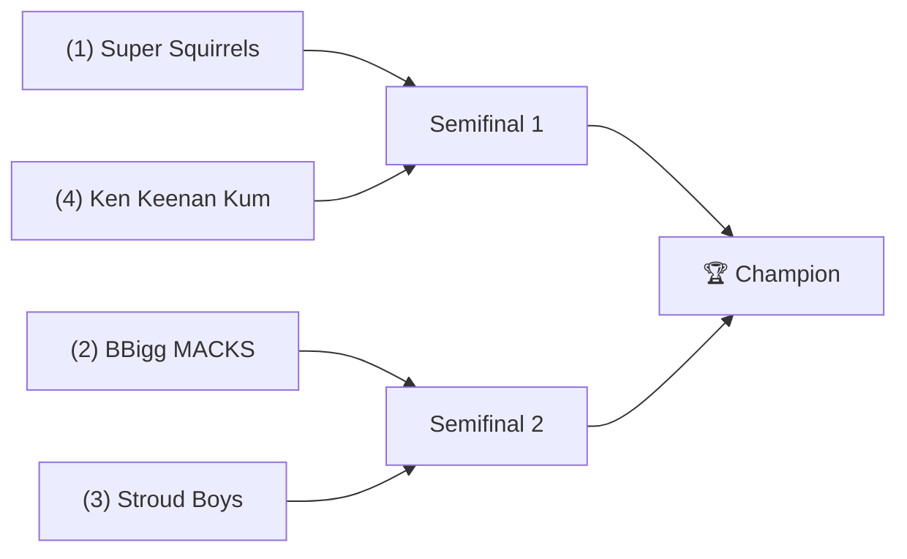

# 🏈 2023 Season

- **Champion:** _TBD_
- **Runner-Up:** _TBD_
- **Regular Season Top Seed:** _TBD_
- **Toilet Bowl Winner:** _TBD_

## Final Standings

> Auto-generated from Yahoo standings. Owners and playoff results are filled from the league bible (`raw/bible.yaml`); _TBD_ means not yet recorded. **Finish** is the standing recorded in the source export and does not always follow W-L order.

| Finish | Team | Owner | W-L | PF | PA | Playoff Seed |
|--------|------|-------|-----|----|----|--------------|
| 1 | Super Squirrels | _TBD_ | 7-7 | 1588.64 | 1644.92 | 1 |
| 2 | BBigg MACKS | _TBD_ | 11-3 | 1874.16 | 1444.54 | 2 |
| 3 | Stroud Boys | _TBD_ | 11-3 | 1888.52 | 1619.28 | 3 |
| 4 | Ken Keenan Kum | _TBD_ | 8-6 | 1793.58 | 1771.36 | 4 |
| 5 | Pukakke NaKupp | _TBD_ | 8-6 | 1755.32 | 1761.32 | - |
| 6 | Michael's Marvelous Team | _TBD_ | 6-8 | 1562.06 | 1624.58 | - |
| 7 | Roger That | _TBD_ | 5-9 | 1663.92 | 1709.82 | - |
| 8 | Jeremy's Neat Team | _TBD_ | 5-9 | 1602.5 | 1831.42 | - |
| 9 | varun’s victorious team | _TBD_ | 5-9 | 1506.58 | 1627.12 | - |
| 10 | Sharman’s Scorpions | _TBD_ | 4-10 | 1365.16 | 1566.08 | - |

## Playoff Bracket

> Playoff results are recorded in the league bible. Add `champions: { 2023: { champion: ..., runner_up: ... } }` to `raw/bible.yaml` to populate this section.

## Team Rosters

| Team | Post-Draft Roster | End-of-Season Roster |
|------|-------------------|----------------------|

## Awards

- 🏆 **League Champion:** _TBD_
- 💥 **Highest Single-Week Score:** _TBD_
- 📉 **Lowest Single-Week Score:** _TBD_
- 🔥 **Biggest Bust:** _TBD_
- 🎯 **Best Draft Pick:** _TBD_
- 🍗 **"Poultry Controversy" Nominee:** _TBD_

## The Story of the Year

_TBD - add the defining moments._

## Related

- [Seasons](index.md) · [2023 Draft](../draft/2023-draft.md) · [Teams](../teams/index.md) · [Records](../records/index.md) · Lore · [Playoffs](../playoffs.md)
