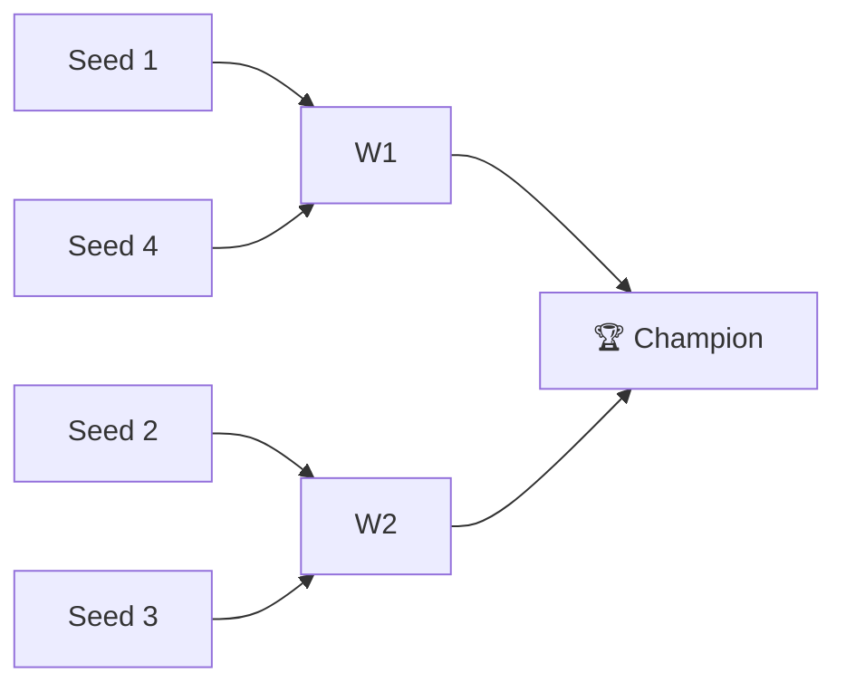

# 🏈 2024 Season

**Champion:** _TBD_
**Runner-Up:** _TBD_
**Regular Season Top Seed:** _TBD_
**Toilet Bowl Winner:** _TBD_

## Final Standings

> Auto-generated from Yahoo standings. Owners and playoff results are filled from the league bible (`raw/bible.yaml`); `_TBD_` means not yet recorded.

| Rank | Team | Owner | W–L | PF | PA | Playoff Seed |
|------|------|-------|-----|----|----|--------------|
| 1 | Stroud Boys | _TBD_ | 8–6 | 1688.16 | 1665.3 | 1 |
| 2 | Jayesh's Great Team | _TBD_ | 6–8 | 1421.08 | 1658.9 | 2 |
| 3 | varun’s victorious team | _TBD_ | 8–6 | 1689.9 | 1385.9 | 3 |
| 4 | Kaushal's Potatoes | _TBD_ | 8–6 | 1625.8 | 1571.04 | 4 |
| 5 | Big black big back | _TBD_ | 9–5 | 1730.3 | 1519.7 | — |
| 6 | Kamara’s a b*tch | _TBD_ | 11–3 | 1749.22 | 1589.04 | — |
| 7 | Joe Sheisty | _TBD_ | 9–5 | 1686.9 | 1478.74 | — |
| 8 | Super Squirrels | _TBD_ | 11–3 | 1723.42 | 1401.42 | — |
| 9 | Sharman’s Scorpions | _TBD_ | 5–9 | 1566.7 | 1662.7 | — |
| 10 | Jeremy's Neat Team | _TBD_ | 4–10 | 1537.98 | 1694.6 | — |
| 11 | Michael's Marvelous Team | _TBD_ | 3–11 | 1386.14 | 1803.18 | — |
| 12 | Roger That | _TBD_ | 2–12 | 1293.38 | 1668.46 | — |

## Playoff Bracket

> Playoff results are recorded in the league bible. Add `champions: { 2024: { champion: ..., runner_up: ... } }` to `raw/bible.yaml` to populate this section.

## Team Rosters

| Team | Post-Draft Roster | End-of-Season Roster |
|------|-------------------|----------------------|

## Awards

- 🏆 **League Champion:** _TBD_
- 💥 **Highest Single-Week Score:** _TBD_
- 📉 **Lowest Single-Week Score:** _TBD_
- 🔥 **Biggest Bust:** _TBD_
- 🎯 **Best Draft Pick:** _TBD_
- 🍗 **"Poultry Controversy" Nominee:** _TBD_

## The Story of the Year

_TBD — add the defining moments._

## Related

- [Seasons](index.md) · [2024 Draft](#) · [Teams](../teams/index.md) · [Records](../records/index.md) · [Lore](#) · [Playoffs](../playoffs.md)
