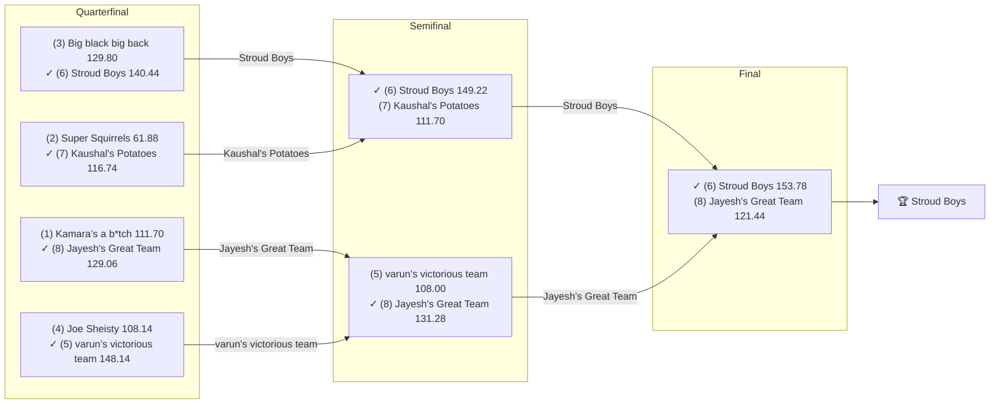

# 🏈 2024 Season

- **Champion:** Stroud Boys
- **Runner-Up:** Jayesh's Great Team
- **Regular Season Top Seed:** Kamara’s a b*tch
- **Toilet Bowl Winner:** Roger That

## Final Standings

> Auto-generated from Yahoo. **Finish** is Yahoo's final playoff-adjusted rank, so it does not follow W-L order - a team can win the title from a lower seed. **Playoff Seed** is the seed the team actually entered the playoffs with; - means it did not qualify.

| Finish | Team | Owner | W-L | PF | PA | Playoff Seed |
|--------|------|-------|-----|----|----|--------------|
| 1 | Stroud Boys | Tanmay | 8-6 | 1688.16 | 1665.3 | 6 |
| 2 | Jayesh's Great Team | Jayesh | 6-8 | 1421.08 | 1658.9 | 8 |
| 3 | varun’s victorious team | Varun | 8-6 | 1689.9 | 1385.9 | 5 |
| 4 | Kaushal's Potatoes | Kaushal | 8-6 | 1625.8 | 1571.04 | 7 |
| 5 | Big black big back | lokesh | 9-5 | 1730.3 | 1519.7 | 3 |
| 6 | Kamara’s a b*tch | Naren | 11-3 | 1749.22 | 1589.04 | 1 |
| 7 | Joe Sheisty | Anish | 9-5 | 1686.9 | 1478.74 | 4 |
| 8 | Super Squirrels | Super | 11-3 | 1723.42 | 1401.42 | 2 |
| 9 | Sharman’s Scorpions | Sharman | 5-9 | 1566.7 | 1662.7 | - |
| 10 | Jeremy's Neat Team | Jeremy | 4-10 | 1537.98 | 1694.6 | - |
| 11 | Michael's Marvelous Team | Michael | 3-11 | 1386.14 | 1803.18 | - |
| 12 | Roger That | Pranav | 2-12 | 1293.38 | 1668.46 | - |

## Playoff Bracket

> The actual championship bracket, from captured weekly matchups. Seeds in parentheses; ✓ marks the winner. Consolation games are excluded, and a team that appears first in a later round had a bye.

## Team Rosters

> Post-draft and end-of-season lineups as Yahoo recorded them. Bench and IR rows are included; points are that week's score.

??? note "Stroud Boys"
    **Post-draft - week 1**

    | Slot | Player | Pos | Pts |
    |------|--------|-----|-----|
    | QB | Jayden Daniels | QB | 28.16 |
    | RB | Saquon Barkley | RB | 33.20 |
    | RB | James Conner | RB | 19.30 |
    | WR | Garrett Wilson | WR | 12.00 |
    | WR | DJ Moore | WR | 10.00 |
    | TE | Dallas Goedert | TE | 7.10 |
    | W/R/T | DeVonta Smith | WR | 15.40 |
    | K | Tyler Bass | K | 10.00 |
    | DEF | Bills | DEF | 5.00 |
    | BN | Trevor Lawrence | QB | 11.28 |
    | BN | Colts | DEF | 5.00 |
    | BN | DeAndre Hopkins | WR | 1.80 |
    | BN | Khalil Herbert | RB | 0.40 |
    | BN | Luke Musgrave | TE | 0.00 |
    | BN | Tee Higgins | WR | 0.00 |

    **End of season - week 17**

    | Slot | Player | Pos | Pts |
    |------|--------|-----|-----|
    | QB | Jayden Daniels | QB | 32.78 |
    | RB | Saquon Barkley | RB | 18.90 |
    | RB | James Conner | RB | 2.80 |
    | WR | Tee Higgins | WR | 40.10 |
    | WR | DJ Moore | WR | 12.20 |
    | TE | Grant Calcaterra | TE | 4.40 |
    | W/R/T | Garrett Wilson | WR | 17.60 |
    | K | Chase McLaughlin | K | 12.00 |
    | DEF | Bills | DEF | 13.00 |
    | BN | DeVonta Smith | WR | 30.00 |
    | BN | Tre Tucker | WR | 13.70 |
    | BN | Keenan Allen | WR | 7.50 |
    | BN | Commanders | DEF | 4.00 |
    | BN | Dallas Goedert | TE | 0.00 |
    | BN | Trevor Lawrence | QB | 0.00 |

??? note "Jayesh's Great Team"
    **Post-draft - week 1**

    | Slot | Player | Pos | Pts |
    |------|--------|-----|-----|
    | QB | Kyler Murray | QB | 14.18 |
    | RB | Bijan Robinson | RB | 16.10 |
    | RB | James Cook III | RB | 13.30 |
    | WR | Brandon Aiyuk | WR | 4.80 |
    | WR | Drake London | WR | 3.50 |
    | TE | David Njoku | TE | 8.40 |
    | W/R/T | Diontae Johnson | WR | 3.90 |
    | K | Ka'imi Fairbairn | K | 17.00 |
    | DEF | Browns | DEF | 2.00 |
    | BN | Matthew Stafford | QB | 15.68 |
    | BN | Austin Ekeler | RB | 15.00 |
    | BN | Brian Thomas Jr. | WR | 14.70 |
    | BN | Tyler Lockett | WR | 13.70 |
    | BN | Broncos | DEF | 10.00 |
    | BN | Cole Kmet | TE | 1.40 |

    **End of season - week 17**

    | Slot | Player | Pos | Pts |
    |------|--------|-----|-----|
    | QB | Kyler Murray | QB | 18.04 |
    | RB | Bijan Robinson | RB | 24.80 |
    | RB | James Cook III | RB | 11.30 |
    | WR | Brian Thomas Jr. | WR | 23.90 |
    | WR | Drake London | WR | 17.60 |
    | TE | T.J. Hockenson | TE | 11.80 |
    | W/R/T | Tyler Lockett | WR | 5.00 |
    | K | Ka'imi Fairbairn | K | 0.00 |
    | DEF | Jaguars | DEF | 9.00 |
    | BN | Matthew Stafford | QB | 9.16 |
    | BN | Austin Ekeler | RB | 0.00 |
    | BN | Brandon Aiyuk | WR | 0.00 |
    | BN | Brenton Strange | TE | 0.00 |
    | BN | Cole Kmet | TE | 0.00 |
    | BN | Diontae Johnson | WR | 0.00 |

??? note "varun’s victorious team"
    **Post-draft - week 1**

    | Slot | Player | Pos | Pts |
    |------|--------|-----|-----|
    | QB | Dak Prescott | QB | 11.46 |
    | RB | Josh Jacobs | RB | 12.40 |
    | RB | D'Andre Swift | RB | 5.00 |
    | WR | CeeDee Lamb | WR | 13.60 |
    | WR | Chris Olave | WR | 3.10 |
    | TE | Trey McBride | TE | 8.00 |
    | W/R/T | Terry McLaurin | WR | 3.70 |
    | K | Jake Elliott | K | 10.00 |
    | DEF | Bears | DEF | 24.00 |
    | BN | Ezekiel Elliott | RB | 12.90 |
    | BN | Kirk Cousins | QB | 8.20 |
    | BN | Courtland Sutton | WR | 7.80 |
    | BN | Jordan Addison | WR | 6.50 |
    | BN | Chiefs | DEF | 4.00 |
    | BN | Cade Otton | TE | 1.50 |

    **End of season - week 17**

    | Slot | Player | Pos | Pts |
    |------|--------|-----|-----|
    | QB | Geno Smith | QB | 8.30 |
    | RB | D'Andre Swift | RB | 12.10 |
    | RB | Josh Jacobs | RB | 10.90 |
    | WR | Courtland Sutton | WR | 16.50 |
    | WR | Terry McLaurin | WR | 1.50 |
    | TE | Trey McBride | TE | 30.30 |
    | W/R/T | Ray-Ray McCloud III | WR | 3.70 |
    | K | Zane Gonzalez | K | 6.00 |
    | DEF | Chiefs | DEF | 13.00 |
    | BN | Cameron Dicker | K | 17.00 |
    | BN | Tyjae Spears | RB | 13.30 |
    | BN | Bears | DEF | 12.00 |
    | BN | DeAndre Hopkins | WR | 2.70 |
    | BN | CeeDee Lamb | WR | 0.00 |
    | IR | Christian Kirk | WR | 0.00 |
    | IR | Dak Prescott | QB | 0.00 |
    | BN | Tua Tagovailoa | QB | 0.00 |

??? note "Kaushal's Potatoes"
    **Post-draft - week 1**

    | Slot | Player | Pos | Pts |
    |------|--------|-----|-----|
    | QB | Patrick Mahomes | QB | 16.14 |
    | RB | Joe Mixon | RB | 26.80 |
    | RB | Aaron Jones Sr. | RB | 18.90 |
    | WR | A.J. Brown | WR | 22.90 |
    | WR | Marvin Harrison Jr. | WR | 1.40 |
    | TE | Evan Engram | TE | 1.50 |
    | W/R/T | Keon Coleman | WR | 9.10 |
    | K | Justin Tucker | K | 8.00 |
    | DEF | Texans | DEF | 4.00 |
    | BN | J.K. Dobbins | RB | 22.90 |
    | BN | Brock Bowers | TE | 11.80 |
    | BN | Jakobi Meyers | WR | 9.40 |
    | BN | Caleb Williams | QB | 7.22 |
    | BN | Joshua Palmer | WR | 3.50 |
    | BN | Jonathon Brooks | RB | 0.00 |

    **End of season - week 17**

    | Slot | Player | Pos | Pts |
    |------|--------|-----|-----|
    | QB | Caleb Williams | QB | 7.58 |
    | RB | Aaron Jones Sr. | RB | 11.70 |
    | RB | Joe Mixon | RB | 5.90 |
    | WR | Marvin Harrison Jr. | WR | 15.60 |
    | WR | A.J. Brown | WR | 12.60 |
    | TE | Brock Bowers | TE | 14.60 |
    | W/R/T | Jakobi Meyers | WR | 17.10 |
    | K | Justin Tucker | K | 9.00 |
    | DEF | Texans | DEF | 2.00 |
    | BN | Patrick Mahomes | QB | 26.00 |
    | IR | J.K. Dobbins | RB | 15.30 |
    | BN | Keon Coleman | WR | 11.70 |
    | BN | Cam Akers | RB | 11.30 |
    | BN | Joshua Palmer | WR | 8.10 |
    | BN | Tyler Bass | K | 8.00 |
    | BN | Evan Engram | TE | 0.00 |

??? note "Big black big back"
    **Post-draft - week 1**

    | Slot | Player | Pos | Pts |
    |------|--------|-----|-----|
    | QB | Lamar Jackson | QB | 25.12 |
    | RB | Rhamondre Stevenson | RB | 21.60 |
    | RB | Kyren Williams | RB | 14.40 |
    | WR | Justin Jefferson | WR | 15.90 |
    | WR | Tank Dell | WR | 8.90 |
    | TE | Sam LaPorta | TE | 8.50 |
    | W/R/T | Chris Godwin Jr. | WR | 22.30 |
    | K | Jake Moody | K | 26.00 |
    | DEF | Bengals | DEF | 2.00 |
    | BN | Jameson Williams | WR | 24.40 |
    | BN | Justin Herbert | QB | 10.36 |
    | BN | Jaylen Warren | RB | 4.00 |
    | BN | Ravens | DEF | 4.00 |
    | BN | Noah Fant | TE | 3.10 |
    | BN | Trey Benson | RB | 2.80 |

    **End of season - week 17**

    | Slot | Player | Pos | Pts |
    |------|--------|-----|-----|
    | QB | Lamar Jackson | QB | 29.42 |
    | RB | Kyren Williams | RB | 16.20 |
    | RB | Tank Bigsby | RB | 3.30 |
    | WR | Jameson Williams | WR | 24.50 |
    | WR | Justin Jefferson | WR | 17.20 |
    | TE | Jonnu Smith | TE | 11.60 |
    | W/R/T | Jaylen Warren | RB | 16.20 |
    | K | Jake Bates | K | 11.00 |
    | DEF | Packers | DEF | 3.00 |
    | BN | Justin Herbert | QB | 24.44 |
    | BN | Sam LaPorta | TE | 18.40 |
    | BN | Dalton Kincaid | TE | 4.40 |
    | BN | Rhamondre Stevenson | RB | 0.10 |
    | BN | Tank Dell | WR | 0.00 |

??? note "Kamara’s a b*tch"
    **Post-draft - week 1**

    | Slot | Player | Pos | Pts |
    |------|--------|-----|-----|
    | QB | Jalen Hurts | QB | 18.42 |
    | RB | Jahmyr Gibbs | RB | 17.40 |
    | RB | Jonathan Taylor | RB | 10.80 |
    | WR | George Pickens | WR | 13.50 |
    | WR | Michael Pittman Jr. | WR | 7.10 |
    | TE | Jonnu Smith | TE | 1.70 |
    | W/R/T | Alvin Kamara | RB | 22.00 |
    | K | Jason Myers | K | 10.00 |
    | DEF | Seahawks | DEF | 9.00 |
    | BN | Tua Tagovailoa | QB | 18.62 |
    | BN | Brian Robinson | RB | 17.90 |
    | BN | Colby Parkinson | TE | 8.70 |
    | BN | Keenan Allen | WR | 6.90 |
    | BN | Christian Kirk | WR | 4.00 |
    | BN | Rome Odunze | WR | 2.10 |
    | IR | Nick Chubb | RB | 0.00 |
    | IR | T.J. Hockenson | TE | 0.00 |

    **End of season - week 17**

    | Slot | Player | Pos | Pts |
    |------|--------|-----|-----|
    | QB | Bryce Young | QB | 16.92 |
    | RB | Jonathan Taylor | RB | 27.60 |
    | RB | Jerome Ford | RB | 4.50 |
    | WR | Jauan Jennings | WR | 13.70 |
    | WR | George Pickens | WR | 8.00 |
    | TE | Tucker Kraft | TE | 7.30 |
    | W/R/T | Jahmyr Gibbs | RB | 26.30 |
    | K | Chris Boswell | K | 4.00 |
    | DEF | Colts | DEF | -4.00 |
    | BN | Michael Pittman Jr. | WR | 25.90 |
    | BN | Jalen McMillan | WR | 23.00 |
    | BN | Brian Robinson | RB | 8.90 |
    | BN | Darnell Mooney | WR | 5.70 |
    | BN | Kendre Miller | RB | 2.90 |
    | BN | Alvin Kamara | RB | 0.00 |
    | IR | Chris Olave | WR | 0.00 |
    | IR | Jalen Hurts | QB | 0.00 |

??? note "Joe Sheisty"
    **Post-draft - week 1**

    | Slot | Player | Pos | Pts |
    |------|--------|-----|-----|
    | QB | Joe Burrow | QB | 8.06 |
    | RB | Jerome Ford | RB | 18.90 |
    | RB | Isiah Pacheco | RB | 15.80 |
    | WR | Ja'Marr Chase | WR | 12.20 |
    | WR | Jaxon Smith-Njigba | WR | 3.90 |
    | TE | Travis Kelce | TE | 6.40 |
    | W/R/T | Zay Flowers | WR | 11.10 |
    | K | Younghoe Koo | K | 4.00 |
    | DEF | Jets | DEF | 2.00 |
    | BN | Isaiah Likely | TE | 26.10 |
    | BN | Malik Nabers | WR | 11.60 |
    | BN | Aaron Rodgers | QB | 9.58 |
    | BN | Romeo Doubs | WR | 9.00 |
    | BN | Rico Dowdle | RB | 4.20 |
    | BN | Raheem Mostert | RB | 3.90 |

    **End of season - week 17**

    | Slot | Player | Pos | Pts |
    |------|--------|-----|-----|
    | QB | Joe Burrow | QB | 36.98 |
    | RB | Rico Dowdle | RB | 9.80 |
    | RB | Isiah Pacheco | RB | 1.80 |
    | WR | Malik Nabers | WR | 36.10 |
    | WR | Ja'Marr Chase | WR | 19.20 |
    | TE | Travis Kelce | TE | 22.40 |
    | W/R/T | Jaxon Smith-Njigba | WR | 6.20 |
    | K | Jake Elliott | K | 11.00 |
    | DEF | 49ers | DEF | 0.00 |
    | BN | Adam Thielen | WR | 28.00 |
    | BN | Wan'Dale Robinson | WR | 18.10 |
    | BN | Isaiah Likely | TE | 7.90 |
    | BN | Zay Flowers | WR | 5.10 |
    | BN | Alexander Mattison | RB | 4.80 |
    | BN | Devaughn Vele | WR | 4.70 |

??? note "Super Squirrels"
    **Post-draft - week 1**

    | Slot | Player | Pos | Pts |
    |------|--------|-----|-----|
    | QB | Brock Purdy | QB | 10.34 |
    | RB | David Montgomery | RB | 16.30 |
    | RB | Derrick Henry | RB | 10.60 |
    | WR | Puka Nacua | WR | 8.20 |
    | WR | DK Metcalf | WR | 5.90 |
    | TE | George Kittle | TE | 8.00 |
    | W/R/T | Jaylen Waddle | WR | 16.20 |
    | K | Evan McPherson | K | 6.00 |
    | DEF | 49ers | DEF | 6.00 |
    | BN | Jayden Reed | WR | 33.10 |
    | BN | Rashid Shaheed | WR | 25.60 |
    | BN | Geno Smith | QB | 18.84 |
    | BN | Packers | DEF | 7.00 |
    | BN | Taysom Hill | QB | 4.60 |
    | BN | Gus Edwards | RB | 3.80 |

    **End of season - week 17**

    | Slot | Player | Pos | Pts |
    |------|--------|-----|-----|
    | QB | Brock Purdy | QB | 32.28 |
    | RB | Derrick Henry | RB | 24.50 |
    | RB | Tyrone Tracy Jr. | RB | 9.30 |
    | WR | Puka Nacua | WR | 22.90 |
    | WR | DK Metcalf | WR | 7.20 |
    | TE | George Kittle | TE | 19.20 |
    | W/R/T | Josh Downs | WR | 5.20 |
    | K | Harrison Butker | K | 5.00 |
    | DEF | Ravens | DEF | 17.00 |
    | BN | Bo Nix | QB | 22.86 |
    | BN | Xavier Legette | WR | 7.80 |
    | BN | Braelon Allen | RB | 2.60 |
    | BN | Jayden Reed | WR | 1.60 |
    | BN | David Montgomery | RB | 0.00 |
    | BN | Jaylen Waddle | WR | 0.00 |
    | IR | Rashid Shaheed | WR | 0.00 |

??? note "Sharman’s Scorpions"
    **Post-draft - week 1**

    | Slot | Player | Pos | Pts |
    |------|--------|-----|-----|
    | QB | Anthony Richardson Sr. | QB | 27.08 |
    | RB | De'Von Achane | RB | 23.00 |
    | RB | Christian McCaffrey | RB | 0.00 |
    | WR | Stefon Diggs | WR | 21.90 |
    | WR | Nico Collins | WR | 17.70 |
    | TE | Kyle Pitts Sr. | TE | 11.60 |
    | W/R/T | Ladd McConkey | WR | 14.90 |
    | K | Harrison Butker | K | 9.00 |
    | DEF | Steelers | DEF | 12.00 |
    | BN | Zack Moss | RB | 14.10 |
    | BN | Will Levis | QB | 8.68 |
    | BN | Chase Brown | RB | 5.30 |
    | BN | Dalton Schultz | TE | 4.60 |
    | BN | Zamir White | RB | 4.60 |
    | BN | Eagles | DEF | 3.00 |

    **End of season - week 17**

    | Slot | Player | Pos | Pts |
    |------|--------|-----|-----|
    | QB | Sam Darnold | QB | 25.78 |
    | RB | Chase Brown | RB | 13.10 |
    | RB | De'Von Achane | RB | 5.80 |
    | WR | Jordan Addison | WR | 18.90 |
    | WR | Nico Collins | WR | 8.90 |
    | TE | Kyle Pitts Sr. | TE | 14.40 |
    | W/R/T | Ladd McConkey | WR | 29.40 |
    | K | Chad Ryland | K | 3.00 |
    | DEF | Eagles | DEF | 19.00 |
    | BN | Jerry Jeudy | WR | 21.40 |
    | BN | Quentin Johnston | WR | 9.80 |
    | BN | Dalton Schultz | TE | 4.10 |
    | BN | Jake Ferguson | TE | 2.80 |
    | IR | Zack Moss | RB | 0.00 |
    | BN | Steelers | DEF | -1.00 |

??? note "Jeremy's Neat Team"
    **Post-draft - week 1**

    | Slot | Player | Pos | Pts |
    |------|--------|-----|-----|
    | QB | Jordan Love | QB | 17.40 |
    | RB | Kenneth Walker III | RB | 18.90 |
    | RB | Javonte Williams | RB | 3.30 |
    | WR | Tyreek Hill | WR | 27.10 |
    | WR | Mike Evans | WR | 23.10 |
    | TE | Mark Andrews | TE | 3.40 |
    | W/R/T | Cooper Kupp | WR | 32.00 |
    | K | Brandon Aubrey | K | 21.00 |
    | DEF | Dolphins | DEF | 6.00 |
    | BN | Saints | DEF | 14.00 |
    | BN | Khalil Shakir | WR | 13.20 |
    | BN | Jared Goff | QB | 12.38 |
    | BN | Zach Charbonnet | RB | 12.10 |
    | BN | Devin Singletary | RB | 9.20 |
    | BN | Hunter Henry | TE | 3.80 |

    **End of season - week 17**

    | Slot | Player | Pos | Pts |
    |------|--------|-----|-----|
    | QB | Jared Goff | QB | 25.82 |
    | RB | Bucky Irving | RB | 23.00 |
    | RB | Kenneth Walker III | RB | 0.00 |
    | WR | Tyreek Hill | WR | 21.30 |
    | WR | Cooper Kupp | WR | 3.90 |
    | TE | Zach Ertz | TE | 25.20 |
    | W/R/T | Mike Evans | WR | 29.70 |
    | K | Brandon Aubrey | K | 1.00 |
    | DEF | Buccaneers | DEF | 14.00 |
    | BN | Jordan Love | QB | 14.00 |
    | BN | Zach Charbonnet | RB | 10.60 |
    | BN | KaVontae Turpin | WR | 9.20 |
    | BN | Khalil Shakir | WR | 5.50 |
    | BN | Javonte Williams | RB | 2.00 |
    | BN | Cedric Tillman | WR | 0.00 |

??? note "Michael's Marvelous Team"
    **Post-draft - week 1**

    | Slot | Player | Pos | Pts |
    |------|--------|-----|-----|
    | QB | Josh Allen | QB | 31.18 |
    | RB | Rachaad White | RB | 16.60 |
    | RB | Travis Etienne Jr. | RB | 11.90 |
    | WR | Rashee Rice | WR | 17.30 |
    | WR | Amon-Ra St. Brown | WR | 4.30 |
    | TE | Dalton Kincaid | TE | 2.10 |
    | W/R/T | Calvin Ridley | WR | 8.00 |
    | K | Matt Gay | K | 0.00 |
    | DEF | Vikings | DEF | 22.00 |
    | BN | Xavier Worthy | WR | 20.80 |
    | BN | Tony Pollard | RB | 18.40 |
    | BN | Deshaun Watson | QB | 12.66 |
    | BN | Christian Watson | WR | 10.30 |
    | BN | Tyler Conklin | TE | 1.60 |
    | BN | Chuba Hubbard | RB | 1.40 |

    **End of season - week 17**

    | Slot | Player | Pos | Pts |
    |------|--------|-----|-----|
    | QB | Anthony Richardson Sr. | QB | 0.00 |
    | RB | Chuba Hubbard | RB | 0.00 |
    | RB | Tony Pollard | RB | 0.00 |
    | WR | Amon-Ra St. Brown | WR | 20.00 |
    | WR | Calvin Ridley | WR | 14.10 |
    | TE | Hunter Henry | TE | 0.00 |
    | W/R/T | Romeo Doubs | WR | 14.80 |
    | K | Matt Gay | K | 9.00 |
    | DEF | Dolphins | DEF | 12.00 |
    | BN | Josh Allen | QB | 22.98 |
    | BN | Xavier Worthy | WR | 22.90 |
    | BN | Juwan Johnson | TE | 12.60 |
    | BN | Travis Etienne Jr. | RB | 8.50 |
    | BN | Rachaad White | RB | 4.40 |
    | BN | Christian Watson | WR | 0.00 |

??? note "Roger That"
    **Post-draft - week 1**

    | Slot | Player | Pos | Pts |
    |------|--------|-----|-----|
    | QB | C.J. Stroud | QB | 18.66 |
    | RB | Breece Hall | RB | 18.30 |
    | RB | Najee Harris | RB | 8.90 |
    | WR | Deebo Samuel Sr. | WR | 18.70 |
    | WR | Davante Adams | WR | 10.90 |
    | TE | Jake Ferguson | TE | 4.50 |
    | W/R/T | Amari Cooper | WR | 3.60 |
    | K | Jason Sanders | K | 10.00 |
    | DEF | Cowboys | DEF | 17.00 |
    | BN | Baker Mayfield | QB | 29.66 |
    | BN | Tyjae Spears | RB | 7.20 |
    | BN | Dustin Hopkins | K | 7.00 |
    | BN | Pat Freiermuth | TE | 6.70 |
    | BN | Blake Corum | RB | 0.00 |
    | BN | Hollywood Brown | WR | 0.00 |

    **End of season - week 17**

    | Slot | Player | Pos | Pts |
    |------|--------|-----|-----|
    | QB | Baker Mayfield | QB | 34.56 |
    | RB | Najee Harris | RB | 10.10 |
    | RB | Breece Hall | RB | 6.30 |
    | WR | Deebo Samuel Sr. | WR | 21.90 |
    | WR | Davante Adams | WR | 9.70 |
    | TE | Pat Freiermuth | TE | 11.00 |
    | W/R/T | Amari Cooper | WR | 14.60 |
    | K | Jason Sanders | K | 10.00 |
    | DEF | Cowboys | DEF | -4.00 |
    | BN | Russell Wilson | QB | 18.70 |
    | BN | Mark Andrews | TE | 14.80 |
    | BN | Isaac Guerendo | RB | 13.90 |
    | IR | Hollywood Brown | WR | 8.60 |
    | BN | C.J. Stroud | QB | 7.10 |
    | IR | Jordan Mason | RB | 0.00 |

## Awards

- 🏆 **League Champion:** Stroud Boys
- 💥 **Highest Single-Week Score:** varun’s victorious team - 180.24 (Wk 8)
- 📉 **Lowest Single-Week Score:** Jayesh's Great Team - 45.70 (Wk 12)
- 🔥 **Biggest Bust:** Christian McCaffrey (RB) - drafted by [Sharman’s Scorpions](../teams/sharman-s-scorpions.md) at pick 1, finished -38 spots at the position, 47.80 pts
- 🎯 **Best Draft Pick:** Ladd McConkey (WR) - drafted by [Sharman’s Scorpions](../teams/sharman-s-scorpions.md) at pick 12, finished +44 spots at the position, 227.20 pts
- 🍗 **"Poultry Controversy" Nominee:** _TBD_

> Best Draft Pick and Biggest Bust are computed, not voted: within each position, the gap between where a player was drafted and where they finished on season points. Bust is restricted to rounds 1-3.

## The Story of the Year

_TBD - add the defining moments._

## Related

- [Seasons](index.md) · [2024 Draft](../draft/2024-draft.md) · [Teams](../teams/index.md) · [Records](../records/index.md) · Lore · [Playoffs](../playoffs.md)
