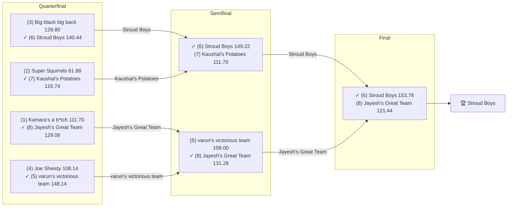

# 🏈 2024 Season

- **Champion:** Stroud Boys
- **Runner-Up:** Jayesh's Great Team
- **Regular Season Top Seed:** Kamara’s a b*tch
- **Toilet Bowl Winner:** Roger That

## Final Standings

> Auto-generated from Yahoo. **Finish** is Yahoo's final playoff-adjusted rank, so it does not follow W-L order - a team can win the title from a lower seed. **Playoff Seed** is the seed the team actually entered the playoffs with; - means it did not qualify.

| Finish | Team | Owner | W-L | PF | PA | Playoff Seed |
|--------|------|-------|-----|----|----|--------------|
| 1 | Stroud Boys | Tanmay | 8-6 | 1688.16 | 1665.3 | 6 |
| 2 | Jayesh's Great Team | Jayesh | 6-8 | 1421.08 | 1658.9 | 8 |
| 3 | varun’s victorious team | Varun | 8-6 | 1689.9 | 1385.9 | 5 |
| 4 | Kaushal's Potatoes | Kaushal | 8-6 | 1625.8 | 1571.04 | 7 |
| 5 | Big black big back | lokesh | 9-5 | 1730.3 | 1519.7 | 3 |
| 6 | Kamara’s a b*tch | Naren | 11-3 | 1749.22 | 1589.04 | 1 |
| 7 | Joe Sheisty | Anish | 9-5 | 1686.9 | 1478.74 | 4 |
| 8 | Super Squirrels | Super | 11-3 | 1723.42 | 1401.42 | 2 |
| 9 | Sharman’s Scorpions | Sharman | 5-9 | 1566.7 | 1662.7 | - |
| 10 | Jeremy's Neat Team | Jeremy | 4-10 | 1537.98 | 1694.6 | - |
| 11 | Michael's Marvelous Team | Michael | 3-11 | 1386.14 | 1803.18 | - |
| 12 | Roger That | Pranav | 2-12 | 1293.38 | 1668.46 | - |

## Playoff Bracket

> The actual championship bracket, from captured weekly matchups. Seeds in parentheses; ✓ marks the winner. Consolation games are excluded, and a team that appears first in a later round had a bye.

## Team Rosters

| Team | Post-Draft Roster | End-of-Season Roster |
|------|-------------------|----------------------|

## Awards

- 🏆 **League Champion:** Stroud Boys
- 💥 **Highest Single-Week Score:** _TBD_
- 📉 **Lowest Single-Week Score:** _TBD_
- 🔥 **Biggest Bust:** _TBD_
- 🎯 **Best Draft Pick:** _TBD_
- 🍗 **"Poultry Controversy" Nominee:** _TBD_

## The Story of the Year

_TBD - add the defining moments._

## Related

- [Seasons](index.md) · [2024 Draft](../draft/2024-draft.md) · [Teams](../teams/index.md) · [Records](../records/index.md) · Lore · [Playoffs](../playoffs.md)
