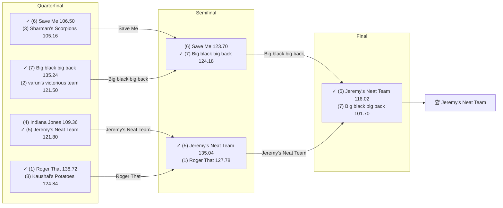

# 2025 Season

- **Champion:** [Jeremy's Neat Team](../owners/jeremy.md)
- **Runner-Up:** [Big black big back](../owners/lokesh.md)
- **Regular Season Top Seed:** [Roger That](../owners/pranav.md)
- **Toilet Bowl Winner:** [Stroud Boys](../owners/tanmay.md)

## Final Standings

**Finish** is the final playoff-adjusted rank, not W-L order. **Playoff Seed** is the seed the team entered the playoffs with; a dash means it did not qualify.

| Finish | Team | Owner | W-L | PF | PA | Playoff Seed |
|--------|------|-------|-----|----|----|--------------|
| 1 | Jeremy's Neat Team | Jeremy | 8-6 | 1526.46 | 1552.74 | 5 |
| 2 | Big black big back | Lokesh | 7-7 | 1603.4 | 1557.16 | 7 |
| 3 | Roger That | Pranav | 10-4 | 1751.42 | 1564.38 | 1 |
| 4 | Save Me | Naren | 7-7 | 1657.02 | 1648.02 | 6 |
| 5 | Indiana Jones | Anish | 8-6 | 1594.84 | 1458.2 | 4 |
| 6 | Sharman's Scorpions | Sharman | 8-6 | 1692.32 | 1697.14 | 3 |
| 7 | varun's victorious team | Varun | 9-5 | 1719.92 | 1559.16 | 2 |
| 8 | Kaushal's Potatoes | Kaushal | 7-7 | 1551.74 | 1552.56 | 8 |
| 9 | Super Squirrels | Abhinav | 6-8 | 1470.88 | 1490.06 | - |
| 10 | Jayesh's Great Team | Jayesh | 6-8 | 1363.52 | 1470.56 | - |
| 11 | Michael's Marvelous Team | Michael | 5-9 | 1694.9 | 1555.26 | - |
| 12 | Stroud Boys | Tanmay | 3-11 | 1151.54 | 1672.72 | - |

## Playoff Bracket

Seeds in parentheses; ✓ marks the winner. Consolation games are excluded; a team appearing first in a later round had a bye.

## Team Rosters

Post-draft and end-of-season lineups as the league's platform recorded them. Bench and IR rows are included; points are that week's score.

??? note "Jeremy's Neat Team"
    **Post-draft - week 1**

    | Slot | Player | Pos | Pts |
    |------|--------|-----|-----|
    | QB | [Lamar Jackson](../players/lamar-jackson.md) | QB | 29.36 |
    | RB | [Saquon Barkley](../players/saquon-barkley.md) | RB | 18.40 |
    | RB | [James Conner](../players/james-conner.md) | RB | 14.40 |
    | WR | [Ladd McConkey](../players/ladd-mcconkey.md) | WR | 13.40 |
    | WR | [George Pickens](../players/george-pickens.md) | WR | 6.00 |
    | TE | [Mark Andrews](../players/mark-andrews.md) | TE | 1.50 |
    | W/R/T | [Aaron Jones Sr.](../players/aaron-jones-sr.md) | RB | 15.70 |
    | K | [Wil Lutz](../players/wil-lutz.md) | K | 8.00 |
    | DEF | [Chargers](../players/chargers.md) | DEF | 2.00 |
    | BN | [Michael Pittman Jr.](../players/michael-pittman-jr.md) | WR | 20.00 |
    | BN | [Travis Etienne Jr.](../players/travis-etienne-jr.md) | RB | 18.60 |
    | BN | [Dalton Kincaid](../players/dalton-kincaid.md) | TE | 14.80 |
    | BN | [Trevor Lawrence](../players/trevor-lawrence.md) | QB | 11.32 |
    | BN | [Braelon Allen](../players/braelon-allen.md) | RB | 6.90 |
    | BN | [Tyjae Spears](../players/tyjae-spears.md) | RB | 0.00 |

    **End of season - week 17**

    | Slot | Player | Pos | Pts |
    |------|--------|-----|-----|
    | QB | [Trevor Lawrence](../players/trevor-lawrence.md) | QB | 24.12 |
    | RB | [Travis Etienne Jr.](../players/travis-etienne-jr.md) | RB | 11.20 |
    | RB | [Saquon Barkley](../players/saquon-barkley.md) | RB | 6.80 |
    | WR | [George Pickens](../players/george-pickens.md) | WR | 11.80 |
    | WR | [Ladd McConkey](../players/ladd-mcconkey.md) | WR | 5.40 |
    | TE | [Juwan Johnson](../players/juwan-johnson.md) | TE | 13.50 |
    | W/R/T | [Rhamondre Stevenson](../players/rhamondre-stevenson.md) | RB | 27.20 |
    | K | [Eddy Pineiro](../players/eddy-pineiro.md) | K | 6.00 |
    | DEF | [Steelers](../players/steelers.md) | DEF | 10.00 |
    | BN | [Jaxson Dart](../players/jaxson-dart.md) | QB | 25.08 |
    | BN | [Aaron Jones Sr.](../players/aaron-jones-sr.md) | RB | 15.30 |
    | BN | [Woody Marks](../players/woody-marks.md) | RB | 8.50 |
    | BN | [Marvin Mims Jr.](../players/marvin-mims-jr.md) | WR | 4.80 |
    | BN | [Michael Pittman Jr.](../players/michael-pittman-jr.md) | WR | 3.60 |
    | BN | [Dalton Kincaid](../players/dalton-kincaid.md) | TE | 0.00 |

??? note "Big black big back"
    **Post-draft - week 1**

    | Slot | Player | Pos | Pts |
    |------|--------|-----|-----|
    | QB | [Jalen Hurts](../players/jalen-hurts.md) | QB | 24.28 |
    | RB | [Derrick Henry](../players/derrick-henry.md) | RB | 29.20 |
    | RB | [David Montgomery](../players/david-montgomery.md) | RB | 8.30 |
    | WR | [Tyreek Hill](../players/tyreek-hill.md) | WR | 8.00 |
    | WR | [A.J. Brown](../players/a-j-brown.md) | WR | 1.80 |
    | TE | [Kyle Pitts Sr.](../players/kyle-pitts-sr.md) | TE | 12.90 |
    | W/R/T | [Jameson Williams](../players/jameson-williams.md) | WR | 6.60 |
    | K | [Jake Bates](../players/jake-bates.md) | K | 7.00 |
    | DEF | [Packers](../players/packers.md) | DEF | 10.00 |
    | BN | [Keenan Allen](../players/keenan-allen.md) | WR | 19.80 |
    | BN | [Jordan Love](../players/jordan-love.md) | QB | 15.92 |
    | BN | [Jayden Reed](../players/jayden-reed.md) | WR | 15.60 |
    | BN | [Jaylen Warren](../players/jaylen-warren.md) | RB | 13.90 |
    | BN | [Nick Chubb](../players/nick-chubb.md) | RB | 6.00 |
    | BN | [Colston Loveland](../players/colston-loveland.md) | TE | 3.20 |

    **End of season - week 17**

    | Slot | Player | Pos | Pts |
    |------|--------|-----|-----|
    | QB | [Jalen Hurts](../players/jalen-hurts.md) | QB | 8.90 |
    | RB | [Derrick Henry](../players/derrick-henry.md) | RB | 45.60 |
    | RB | [Jaylen Warren](../players/jaylen-warren.md) | RB | 8.70 |
    | WR | [A.J. Brown](../players/a-j-brown.md) | WR | 11.80 |
    | WR | [Jameson Williams](../players/jameson-williams.md) | WR | 5.70 |
    | TE | [Kyle Pitts Sr.](../players/kyle-pitts-sr.md) | TE | 3.60 |
    | W/R/T | [Josh Downs](../players/josh-downs.md) | WR | 5.40 |
    | K | [Jake Bates](../players/jake-bates.md) | K | 5.00 |
    | DEF | [Lions](../players/lions.md) | DEF | 7.00 |
    | BN | [Rico Dowdle](../players/rico-dowdle.md) | RB | 9.30 |
    | BN | [Jayden Reed](../players/jayden-reed.md) | WR | 8.10 |
    | BN | [Cade Otton](../players/cade-otton.md) | TE | 7.30 |
    | BN | [David Montgomery](../players/david-montgomery.md) | RB | 6.00 |
    | BN | [Jordan Love](../players/jordan-love.md) | QB | 0.00 |
    | IR | [Tyreek Hill](../players/tyreek-hill.md) | WR | 0.00 |

??? note "Roger That"
    **Post-draft - week 1**

    | Slot | Player | Pos | Pts |
    |------|--------|-----|-----|
    | QB | [Bo Nix](../players/bo-nix.md) | QB | 8.84 |
    | RB | [Breece Hall](../players/breece-hall.md) | RB | 16.50 |
    | RB | [Kaleb Johnson](../players/kaleb-johnson.md) | RB | 13.00 |
    | WR | [Jaylen Waddle](../players/jaylen-waddle.md) | WR | 7.00 |
    | WR | [Ja'Marr Chase](../players/ja-marr-chase.md) | WR | 4.60 |
    | TE | [Trey McBride](../players/trey-mcbride.md) | TE | 12.10 |
    | W/R/T | [George Kittle](../players/george-kittle.md) | TE | 12.50 |
    | K | [Ka'imi Fairbairn](../players/ka-imi-fairbairn.md) | K | 14.00 |
    | DEF | [Bills](../players/bills.md) | DEF | 0.00 |
    | BN | [Javonte Williams](../players/javonte-williams.md) | RB | 20.40 |
    | BN | [J.K. Dobbins](../players/j-k-dobbins.md) | RB | 14.80 |
    | BN | [Dallas Goedert](../players/dallas-goedert.md) | TE | 11.40 |
    | BN | [Bryce Young](../players/bryce-young.md) | QB | 10.16 |
    | BN | [Matthew Golden](../players/matthew-golden.md) | WR | 4.70 |
    | BN | [Rachaad White](../players/rachaad-white.md) | RB | 2.60 |

    **End of season - week 17**

    | Slot | Player | Pos | Pts |
    |------|--------|-----|-----|
    | QB | [Matthew Stafford](../players/matthew-stafford.md) | QB | 15.76 |
    | RB | [Breece Hall](../players/breece-hall.md) | RB | 20.90 |
    | RB | [Javonte Williams](../players/javonte-williams.md) | RB | 11.40 |
    | WR | [Ja'Marr Chase](../players/ja-marr-chase.md) | WR | 25.00 |
    | WR | [Jaylen Waddle](../players/jaylen-waddle.md) | WR | 0.70 |
    | TE | [Trey McBride](../players/trey-mcbride.md) | TE | 23.60 |
    | W/R/T | [George Kittle](../players/george-kittle.md) | TE | 0.00 |
    | K | [Cairo Santos](../players/cairo-santos.md) | K | 8.00 |
    | DEF | [Eagles](../players/eagles.md) | DEF | 13.00 |
    | BN | [Bo Nix](../players/bo-nix.md) | QB | 20.48 |
    | BN | [Jayden Higgins](../players/jayden-higgins.md) | WR | 16.80 |
    | BN | [Dallas Goedert](../players/dallas-goedert.md) | TE | 9.80 |
    | BN | [Kenneth Walker III](../players/kenneth-walker-iii.md) | RB | 7.70 |
    | BN | [Darius Slayton](../players/darius-slayton.md) | WR | 5.60 |
    | BN | [Isiah Pacheco](../players/isiah-pacheco.md) | RB | 3.20 |
    | IR | [Greg Dortch](../players/greg-dortch.md) | WR | 0.00 |

??? note "Save Me"
    **Post-draft - week 1**

    | Slot | Player | Pos | Pts |
    |------|--------|-----|-----|
    | QB | [Justin Herbert](../players/justin-herbert.md) | QB | 27.92 |
    | RB | [Ashton Jeanty](../players/ashton-jeanty.md) | RB | 12.00 |
    | RB | [Kenneth Walker III](../players/kenneth-walker-iii.md) | RB | 5.40 |
    | WR | [Drake London](../players/drake-london.md) | WR | 13.50 |
    | WR | [Davante Adams](../players/davante-adams.md) | WR | 9.10 |
    | TE | [Mason Taylor](../players/mason-taylor.md) | TE | 3.00 |
    | W/R/T | [Courtland Sutton](../players/courtland-sutton.md) | WR | 18.10 |
    | K | [Cam Little](../players/cam-little.md) | K | 15.00 |
    | DEF | [Eagles](../players/eagles.md) | DEF | 3.00 |
    | BN | [Marvin Mims Jr.](../players/marvin-mims-jr.md) | WR | 15.10 |
    | BN | [Ricky Pearsall](../players/ricky-pearsall.md) | WR | 14.80 |
    | BN | [D'Andre Swift](../players/d-andre-swift.md) | RB | 9.50 |
    | BN | [Rhamondre Stevenson](../players/rhamondre-stevenson.md) | RB | 4.70 |
    | BN | [Rashod Bateman](../players/rashod-bateman.md) | WR | 3.00 |
    | IR | [Quinshon Judkins](../players/quinshon-judkins.md) | RB | 0.00 |
    | BN | [Rashee Rice](../players/rashee-rice.md) | WR | 0.00 |

    **End of season - week 17**

    | Slot | Player | Pos | Pts |
    |------|--------|-----|-----|
    | QB | [Brock Purdy](../players/brock-purdy.md) | QB | 37.92 |
    | RB | [D'Andre Swift](../players/d-andre-swift.md) | RB | 21.90 |
    | RB | [Ashton Jeanty](../players/ashton-jeanty.md) | RB | 9.30 |
    | WR | [Courtland Sutton](../players/courtland-sutton.md) | WR | 8.00 |
    | WR | [DJ Moore](../players/dj-moore.md) | WR | 1.70 |
    | TE | [Harold Fannin Jr.](../players/harold-fannin-jr.md) | TE | 11.00 |
    | W/R/T | [Drake London](../players/drake-london.md) | WR | 1.40 |
    | K | [Ka'imi Fairbairn](../players/ka-imi-fairbairn.md) | K | 10.00 |
    | DEF | [Seahawks](../players/seahawks.md) | DEF | 10.00 |
    | BN | [Audric Estime](../players/audric-estime.md) | RB | 16.80 |
    | BN | [Colby Parkinson](../players/colby-parkinson.md) | TE | 11.30 |
    | BN | [Michael Carter](../players/michael-carter.md) | RB | 6.30 |
    | BN | [Emanuel Wilson](../players/emanuel-wilson.md) | RB | 5.70 |
    | BN | [Bills](../players/bills.md) | DEF | 5.00 |
    | BN | [Davante Adams](../players/davante-adams.md) | WR | 0.00 |
    | IR | [Quinshon Judkins](../players/quinshon-judkins.md) | RB | 0.00 |
    | IR | [Rashee Rice](../players/rashee-rice.md) | WR | 0.00 |

??? note "Indiana Jones"
    **Post-draft - week 1**

    | Slot | Player | Pos | Pts |
    |------|--------|-----|-----|
    | QB | [Brock Purdy](../players/brock-purdy.md) | QB | 18.78 |
    | RB | [Josh Jacobs](../players/josh-jacobs.md) | RB | 14.00 |
    | RB | [Jordan Mason](../players/jordan-mason.md) | RB | 8.50 |
    | WR | [Marvin Harrison Jr.](../players/marvin-harrison-jr.md) | WR | 18.10 |
    | WR | [DJ Moore](../players/dj-moore.md) | WR | 8.60 |
    | TE | [T.J. Hockenson](../players/t-j-hockenson.md) | TE | 4.50 |
    | W/R/T | [Omarion Hampton](../players/omarion-hampton.md) | RB | 8.10 |
    | K | [Harrison Butker](../players/harrison-butker.md) | K | 11.00 |
    | DEF | [Ravens](../players/ravens.md) | DEF | -3.00 |
    | BN | [Justin Fields](../players/justin-fields.md) | QB | 29.52 |
    | BN | [Christian McCaffrey](../players/christian-mccaffrey.md) | RB | 23.20 |
    | BN | [Dylan Sampson](../players/dylan-sampson.md) | RB | 17.30 |
    | BN | [Zach Ertz](../players/zach-ertz.md) | TE | 11.60 |
    | BN | [Brian Robinson](../players/brian-robinson.md) | RB | 4.70 |
    | BN | [Josh Downs](../players/josh-downs.md) | WR | 3.20 |

    **End of season - week 17**

    | Slot | Player | Pos | Pts |
    |------|--------|-----|-----|
    | QB | [Jacoby Brissett](../players/jacoby-brissett.md) | QB | 16.48 |
    | RB | [Christian McCaffrey](../players/christian-mccaffrey.md) | RB | 28.10 |
    | RB | [Josh Jacobs](../players/josh-jacobs.md) | RB | 1.30 |
    | WR | [Wan'Dale Robinson](../players/wan-dale-robinson.md) | WR | 22.30 |
    | WR | [Malik Washington](../players/malik-washington.md) | WR | 6.20 |
    | TE | [Brenton Strange](../players/brenton-strange.md) | TE | 8.40 |
    | W/R/T | [Omarion Hampton](../players/omarion-hampton.md) | RB | 20.00 |
    | K | [Will Reichard](../players/will-reichard.md) | K | 16.00 |
    | DEF | [Falcons](../players/falcons.md) | DEF | 16.00 |
    | BN | [Parker Washington](../players/parker-washington.md) | WR | 20.00 |
    | BN | [Quentin Johnston](../players/quentin-johnston.md) | WR | 14.80 |
    | BN | [Jalen Coker](../players/jalen-coker.md) | WR | 3.60 |
    | BN | [Jordan Mason](../players/jordan-mason.md) | RB | 0.00 |
    | BN | [Marvin Harrison Jr.](../players/marvin-harrison-jr.md) | WR | 0.00 |

??? note "Sharman's Scorpions"
    **Post-draft - week 1**

    | Slot | Player | Pos | Pts |
    |------|--------|-----|-----|
    | QB | [Patrick Mahomes](../players/patrick-mahomes.md) | QB | 26.02 |
    | RB | [Jahmyr Gibbs](../players/jahmyr-gibbs.md) | RB | 15.00 |
    | RB | [Bucky Irving](../players/bucky-irving.md) | RB | 14.50 |
    | WR | [Zay Flowers](../players/zay-flowers.md) | WR | 28.10 |
    | WR | [DeVonta Smith](../players/devonta-smith.md) | WR | 4.60 |
    | TE | [Tucker Kraft](../players/tucker-kraft.md) | TE | 9.90 |
    | W/R/T | [Kyren Williams](../players/kyren-williams.md) | RB | 13.90 |
    | K | [Evan McPherson](../players/evan-mcpherson.md) | K | 5.00 |
    | DEF | [Lions](../players/lions.md) | DEF | 0.00 |
    | BN | [Jared Goff](../players/jared-goff.md) | QB | 11.90 |
    | BN | [Zach Charbonnet](../players/zach-charbonnet.md) | RB | 10.70 |
    | BN | [Brenton Strange](../players/brenton-strange.md) | TE | 9.90 |
    | BN | [Austin Ekeler](../players/austin-ekeler.md) | RB | 8.70 |
    | BN | [Jauan Jennings](../players/jauan-jennings.md) | WR | 3.60 |
    | BN | [Chris Godwin Jr.](../players/chris-godwin-jr.md) | WR | 0.00 |

    **End of season - week 17**

    | Slot | Player | Pos | Pts |
    |------|--------|-----|-----|
    | QB | [Jared Goff](../players/jared-goff.md) | QB | 4.08 |
    | RB | [Bucky Irving](../players/bucky-irving.md) | RB | 8.30 |
    | RB | [Jahmyr Gibbs](../players/jahmyr-gibbs.md) | RB | 6.40 |
    | WR | [Zay Flowers](../players/zay-flowers.md) | WR | 13.00 |
    | WR | [Jauan Jennings](../players/jauan-jennings.md) | WR | 12.20 |
    | TE | [Dalton Schultz](../players/dalton-schultz.md) | TE | 4.90 |
    | W/R/T | [Kyren Williams](../players/kyren-williams.md) | RB | 16.00 |
    | K | [Evan McPherson](../players/evan-mcpherson.md) | K | 9.00 |
    | DEF | [Patriots](../players/patriots.md) | DEF | 7.00 |
    | BN | [Zach Charbonnet](../players/zach-charbonnet.md) | RB | 26.20 |
    | BN | [Chris Godwin Jr.](../players/chris-godwin-jr.md) | WR | 23.80 |
    | BN | [Colts](../players/colts.md) | DEF | 6.00 |
    | BN | [DeVonta Smith](../players/devonta-smith.md) | WR | 4.50 |
    | BN | [Matt Prater](../players/matt-prater.md) | K | 0.00 |
    | BN | [Patrick Mahomes](../players/patrick-mahomes.md) | QB | 0.00 |

??? note "varun's victorious team"
    **Post-draft - week 1**

    | Slot | Player | Pos | Pts |
    |------|--------|-----|-----|
    | QB | [C.J. Stroud](../players/c-j-stroud.md) | QB | 9.72 |
    | RB | [Chuba Hubbard](../players/chuba-hubbard.md) | RB | 17.90 |
    | RB | [De'Von Achane](../players/de-von-achane.md) | RB | 16.50 |
    | WR | [Amon-Ra St. Brown](../players/amon-ra-st-brown.md) | WR | 8.50 |
    | WR | [Tee Higgins](../players/tee-higgins.md) | WR | 6.30 |
    | TE | [Travis Kelce](../players/travis-kelce.md) | TE | 12.70 |
    | W/R/T | [Rashid Shaheed](../players/rashid-shaheed.md) | WR | 11.10 |
    | K | [Tyler Loop](../players/tyler-loop.md) | K | 13.00 |
    | DEF | [Vikings](../players/vikings.md) | DEF | 5.00 |
    | BN | [Michael Penix Jr.](../players/michael-penix-jr.md) | QB | 24.02 |
    | BN | [Drake Maye](../players/drake-maye.md) | QB | 16.78 |
    | BN | [Jonnu Smith](../players/jonnu-smith.md) | TE | 12.50 |
    | BN | [Tetairoa McMillan](../players/tetairoa-mcmillan.md) | WR | 11.80 |
    | BN | [Stefon Diggs](../players/stefon-diggs.md) | WR | 11.70 |
    | IR | [Joe Mixon](../players/joe-mixon.md) | RB | 0.00 |

    **End of season - week 17**

    | Slot | Player | Pos | Pts |
    |------|--------|-----|-----|
    | QB | [Drake Maye](../players/drake-maye.md) | QB | 32.44 |
    | RB | [De'Von Achane](../players/de-von-achane.md) | RB | 14.20 |
    | RB | [Chuba Hubbard](../players/chuba-hubbard.md) | RB | 5.50 |
    | WR | [Stefon Diggs](../players/stefon-diggs.md) | WR | 22.10 |
    | WR | [Amon-Ra St. Brown](../players/amon-ra-st-brown.md) | WR | 14.80 |
    | TE | [Travis Kelce](../players/travis-kelce.md) | TE | 8.60 |
    | W/R/T | [Tetairoa McMillan](../players/tetairoa-mcmillan.md) | WR | 1.50 |
    | K | [Tyler Loop](../players/tyler-loop.md) | K | 11.00 |
    | DEF | [Rams](../players/rams.md) | DEF | 8.00 |
    | BN | [C.J. Stroud](../players/c-j-stroud.md) | QB | 15.76 |
    | BN | [Tee Higgins](../players/tee-higgins.md) | WR | 9.90 |
    | BN | [Andrei Iosivas](../players/andrei-iosivas.md) | WR | 8.10 |
    | BN | [Kareem Hunt](../players/kareem-hunt.md) | RB | 3.80 |
    | BN | [Rashid Shaheed](../players/rashid-shaheed.md) | WR | 3.10 |
    | BN | [Sean Tucker](../players/sean-tucker.md) | RB | 0.80 |
    | IR | [Joe Mixon](../players/joe-mixon.md) | RB | 0.00 |

??? note "Kaushal's Potatoes"
    **Post-draft - week 1**

    | Slot | Player | Pos | Pts |
    |------|--------|-----|-----|
    | QB | [Jayden Daniels](../players/jayden-daniels.md) | QB | 20.12 |
    | RB | [Chase Brown](../players/chase-brown.md) | RB | 13.10 |
    | RB | [RJ Harvey](../players/rj-harvey.md) | RB | 7.90 |
    | WR | [DK Metcalf](../players/dk-metcalf.md) | WR | 12.30 |
    | WR | [Nico Collins](../players/nico-collins.md) | WR | 5.50 |
    | TE | [Jake Ferguson](../players/jake-ferguson.md) | TE | 7.30 |
    | W/R/T | [Calvin Ridley](../players/calvin-ridley.md) | WR | 6.70 |
    | K | [Cameron Dicker](../players/cameron-dicker.md) | K | 9.00 |
    | DEF | [Broncos](../players/broncos.md) | DEF | 14.00 |
    | BN | [Keon Coleman](../players/keon-coleman.md) | WR | 25.20 |
    | BN | [Emeka Egbuka](../players/emeka-egbuka.md) | WR | 23.60 |
    | BN | [Matthew Stafford](../players/matthew-stafford.md) | QB | 13.60 |
    | BN | [Jerry Jeudy](../players/jerry-jeudy.md) | WR | 11.60 |
    | BN | [DeMario Douglas](../players/demario-douglas.md) | WR | 8.20 |
    | BN | [Tyler Allgeier](../players/tyler-allgeier.md) | RB | 2.40 |

    **End of season - week 17**

    | Slot | Player | Pos | Pts |
    |------|--------|-----|-----|
    | QB | [Sam Darnold](../players/sam-darnold.md) | QB | 7.08 |
    | RB | [Chase Brown](../players/chase-brown.md) | RB | 29.10 |
    | RB | [RJ Harvey](../players/rj-harvey.md) | RB | 18.60 |
    | WR | [Jerry Jeudy](../players/jerry-jeudy.md) | WR | 10.40 |
    | WR | [Emeka Egbuka](../players/emeka-egbuka.md) | WR | 5.00 |
    | TE | [Jake Ferguson](../players/jake-ferguson.md) | TE | 7.60 |
    | W/R/T | [Nico Collins](../players/nico-collins.md) | WR | 8.70 |
    | K | [Cam Little](../players/cam-little.md) | K | 14.00 |
    | DEF | [Ravens](../players/ravens.md) | DEF | 6.00 |
    | BN | [Hunter Henry](../players/hunter-henry.md) | TE | 13.90 |
    | BN | [Broncos](../players/broncos.md) | DEF | 5.00 |
    | BN | [Cameron Dicker](../players/cameron-dicker.md) | K | 4.00 |
    | BN | [Joe Flacco](../players/joe-flacco.md) | QB | 1.16 |
    | BN | [Nick Chubb](../players/nick-chubb.md) | RB | 0.10 |
    | BN | [DK Metcalf](../players/dk-metcalf.md) | WR | 0.00 |

??? note "Super Squirrels"
    **Post-draft - week 1**

    | Slot | Player | Pos | Pts |
    |------|--------|-----|-----|
    | QB | [Baker Mayfield](../players/baker-mayfield.md) | QB | 22.58 |
    | RB | [Alvin Kamara](../players/alvin-kamara.md) | RB | 13.70 |
    | RB | [Isiah Pacheco](../players/isiah-pacheco.md) | RB | 4.80 |
    | WR | [Malik Nabers](../players/malik-nabers.md) | WR | 12.10 |
    | WR | [Brian Thomas Jr.](../players/brian-thomas-jr.md) | WR | 9.00 |
    | TE | [Sam LaPorta](../players/sam-laporta.md) | TE | 13.90 |
    | W/R/T | [Mike Evans](../players/mike-evans.md) | WR | 10.10 |
    | K | [Jake Elliott](../players/jake-elliott.md) | K | 8.00 |
    | DEF | [Steelers](../players/steelers.md) | DEF | 2.00 |
    | BN | [Caleb Williams](../players/caleb-williams.md) | QB | 24.20 |
    | BN | [Chris Olave](../players/chris-olave.md) | WR | 12.40 |
    | BN | [Khalil Shakir](../players/khalil-shakir.md) | WR | 12.40 |
    | BN | [Hunter Henry](../players/hunter-henry.md) | TE | 10.60 |
    | BN | [Trey Benson](../players/trey-benson.md) | RB | 8.50 |
    | BN | [Jerome Ford](../players/jerome-ford.md) | RB | 1.50 |

    **End of season - week 17**

    | Slot | Player | Pos | Pts |
    |------|--------|-----|-----|
    | QB | [Baker Mayfield](../players/baker-mayfield.md) | QB | 19.44 |
    | RB | [Kenny Gainwell](../players/kenny-gainwell.md) | RB | 9.10 |
    | RB | [Kyle Monangai](../players/kyle-monangai.md) | RB | 7.70 |
    | WR | [Chris Olave](../players/chris-olave.md) | WR | 25.90 |
    | WR | [Chimere Dike](../players/chimere-dike.md) | WR | 14.20 |
    | TE | [Colston Loveland](../players/colston-loveland.md) | TE | 21.40 |
    | W/R/T | [Michael Wilson](../players/michael-wilson.md) | WR | 19.90 |
    | K | [Jason Myers](../players/jason-myers.md) | K | 10.00 |
    | DEF | [Texans](../players/texans.md) | DEF | 8.00 |
    | BN | [Caleb Williams](../players/caleb-williams.md) | QB | 23.00 |
    | BN | [Christian Watson](../players/christian-watson.md) | WR | 22.30 |
    | BN | [Khalil Shakir](../players/khalil-shakir.md) | WR | 14.50 |
    | IR | [Mike Evans](../players/mike-evans.md) | WR | 12.10 |
    | BN | [Brian Thomas Jr.](../players/brian-thomas-jr.md) | WR | 7.90 |
    | BN | [Alvin Kamara](../players/alvin-kamara.md) | RB | 0.00 |
    | BN | [Kimani Vidal](../players/kimani-vidal.md) | RB | 0.00 |
    | IR | [Trey Benson](../players/trey-benson.md) | RB | 0.00 |

??? note "Jayesh's Great Team"
    **Post-draft - week 1**

    | Slot | Player | Pos | Pts |
    |------|--------|-----|-----|
    | QB | [Josh Allen](../players/josh-allen.md) | QB | 38.76 |
    | RB | [Jonathan Taylor](../players/jonathan-taylor.md) | RB | 12.80 |
    | RB | [Tony Pollard](../players/tony-pollard.md) | RB | 7.90 |
    | WR | [Garrett Wilson](../players/garrett-wilson.md) | WR | 22.50 |
    | WR | [Justin Jefferson](../players/justin-jefferson.md) | WR | 14.80 |
    | TE | [Evan Engram](../players/evan-engram.md) | TE | 5.10 |
    | W/R/T | [Travis Hunter](../players/travis-hunter.md) | WR | 9.30 |
    | K | [Brandon Aubrey](../players/brandon-aubrey.md) | K | 11.00 |
    | DEF | [Jets](../players/jets.md) | DEF | 3.00 |
    | BN | [Kyler Murray](../players/kyler-murray.md) | QB | 18.32 |
    | BN | [Tyler Warren](../players/tyler-warren.md) | TE | 14.90 |
    | BN | [Jacory Croskey-Merritt](../players/jacory-croskey-merritt.md) | RB | 14.20 |
    | BN | [Darnell Mooney](../players/darnell-mooney.md) | WR | 0.00 |
    | BN | [Jaydon Blue](../players/jaydon-blue.md) | RB | 0.00 |
    | BN | [Jordan Addison](../players/jordan-addison.md) | WR | 0.00 |

    **End of season - week 17**

    | Slot | Player | Pos | Pts |
    |------|--------|-----|-----|
    | QB | [Josh Allen](../players/josh-allen.md) | QB | 23.18 |
    | RB | [Jonathan Taylor](../players/jonathan-taylor.md) | RB | 17.40 |
    | RB | [Tony Pollard](../players/tony-pollard.md) | RB | 11.50 |
    | WR | [Justin Jefferson](../players/justin-jefferson.md) | WR | 7.00 |
    | WR | [Garrett Wilson](../players/garrett-wilson.md) | WR | 0.00 |
    | TE | [Evan Engram](../players/evan-engram.md) | TE | 6.10 |
    | W/R/T | [Travis Hunter](../players/travis-hunter.md) | WR | 0.00 |
    | K | [Brandon Aubrey](../players/brandon-aubrey.md) | K | 17.00 |
    | DEF | [Jets](../players/jets.md) | DEF | -3.00 |
    | BN | [Jacory Croskey-Merritt](../players/jacory-croskey-merritt.md) | RB | 22.50 |
    | BN | [Jordan Addison](../players/jordan-addison.md) | WR | 12.50 |
    | BN | [Tyler Warren](../players/tyler-warren.md) | TE | 9.30 |
    | BN | [Darnell Mooney](../players/darnell-mooney.md) | WR | 5.50 |
    | BN | [Jaydon Blue](../players/jaydon-blue.md) | RB | 0.00 |
    | BN | [Kyler Murray](../players/kyler-murray.md) | QB | 0.00 |

??? note "Michael's Marvelous Team"
    **Post-draft - week 1**

    | Slot | Player | Pos | Pts |
    |------|--------|-----|-----|
    | QB | [Dak Prescott](../players/dak-prescott.md) | QB | 7.82 |
    | RB | [Bijan Robinson](../players/bijan-robinson.md) | RB | 24.40 |
    | RB | [TreVeyon Henderson](../players/treveyon-henderson.md) | RB | 15.40 |
    | WR | [Jaxon Smith-Njigba](../players/jaxon-smith-njigba.md) | WR | 19.40 |
    | WR | [Xavier Worthy](../players/xavier-worthy.md) | WR | 0.00 |
    | TE | [Brock Bowers](../players/brock-bowers.md) | TE | 15.30 |
    | W/R/T | [Rome Odunze](../players/rome-odunze.md) | WR | 15.70 |
    | K | [Chris Boswell](../players/chris-boswell.md) | K | 14.00 |
    | DEF | [Texans](../players/texans.md) | DEF | 6.00 |
    | BN | [Geno Smith](../players/geno-smith.md) | QB | 18.48 |
    | BN | [Cooper Kupp](../players/cooper-kupp.md) | WR | 3.50 |
    | BN | [Tank Bigsby](../players/tank-bigsby.md) | RB | 3.20 |
    | BN | [Cam Skattebo](../players/cam-skattebo.md) | RB | 2.90 |
    | BN | [Theo Johnson](../players/theo-johnson.md) | TE | 1.50 |
    | BN | [Christian Kirk](../players/christian-kirk.md) | WR | 0.00 |

    **End of season - week 17**

    | Slot | Player | Pos | Pts |
    |------|--------|-----|-----|
    | QB | [Dak Prescott](../players/dak-prescott.md) | QB | 22.68 |
    | RB | [Bijan Robinson](../players/bijan-robinson.md) | RB | 39.90 |
    | RB | [TreVeyon Henderson](../players/treveyon-henderson.md) | RB | 8.20 |
    | WR | [Jaxon Smith-Njigba](../players/jaxon-smith-njigba.md) | WR | 16.20 |
    | WR | [Rome Odunze](../players/rome-odunze.md) | WR | 0.00 |
    | TE | [Brock Bowers](../players/brock-bowers.md) | TE | 0.00 |
    | W/R/T | [Romeo Doubs](../players/romeo-doubs.md) | WR | 9.20 |
    | K | [Chris Boswell](../players/chris-boswell.md) | K | 8.00 |
    | DEF | [Jaguars](../players/jaguars.md) | DEF | 7.00 |
    | BN | [KaVontae Turpin](../players/kavontae-turpin.md) | WR | 27.10 |
    | BN | [Aaron Rodgers](../players/aaron-rodgers.md) | QB | 7.32 |
    | BN | [Cooper Kupp](../players/cooper-kupp.md) | WR | 1.60 |
    | BN | [Xavier Worthy](../players/xavier-worthy.md) | WR | 0.10 |
    | BN | [Theo Johnson](../players/theo-johnson.md) | TE | 0.00 |

??? note "Stroud Boys"
    **Post-draft - week 1**

    | Slot | Player | Pos | Pts |
    |------|--------|-----|-----|
    | QB | [Joe Burrow](../players/joe-burrow.md) | QB | 8.82 |
    | RB | [James Cook III](../players/james-cook-iii.md) | RB | 21.20 |
    | RB | [Tyrone Tracy Jr.](../players/tyrone-tracy-jr.md) | RB | 5.50 |
    | WR | [Puka Nacua](../players/puka-nacua.md) | WR | 23.10 |
    | WR | [CeeDee Lamb](../players/ceedee-lamb.md) | WR | 18.00 |
    | TE | [David Njoku](../players/david-njoku.md) | TE | 6.70 |
    | W/R/T | [Terry McLaurin](../players/terry-mclaurin.md) | WR | 4.70 |
    | K | [Chase McLaughlin](../players/chase-mclaughlin.md) | K | 6.00 |
    | DEF | [Chiefs](../players/chiefs.md) | DEF | 3.00 |
    | BN | [Deebo Samuel Sr.](../players/deebo-samuel-sr.md) | WR | 27.60 |
    | BN | [J.J. McCarthy](../players/j-j-mccarthy.md) | QB | 23.22 |
    | BN | [Jakobi Meyers](../players/jakobi-meyers.md) | WR | 17.70 |
    | BN | [Chig Okonkwo](../players/chig-okonkwo.md) | TE | 4.90 |
    | BN | [Bhayshul Tuten](../players/bhayshul-tuten.md) | RB | 2.30 |
    | BN | [Brandon Aiyuk](../players/brandon-aiyuk.md) | WR | 0.00 |

    **End of season - week 17**

    | Slot | Player | Pos | Pts |
    |------|--------|-----|-----|
    | QB | [Tua Tagovailoa](../players/tua-tagovailoa.md) | QB | 0.00 |
    | RB | [Tyrone Tracy Jr.](../players/tyrone-tracy-jr.md) | RB | 6.70 |
    | RB | [Bhayshul Tuten](../players/bhayshul-tuten.md) | RB | 0.00 |
    | WR | [Deebo Samuel Sr.](../players/deebo-samuel-sr.md) | WR | 11.30 |
    | WR | [CeeDee Lamb](../players/ceedee-lamb.md) | WR | 9.60 |
    | TE | [Chig Okonkwo](../players/chig-okonkwo.md) | TE | 14.50 |
    | W/R/T | [Terry McLaurin](../players/terry-mclaurin.md) | WR | 11.30 |
    | K | [Chase McLaughlin](../players/chase-mclaughlin.md) | K | 5.00 |
    | DEF | [Chiefs](../players/chiefs.md) | DEF | 4.00 |
    | IR | [Joe Burrow](../players/joe-burrow.md) | QB | 20.40 |
    | BN | [Puka Nacua](../players/puka-nacua.md) | WR | 15.70 |
    | BN | [James Cook III](../players/james-cook-iii.md) | RB | 8.70 |
    | BN | [Jakobi Meyers](../players/jakobi-meyers.md) | WR | 7.90 |
    | BN | [Brandon Aiyuk](../players/brandon-aiyuk.md) | WR | 0.00 |
    | BN | [David Njoku](../players/david-njoku.md) | TE | 0.00 |
    | BN | [J.J. McCarthy](../players/j-j-mccarthy.md) | QB | 0.00 |

## Awards

- **League Champion:** [Jeremy's Neat Team](../owners/jeremy.md)
- **Most Valuable Player:** [Ja'Marr Chase](../players/ja-marr-chase.md) - 6 wins swung
- **Finals MVP:** [Rhamondre Stevenson](../players/rhamondre-stevenson.md) - 27.20 pts ([Jeremy's Neat Team](../owners/jeremy.md))
- **Newcomer of the Year:** [Ashton Jeanty](../players/ashton-jeanty.md) - 5 wins swung
- **Undrafted Player of the Year:** [Eddy Pineiro](../players/eddy-pineiro.md) - 5 wins swung
- **Highest Single-Week Score:** Sharman's Scorpions - 177.24 (Wk 7)
- **Lowest Single-Week Score:** Stroud Boys - 38.50 (Wk 6)
- **Best Draft Pick:** [Rashid Shaheed](../players/rashid-shaheed.md) (WR) - drafted by [varun's victorious team](../owners/varun.md) at pick 113, finished +40 spots at the position, 227.60 pts
- **Biggest Bust:** [Brian Thomas Jr.](../players/brian-thomas-jr.md) (WR) - drafted by [Super Squirrels](../owners/abhinav.md) at pick 14, finished -26 spots at the position, 130.90 pts, played 13 of 17 weeks

## Position Highs

Highest single week at each position. Regular season, starters only.

| Pos | Player | Points | When |
|-----|--------|--------|------|
| QB | [Josh Allen](../players/josh-allen.md) | 44.68 | Wk 11, [Jayesh's Great Team](../owners/jayesh.md) |
| RB | [Jahmyr Gibbs](../players/jahmyr-gibbs.md) | 55.40 | Wk 12, [Sharman's Scorpions](../owners/sharman.md) |
| WR | [Amon-Ra St. Brown](../players/amon-ra-st-brown.md) | 39.20 | Wk 2, [varun's victorious team](../owners/varun.md) |
| TE | [Tucker Kraft](../players/tucker-kraft.md) | 33.30 | Wk 8, [Sharman's Scorpions](../owners/sharman.md) |
| K | [Brandon Aubrey](../players/brandon-aubrey.md) | 23.00 | Wk 14, [Jayesh's Great Team](../owners/jayesh.md) |
| DEF (2-way tie) | [Vikings](../players/vikings.md) | 30.00 | Wk 3, [varun's victorious team](../owners/varun.md) |
|  | [Seahawks](../players/seahawks.md) | 30.00 | Wk 13, [Save Me](../owners/naren.md) |

## Team of the Season

Each starting slot goes to the player who swung the most wins in it; the flex takes the best eligible player the position slots did not claim.

| Slot | Player | Pos | Wins Swung | Points in Them | Rostered By |
|------|--------|-----|------------|----------------|-------------|
| QB | [Lamar Jackson](../players/lamar-jackson.md) | QB | 6 | 101.84 | Jeremy's Neat Team |
| RB | [Saquon Barkley](../players/saquon-barkley.md) | RB | 6 | 92.30 | Jeremy's Neat Team |
|  | [Jahmyr Gibbs](../players/jahmyr-gibbs.md) | RB | 5 | 142.20 | Sharman's Scorpions |
| WR | [Ja'Marr Chase](../players/ja-marr-chase.md) | WR | 6 | 138.70 | Roger That |
|  | [Davante Adams](../players/davante-adams.md) | WR | 6 | 82.00 | Save Me |
| TE | [Trey McBride](../players/trey-mcbride.md) | TE | 5 | 109.50 | Roger That |
| W/R/T | [Travis Etienne Jr.](../players/travis-etienne-jr.md) | RB | 5 | 103.70 | Jeremy's Neat Team |
| K | [Eddy Pineiro](../players/eddy-pineiro.md) | K | 5 | 69.00 | Save Me, Jeremy's Neat Team |
| DEF (2-way tie) | [Broncos](../players/broncos.md) | DEF | 3 | 37.00 | Kaushal's Potatoes |
|  | [Lions](../players/lions.md) | DEF | 3 | 37.00 | Save Me, Sharman's Scorpions |

Every award is computed rather than voted. Full definitions are on [Awards](../awards.md).

## Related

- [Seasons](index.md) · [2025 Draft](../draft/2025-draft.md) · [Teams](../teams/index.md) · [Records](../records/index.md) · [Lore](../lore.md) · [Playoffs](../playoffs.md)

*[PF]: Points For - total points a team scored
*[PA]: Points Against - total points scored against a team
*[W/R/T]: Flex slot - a receiver, back or tight end may start in it
*[BN]: Bench - rostered that week, but not in the starting lineup
*[IR]: Injured Reserve
*[QB]: Quarterback
*[RB]: Running back
*[WR]: Wide receiver
*[TE]: Tight end
*[DEF]: Team defense
*[MVP]: Most Valuable Player
